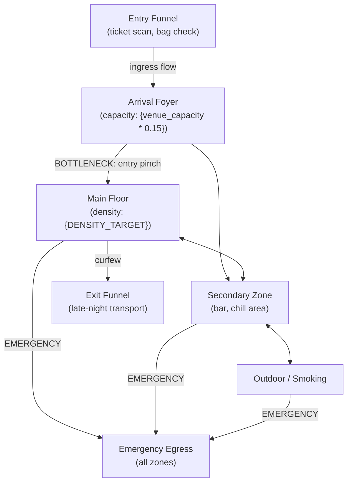
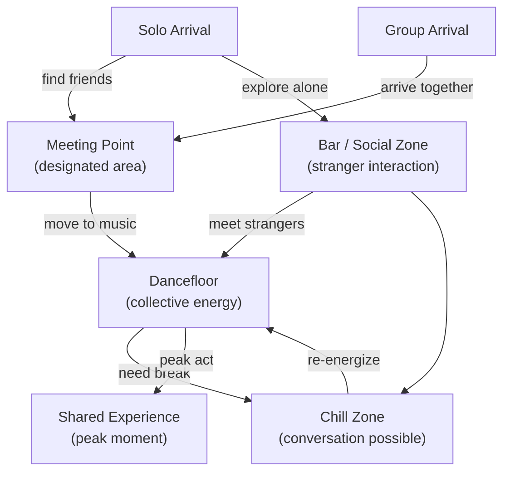

<objective>
Write Wave 0 Nyquist tests for all 4 FLOW requirements, then add the experience flow conditional block to flows.md — generating temporal (TFL), spatial (SFL), and social (SOC) flow diagrams plus spaces-inventory.json, with manifest registration for all three artifact codes.

Purpose: Experience products need physical-domain flow diagrams (crowd movement, temporal arc, social dynamics) instead of software user-flow diagrams. The mutual exclusion architecture means experience products skip the software path entirely and produce their own artifacts, feeding Phase 78 floor plan generation.

Output: Passing Nyquist test suite + fully instrumented flows.md with experience flow generation.
</objective>

<execution_context>
@/Users/greyaltaer/.claude/get-shit-done/workflows/execute-plan.md
@/Users/greyaltaer/.claude/get-shit-done/templates/summary.md
</execution_context>

<context>
@.planning/PROJECT.md
@.planning/ROADMAP.md
@.planning/STATE.md
@.planning/phases/77-flow-diagrams/77-RESEARCH.md

<interfaces>
<!-- Key patterns executor needs from codebase -->

From tests/phase-76/experience-tokens.test.mjs (Wave 0 TDD pattern to replicate):
```javascript
import { test, describe } from 'node:test';
import assert from 'node:assert/strict';
import { readFileSync } from 'fs';
import { resolve, join } from 'path';
import { fileURLToPath } from 'url';

const __dirname = fileURLToPath(new URL('.', import.meta.url));
const ROOT = resolve(__dirname, '..', '..');

function readWorkflow(name) {
  return readFileSync(join(ROOT, name), 'utf8');
}
```

From workflows/flows.md line 72 (Phase 74 stub to replace):
```markdown
<!-- Experience product type — Phase 74 stub: temporal, spatial, and social flow dimensions (crowd flow, ingress/egress, stage-to-stage routing, run-of-show timing) are added in Phase 77. Current behavior: proceed with software flow path as temporary fallback for experience product type. NEVER produce experience-specific spatial flow diagrams from this stub. -->
```

From workflows/flows.md Step 4/7 structure (lines 147-366):
- 4a: Persona and journey identification (software path)
- 4b: Overview diagram (software path)
- 4c: Per-journey diagrams (software path)
- 4d: Flow summary table (software path)
- 4e: Screen inventory build (software path)

From workflows/flows.md Step 5/7 structure (lines 370-410):
- File 1: FLW-flows-v{N}.md (software versioned flow document)
- File 2: FLW-screen-inventory.json (software screen inventory)

From workflows/flows.md Step 7/7 manifest registration (lines 499-509):
```bash
node "${CLAUDE_PLUGIN_ROOT}/bin/pde-tools.cjs" design manifest-update FLW code FLW
node "${CLAUDE_PLUGIN_ROOT}/bin/pde-tools.cjs" design manifest-update FLW name "User Flows"
node "${CLAUDE_PLUGIN_ROOT}/bin/pde-tools.cjs" design manifest-update FLW type user-flows
node "${CLAUDE_PLUGIN_ROOT}/bin/pde-tools.cjs" design manifest-update FLW domain ux
node "${CLAUDE_PLUGIN_ROOT}/bin/pde-tools.cjs" design manifest-update FLW path ".planning/design/ux/FLW-flows-v{N}.md"
node "${CLAUDE_PLUGIN_ROOT}/bin/pde-tools.cjs" design manifest-update FLW status draft
node "${CLAUDE_PLUGIN_ROOT}/bin/pde-tools.cjs" design manifest-update FLW version {N}
```

From workflows/flows.md Step 7/7 coverage pattern (lines 511-539):
```bash
COV=$(node "${CLAUDE_PLUGIN_ROOT}/bin/pde-tools.cjs" design coverage-check)
if [[ "$COV" == @file:* ]]; then COV=$(cat "${COV#@file:}"); fi
# Parse all current flag values, merge hasFlows: true, write full object
```

From 77-RESEARCH.md artifact codes:
- TFL — Temporal Flow (.planning/design/ux/TFL-temporal-flow-v1.md)
- SFL — Spatial Flow (.planning/design/ux/SFL-spatial-flow-v1.md)
- SOC — Social Flow (.planning/design/ux/SOC-social-flow-v1.md)
- spaces-inventory.json (.planning/design/ux/spaces-inventory.json)

From 77-RESEARCH.md Mermaid diagram structures:
- TFL: flowchart LR with 8 stages (Awareness through Afterglow), TFL_{N} node IDs
- SFL: flowchart TD with zones (Entry Funnel, Foyer, zones, Egress, Exit), SFL_ node IDs, BOTTLENECK: prefix on edges
- SOC: flowchart TD with social mode nodes (solo, group, meeting, dancefloor), SOC_ node IDs

From 77-RESEARCH.md spaces-inventory.json schema:
```json
{
  "schemaVersion": "1.0",
  "generatedAt": "{ISO 8601 date}",
  "source": "Phase 77 — /pde:flows experience block",
  "venueCapacity": 500,
  "zones": [{ "id": "zone-main-floor", "name": "...", "capacity": 350, "densityTarget": "high", "mood": "...", "adjacentTo": ["..."], "sightlines": "..." }],
  "bottlenecks": [{ "location": "...", "type": "ingress", "zoneId": "...", "mitigationNote": "..." }],
  "emergencyEgress": [{ "zoneId": "...", "exitPath": "...", "estimatedEvacTimeSec": 120 }]
}
```
</interfaces>
</context>

<tasks>

<task type="auto">
  <name>Task 1: Wave 0 Nyquist test suite for FLOW-01 through FLOW-04</name>
  <files>tests/phase-77/experience-flows.test.mjs</files>
  <read_first>
    - tests/phase-76/experience-tokens.test.mjs (Wave 0 TDD pattern to replicate exactly)
    - .planning/phases/77-flow-diagrams/77-RESEARCH.md (artifact codes, Mermaid patterns, spaces-inventory schema)
  </read_first>
  <action>
Create directory `tests/phase-77/` and file `tests/phase-77/experience-flows.test.mjs`.

Follow the exact pattern from `tests/phase-76/experience-tokens.test.mjs`:
- Same imports: `node:test`, `node:assert/strict`, `fs`, `path`, `url`
- Same `ROOT` resolution: `const ROOT = resolve(__dirname, '..', '..');`
- Helper function: `function readWorkflow(name) { return readFileSync(join(ROOT, name), 'utf8'); }`

Write these describe/test blocks:

**FLOW-01 (temporal flow):**
```javascript
describe('FLOW-01: temporal flow diagram in flows.md', () => {
  test('flows.md contains temporal flow generation instruction', () => {
    const content = readWorkflow('workflows/flows.md');
    assert.ok(
      content.includes('TFL') || content.includes('temporal flow'),
      'flows.md missing temporal flow generation instruction (FLOW-01)'
    );
  });
  test('flows.md contains PRODUCT_TYPE experience guard before TFL generation', () => {
    const content = readWorkflow('workflows/flows.md');
    const guardIdx = content.indexOf('PRODUCT_TYPE == "experience"');
    const tflIdx = Math.max(content.indexOf('TFL'), content.indexOf('temporal flow'));
    assert.ok(guardIdx !== -1, 'flows.md missing PRODUCT_TYPE experience guard');
    assert.ok(tflIdx !== -1, 'flows.md missing TFL/temporal flow reference');
    assert.ok(guardIdx < tflIdx, 'PRODUCT_TYPE guard must precede TFL generation instruction');
  });
  test('flows.md contains 8-stage attendee arc keywords', () => {
    const content = readWorkflow('workflows/flows.md');
    assert.ok(content.includes('Awareness'), 'FLOW-01: Awareness stage missing');
    assert.ok(content.includes('Anticipation'), 'FLOW-01: Anticipation stage missing');
    assert.ok(content.includes('Arrival'), 'FLOW-01: Arrival stage missing');
    assert.ok(content.includes('Immersion'), 'FLOW-01: Immersion stage missing');
    assert.ok(content.includes('Peak'), 'FLOW-01: Peak stage missing');
    assert.ok(content.includes('Comedown'), 'FLOW-01: Comedown stage missing');
    assert.ok(content.includes('Departure'), 'FLOW-01: Departure stage missing');
    assert.ok(content.includes('Afterglow'), 'FLOW-01: Afterglow stage missing');
  });
});
```

**FLOW-02 (spatial flow):**
```javascript
describe('FLOW-02: spatial flow diagram in flows.md', () => {
  test('flows.md contains spatial flow generation instruction', () => {
    const content = readWorkflow('workflows/flows.md');
    assert.ok(
      content.includes('SFL') || content.includes('spatial flow'),
      'flows.md missing spatial flow generation instruction (FLOW-02)'
    );
  });
  test('flows.md contains zone and bottleneck keywords for spatial flow', () => {
    const content = readWorkflow('workflows/flows.md');
    assert.ok(content.includes('BOTTLENECK'), 'FLOW-02: BOTTLENECK annotation keyword missing');
    assert.ok(content.includes('Emergency Egress') || content.includes('emergency egress') || content.includes('EMERGENCY'), 'FLOW-02: emergency egress reference missing');
  });
});
```

**FLOW-03 (social flow):**
```javascript
describe('FLOW-03: social flow diagram in flows.md', () => {
  test('flows.md contains social flow generation instruction', () => {
    const content = readWorkflow('workflows/flows.md');
    assert.ok(
      content.includes('SOC') || content.includes('social flow'),
      'flows.md missing social flow generation instruction (FLOW-03)'
    );
  });
  test('flows.md contains solo vs group social dynamic keywords', () => {
    const content = readWorkflow('workflows/flows.md');
    assert.ok(content.includes('solo') || content.includes('Solo'), 'FLOW-03: solo dynamic missing');
    assert.ok(content.includes('group') || content.includes('Group'), 'FLOW-03: group dynamic missing');
  });
});
```

**FLOW-04 (spaces-inventory.json):**
```javascript
describe('FLOW-04: spaces-inventory.json in flows.md', () => {
  test('flows.md contains spaces-inventory.json generation instruction', () => {
    const content = readWorkflow('workflows/flows.md');
    assert.ok(
      content.includes('spaces-inventory.json'),
      'flows.md missing spaces-inventory.json generation instruction (FLOW-04)'
    );
  });
  test('flows.md specifies spaces-inventory.json schema fields', () => {
    const content = readWorkflow('workflows/flows.md');
    assert.ok(content.includes('venueCapacity'), 'FLOW-04: venueCapacity field missing from schema');
    assert.ok(content.includes('adjacentTo'), 'FLOW-04: adjacentTo field missing from schema');
    assert.ok(content.includes('densityTarget'), 'FLOW-04: densityTarget field missing from schema');
  });
  test('flows.md specifies spaces-inventory.json write path in ux directory', () => {
    const content = readWorkflow('workflows/flows.md');
    assert.ok(
      content.includes('.planning/design/ux/spaces-inventory.json'),
      'FLOW-04: canonical write path .planning/design/ux/spaces-inventory.json missing'
    );
  });
});
```

**Software isolation check:**
```javascript
describe('Experience flow isolation: software products unaffected', () => {
  test('experience flow artifact codes appear only inside PRODUCT_TYPE experience guard', () => {
    const content = readWorkflow('workflows/flows.md');
    const guardIdx = content.indexOf('PRODUCT_TYPE == "experience"');
    if (guardIdx === -1) return; // guard tested elsewhere
    const tflIdx = content.indexOf('TFL-temporal-flow');
    const sflIdx = content.indexOf('SFL-spatial-flow');
    const socIdx = content.indexOf('SOC-social-flow');
    if (tflIdx !== -1) assert.ok(tflIdx > guardIdx, 'TFL reference appears before experience guard');
    if (sflIdx !== -1) assert.ok(sflIdx > guardIdx, 'SFL reference appears before experience guard');
    if (socIdx !== -1) assert.ok(socIdx > guardIdx, 'SOC reference appears before experience guard');
  });
});
```

Total: 5 describe blocks, ~12 tests. All tests MUST FAIL when run against current flows.md (Wave 0 contract).

Commit the test file with message: `test(77-01): add failing Nyquist tests for FLOW-01 through FLOW-04`

Run `node --test tests/phase-77/experience-flows.test.mjs` and confirm tests FAIL (expected for Wave 0).
  </action>
  <verify>
    <automated>node --test tests/phase-77/experience-flows.test.mjs 2>&1 | tail -5</automated>
  </verify>
  <acceptance_criteria>
    - File `tests/phase-77/experience-flows.test.mjs` exists
    - File contains `import { test, describe } from 'node:test'`
    - File contains `spaces-inventory.json` string assertion
    - File contains `PRODUCT_TYPE` guard ordering assertion
    - File contains assertions for all 3 artifact codes: `TFL`, `SFL`, `SOC`
    - File contains 8-stage arc keywords: `Awareness`, `Anticipation`, `Arrival`, `Immersion`, `Peak`, `Comedown`, `Departure`, `Afterglow`
    - File contains `BOTTLENECK` annotation assertion
    - File contains `venueCapacity`, `adjacentTo`, `densityTarget` schema field assertions
    - File contains `.planning/design/ux/spaces-inventory.json` path assertion
    - Running `node --test tests/phase-77/experience-flows.test.mjs` exits non-zero (tests fail against pre-edit flows.md -- Wave 0 contract)
  </acceptance_criteria>
  <done>Wave 0 test scaffold committed with all FLOW assertions failing against current flows.md</done>
</task>

<task type="auto">
  <name>Task 2: Add experience flow generation block to flows.md</name>
  <files>workflows/flows.md</files>
  <read_first>
    - workflows/flows.md (FULL file -- must understand Step 2 stub at line 72, Step 4 structure lines 147-366, Step 5 file writes lines 370-410, Step 6 DESIGN-STATE lines 414-437, Step 7 manifest registration lines 441-542)
    - .planning/phases/77-flow-diagrams/77-RESEARCH.md (architecture patterns, Mermaid diagrams, anti-patterns, manifest registration, coverage pattern)
    - tests/phase-77/experience-flows.test.mjs (the assertions this task must satisfy)
  </read_first>
  <action>
Edit `workflows/flows.md` in five locations. The experience block uses MUTUAL EXCLUSION: for experience products, skip software Steps 4a-4e entirely and produce TFL/SFL/SOC/spaces-inventory.json instead.

**Location 1 -- Step 2 stub replacement (line 72):**

Replace:
```
<!-- Experience product type — Phase 74 stub: temporal, spatial, and social flow dimensions (crowd flow, ingress/egress, stage-to-stage routing, run-of-show timing) are added in Phase 77. Current behavior: proceed with software flow path as temporary fallback for experience product type. NEVER produce experience-specific spatial flow diagrams from this stub. -->
```

With:
```
<!-- Experience product type — Phase 74 architecture: temporal, spatial, and social flow diagrams implemented in Phase 77. See Step 4b experience block for TFL/SFL/SOC generation. Software products skip this block entirely. -->
```

CRITICAL: The replacement MUST retain the substring `Phase 74` to keep the Phase 82 regression test at line 213 (which checks `content.includes('Phase 74')`) passing.

**Location 2 -- New experience guard BEFORE Step 4a (insert between line 149 "This is the core generation step..." and line 151 "#### 4a:"):**

Insert a new section:

```markdown
**IF `PRODUCT_TYPE == "experience"`:** skip Steps 4a through 4e (software path) and jump to Step 4-EXP below.

#### Step 4-EXP: Experience flow generation (experience products only)

Read the experience brief fields from BRIEF.md:
- `VIBE_CONTRACT` — from Vibe Contract section (emotional arc, peak timing, energy level, aesthetic register)
- `VENUE_CONSTRAINTS` — from Venue Constraints section (capacity, curfew, noise limits, load-in windows, fixed infrastructure)
- `AUDIENCE_ARCHETYPE` — from Audience Archetype section (crowd composition, mobility needs, group size, energy profile)

Read `SYS-experience-tokens.json` if present (soft dependency):
- Extract `spatial.zone-count.$value` for ZONE_COUNT
- Extract `spatial.density-target.$value` for DENSITY_TARGET
- If file absent: set ZONE_COUNT = "3-5 zones (estimated)", DENSITY_TARGET = "moderate"

Generate three experience flow diagrams (held in memory):

##### TFL: Temporal Flow Diagram (FLOW-01)

Generate a Mermaid `flowchart LR` representing the eight-stage attendee emotional arc. Each stage is a node; transitions show timing/triggers derived from the Vibe Contract energy level and peak timing.

```mermaid
flowchart LR
    TFL_1["Awareness\n(pre-event discovery)"]
    TFL_2["Anticipation\n(ticket purchase → doors)"]
    TFL_3["Arrival\n(entry funnel, first impressions)"]
    TFL_4["Immersion\n(settling in, zone exploration)"]
    TFL_5["Peak\n(headline act / peak energy)"]
    TFL_6["Comedown\n(post-peak transition)"]
    TFL_7["Departure\n(exit flow, transport)"]
    TFL_8["Afterglow\n(social media, memory)"]

    TFL_1 -->|"ticket purchase"| TFL_2
    TFL_2 -->|"doors open"| TFL_3
    TFL_3 -->|"entry complete"| TFL_4
    TFL_4 -->|"peak act begins"| TFL_5
    TFL_5 -->|"set ends"| TFL_6
    TFL_6 -->|"curfew approach"| TFL_7
    TFL_7 -->|"post-event"| TFL_8
```



Node IDs use `TFL_{N}` prefix. Customize stage descriptions and transition labels using the Vibe Contract (peak timing drives the TFL_4->TFL_5 transition label; energy level drives descriptive text in each node annotation).

Below the diagram, generate a **Temporal Analysis** table:

```markdown
| Stage | Duration Estimate | Energy Level | Key Design Consideration |
|-------|-------------------|--------------|--------------------------|
| Awareness | Weeks/days pre-event | Low | Discovery channels, ticket design |
| Anticipation | Days to hours | Building | Communication cadence, pre-event content |
| Arrival | 30-60 min | Medium-high | Queue management, first impression |
| Immersion | 1-3 hours | High | Zone exploration, wayfinding |
| Peak | 30-90 min | Maximum | Crowd density, safety, sightlines |
| Comedown | 30-60 min | Declining | Transition spaces, hydration |
| Departure | 30-60 min | Low | Exit flow, transport, coat check |
| Afterglow | Post-event | Warm | Social sharing, feedback collection |
```

Customize durations and energy levels based on Venue Constraints (curfew affects departure timing) and Vibe Contract (energy arc).

##### SFL: Spatial Flow Diagram (FLOW-02)

Generate a Mermaid `flowchart TD` representing crowd movement through physical zones. Nodes are locations/zones; edges show movement with capacity and bottleneck annotations.



Node IDs use `SFL_` prefix. Zone count and names derive from `spatial.zone-count` token and Venue Constraints. Bottleneck annotations on edges use `BOTTLENECK:` prefix for downstream Phase 78 floor plan detection. Every zone must have an `EMERGENCY` edge to `SFL_EGRESS`.

Below the diagram, generate a **Zone Capacity Analysis** table:

```markdown
| Zone | Estimated Capacity | Density Target | Mood | Adjacent Zones |
|------|-------------------|----------------|------|----------------|
| Entry Funnel | {venue_capacity * 0.05} | controlled | anticipation | Foyer |
| Arrival Foyer | {venue_capacity * 0.15} | moderate | welcome | Main Floor, Secondary |
| Main Floor | {venue_capacity * 0.55} | {DENSITY_TARGET} | peak energy | Secondary, Egress |
| Secondary Zone | {venue_capacity * 0.20} | moderate | social | Main Floor, Outdoor |
| Outdoor | {venue_capacity * 0.05} | low | decompression | Secondary |
```

##### SOC: Social Flow Diagram (FLOW-03)

Generate a Mermaid `flowchart TD` representing attendee social modes and interaction points. Nodes distinguish solo arrivals, group arrivals, meeting points, stranger interaction zones, and dancefloor density dynamics.



Node IDs use `SOC_` prefix. Customize node descriptions using Audience Archetype (group size distribution, energy profile). Below the diagram, generate a **Social Dynamics Analysis** noting solo vs group arrival ratio, stranger interaction probability, and dancefloor density expectations derived from Audience Archetype.

##### Spaces Inventory JSON (FLOW-04)

Build a `SPACES_INVENTORY` JSON object conforming to this exact schema:

```json
{
  "schemaVersion": "1.0",
  "generatedAt": "{ISO 8601 date}",
  "source": "Phase 77 — /pde:flows experience block",
  "venueCapacity": {capacity from Venue Constraints},
  "zones": [
    {
      "id": "zone-{kebab-case-name}",
      "name": "{Zone Display Name}",
      "capacity": {number},
      "densityTarget": "{high|moderate|low}",
      "mood": "{mood from spatial tokens or brief}",
      "adjacentTo": ["{zone-id}", "..."],
      "sightlines": "{description}"
    }
  ],
  "bottlenecks": [
    {
      "location": "{location name}",
      "type": "{ingress|egress|internal}",
      "zoneId": "{zone-id}",
      "mitigationNote": "{recommendation}"
    }
  ],
  "emergencyEgress": [
    {
      "zoneId": "{zone-id}",
      "exitPath": "{description}",
      "estimatedEvacTimeSec": {number}
    }
  ]
}
```

Zone data derives from the SFL spatial flow diagram zones. Capacity estimates from Venue Constraints; density targets from SYS-experience-tokens.json spatial category; mood from spatial tokens or Vibe Contract.

After generating all four artifacts in memory, jump to Step 5-EXP.

**End experience flow generation block.** Non-experience products skip this entire Step 4-EXP and proceed to Step 4a as before.
```

**Location 3 -- New Step 5-EXP (insert between existing Step 5 content and Step 6, around line 412):**

Insert a new section for experience file writes:

```markdown
#### Step 5-EXP: Write experience flow artifacts (experience products only)

**IF `PRODUCT_TYPE == "experience"` (continuing from Step 4-EXP):**

Write all files using the Write tool. Display confirmation after each file.

**File 1: Temporal flow document**

Write to `.planning/design/ux/TFL-temporal-flow-v1.md`. Include frontmatter:

```yaml
---
Generated: "{ISO 8601 date}"
Skill: /pde:flows (TFL)
Version: v1
Status: draft
Source Brief: "{brief path}"
Type: experience-flow-temporal
---
```

Content: the temporal flow Mermaid diagram and Temporal Analysis table from Step 4-EXP.

Display: `  -> Created: .planning/design/ux/TFL-temporal-flow-v1.md`

**File 2: Spatial flow document**

Write to `.planning/design/ux/SFL-spatial-flow-v1.md`. Include frontmatter with `Type: experience-flow-spatial`. Content: the spatial flow Mermaid diagram and Zone Capacity Analysis table from Step 4-EXP.

Display: `  -> Created: .planning/design/ux/SFL-spatial-flow-v1.md`

**File 3: Social flow document**

Write to `.planning/design/ux/SOC-social-flow-v1.md`. Include frontmatter with `Type: experience-flow-social`. Content: the social flow Mermaid diagram and Social Dynamics Analysis from Step 4-EXP.

Display: `  -> Created: .planning/design/ux/SOC-social-flow-v1.md`

**File 4: Spaces inventory JSON**

Write to `.planning/design/ux/spaces-inventory.json` (fixed path, unversioned -- same convention as `FLW-screen-inventory.json`). Write the full `SPACES_INVENTORY` JSON object from Step 4-EXP.

Display: `  -> Created: .planning/design/ux/spaces-inventory.json`

Display: `Step 5/7: Experience flow artifacts written (3 diagrams + 1 JSON).`

**Skip to Step 6.** (Non-experience products use the standard Step 5 above.)
```

**Location 4 -- Step 6 experience DESIGN-STATE update (insert after existing Step 6 FLW row update, around line 436):**

Add inside Step 6, after the existing FLW row instruction:

```markdown
**If `PRODUCT_TYPE == "experience"`:** Add or update THREE artifact rows instead of one FLW row:

```
| TFL | Temporal Flow | /pde:flows | draft | v1 | none | -- | {YYYY-MM-DD} |
| SFL | Spatial Flow | /pde:flows | draft | v1 | none | -- | {YYYY-MM-DD} |
| SOC | Social Flow | /pde:flows | draft | v1 | none | -- | {YYYY-MM-DD} |
```

Do NOT add the FLW row for experience products (mutual exclusion -- experience products produce TFL/SFL/SOC, not FLW).
```

**Location 5 -- Step 7 experience manifest registration (insert after existing FLW manifest-update block, around line 510):**

Add inside Step 7, after the existing FLW manifest registration:

```markdown
**If `PRODUCT_TYPE == "experience"`:** Register three experience flow artifacts INSTEAD of FLW:

```bash
# Temporal flow (TFL)
node "${CLAUDE_PLUGIN_ROOT}/bin/pde-tools.cjs" design manifest-update TFL code TFL
node "${CLAUDE_PLUGIN_ROOT}/bin/pde-tools.cjs" design manifest-update TFL name "Temporal Flow Diagram"
node "${CLAUDE_PLUGIN_ROOT}/bin/pde-tools.cjs" design manifest-update TFL type experience-flow-temporal
node "${CLAUDE_PLUGIN_ROOT}/bin/pde-tools.cjs" design manifest-update TFL domain ux
node "${CLAUDE_PLUGIN_ROOT}/bin/pde-tools.cjs" design manifest-update TFL path ".planning/design/ux/TFL-temporal-flow-v1.md"
node "${CLAUDE_PLUGIN_ROOT}/bin/pde-tools.cjs" design manifest-update TFL status draft

# Spatial flow (SFL) -- also references spaces-inventory.json
node "${CLAUDE_PLUGIN_ROOT}/bin/pde-tools.cjs" design manifest-update SFL code SFL
node "${CLAUDE_PLUGIN_ROOT}/bin/pde-tools.cjs" design manifest-update SFL name "Spatial Flow Diagram"
node "${CLAUDE_PLUGIN_ROOT}/bin/pde-tools.cjs" design manifest-update SFL type experience-flow-spatial
node "${CLAUDE_PLUGIN_ROOT}/bin/pde-tools.cjs" design manifest-update SFL domain ux
node "${CLAUDE_PLUGIN_ROOT}/bin/pde-tools.cjs" design manifest-update SFL path ".planning/design/ux/SFL-spatial-flow-v1.md"
node "${CLAUDE_PLUGIN_ROOT}/bin/pde-tools.cjs" design manifest-update SFL status draft

# Social flow (SOC)
node "${CLAUDE_PLUGIN_ROOT}/bin/pde-tools.cjs" design manifest-update SOC code SOC
node "${CLAUDE_PLUGIN_ROOT}/bin/pde-tools.cjs" design manifest-update SOC name "Social Flow Diagram"
node "${CLAUDE_PLUGIN_ROOT}/bin/pde-tools.cjs" design manifest-update SOC type experience-flow-social
node "${CLAUDE_PLUGIN_ROOT}/bin/pde-tools.cjs" design manifest-update SOC domain ux
node "${CLAUDE_PLUGIN_ROOT}/bin/pde-tools.cjs" design manifest-update SOC path ".planning/design/ux/SOC-social-flow-v1.md"
node "${CLAUDE_PLUGIN_ROOT}/bin/pde-tools.cjs" design manifest-update SOC status draft
```

Do NOT register the FLW artifact for experience products.

**Experience coverage update (inside Step 7, after existing coverage block):**

For experience products, use the same read-merge-write pattern as software products. Read current coverage first, merge `hasFlows: true`, write all 16 fields (including `hasPrintCollateral` and `hasProductionBible`). The coverage flag `hasFlows` is semantically correct for experience flow artifacts. Do NOT introduce a `hasExperienceFlows` flag.

```bash
COV=$(node "${CLAUDE_PLUGIN_ROOT}/bin/pde-tools.cjs" design coverage-check)
if [[ "$COV" == @file:* ]]; then COV=$(cat "${COV#@file:}"); fi
# Parse ALL 16 current flag values from COV, merge hasFlows: true, write full 16-field object
node "${CLAUDE_PLUGIN_ROOT}/bin/pde-tools.cjs" design manifest-set-top-level designCoverage '{"hasDesignSystem":{current},"hasWireframes":{current},"hasFlows":true,"hasHardwareSpec":{current},"hasCritique":{current},"hasIterate":{current},"hasHandoff":{current},"hasIdeation":{current},"hasCompetitive":{current},"hasOpportunity":{current},"hasMockup":{current},"hasHigAudit":{current},"hasRecommendations":{current},"hasStitchWireframes":{current},"hasPrintCollateral":{current},"hasProductionBible":{current}}'
```
```

Also update the **Summary section** at the end of flows.md (around line 560) to include experience output files:

```markdown
**If `PRODUCT_TYPE == "experience"`:**

| Property | Value |
|----------|-------|
| Files created | .planning/design/ux/TFL-temporal-flow-v1.md, .planning/design/ux/SFL-spatial-flow-v1.md, .planning/design/ux/SOC-social-flow-v1.md, .planning/design/ux/spaces-inventory.json, .planning/design/ux/DESIGN-STATE.md (if it does not exist) |
| Files modified | .planning/design/DESIGN-STATE.md, .planning/design/design-manifest.json |
| Next suggested skill | /pde:wireframe |
```

And update the **output** section at the end of flows.md to add experience artifacts:

```markdown
- `.planning/design/ux/TFL-temporal-flow-v1.md` — temporal flow diagram (experience products only)
- `.planning/design/ux/SFL-spatial-flow-v1.md` — spatial flow diagram with zone/bottleneck annotations (experience products only)
- `.planning/design/ux/SOC-social-flow-v1.md` — social flow diagram (experience products only)
- `.planning/design/ux/spaces-inventory.json` — machine-readable zone inventory for Phase 78 floor plan (experience products only)
```

CRITICAL ANTI-PATTERNS:
- Do NOT modify Steps 4a, 4b, 4c, 4d, 4e content (software flow generation). Experience block is a SEPARATE step.
- Do NOT use artifact codes TML or FLP -- those belong to Phase 78 wireframe stage.
- Do NOT remove the `Phase 74` substring from the replacement comment (breaks Phase 82 test).
- Do NOT hardcode designCoverage field count to 14 -- use 16 fields (includes hasPrintCollateral and hasProductionBible).
- Do NOT write spaces-inventory.json to any path other than `.planning/design/ux/spaces-inventory.json`.

After editing, run:
```bash
node --test tests/phase-77/experience-flows.test.mjs
```
All tests MUST now PASS (Wave 0 green).

Also run regression:
```bash
node --test tests/phase-74/experience-regression.test.mjs && node --test tests/phase-75/brief-extensions.test.mjs && node --test tests/phase-76/experience-tokens.test.mjs
```
All three MUST pass (no regressions).

Commit with message: `feat(77-01): add experience flow diagrams to flows.md`
  </action>
  <verify>
    <automated>node --test tests/phase-77/experience-flows.test.mjs && node --test tests/phase-74/experience-regression.test.mjs && node --test tests/phase-75/brief-extensions.test.mjs && node --test tests/phase-76/experience-tokens.test.mjs</automated>
  </verify>
  <acceptance_criteria>
    - `grep -c 'PRODUCT_TYPE == "experience"' workflows/flows.md` returns at least 1
    - `grep 'Step 4-EXP' workflows/flows.md` returns a match
    - `grep 'Step 5-EXP' workflows/flows.md` returns a match
    - `grep 'TFL-temporal-flow-v1.md' workflows/flows.md` returns at least 1
    - `grep 'SFL-spatial-flow-v1.md' workflows/flows.md` returns at least 1
    - `grep 'SOC-social-flow-v1.md' workflows/flows.md` returns at least 1
    - `grep '.planning/design/ux/spaces-inventory.json' workflows/flows.md` returns at least 1
    - `grep 'venueCapacity' workflows/flows.md` returns at least 1
    - `grep 'adjacentTo' workflows/flows.md` returns at least 1
    - `grep 'densityTarget' workflows/flows.md` returns at least 1
    - `grep 'BOTTLENECK' workflows/flows.md` returns at least 1
    - `grep 'Awareness' workflows/flows.md` returns at least 1
    - `grep 'Afterglow' workflows/flows.md` returns at least 1
    - `grep 'Solo' workflows/flows.md` OR `grep 'solo' workflows/flows.md` returns at least 1
    - `grep 'manifest-update TFL' workflows/flows.md` returns at least 6 lines
    - `grep 'manifest-update SFL' workflows/flows.md` returns at least 6 lines
    - `grep 'manifest-update SOC' workflows/flows.md` returns at least 6 lines
    - `grep 'Phase 74' workflows/flows.md` still returns at least 1 (keeps Phase 82 stub test passing)
    - `grep 'hasPrintCollateral' workflows/flows.md` returns at least 1 (16-field coverage)
    - `grep 'hasProductionBible' workflows/flows.md` returns at least 1 (16-field coverage)
    - `node --test tests/phase-77/experience-flows.test.mjs` exits 0
    - `node --test tests/phase-74/experience-regression.test.mjs` exits 0
    - `node --test tests/phase-75/brief-extensions.test.mjs` exits 0
    - `node --test tests/phase-76/experience-tokens.test.mjs` exits 0
  </acceptance_criteria>
  <done>flows.md contains complete experience flow generation block with TFL/SFL/SOC diagrams, spaces-inventory.json schema, manifest registration for 3 artifact codes, 16-field coverage merge, all Phase 77 Nyquist tests pass, Phases 74-76 regressions clean</done>
</task>

</tasks>

<verification>
- `node --test tests/phase-77/experience-flows.test.mjs` -- all FLOW structural assertions green
- `node --test tests/phase-74/experience-regression.test.mjs` -- Phase 74 regression clean
- `node --test tests/phase-75/brief-extensions.test.mjs` -- Phase 75 regression clean
- `node --test tests/phase-76/experience-tokens.test.mjs` -- Phase 76 regression clean
- `grep -c 'spaces-inventory.json' workflows/flows.md` >= 2
- `grep 'manifest-update TFL' workflows/flows.md | wc -l` >= 6
- `grep 'manifest-update SFL' workflows/flows.md | wc -l` >= 6
- `grep 'manifest-update SOC' workflows/flows.md | wc -l` >= 6
</verification>

<success_criteria>
- flows.md generates TFL, SFL, SOC diagrams and spaces-inventory.json for experience products via Step 4-EXP/5-EXP conditional block
- Three Mermaid diagrams specified with correct node ID conventions (TFL_, SFL_, SOC_ prefixes)
- spaces-inventory.json schema includes venueCapacity, zones (with id, name, capacity, densityTarget, mood, adjacentTo, sightlines), bottlenecks, and emergencyEgress
- Manifest registration and coverage flag commands present for all three experience artifact codes
- Coverage uses 16-field read-merge-write pattern (preserves hasPrintCollateral, hasProductionBible)
- Base software flow generation is untouched (Steps 4a-4e unmodified)
- All Phase 77 Nyquist tests pass; all Phase 74, 75, 76 regression tests pass
</success_criteria>

<output>
After completion, create `.planning/phases/77-flow-diagrams/77-01-SUMMARY.md`
</output>
