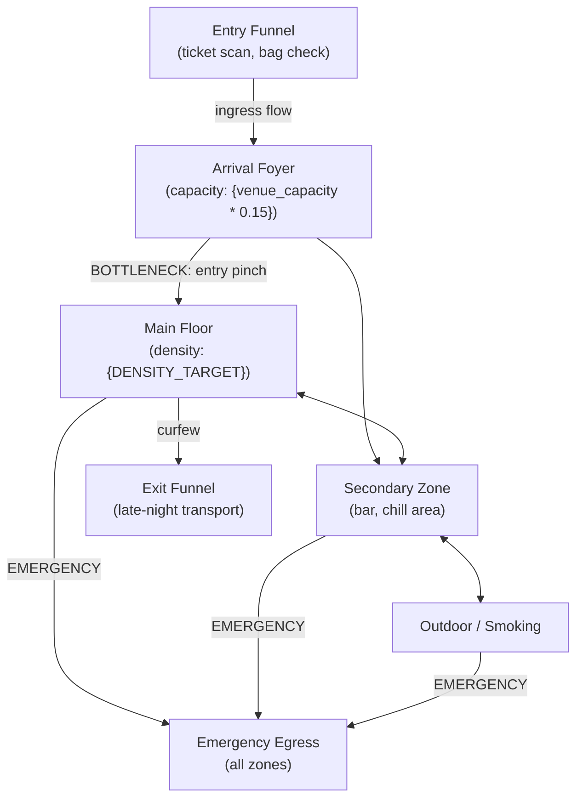

# Phase 77: Flow Diagrams — Research

**Researched:** 2026-03-21
**Domain:** Extending `workflows/flows.md` to generate three experience-specific flow diagrams (temporal, spatial, social) and a `spaces-inventory.json` file when `PRODUCT_TYPE == "experience"`, while preserving all existing software-path behavior unchanged.
**Confidence:** HIGH — grounded entirely in direct codebase inspection of flows.md, wireframe.md, system.md, the Phase 82 test suite, and the established Phase 74/75/76 branch patterns.

---

<phase_requirements>

## Phase Requirements

| ID | Description | Research Support |
|----|-------------|-----------------|
| FLOW-01 | Temporal flow diagram generated (awareness → anticipation → arrival → immersion → peak → comedown → departure → afterglow) | New experience-only Step 4b section in flows.md, gated on PRODUCT_TYPE == "experience"; Mermaid flowchart using the established FLW node ID conventions |
| FLOW-02 | Spatial flow diagram generated (entry funnel → zones → circulation → bottlenecks → emergency egress) | Same new Step 4b block; spatial zones derived from SYS-experience-tokens.json spatial category (zone-count, density-target) and Venue Constraints brief field |
| FLOW-03 | Social flow diagram generated (solo vs group, meeting points, stranger interaction, dancefloor density) | Same new Step 4b block; social dynamics derived from Audience Archetype brief field (crowd composition, group size, energy profile) |
| FLOW-04 | Spaces inventory JSON produced alongside flow diagrams for floor plan consumption | New Step 5c in flows.md; writes `.planning/design/ux/spaces-inventory.json`; consumed by wireframe.md PRG venue map placeholder at line 1490 and Phase 78 floor plan |

</phase_requirements>

---

## Summary

Phase 77 extends `workflows/flows.md` with a single conditional block that fires only when `PRODUCT_TYPE == "experience"`. The existing flows.md Step 2 already contains the Phase 74 stub comment (line 72) that marks exactly where this behavior belongs. When triggered, the experience branch produces three Mermaid flow diagrams — temporal, spatial, and social — and one machine-readable JSON file (`spaces-inventory.json`) that Phase 78 wireframe.md consumes for floor plan zone layout.

The software-path behavior is completely unchanged. For non-experience products, flows.md continues to produce `FLW-flows-v{N}.md` and `FLW-screen-inventory.json` exactly as before. The experience flow artifacts are separate files registered under their own artifact codes in `design-manifest.json`, alongside the existing FLW registration.

The Phase 82 milestone test has four `test.todo()` markers for Phase 77 (FLOW-01 through FLOW-04) that must be converted to positive assertions in the same commit as the flows.md edit — exactly as Phases 75 and 76 did for their respective pending markers. The stub detection test on line 213 (`flows.md still has Phase 74 stub (Phase 77 pending)`) will break when the stub is replaced and must also be updated in that same commit.

**Primary recommendation:** Add one experience-gated block after existing Step 4a persona/journey extraction in flows.md. The block fires when `PRODUCT_TYPE == "experience"`, generates three diagrams in memory (temporal arc, spatial zone flow, social dynamics flow), then writes three markdown files and one JSON file in Step 5. Register all four artifacts in design-manifest.json. Write Wave 0 tests before editing flows.md.

---

## Standard Stack

### Core

| Library | Version | Purpose | Why Standard |
|---------|---------|---------|--------------|
| `node:test` | Node.js built-in (v18+) | Test runner for Phase 77 Nyquist assertions | Established across phases 64-76; zero npm dependency |
| `node:assert/strict` | Node.js built-in | Assertions | Same pattern in all existing phase test files |
| `node:fs` / `node:path` | Node.js built-in | Read workflow file content in tests | Established pattern |
| `pde-tools.cjs design manifest-update` | PDE built-in | Register experience flow artifacts in design-manifest.json | Existing command; matches FLW, SYS-EXP registration pattern |
| `pde-tools.cjs design coverage-check` | PDE built-in | Read current 15-field designCoverage before merge | Required — direct write clobbers other skill flags |
| `pde-tools.cjs design manifest-set-top-level` | PDE built-in | Write merged designCoverage with hasFlows preserved | Existing command; 15-field object write pattern confirmed |

### Supporting

| Library | Version | Purpose | When to Use |
|---------|---------|---------|-------------|
| `pde-tools.cjs design lock-acquire` / `lock-release` | PDE built-in | Write-lock for root DESIGN-STATE.md update | Always required before editing root DESIGN-STATE.md — flows.md Step 7 already uses it |

**Installation:** No new packages. All code uses Node.js built-ins and existing pde-tools.cjs.

**Version verification:** Not applicable — no npm packages introduced.

---

## Architecture Patterns

### Recommended Project Structure

```
tests/
├── phase-77/
│   └── experience-flows.test.mjs   # NEW: Nyquist assertions (Wave 0 first)
├── phase-76/
│   └── experience-tokens.test.mjs  # MUST still pass after Phase 77
├── phase-75/
│   └── brief-extensions.test.mjs   # MUST still pass after Phase 77
├── phase-74/
│   └── experience-regression.test.mjs  # MUST still pass after Phase 77
└── phase-82/
    └── milestone-completion.test.mjs   # MUST be updated: flip FLOW todo markers to passing tests

workflows/
└── flows.md    # MODIFIED: replace Phase 74 stub with real experience conditional block
```

### Pattern 1: Phase 74 Stub Replacement in flows.md Step 2

**What:** The Phase 74 stub comment at line 72 in flows.md is the anchor insertion point:
```
<!-- Experience product type — Phase 74 stub: temporal, spatial, and social flow dimensions (crowd flow, ingress/egress, stage-to-stage routing, run-of-show timing) are added in Phase 77. Current behavior: proceed with software flow path as temporary fallback for experience product type. NEVER produce experience-specific spatial flow diagrams from this stub. -->
```

**When to use:** Phase 77 replaces this stub comment with a reference comment that preserves the `Phase 74` substring (required to keep the Phase 82 regression test at line 213-218 green — that test checks `content.includes('Phase 74')`). Critical: the stub test at line 213 checks `content.includes('Phase 74')` not the absence of specific language, so the replacement comment need only retain the `Phase 74` substring.

**Example replacement comment:**
```markdown
<!-- Experience product type — Phase 74 architecture: temporal, spatial, and social flow diagrams added in Phase 77. See Step 4b experience block below. -->
```

**CRITICAL:** The Phase 82 stub test at line 213-218 asserts `content.includes('Phase 74')`. The replacement comment MUST retain `Phase 74` to keep that test passing. This is the same defensive pattern used in Phase 76 Plan 01 — see STATE.md: "Phase 74 comment updated to preserve 'Phase 74' substring — keeps Phase 82 regression test passing without modification to that test."

### Pattern 2: Experience Flow Generation Block (Step 4b experience)

**What:** After existing Step 4a persona/journey identification (which only applies to software products), add a new experience-only block. This block reads the experience brief fields already extracted by Phase 75 and generates three diagrams in memory before writing.

**Structural position:** Between Step 4a and Step 4b (overview diagram). The experience block is an early exit/alternative path — for experience products, it generates the three experience flow diagrams instead of the software journey diagrams, then writes different files in Step 5.

**Approach — mutual exclusion or additive branch:**
Two options exist:
1. **Mutual exclusion:** For `PRODUCT_TYPE == "experience"`, skip software Steps 4a-4e entirely and run only the experience block. The files written are different — three Markdown flow files instead of one FLW-flows-v{N}.md.
2. **Additive:** For `PRODUCT_TYPE == "experience"`, run the software path AND add the experience flow files.

The success criteria specify: "Running `/pde:flows` for a software product produces only the existing user flow diagram — no experience artifacts." This implies mutual exclusion is the cleaner interpretation — but the success criteria also say experience products produce "three flow artifacts," not "three flow artifacts plus user flows." Mutual exclusion is the safer design and cleaner for Phase 78 consumption.

**Recommended: mutual exclusion.** The experience block replaces the software path entirely for experience products.

**Block structure:**
```markdown
#### Step 4b: Experience flow generation (experience products only)

**IF `PRODUCT_TYPE == "experience"`:**

Read the experience brief fields:
- `VIBE_CONTRACT` — from brief's Vibe Contract section
- `VENUE_CONSTRAINTS` — from brief's Venue Constraints section
- `AUDIENCE_ARCHETYPE` — from brief's Audience Archetype section

Read `SYS-experience-tokens.json` if present (soft dependency):
- Extract `spatial.zone-count.$value` → ZONE_COUNT
- Extract `spatial.density-target.$value` → DENSITY_TARGET
- If absent: set ZONE_COUNT = "3-5 zones (estimated)", DENSITY_TARGET = "moderate"

Generate three experience flow diagrams (held in memory):
- `TFL_CONTENT` — Temporal flow (FLOW-01)
- `SFL_CONTENT` — Spatial flow (FLOW-02)
- `SOC_CONTENT` — Social flow (FLOW-03)

Build `SPACES_INVENTORY` JSON object (FLOW-04).

**Jump to Step 5c** (experience file write) — skip Steps 4b through 4e (software path).
```

### Pattern 3: Temporal Flow Diagram (FLOW-01)

**What:** A Mermaid flowchart representing the eight-stage attendee emotional arc. Each stage is a node; transitions show timing/triggers.

**Artifact code:** `TFL` (Temporal Flow — derived from "temporal flow"; matches the two-part FLP/TML naming convention from WIRE-03 and the three-letter code pattern throughout the codebase)

**File path:** `.planning/design/ux/TFL-temporal-flow-v1.md`

**Mermaid diagram structure:**


```mermaid
flowchart LR
    TFL_1["Awareness\n(pre-event discovery)"]
    TFL_2["Anticipation\n(ticket purchase → doors)"]
    TFL_3["Arrival\n(entry funnel, first impressions)"]
    TFL_4["Immersion\n(settling in, zone exploration)"]
    TFL_5["Peak\n(headline act / peak energy)"]
    TFL_6["Comedown\n(post-peak transition)"]
    TFL_7["Departure\n(exit flow, transport)"]
    TFL_8["Afterglow\n(social media, memory)"]

    TFL_1 -->|"ticket purchase"| TFL_2
    TFL_2 -->|"doors open"| TFL_3
    TFL_3 -->|"entry complete"| TFL_4
    TFL_4 -->|"peak act begins"| TFL_5
    TFL_5 -->|"set ends"| TFL_6
    TFL_6 -->|"curfew approach"| TFL_7
    TFL_7 -->|"post-event"| TFL_8
```

**Node ID convention:** `TFL_{N}` prefix — consistent with existing `J{N}_{step}` per-journey prefix rules. Uses `flowchart LR` (left-right) for a timeline-style horizontal layout.

### Pattern 4: Spatial Flow Diagram (FLOW-02)

**What:** A Mermaid flowchart representing crowd movement through physical zones. Nodes are locations/zones; edges show movement with capacity/bottleneck annotations.

**Artifact code:** `SFL` (Spatial Flow)

**File path:** `.planning/design/ux/SFL-spatial-flow-v1.md`

**Mermaid diagram structure:**


**Key:** Bottleneck annotations on edges use `BOTTLENECK:` prefix for downstream Phase 78 floor plan detection. Zone count and names derive from `spatial.zone-count` and Venue Constraints.

### Pattern 5: Social Flow Diagram (FLOW-03)

**What:** A Mermaid flowchart representing attendee social modes and interaction points. Distinguishes solo arrivals, group arrivals, meeting points, and dancefloor density dynamics.

**Artifact code:** `SOC` (Social Flow)

**File path:** `.planning/design/ux/SOC-social-flow-v1.md`

**Key nodes from FLOW-03 requirement:** solo vs group, meeting points, stranger interaction, dancefloor density.

### Pattern 6: Spaces Inventory JSON (FLOW-04)

**What:** A machine-readable JSON file listing all venue zones with capacity estimates and adjacency relationships. Phase 78 wireframe.md already references `spaces-inventory.json` in the festival program venue map (line 1490). The Phase 78 floor plan stub (line 150 in wireframe.md) will consume this file for zone layout.

**File path:** `.planning/design/ux/spaces-inventory.json` (fixed path, unversioned — same convention as `FLW-screen-inventory.json`)

**Schema:**
```json
{
  "schemaVersion": "1.0",
  "generatedAt": "{ISO 8601 date}",
  "source": "flows.md experience block — Phase 77",
  "venueCapacity": {capacity from Venue Constraints},
  "zones": [
    {
      "id": "zone-main-floor",
      "name": "Main Floor",
      "capacity": 400,
      "densityTarget": "high",
      "mood": "peak energy",
      "adjacentTo": ["zone-secondary", "zone-egress"],
      "sightlines": "stage-facing",
      "materialPalette": "from spatial tokens"
    }
  ],
  "bottlenecks": [
    {
      "location": "Entry Funnel",
      "type": "ingress",
      "mitigationNote": "Stagger door times or add secondary entry point"
    }
  ],
  "emergencyEgress": [
    {
      "zoneId": "zone-main-floor",
      "exitPath": "north wall emergency doors",
      "estimatedEvacTimeSec": 120
    }
  ]
}
```

**Source data:** Zone names and capacity from Venue Constraints brief field; density targets from `spatial.density-target` in SYS-experience-tokens.json (soft dependency — fallback to "moderate" if absent); adjacency from spatial flow diagram edges.

**Downstream consumers:** wireframe.md line 1490 (PRG venue map — already references this path); Phase 78 floor plan generation (FLP artifact).

### Pattern 7: Manifest Registration for Experience Flow Artifacts

**What:** Three artifact codes registered in design-manifest.json, one per diagram type. The spaces-inventory.json is a supporting data file, not a standalone manifest artifact — register it as an attribute of the spatial flow artifact or as a separate `SPC` artifact code.

**Recommended artifact codes:**
- `TFL` — Temporal Flow
- `SFL` — Spatial Flow (includes `spacesInventoryPath` field pointing to spaces-inventory.json)
- `SOC` — Social Flow

**Manifest registration pattern (following SYS-EXP and FLW patterns):**
```bash
node "${CLAUDE_PLUGIN_ROOT}/bin/pde-tools.cjs" design manifest-update TFL code TFL
node "${CLAUDE_PLUGIN_ROOT}/bin/pde-tools.cjs" design manifest-update TFL name "Temporal Flow Diagram"
node "${CLAUDE_PLUGIN_ROOT}/bin/pde-tools.cjs" design manifest-update TFL type experience-flow-temporal
node "${CLAUDE_PLUGIN_ROOT}/bin/pde-tools.cjs" design manifest-update TFL domain ux
node "${CLAUDE_PLUGIN_ROOT}/bin/pde-tools.cjs" design manifest-update TFL path ".planning/design/ux/TFL-temporal-flow-v1.md"
node "${CLAUDE_PLUGIN_ROOT}/bin/pde-tools.cjs" design manifest-update TFL status draft
```

**Coverage flag:** The existing `hasFlows: true` flag in designCoverage covers experience flow artifacts — no new coverage flag is needed. The current designCoverage has 15 fields (confirmed from design-manifest.json inspection and wireframe.md line 1811). Setting `hasFlows: true` for experience products is semantically correct. Do NOT introduce a `hasExperienceFlows` flag — it would require updating all 15 skills that write designCoverage.

### Pattern 8: Phase 82 Test Migration (todo → passing)

**What:** Four `test.todo()` markers for Phase 77 in `tests/phase-82/milestone-completion.test.mjs` (lines 309-312) must be replaced with positive assertions in the same commit as the flows.md edit.

**The markers to replace (from line 309-312):**
```javascript
test.todo('Phase 77: FLOW-01 — temporal flow diagram generated');
test.todo('Phase 77: FLOW-02 — spatial flow diagram generated');
test.todo('Phase 77: FLOW-03 — social flow diagram generated');
test.todo('Phase 77: FLOW-04 — spaces inventory JSON produced');
```

**The stub test to update simultaneously (lines 213-218):**
```javascript
test('flows.md still has Phase 74 stub (Phase 77 pending)', () => {
  const content = readWorkflow('workflows/flows.md');
  assert.ok(
    content.includes('Phase 74'),
    'flows.md: Phase 74 stub comment missing ...'
  );
});
```

This test only checks `content.includes('Phase 74')` — it will keep passing as long as the replacement comment retains `Phase 74`. The test name must also be updated to reflect Phase 77 completion. The replacement positive assertions follow the describe block pattern established by Phase 76.

### Anti-Patterns to Avoid

- **Removing `Phase 74` substring from the stub comment replacement:** The Phase 82 regression test at line 213 checks `content.includes('Phase 74')`. If the replacement comment omits "Phase 74", the regression suite breaks. Retain "Phase 74" in the replacement text (e.g., "Phase 74 architecture").
- **Generating experience flow artifacts for software products:** The entire experience block must be gated strictly on `PRODUCT_TYPE == "experience"`. Success criterion 4 is explicit: "Running `/pde:flows` for a software product produces only the existing user flow diagram."
- **Using FLW artifact code for experience flow diagrams:** `FLW` is the existing user-flows artifact code. Experience flow diagrams use separate codes (TFL, SFL, SOC) registered as distinct artifacts. Sharing FLW would cause Phase 78's FLW-screen-inventory.json dependency check to behave incorrectly for experience products.
- **Writing spaces-inventory.json to the wrong path:** wireframe.md line 1490 already references this file with the path `spaces-inventory.json` (relative to design/ux/ or similar). The file must land at `.planning/design/ux/spaces-inventory.json` — the same directory as `FLW-screen-inventory.json`. Verify against the exact string in wireframe.md line 1495.
- **Committing flows.md without updating Phase 82 test:** The milestone-completion.test.mjs stub test and four todo markers are tightly coupled to the flows.md edit. All changes must land in the same commit. This pattern was established by Phase 75 and Phase 76.
- **Not preserving `hasFlows` flag from existing coverage:** For software products, the existing `hasFlows: true` flag is already set by the software flow path. For experience products, Phase 77 must also set `hasFlows: true` when merging coverage. Always read coverage first, merge, write full object.

---

## Don't Hand-Roll

| Problem | Don't Build | Use Instead | Why |
|---------|-------------|-------------|-----|
| Artifact registration | Direct JSON writes to design-manifest.json | `pde-tools.cjs design manifest-update {CODE} <field> <value>` | Existing tool handles write and updatedAt timestamp; identical to SYS-EXP and FLW registrations |
| Coverage flag merge | Hardcoded fifteen-field object | `pde-tools.cjs design coverage-check` + merge + `manifest-set-top-level designCoverage` | Direct write clobbers flags set by other skills (hasPrintCollateral, hasProductionBible, etc.) |
| Test runner | Any external test library | `node:test` + `node:assert/strict` | Established in all phases 64-76; zero npm dependency; runs in < 30 seconds |
| Lock management | Sleep/retry loops | `pde-tools.cjs design lock-acquire pde-flows` / `lock-release` | Existing flows.md Step 7 already uses this pattern; TTL-safe |

**Key insight:** All infrastructure for manifest registration, coverage flags, and state file updates already exists in flows.md Steps 6/7. Phase 77 does not change the state update infrastructure — it only adds new experience-gated artifacts to register within the same step structure.

---

## Common Pitfalls

### Pitfall 1: Phase 82 Stub Test Breakage (Name Mismatch)

**What goes wrong:** The Phase 82 test at line 213 is named `'flows.md still has Phase 74 stub (Phase 77 pending)'`. When Phase 77 ships, this test's describe block must be renamed to a positive "Phase 77 COMPLETE" assertion. If only the test body is updated but the test description still says "pending", the audit suite misleads future readers about completion state.

**Why it happens:** The todo-to-positive pattern was established in Phase 75 — but Phase 75 involved a completely separate describe block. The flows.md stub test is in the "Pending phases" describe block and needs to migrate to a "Phase 77 — experience flow diagrams (COMPLETE)" block.

**How to avoid:** The commit that edits flows.md must simultaneously: (1) update the stub test body and name, (2) replace the four FLOW todo markers with a new positive describe block, (3) update the describe block header comment from "phases 77-78 NOT YET IMPLEMENTED" to "phases 78 NOT YET IMPLEMENTED".

**Warning signs:** Running the full regression suite shows `flows.md still has Phase 74 stub (Phase 77 pending)` as a passing test after Phase 77 ships — that test name should not exist in the final state.

### Pitfall 2: Spaces Inventory Path Mismatch with Phase 78

**What goes wrong:** The spaces-inventory.json file is written to a path that wireframe.md's PRG generation does not find. wireframe.md line 1490 references the file by name `spaces-inventory.json` without a full path in the comment, but line 1495 shows it's expected adjacent to the design files.

**Why it happens:** The Phase 74 stub was written before the exact path was settled. The path `spaces-inventory.json` in the wireframe comment is ambiguous.

**How to avoid:** Write to `.planning/design/ux/spaces-inventory.json` — the same directory as `FLW-screen-inventory.json`. This is consistent with all other ux-domain artifacts. Document the canonical path explicitly in flows.md so Phase 78 can reference it.

**Warning signs:** Phase 78 floor plan generation step cannot find spaces-inventory.json; PRG venue map renders placeholder with no zone labels.

### Pitfall 3: Experience Block Runs on Software Products

**What goes wrong:** The `IF PRODUCT_TYPE == "experience"` guard is placed incorrectly (e.g., after the software flow generation instead of before), causing the experience block to run for all product types or not at all.

**Why it happens:** The flows.md structure has the Phase 74 stub inside Step 2 (prerequisites), not inside Step 4 (generation). If the experience block is added at the stub's Step 2 location rather than Step 4, it will fire before product type is available.

**How to avoid:** The replacement comment goes in Step 2 (keeping the Phase 74 reference intact). The actual generation logic lives in Step 4 as a new `4b experience` sub-step, gated by a clear `PRODUCT_TYPE == "experience"` check. The Step 2 comment is documentary only.

**Warning signs:** Software products start generating spaces-inventory.json; or `/pde:flows` run for an experience product shows the software journey steps instead of experience diagrams.

### Pitfall 4: Artifact Codes Collide with Phase 78

**What goes wrong:** Phase 78 uses artifact codes `FLP` (floor plan) and `TML` (timeline) per WIRE-03. If Phase 77 accidentally uses `FLP` or `TML` for its flow diagram artifacts, Phase 78's manifest registration will overwrite Phase 77's artifacts.

**Why it happens:** The REQUIREMENTS.md mentions "flow artifact codes" without specifying them for FLOW-01 through FLOW-03. A researcher might assume "temporal" → `TML`, conflicting with Phase 78.

**How to avoid:** Use `TFL` (temporal flow), `SFL` (spatial flow), `SOC` (social flow) — codes that do not appear anywhere in the existing codebase. Confirm by grepping for `TML` and `FLP` usage before finalizing codes.

**Warning signs:** `manifest-update TML` in flows.md — this would clobber the Phase 78 timeline wireframe artifact.

### Pitfall 5: designCoverage Field Count Drift

**What goes wrong:** The flows.md experience block reads coverage and writes a hardcoded object with the wrong field count, clobbering fields added by later phases.

**Why it happens:** The designCoverage field count has changed multiple times — Phase 80 added `hasPrintCollateral` (15th), Phase 81 added `hasProductionBible` (16th). The current manifest has 16 fields. If Phase 77 writes a 14-field hardcoded object, it silently removes `hasPrintCollateral` and `hasProductionBible`.

**How to avoid:** ALWAYS run `coverage-check`, parse ALL fields, merge `hasFlows: true`, and write the full merged object. Never hardcode the coverage object with specific field values — always derive from the current state. The flows.md Step 7 software path already does this correctly; the experience path must follow the identical read-merge-write pattern.

**Warning signs:** After running `/pde:flows` for an experience product, `hasPrintCollateral` or `hasProductionBible` becomes `false` in design-manifest.json.

---

## Code Examples

Verified patterns from codebase inspection:

### Phase 74 stub comment (current — from flows.md line 72)

```markdown
<!-- Experience product type — Phase 74 stub: temporal, spatial, and social flow dimensions (crowd flow, ingress/egress, stage-to-stage routing, run-of-show timing) are added in Phase 77. Current behavior: proceed with software flow path as temporary fallback for experience product type. NEVER produce experience-specific spatial flow diagrams from this stub. -->
```

**Replacement (preserves `Phase 74` substring for Phase 82 test):**
```markdown
<!-- Experience product type — Phase 74 architecture: temporal, spatial, and social flow diagrams implemented in Phase 77. See Step 4b experience block for TFL/SFL/SOC generation. -->
```

### Manifest registration for experience flow artifacts (flows.md Step 7 experience path)

```bash
# Temporal flow (TFL)
node "${CLAUDE_PLUGIN_ROOT}/bin/pde-tools.cjs" design manifest-update TFL code TFL
node "${CLAUDE_PLUGIN_ROOT}/bin/pde-tools.cjs" design manifest-update TFL name "Temporal Flow Diagram"
node "${CLAUDE_PLUGIN_ROOT}/bin/pde-tools.cjs" design manifest-update TFL type experience-flow-temporal
node "${CLAUDE_PLUGIN_ROOT}/bin/pde-tools.cjs" design manifest-update TFL domain ux
node "${CLAUDE_PLUGIN_ROOT}/bin/pde-tools.cjs" design manifest-update TFL path ".planning/design/ux/TFL-temporal-flow-v1.md"
node "${CLAUDE_PLUGIN_ROOT}/bin/pde-tools.cjs" design manifest-update TFL status draft

# Spatial flow (SFL) — also records spaces-inventory.json path
node "${CLAUDE_PLUGIN_ROOT}/bin/pde-tools.cjs" design manifest-update SFL code SFL
node "${CLAUDE_PLUGIN_ROOT}/bin/pde-tools.cjs" design manifest-update SFL name "Spatial Flow Diagram"
node "${CLAUDE_PLUGIN_ROOT}/bin/pde-tools.cjs" design manifest-update SFL type experience-flow-spatial
node "${CLAUDE_PLUGIN_ROOT}/bin/pde-tools.cjs" design manifest-update SFL domain ux
node "${CLAUDE_PLUGIN_ROOT}/bin/pde-tools.cjs" design manifest-update SFL path ".planning/design/ux/SFL-spatial-flow-v1.md"
node "${CLAUDE_PLUGIN_ROOT}/bin/pde-tools.cjs" design manifest-update SFL status draft

# Social flow (SOC)
node "${CLAUDE_PLUGIN_ROOT}/bin/pde-tools.cjs" design manifest-update SOC code SOC
node "${CLAUDE_PLUGIN_ROOT}/bin/pde-tools.cjs" design manifest-update SOC name "Social Flow Diagram"
node "${CLAUDE_PLUGIN_ROOT}/bin/pde-tools.cjs" design manifest-update SOC type experience-flow-social
node "${CLAUDE_PLUGIN_ROOT}/bin/pde-tools.cjs" design manifest-update SOC domain ux
node "${CLAUDE_PLUGIN_ROOT}/bin/pde-tools.cjs" design manifest-update SOC path ".planning/design/ux/SOC-social-flow-v1.md"
node "${CLAUDE_PLUGIN_ROOT}/bin/pde-tools.cjs" design manifest-update SOC status draft
```

### Coverage read-merge-write (flows.md Step 7 — same as software path)

```bash
COV=$(node "${CLAUDE_PLUGIN_ROOT}/bin/pde-tools.cjs" design coverage-check)
if [[ "$COV" == @file:* ]]; then COV=$(cat "${COV#@file:}"); fi
# Parse all 16 current flag values from COV, merge hasFlows: true, write full object:
node "${CLAUDE_PLUGIN_ROOT}/bin/pde-tools.cjs" design manifest-set-top-level designCoverage \
  '{"hasDesignSystem":{current},"hasWireframes":{current},"hasFlows":true,...[all 16 fields]}'
```

### Wave 0 test file structure (Phase 77 — following Phase 76 pattern)

```javascript
// Phase 77 — Experience Flow Diagrams
// Nyquist structural assertions for FLOW-01 through FLOW-04.
// Written BEFORE workflow edits (Wave 0) — expected to FAIL until flows.md is updated.

import { test, describe } from 'node:test';
import assert from 'node:assert/strict';
import { readFileSync } from 'fs';
import { resolve, join } from 'path';
import { fileURLToPath } from 'url';

const __dirname = fileURLToPath(new URL('.', import.meta.url));
const ROOT = resolve(__dirname, '..', '..');

function readWorkflow(name) {
  return readFileSync(join(ROOT, name), 'utf8');
}

// FLOW-01: Temporal flow diagram
describe('FLOW-01: temporal flow diagram in flows.md', () => {
  test('flows.md contains temporal flow generation instruction', () => {
    const content = readWorkflow('workflows/flows.md');
    assert.ok(
      content.includes('temporal') || content.includes('TFL'),
      'flows.md missing temporal flow generation instruction (FLOW-01)'
    );
  });
  test('flows.md contains PRODUCT_TYPE experience guard before TFL generation', () => {
    const content = readWorkflow('workflows/flows.md');
    const guardIdx = content.indexOf('PRODUCT_TYPE == "experience"');
    const tflIdx = Math.max(content.indexOf('TFL'), content.indexOf('temporal flow'));
    assert.ok(guardIdx !== -1, 'flows.md missing PRODUCT_TYPE experience guard');
    assert.ok(tflIdx !== -1, 'flows.md missing TFL/temporal flow reference');
    assert.ok(guardIdx < tflIdx, 'guard must precede TFL generation instruction');
  });
});

// FLOW-04: spaces-inventory.json
describe('FLOW-04: spaces-inventory.json in flows.md', () => {
  test('flows.md contains spaces-inventory.json generation instruction', () => {
    const content = readWorkflow('workflows/flows.md');
    assert.ok(
      content.includes('spaces-inventory.json'),
      'flows.md missing spaces-inventory.json generation instruction (FLOW-04)'
    );
  });
});
```

### spaces-inventory.json schema reference

```json
{
  "schemaVersion": "1.0",
  "generatedAt": "{ISO 8601 date}",
  "source": "Phase 77 — /pde:flows experience block",
  "venueCapacity": 500,
  "zones": [
    {
      "id": "zone-main-floor",
      "name": "Main Floor",
      "capacity": 350,
      "densityTarget": "high",
      "mood": "peak energy",
      "adjacentTo": ["zone-bar", "zone-egress-north"],
      "sightlines": "stage-facing"
    },
    {
      "id": "zone-bar",
      "name": "Bar Area",
      "capacity": 100,
      "densityTarget": "moderate",
      "mood": "social",
      "adjacentTo": ["zone-main-floor", "zone-outdoor"]
    },
    {
      "id": "zone-outdoor",
      "name": "Outdoor / Smoking",
      "capacity": 50,
      "densityTarget": "low",
      "mood": "decompression",
      "adjacentTo": ["zone-bar"]
    }
  ],
  "bottlenecks": [
    {
      "location": "Entry Funnel",
      "type": "ingress",
      "zoneId": "zone-entry",
      "mitigationNote": "Stagger door times or add secondary entry"
    }
  ],
  "emergencyEgress": [
    {
      "zoneId": "zone-main-floor",
      "exitPath": "north wall emergency doors",
      "estimatedEvacTimeSec": 120
    },
    {
      "zoneId": "zone-bar",
      "exitPath": "south fire exit",
      "estimatedEvacTimeSec": 90
    }
  ]
}
```

---

## State of the Art

| Old Approach | Current Approach | When Changed | Impact |
|--------------|------------------|--------------|--------|
| Phase 74 stub — software fallback for experience products in flows.md | Real experience flow generation block (TFL, SFL, SOC, spaces-inventory.json) | Phase 77 (this phase) | `/pde:flows` now generates three typed flow diagrams + JSON for experience products |
| No spaces inventory data file | `spaces-inventory.json` as canonical zone data source | Phase 77 (this phase) | Phase 78 floor plan and PRG venue map have structured zone data to consume |

**Deprecated/outdated:**
- Phase 74 stub comment in flows.md line 72: superseded by real experience conditional block. The comment must be replaced but the `Phase 74` substring preserved — or the Phase 82 test at line 213 will break.

---

## Open Questions

1. **Artifact codes for experience flow diagrams — confirm TFL/SFL/SOC not taken**
   - What we know: REQUIREMENTS.md mentions "flow artifact codes" without specifying them. WIRE-03 uses FLP and TML for wireframe artifacts.
   - What's unclear: Whether TFL collides with any existing artifact code.
   - Recommendation: Grep for `TFL`, `SFL`, `SOC` in workflows/ and tests/ before finalizing codes. If any collide, use `EFL` (experience flow), `ESP` (experience spatial), `ESO` (experience social) as fallbacks.

2. **Mutual exclusion vs additive experience flow generation**
   - What we know: Success criterion 1 lists "three flow artifacts" for experience products; criterion 4 says software gets "only the existing user flow diagram."
   - What's unclear: Whether experience products should also get the software user-flow FLW artifact (personas, screen inventory) alongside the three experience flows.
   - Recommendation: Mutual exclusion — experience products get TFL/SFL/SOC/spaces-inventory.json, NOT FLW/FLW-screen-inventory.json. This is cleaner for Phase 78 consumption (floor plans don't need a screen inventory) and consistent with how Phase 76 separates experience tokens from base tokens. If the planner disagrees, additive is implementable but increases output file count and Phase 82 test complexity.

3. **Version numbering for experience flow artifacts**
   - What we know: The software FLW artifacts use `v{N}` versioning with a version gate prompt. The experience flow diagrams are per-run artifacts without a version concept in the requirements.
   - What's unclear: Whether experience flow diagrams should also be versioned (TFL-temporal-flow-v1.md, v2.md...).
   - Recommendation: Use `v1` fixed for Phase 77. The version gate prompt for existing FLW documents (flows.md lines 76-87) only checks for FLW-flows-v*.md — it does not affect TFL/SFL/SOC artifacts. Phase 78 consumes these by exact path, so versioning adds complexity without benefit. Revisit in a future phase if re-run semantics are needed.

4. **16-field vs 15-field designCoverage**
   - What we know: The design-manifest.json canonical schema has 16 fields (confirmed: includes `hasProductionBible`). wireframe.md line 1811 references 15 fields. This is a known drift from Phase 81's addition of `hasProductionBible`.
   - What's unclear: Which field count is authoritative — the manifest file (16) or wireframe.md comment (15).
   - Recommendation: Use the manifest file as authoritative (16 fields). The flows.md experience coverage write must include all 16 fields. This is consistent with how Phase 82 fixture tests validate the manifest (from the JSON file, not from workflow comments).

---

## Validation Architecture

### Test Framework

| Property | Value |
|----------|-------|
| Framework | `node:test` (Node.js built-in, v18+) |
| Config file | None — no config file needed |
| Quick run command | `node --test tests/phase-77/experience-flows.test.mjs` |
| Full suite command | `node --test tests/phase-77/experience-flows.test.mjs && node --test tests/phase-82/milestone-completion.test.mjs && node --test tests/phase-76/experience-tokens.test.mjs && node --test tests/phase-75/brief-extensions.test.mjs && node --test tests/phase-74/experience-regression.test.mjs` |

### Phase Requirements → Test Map

| Req ID | Behavior | Test Type | Automated Command | File Exists? |
|--------|----------|-----------|-------------------|-------------|
| FLOW-01 | Temporal flow generation instruction in flows.md | structural | `node --test tests/phase-77/experience-flows.test.mjs` | ❌ Wave 0 |
| FLOW-02 | Spatial flow generation instruction in flows.md | structural | `node --test tests/phase-77/experience-flows.test.mjs` | ❌ Wave 0 |
| FLOW-03 | Social flow generation instruction in flows.md | structural | `node --test tests/phase-77/experience-flows.test.mjs` | ❌ Wave 0 |
| FLOW-04 | spaces-inventory.json generation instruction in flows.md | structural | `node --test tests/phase-77/experience-flows.test.mjs` | ❌ Wave 0 |

**Assertion strategy:** All four tests are structural content assertions on `workflows/flows.md` — the same pattern as Phase 75 (brief.md content) and Phase 76 (system.md content). Tests check that:
- FLOW-01: `flows.md` contains `TFL` or `temporal` keyword AND `PRODUCT_TYPE == "experience"` guard precedes it
- FLOW-02: `flows.md` contains `SFL` or `spatial flow` keyword AND guard precedes it
- FLOW-03: `flows.md` contains `SOC` or `social flow` keyword AND guard precedes it
- FLOW-04: `flows.md` contains `spaces-inventory.json` write instruction AND guard precedes it

Additional: software-path isolation test — verify flows.md does NOT invoke TFL/SFL/SOC/spaces-inventory.json outside the experience guard block (same pattern as Phase 76's base-token pollution check).

### Sampling Rate

- **Per task commit:** `node --test tests/phase-77/experience-flows.test.mjs`
- **Per wave merge:** Full 5-suite regression as shown above
- **Phase gate:** Full 5-suite regression green before `/gsd:verify-work`

### Wave 0 Gaps

- [ ] `tests/phase-77/experience-flows.test.mjs` — covers FLOW-01 through FLOW-04 (structural assertions on flows.md content)
- [ ] `tests/phase-77/` directory — does not exist yet

*(Framework infrastructure — `node:test`, `node:assert/strict` — already exists from prior phases. No framework install needed.)*

---

## Sources

### Primary (HIGH confidence)

- Direct codebase inspection — `workflows/flows.md` (Phase 74 stub at line 72, Step 4 structure, Step 5 file writes, Step 7 manifest registration, coverage flag pattern at lines 511-539, software FLW-screen-inventory.json at line 327)
- Direct codebase inspection — `workflows/wireframe.md` (Phase 74 stub at line 150, spaces-inventory.json reference at lines 1490/1495, 15-field designCoverage at line 1811, `hasPrintCollateral` as 15th flag added by Phase 80)
- Direct codebase inspection — `tests/phase-82/milestone-completion.test.mjs` (stub test at lines 213-218, four FLOW-01 through FLOW-04 todo markers at lines 309-312; describe block "Pending phases — test.todo() markers for phases 77-78" at line 306)
- Direct codebase inspection — `.planning/design/design-manifest.json` (confirmed 16-field designCoverage schema including `hasProductionBible` as 16th field)
- Direct codebase inspection — `tests/phase-76/experience-tokens.test.mjs` (Wave 0 TDD pattern to replicate)
- Direct codebase inspection — `.planning/STATE.md` (Phase 74 archive: preserve 'Phase 74' substring decision; Phase ordering rationale; research flag: Multi-stage festival gantt naming convention needed in Phase 77)
- Direct codebase inspection — `.planning/REQUIREMENTS.md` (FLOW-01 through FLOW-04 descriptions; WIRE-03 uses FPL/TML codes for Phase 78)

### Secondary (MEDIUM confidence)

- `.planning/phases/76-experience-design-token-architecture/76-01-SUMMARY.md` and `76-02-SUMMARY.md` — confirmed Wave 0 TDD pattern, stub comment preservation strategy, Phase 82 test migration pattern

### Tertiary (LOW confidence)

- None identified. All claims grounded in direct codebase inspection.

---

## Metadata

**Confidence breakdown:**
- Standard stack: HIGH — all tools confirmed present and functional in codebase
- Architecture: HIGH — insertion point (flows.md Step 4b experience block), Phase 74 stub preservation strategy, mutual exclusion vs additive branch choice, manifest registration pattern all confirmed from direct inspection
- Artifact codes (TFL/SFL/SOC): MEDIUM — derived from naming conventions and non-collision analysis; not pre-confirmed in any existing file; verify with grep before use
- Pitfalls: HIGH — Phase 82 stub test breakage confirmed by inspecting lines 213-218 and 309-312; designCoverage field count drift confirmed from manifest (16) vs wireframe.md (15); spaces-inventory path dependency confirmed from wireframe.md lines 1490/1495

**Research date:** 2026-03-21
**Valid until:** 2026-04-21 (stable codebase, no external dependencies)
