# Phase 78: Wireframe Stage Extensions — Research

**Researched:** 2026-03-21
**Domain:** Extending `workflows/wireframe.md` to generate floor plan (FLP) and timeline (TML) artifacts for experience products when `PRODUCT_TYPE == "experience"`, following the established Phase 74–77 conditional block pattern.
**Confidence:** HIGH — grounded entirely in direct codebase inspection of wireframe.md, flows.md, design-manifest.json, Phase 77 research/plans, Phase 79/81 plans (which define exact FLP/TML artifact contracts as downstream consumers), and the Phase 82 milestone test suite.

---

<phase_requirements>

## Phase Requirements

| ID | Description | Research Support |
|----|-------------|-----------------|
| WIRE-01 | Floor plan wireframe generated as SVG-in-HTML with zone boundaries, capacity annotations, flow arrows, infrastructure placement, accessibility routes | New experience-only block in wireframe.md Step 4; reads spaces-inventory.json from Phase 77; generates FLP-floor-plan-v1.html with inline SVG |
| WIRE-02 | Timeline wireframe generated as gantt-style HTML with parallel tracks, operational beats, energy curve overlay | Same new block; reads TFL-temporal-flow from Phase 77 plus brief temporal data; generates TML-timeline-v1.html with inline Mermaid gantt rendered via script |
| WIRE-03 | Floor plan and timeline registered in design-manifest.json with FLP/TML artifact codes | Manifest registration in Step 7 (following FLY/SIT/PRG precedent); coverage flag merge pattern established |

</phase_requirements>

---

## Summary

Phase 78 replaces the Phase 74 stub comment in `workflows/wireframe.md` (line 150) with a real experience-gated block. The stub marks exactly where the new behavior belongs — immediately after `PRODUCT_TYPE` is set in Step 2e. When `PRODUCT_TYPE == "experience"`, the block generates two HTML artifacts: `FLP-floor-plan-v1.html` (self-contained inline SVG floor plan) and `TML-timeline-v1.html` (self-contained gantt-style timeline with energy curve). Both are written to `.planning/design/ux/wireframes/` and registered in `design-manifest.json` under their artifact codes.

The most important upstream constraint discovered: Phase 79 (critique) treats `FLP-floor-plan-v*.html` as a **hard prerequisite** — it HALTs with an error if the floor plan is absent. Phase 81 (production bible) uses `TML-timeline-v*.html` as the primary source for run sheet data. These two downstream consumers impose exact file naming conventions and SVG structural requirements that this phase must satisfy. The artifact codes `FLP` and `TML` are already used verbatim in Phases 79, 81, and 82 tests — there is no flexibility on these names.

The primary technical challenge is SVG floor plan generation quality. The STATE.md explicitly flags this as an open research concern: "SVG spatial generation quality for floor plans is empirically unvalidated — generate 2-3 example floor plans early in Phase 78 before committing to prompt architecture." The planner should treat the FLP generation block as requiring early Wave 0 validation before finalizing the SVG prompt structure.

**Primary recommendation:** Add a new Step 4-EXP block in wireframe.md (before the software path Steps 4a–4c) that fires when `PRODUCT_TYPE == "experience"`. Consume `spaces-inventory.json` (FLOW-04 output) for zone data. Generate FLP and TML HTML files in memory; write them in Step 5 alongside or instead of the software wireframe path. Register in Step 7 following the established FLY/PRG pattern.

---

## Standard Stack

### Core

| Library | Version | Purpose | Why Standard |
|---------|---------|---------|--------------|
| `node:test` | Node.js built-in (v18+) | Test runner for Phase 78 Nyquist assertions | Established across phases 64–77; zero npm dependency |
| `node:assert/strict` | Node.js built-in | Assertions | Same pattern in all existing phase test files |
| `node:fs` / `node:path` | Node.js built-in | Read workflow file content in tests | Established pattern |
| `pde-tools.cjs design manifest-update` | PDE built-in | Register FLP and TML artifacts in design-manifest.json | Existing command; matches FLY/SIT/PRG registration pattern from Phase 80 |
| `pde-tools.cjs design coverage-check` | PDE built-in | Read current 15-field designCoverage before merge | Required — direct write clobbers other skill flags |
| `pde-tools.cjs design manifest-set-top-level` | PDE built-in | Write merged designCoverage | Existing command; 15-field object write pattern |
| Inline SVG | N/A — HTML/SVG spec | Floor plan rendering | No external dependencies; file:// compatible; matches PDE self-contained HTML pattern |
| Mermaid via CDN `<script>` | Latest stable (as of 2026-03) | Gantt chart rendering for TML | Used for flowcharts in Phase 77 output; browser-rendered from inline definition |

### Supporting

| Library | Version | Purpose | When to Use |
|---------|---------|---------|-------------|
| `pde-tools.cjs design lock-acquire` / `lock-release` | PDE built-in | Write-lock for root DESIGN-STATE.md update | Always required before editing root DESIGN-STATE.md — wireframe.md Step 7a already uses it |

**Installation:** No new packages. All code uses Node.js built-ins and existing pde-tools.cjs.

**Version verification:** Not applicable — no npm packages introduced.

---

## Architecture Patterns

### Recommended Project Structure

```
tests/
├── phase-78/
│   └── wireframe-stage-extensions.test.mjs   # NEW: Nyquist assertions (Wave 0 first)
├── phase-77/
│   └── experience-flows.test.mjs  # MUST still pass after Phase 78
└── phase-82/
    └── milestone-completion.test.mjs   # MUST be updated: flip WIRE todo markers to passing tests

workflows/
└── wireframe.md    # MODIFIED: replace Phase 74 stub with real experience conditional block

.planning/design/ux/wireframes/
├── FLP-floor-plan-v1.html    # NEW: self-contained SVG floor plan
└── TML-timeline-v1.html      # NEW: self-contained gantt timeline
```

### Pattern 1: Phase 74 Stub Replacement in wireframe.md Step 2e

The Phase 74 stub comment at line 150 in wireframe.md is the anchor insertion point:

```
<!-- Experience product type — Phase 74 stub: floor plan (FLP) and timeline (TML) artifacts are added in Phase 78. Current behavior: proceed with software wireframe path as temporary fallback for experience product type. NEVER produce floor plans or timeline wireframes from this stub. -->
```

**CRITICAL:** The Phase 82 regression test at line 50–54 checks that ALL 13 pipeline workflow files contain the string `'experience'`. wireframe.md already passes this test. The replacement comment must preserve `experience` somewhere in the region (trivially satisfied since the new block uses `PRODUCT_TYPE == "experience"` explicitly).

The stub itself is NOT tested by Phase 82 tests — unlike flows.md, there is no test that checks for the stub text's presence. The replacement is therefore clean with no substring preservation constraint.

**Replacement comment (forward-reference pattern from Phase 77):**

```markdown
<!-- Experience product type — Phase 74 architecture: floor plan (FLP) and timeline (TML) wireframes added in Phase 78. See Step 4-EXP experience block below. -->
```

### Pattern 2: Experience Branch Structure (mutual exclusion from software path)

The established pattern across Phases 75–77 is **mutual exclusion**: for `PRODUCT_TYPE == "experience"`, execute the experience-specific block and skip the software path entirely. Phase 77 research documents this as the "cleaner interpretation" since the artifacts are different file types (HTML floor plan vs HTML wireframes).

**Structural position:** After Step 2e extracts `PRODUCT_TYPE` but before the software wireframe path begins in Step 4. The experience gate should be checked at the START of Step 4 (before Step 4a "Determine screen context"), following the exact pattern used in flows.md Step 4-EXP.

**Block structure:**

```markdown
#### Step 4-EXP: Experience wireframe generation (experience products only)

**IF `PRODUCT_TYPE == "experience"`:**

1. Read spaces-inventory.json (hard prerequisite for FLP):
   Use Glob to check `.planning/design/ux/spaces-inventory.json`.
   - If present: load as SPACES_INVENTORY
   - If absent: HALT with error:
     ```
     Error: spaces-inventory.json not found.
       Floor plan generation requires zone data from /pde:flows.
       Run /pde:flows first, then retry /pde:wireframe.
     ```

2. Read TFL temporal flow (soft prerequisite for TML):
   Use Glob to check `.planning/design/ux/TFL-temporal-flow-v*.md`. Highest version.
   - If present: load as TFL_CONTENT (for track timing extraction)
   - If absent: emit WARNING and use brief temporal data as fallback

3. Generate FLP_HTML (floor plan — WIRE-01)
4. Generate TML_HTML (timeline — WIRE-02)

**Jump to Step 5-EXP** (experience file write) — skip Steps 4a through 4f (software path).
```

### Pattern 3: FLP Floor Plan HTML Scaffold (WIRE-01)

**What:** A self-contained HTML file containing inline SVG. The SVG renders the venue floor plan schematically. No external dependencies — opens at `file://` without a server.

**Artifact code:** `FLP` (Floor Plan) — confirmed by Phase 79 (`FLP-floor-plan-v*.html`), Phase 81 (`FLP_PATH`), and STATE.md.

**File path:** `.planning/design/ux/wireframes/FLP-floor-plan-v1.html`

**HTML scaffold:**

```html
<!DOCTYPE html>
<!-- Source: PDE Phase 78 — FLP artifact pattern -->
<html lang="en">
<head>
  <meta charset="UTF-8">
  <meta name="viewport" content="width=device-width, initial-scale=1.0">
  <title>FLP — {EVENT_NAME} — Floor Plan (Schematic)</title>
  <style>
    /* Reset */
    *, *::before, *::after { box-sizing: border-box; margin: 0; padding: 0; }
    body { font-family: system-ui, sans-serif; background: #f5f5f5; padding: 24px; }
    h1 { font-size: 18px; margin-bottom: 8px; }
    .schematic-disclaimer {
      background: #fff8dc; border: 1px solid #e0c060; border-radius: 4px;
      padding: 8px 12px; font-size: 12px; margin-bottom: 16px; max-width: 840px;
    }
    .floor-plan-container { background: white; padding: 16px; display: inline-block; }
    svg { display: block; }
  </style>
</head>
<body>
  <h1>{EVENT_NAME} — Floor Plan</h1>
  <aside class="schematic-disclaimer">
    <strong>SCHEMATIC ONLY.</strong> Not to scale. Zone boundaries, dimensions, and
    infrastructure placements are illustrative. Verify all measurements against venue
    technical drawings before production.
  </aside>
  <div class="floor-plan-container">
    <svg xmlns="http://www.w3.org/2000/svg" viewBox="0 0 840 600"
         width="840" height="600" role="img" aria-label="Floor plan schematic">
      <title>{EVENT_NAME} Floor Plan Schematic</title>
      <!-- SVG content generated by Claude from spaces-inventory.json zones -->
    </svg>
  </div>
</body>
</html>
```

**SVG Requirements from WIRE-01:**
- Zone boundaries: `<rect>` or `<polygon>` elements with stroke
- Capacity annotations: `<text>` elements, minimum font-size 14 — HARD MINIMUM from success criteria
- Wall/boundary strokes: minimum stroke-width 3 — HARD MINIMUM from success criteria
- Flow arrows: `<line>` or `<path>` with `marker-end` pointing arrowhead
- Infrastructure placement: circles or simple icon shapes for stage, bar, toilets, medical
- Accessibility routes: dashed lines or distinct color for step-free routes
- Scale bar: `<line>` element with `<text>` label ("10m" or "Not to scale")
- SCHEMATIC ONLY text: `<text>` element visible in the SVG (in addition to the aside disclaimer)

**Data source:** `SPACES_INVENTORY.zones` array provides zone names, capacities, density targets, adjacency. Zone layout is Claude's judgment call — spaces-inventory.json has no X/Y coordinates. Claude places zones logically (main floor central, bar adjacent, outdoor peripheral).

### Pattern 4: SVG Floor Plan Generation Approach

**Challenge:** spaces-inventory.json contains zone properties but no spatial coordinates. Claude must synthesize a plausible layout from adjacency and zone type.

**Recommended layout algorithm (descriptive, not code):**
1. Read `zones` array; identify "main floor" zone (highest capacity, peak-energy mood)
2. Place main floor as the largest rect, centered in SVG viewport
3. Place adjacent zones around the main floor based on `adjacentTo` relationships
4. Place entry/exit funnel zones near the bottom edge (entrance convention)
5. Place emergency egress markers at logical edges (north/south walls)
6. Draw flow arrows between adjacent zones using `<path>` with arrowhead markers

**Validated early (STATE.md research flag):** The STATE.md explicitly flags: "SVG spatial generation quality for floor plans is empirically unvalidated — generate 2-3 example floor plans early in Phase 78 before committing to prompt architecture." The Wave 0 test plan should include a manual validation step: Claude generates a sample FLP from a fixture spaces-inventory.json and checks that it renders sensibly in a browser.

**SVG element specifications:**

```html
<!-- Zone boundary -->
<rect x="{x}" y="{y}" width="{w}" height="{h}"
      fill="rgba(100,150,200,0.15)"
      stroke="#334155" stroke-width="3"/>

<!-- Zone label + capacity -->
<text x="{cx}" y="{cy}" font-size="16" font-weight="bold"
      text-anchor="middle" fill="#1e293b">{ZONE_NAME}</text>
<text x="{cx}" y="{cy+22}" font-size="14" text-anchor="middle"
      fill="#475569">Cap: {capacity}</text>

<!-- Flow arrow (with arrowhead marker) -->
<defs>
  <marker id="arrowhead" markerWidth="10" markerHeight="7"
          refX="9" refY="3.5" orient="auto">
    <polygon points="0 0, 10 3.5, 0 7" fill="#64748b"/>
  </marker>
</defs>
<line x1="{x1}" y1="{y1}" x2="{x2}" y2="{y2}"
      stroke="#64748b" stroke-width="2"
      marker-end="url(#arrowhead)"/>

<!-- Accessibility route (dashed) -->
<line x1="{x1}" y1="{y1}" x2="{x2}" y2="{y2}"
      stroke="#16a34a" stroke-width="2" stroke-dasharray="8,4"/>

<!-- Scale bar -->
<line x1="40" y1="560" x2="140" y2="560"
      stroke="#1e293b" stroke-width="3"/>
<text x="40" y="578" font-size="12" fill="#1e293b">0</text>
<text x="85" y="578" font-size="12" text-anchor="middle" fill="#1e293b">~10m</text>
<text x="140" y="578" font-size="12" text-anchor="middle" fill="#1e293b">NOT TO SCALE</text>

<!-- SCHEMATIC ONLY text in SVG (per WIRE-01 requirement) -->
<text x="420" y="590" font-size="13" text-anchor="middle"
      fill="#94a3b8" font-style="italic">SCHEMATIC ONLY — NOT TO SCALE</text>

<!-- Infrastructure icon: stage -->
<rect x="{x}" y="{y}" width="60" height="30"
      fill="#1e293b" rx="4"/>
<text x="{x+30}" y="{y+20}" font-size="11" text-anchor="middle"
      fill="#ffffff" font-weight="bold">STAGE</text>

<!-- Infrastructure icon: emergency exit -->
<rect x="{x}" y="{y}" width="40" height="20"
      fill="#dc2626"/>
<text x="{x+20}" y="{y+14}" font-size="9" text-anchor="middle"
      fill="#ffffff" font-weight="bold">EXIT</text>
```

### Pattern 5: TML Timeline HTML Scaffold (WIRE-02)

**What:** A self-contained HTML file with a Mermaid gantt chart rendered via CDN script tag. Includes parallel operational tracks and energy curve overlay. No external dependencies beyond CDN (acceptable for design artifacts; file:// opens with internet connection; offline note in comment).

**Artifact code:** `TML` (Timeline) — confirmed by Phase 79 (`TML-timeline-v*.html`), Phase 81 (`TML_PATH` used as primary run sheet source), and STATE.md.

**File path:** `.planning/design/ux/wireframes/TML-timeline-v1.html`

**Mermaid gantt approach — confirmed from STATE.md research flag:** "Multi-stage festival gantt legibility above ~20 items — explicit manifest naming convention for multi-stage TML artifacts needed in Phase 77." This flag was not resolved in Phase 77 (it remained open). Phase 78 must make a deliberate choice: limit TML to events up to ~20 timeline entries, or structure multiple sections clearly.

**Mermaid gantt structure for parallel operational tracks:**

```mermaid
gantt
    title {EVENT_NAME} — Event Timeline
    dateFormat HH:mm
    axisFormat %H:%M

    section Load-in / Setup
    Crew arrives       :done, crew, 10:00, 2h
    Stage setup        :active, stage, 11:00, 3h
    Sound check        : soundcheck, 14:00, 1h

    section Doors / Operations
    Doors open         : doors, 16:00, 1h
    Bar opens          : bar, 16:00, 8h
    First act          : act1, 17:00, 1h

    section Peak Programming
    Headliner          : crit, headliner, 21:00, 2h
    Curfew             : crit, curfew, 23:00, 10m

    section Load-out
    Clear venue        : loadout, 23:15, 1h
```



**Parallel tracks** are implemented via Mermaid `section` headers — each section is an operational track. This is the idiomatic Mermaid gantt pattern for parallel tracks.

**Energy curve overlay:** Mermaid gantt does not support an energy curve natively. Implement as an SVG overlay positioned above the rendered gantt chart using JavaScript to position based on timeline span. Alternative: embed the energy curve as a separate small inline SVG above the gantt, annotated with stage labels from the Temporal Arc (FLOW-01).

**HTML scaffold:**

```html
<!DOCTYPE html>
<!-- Source: PDE Phase 78 — TML artifact pattern -->
<html lang="en">
<head>
  <meta charset="UTF-8">
  <meta name="viewport" content="width=device-width, initial-scale=1.0">
  <title>TML — {EVENT_NAME} — Event Timeline</title>
  <!-- Mermaid via CDN for gantt rendering — requires internet for first load -->
  <!-- If offline: gantt text remains visible as structured text fallback -->
  <script src="https://cdn.jsdelivr.net/npm/mermaid/dist/mermaid.min.js"></script>
  <style>
    body { font-family: system-ui, sans-serif; background: #f5f5f5; padding: 24px; max-width: 1200px; margin: 0 auto; }
    h1 { font-size: 18px; margin-bottom: 16px; }
    .energy-curve-container { background: white; padding: 16px; margin-bottom: 16px; border-radius: 4px; }
    .gantt-container { background: white; padding: 16px; border-radius: 4px; }
    .mermaid { display: block; }
    .operational-note { font-size: 11px; color: #6b7280; margin-top: 8px; }
  </style>
</head>
<body>
  <h1>{EVENT_NAME} — Event Timeline</h1>

  <!-- Energy Curve (inline SVG — derived from Vibe Contract energy arc) -->
  <section class="energy-curve-container">
    <h2 style="font-size:13px; color:#6b7280; margin-bottom:8px;">Energy Arc</h2>
    <svg xmlns="http://www.w3.org/2000/svg" viewBox="0 0 800 80"
         width="100%" height="80" role="img"
         aria-label="Energy curve from arrival to departure">
      <!-- Bezier curve representing energy level across event arc -->
      <path d="{energy-curve bezier derived from Vibe Contract peak timing}"
            stroke="#f59e0b" stroke-width="3" fill="none"/>
      <!-- Stage labels at key points -->
      <!-- Arrival, Immersion, Peak, Comedown, Departure labels from TFL -->
    </svg>
  </section>

  <!-- Gantt Chart (Mermaid rendered) -->
  <section class="gantt-container">
    <div class="mermaid">
gantt
    title {EVENT_NAME} — Operational Timeline
    dateFormat HH:mm
    axisFormat %H:%M
    {gantt sections generated from brief temporal data and TFL_CONTENT}
    </div>
    <p class="operational-note">
      Timeline derived from brief Venue Constraints (curfew, doors) and Vibe Contract (peak timing).
      [VERIFY WITH LOCAL AUTHORITY] for curfew and licensed hours compliance.
    </p>
  </section>

  <script>
    mermaid.initialize({ startOnLoad: true, theme: 'neutral', gantt: { barHeight: 20, fontSize: 12 } });
  </script>
</body>
</html>
```

### Pattern 6: Manifest Registration (WIRE-03)

**Artifact codes confirmed:** `FLP` (Floor Plan) and `TML` (Timeline). These codes are used verbatim in Phase 79 Glob patterns (`FLP-floor-plan-v*.html`, `TML-timeline-v*.html`) and Phase 81 Glob patterns. No flexibility.

**Registration pattern (following FLY/SIT/PRG from Phase 80 Step 7c-print):**

```bash
# FLP artifact
node "${CLAUDE_PLUGIN_ROOT}/bin/pde-tools.cjs" design manifest-update FLP code FLP
node "${CLAUDE_PLUGIN_ROOT}/bin/pde-tools.cjs" design manifest-update FLP name "Floor Plan"
node "${CLAUDE_PLUGIN_ROOT}/bin/pde-tools.cjs" design manifest-update FLP type experience-wireframe-floorplan
node "${CLAUDE_PLUGIN_ROOT}/bin/pde-tools.cjs" design manifest-update FLP domain ux
node "${CLAUDE_PLUGIN_ROOT}/bin/pde-tools.cjs" design manifest-update FLP path ".planning/design/ux/wireframes/FLP-floor-plan-v1.html"
node "${CLAUDE_PLUGIN_ROOT}/bin/pde-tools.cjs" design manifest-update FLP status draft
node "${CLAUDE_PLUGIN_ROOT}/bin/pde-tools.cjs" design manifest-update FLP version 1

# TML artifact
node "${CLAUDE_PLUGIN_ROOT}/bin/pde-tools.cjs" design manifest-update TML code TML
node "${CLAUDE_PLUGIN_ROOT}/bin/pde-tools.cjs" design manifest-update TML name "Event Timeline"
node "${CLAUDE_PLUGIN_ROOT}/bin/pde-tools.cjs" design manifest-update TML type experience-wireframe-timeline
node "${CLAUDE_PLUGIN_ROOT}/bin/pde-tools.cjs" design manifest-update TML domain ux
node "${CLAUDE_PLUGIN_ROOT}/bin/pde-tools.cjs" design manifest-update TML path ".planning/design/ux/wireframes/TML-timeline-v1.html"
node "${CLAUDE_PLUGIN_ROOT}/bin/pde-tools.cjs" design manifest-update TML status draft
node "${CLAUDE_PLUGIN_ROOT}/bin/pde-tools.cjs" design manifest-update TML version 1
```

**Coverage flag:** The existing `hasWireframes` flag covers the FLP and TML artifacts — no new flag needed. Phase 79 checks `hasHigAudit`, Phase 81 reads `hasProductionBible`, but no downstream consumer checks a distinct `hasExperienceWireframes` flag. Setting `hasWireframes: true` is semantically correct and maintains 15-field coverage count.

**Coverage merge command (read-before-set pattern, established in wireframe.md Step 7d):**

```bash
COV=$(node "${CLAUDE_PLUGIN_ROOT}/bin/pde-tools.cjs" design coverage-check)
# parse and merge hasWireframes: true, preserve all other 15 fields
node "${CLAUDE_PLUGIN_ROOT}/bin/pde-tools.cjs" design manifest-set-top-level designCoverage \
  '{"hasDesignSystem":{current},"hasWireframes":true,"hasFlows":{current},...}'
```

### Pattern 7: Phase 82 Test Migration (todo → passing)

The three `test.todo()` markers in `tests/phase-82/milestone-completion.test.mjs` (lines 330–332) must be replaced with positive assertions in the same commit as the wireframe.md edit:

```javascript
// Before (Phase 78 pending):
test.todo('Phase 78: WIRE-01 — floor plan wireframe generated as SVG-in-HTML');
test.todo('Phase 78: WIRE-02 — timeline wireframe generated as gantt-style HTML');
test.todo('Phase 78: WIRE-03 — floor plan and timeline registered in manifest');

// After (Phase 78 complete):
test('Phase 78: WIRE-01 — floor plan wireframe generated as SVG-in-HTML', () => {
  const content = readWorkflow('workflows/wireframe.md');
  assert.ok(content.includes('FLP') || content.includes('floor plan'), 'WIRE-01: FLP floor plan generation missing from wireframe.md');
  assert.ok(content.includes('PRODUCT_TYPE') && content.includes('experience'), 'WIRE-01: PRODUCT_TYPE experience guard missing from wireframe.md');
  assert.ok(content.includes('SCHEMATIC ONLY') || content.includes('spaces-inventory.json'), 'WIRE-01: schematic disclaimer or spaces-inventory reference missing');
});
test('Phase 78: WIRE-02 — timeline wireframe generated as gantt-style HTML', () => {
  const content = readWorkflow('workflows/wireframe.md');
  assert.ok(content.includes('TML') || content.includes('timeline'), 'WIRE-02: TML timeline generation missing from wireframe.md');
  assert.ok(content.includes('gantt') || content.includes('mermaid'), 'WIRE-02: gantt/mermaid chart reference missing from wireframe.md');
});
test('Phase 78: WIRE-03 — floor plan and timeline registered in manifest', () => {
  const content = readWorkflow('workflows/wireframe.md');
  assert.ok(content.includes('manifest-update FLP') || (content.includes('FLP') && content.includes('manifest')), 'WIRE-03: FLP manifest registration missing from wireframe.md');
  assert.ok(content.includes('manifest-update TML') || (content.includes('TML') && content.includes('manifest')), 'WIRE-03: TML manifest registration missing from wireframe.md');
});
```

### Anti-Patterns to Avoid

- **Using `WFR` code for FLP/TML artifacts:** FLP and TML are separate artifact codes registered independently. Phase 79 and Phase 81 look for them by specific Glob patterns. Do NOT register them as `WFR-floor-plan` or similar.
- **Putting FLP in `.planning/design/physical/print/`:** FLP and TML go in `.planning/design/ux/wireframes/` (confirmed by Phase 79 Glob: `.planning/design/ux/wireframes/FLP-floor-plan-v*.html`). Print collateral goes in physical/print/. Do not confuse the domains.
- **External dependencies in the FLP SVG:** The FLP must open at file:// without a server. No CDN dependencies, no external images.
- **Using Mermaid gantt `section` for energy curve:** Mermaid gantt cannot render a continuous curve. Energy curve must be a separate inline SVG element overlaid on the gantt output.
- **Smallest zone label below font-size 14:** WIRE-01 success criteria explicitly requires no zone label smaller than 14. The SVG template uses font-size 16 for zone names and 14 for annotations — do not allow smaller values.
- **Wall stroke thinner than 3:** WIRE-01 explicitly requires no wall stroke thinner than 3. Use stroke-width="3" minimum on all zone boundary rect/polygon elements.
- **Setting designCoverage without reading first:** Same anti-pattern documented in wireframe.md line 1875 — always read coverage-check, merge, then write.
- **Generating FLP without spaces-inventory.json:** spaces-inventory.json is the hard prerequisite for zone layout. Without it, zone placement is fabricated. HALT with error (not warning).
- **Including software wireframes path for experience products:** For `PRODUCT_TYPE == "experience"`, skip Steps 4a–4f (software path) entirely. Experience products do not produce WFR-{slug}.html files — only FLP and TML.

---

## Don't Hand-Roll

| Problem | Don't Build | Use Instead | Why |
|---------|-------------|-------------|-----|
| Manifest registration | Custom JSON write logic | `pde-tools.cjs design manifest-update` | Existing tool handles field-level updates without clobber risk |
| Coverage flag merge | Read JSON, mutate, write | `coverage-check` + `manifest-set-top-level` | 15-field pattern established; direct write resets other skills' flags |
| Gantt chart rendering | Custom SVG gantt implementation | Mermaid gantt via CDN `<script>` tag | Mermaid handles all gantt rendering, bar sizing, axis formatting |
| SVG arrowhead markers | Inline CSS or image arrows | SVG `<marker>` + `marker-end` attribute | Standard SVG pattern; no dependencies; file:// compatible |
| Write lock | Concurrent file check | `pde-tools.cjs design lock-acquire` / `lock-release` | Already wired into wireframe.md Step 7a; reuse the same pattern |

**Key insight:** This phase is entirely within the PDE skill pattern. No new external tools are needed. The SVG floor plan and Mermaid gantt are hand-generated content (not library calls), but their container infrastructure (manifest, coverage, lock) uses established pde-tools commands.

---

## Common Pitfalls

### Pitfall 1: FLP/TML File Naming Mismatch

**What goes wrong:** File written as `FLP-floor-plan.html` (missing version suffix) or `floor-plan-v1.html` (missing FLP prefix). Phase 79 Glob pattern `FLP-floor-plan-v*.html` fails to match.

**Why it happens:** Phase 78 adds the naming convention; Phase 79 was written assuming it. The contract is tight.

**How to avoid:** Always write to exactly `.planning/design/ux/wireframes/FLP-floor-plan-v1.html` and `.planning/design/ux/wireframes/TML-timeline-v1.html`.

**Warning signs:** Phase 79 critique HALTs with "No floor plan found" error even after Phase 78 runs.

### Pitfall 2: SVG Zone Labels Below Minimum Font-Size

**What goes wrong:** Venue with many zones (6+) causes zone labels to be squeezed below font-size 14 to fit in the SVG viewport.

**Why it happens:** SVG viewBox is fixed at 840x600 (suggested). With 6+ zones, the available rect area per zone shrinks.

**How to avoid:** Scale the viewBox dynamically based on zone count — increase height by 100px per zone beyond 4. Alternatively, cap zone label font-size at 14 as a hard minimum and allow zone rects to be smaller.

**Warning signs:** WIRE-01 success criteria check: "no zone label smaller than font-size 14".

### Pitfall 3: Mermaid CDN Unavailable at file://

**What goes wrong:** TML gantt chart appears as raw text (the Mermaid definition block) when opened at file:// without internet access.

**Why it happens:** CDN script tag requires network access. file:// loading blocks mixed content.

**How to avoid:** Include a visible fallback: if the `.mermaid` div is not rendered by Mermaid (because the script failed), display the raw text in a `<pre>` block. Add a comment noting internet is required for visual rendering. This matches the existing pattern for Phase 80 PRG which uses Google Fonts CDN.

**Warning signs:** TML opens but shows `gantt title {EVENT_NAME}` as plain text rather than a chart.

### Pitfall 4: Energy Curve Bezier Path Construction

**What goes wrong:** Energy curve SVG path is hardcoded rather than derived from Vibe Contract peak timing. The curve does not reflect the actual event's emotional arc.

**Why it happens:** The Vibe Contract provides `peak_timing` and `energy_level` fields but no X/Y coordinates. Translating timing (e.g., "21:30 peak") to SVG path coordinates requires mapping the event duration to the SVG width.

**How to avoid:** Map the event time span (doors-open to curfew) to the SVG viewBox width. Place control points at fractions of that width corresponding to TFL arc stages. Example: if doors at 16:00 and curfew at 23:00 (7 hours), peak at 21:00 = 71% of width.

**Warning signs:** Energy curve shows a flat line or a generic shape unrelated to the event.

### Pitfall 5: Software Wireframe Path Executing for Experience Products

**What goes wrong:** Experience products also try to read `FLW-screen-inventory.json` and generate WFR-{slug}.html files, producing an error ("No screen inventory found") or empty wireframes.

**Why it happens:** The experience gate in Step 4 must be checked before the software path steps. If the mutual-exclusion jump to Step 5-EXP is omitted or placed incorrectly, the software path runs.

**How to avoid:** The Step 4-EXP block must end with an explicit "Jump to Step 5-EXP — skip Steps 4a through 4f" instruction. This is the same pattern used in flows.md Step 4-EXP (Phase 77).

### Pitfall 6: spaces-inventory.json Absent (Soft vs Hard)

**What goes wrong:** Treating `spaces-inventory.json` as a soft dependency (warning only) when it should be a hard dependency (HALT). Without it, floor plan zones are fabricated by Claude with no grounding data.

**Why it happens:** Phase 77 produces spaces-inventory.json. If flows.md was not run for this project, the file is absent. Phase 79 treats FLP as a HARD prerequisite for critique. A fabricated FLP with wrong zones would produce incorrect safety findings.

**How to avoid:** spaces-inventory.json is a HARD prerequisite for FLP — HALT with an error that tells the user to run `/pde:flows` first. TFL temporal flow is a SOFT prerequisite for TML — emit a warning and fall back to brief temporal data.

---

## Code Examples

### FLP Registration in wireframe.md Step 7 (WIRE-03)

```bash
# Source: Phase 80 print collateral manifest registration pattern (wireframe.md Step 7c-print)
# FLP artifact (experience products only, in experience-gated Step 7 block)
node "${CLAUDE_PLUGIN_ROOT}/bin/pde-tools.cjs" design manifest-update FLP code FLP
node "${CLAUDE_PLUGIN_ROOT}/bin/pde-tools.cjs" design manifest-update FLP name "Floor Plan"
node "${CLAUDE_PLUGIN_ROOT}/bin/pde-tools.cjs" design manifest-update FLP type experience-wireframe-floorplan
node "${CLAUDE_PLUGIN_ROOT}/bin/pde-tools.cjs" design manifest-update FLP domain ux
node "${CLAUDE_PLUGIN_ROOT}/bin/pde-tools.cjs" design manifest-update FLP path ".planning/design/ux/wireframes/FLP-floor-plan-v1.html"
node "${CLAUDE_PLUGIN_ROOT}/bin/pde-tools.cjs" design manifest-update FLP status draft
node "${CLAUDE_PLUGIN_ROOT}/bin/pde-tools.cjs" design manifest-update FLP version 1
```

### TML Registration in wireframe.md Step 7 (WIRE-03)

```bash
# TML artifact
node "${CLAUDE_PLUGIN_ROOT}/bin/pde-tools.cjs" design manifest-update TML code TML
node "${CLAUDE_PLUGIN_ROOT}/bin/pde-tools.cjs" design manifest-update TML name "Event Timeline"
node "${CLAUDE_PLUGIN_ROOT}/bin/pde-tools.cjs" design manifest-update TML type experience-wireframe-timeline
node "${CLAUDE_PLUGIN_ROOT}/bin/pde-tools.cjs" design manifest-update TML domain ux
node "${CLAUDE_PLUGIN_ROOT}/bin/pde-tools.cjs" design manifest-update TML path ".planning/design/ux/wireframes/TML-timeline-v1.html"
node "${CLAUDE_PLUGIN_ROOT}/bin/pde-tools.cjs" design manifest-update TML status draft
node "${CLAUDE_PLUGIN_ROOT}/bin/pde-tools.cjs" design manifest-update TML version 1
```

### Mermaid Gantt Initialization Script

```javascript
// Source: Mermaid documentation — standard gantt configuration
// Placed at end of TML-timeline-v1.html
mermaid.initialize({
  startOnLoad: true,
  theme: 'neutral',
  gantt: {
    barHeight: 20,
    fontSize: 12,
    fontFamily: 'system-ui, sans-serif',
    barGap: 4,
    topPadding: 30,
    leftPadding: 75,
    gridLineStartPadding: 35,
  }
});
```

### Phase 77 spaces-inventory.json Schema (upstream contract)

```json
{
  "schemaVersion": "1.0",
  "venueCapacity": 600,
  "zones": [
    {
      "id": "zone-main-floor",
      "name": "Main Floor",
      "capacity": 400,
      "densityTarget": "high",
      "mood": "peak energy",
      "adjacentTo": ["zone-secondary", "zone-egress"],
      "sightlines": "stage-facing"
    }
  ],
  "bottlenecks": [{ "location": "Entry Funnel", "type": "ingress" }],
  "emergencyEgress": [{ "zoneId": "zone-main-floor", "exitPath": "north wall" }]
}
```

Phase 78 reads `zones`, `venueCapacity`, `bottlenecks`, and `emergencyEgress` from this schema.

---

## State of the Art

| Old Approach | Current Approach | When Changed | Impact |
|--------------|------------------|--------------|--------|
| Software wireframes via HTML/CSS grids | Experience floor plan via inline SVG | Phase 78 | Entirely different artifact type; no responsive CSS needed |
| Screen-inventory.json as wireframe input | spaces-inventory.json as FLP input | Phase 77/78 | Experience products bypass FLW-screen-inventory.json entirely |
| WFR artifact code for all wireframes | FLP and TML as separate codes | Phase 78 | Phase 79/81 already depend on FLP/TML names; not interchangeable with WFR |

**Deprecated for experience products:**
- FLW-screen-inventory.json: not used by experience products in wireframe step
- WFR-{slug}.html pattern: not produced for experience products
- Grid system selection (WIRE-01 through WIRE-05 composition decisions): not applicable — floor plan uses spatial layout, not web grid systems

---

## Open Questions

1. **Mermaid version pinning**
   - What we know: Mermaid `latest` CDN link may break on Mermaid v10+ API changes. Phase 80 FLY uses `https://fonts.googleapis.com` without version pinning.
   - What's unclear: Whether PDE has a policy on CDN version pinning in generated artifacts.
   - Recommendation: Use `https://cdn.jsdelivr.net/npm/mermaid/dist/mermaid.min.js` (unpinned) and document in a comment that a pinned version is preferred for production artifacts.

2. **Multi-stage festival gantt legibility (STATE.md open flag)**
   - What we know: STATE.md flags "Multi-stage festival gantt legibility above ~20 items — explicit manifest naming convention for multi-stage TML artifacts needed." This was flagged in Phase 76 but not resolved in Phase 77.
   - What's unclear: Whether Phase 78 needs to address multi-stage (multiple stages = multiple parallel gantt tracks) vs single-stage events. The current design handles this via Mermaid `section` headers.
   - Recommendation: Accept a practical limit of 4–6 sections / 20 entries for the initial TML implementation. Add a comment in wireframe.md noting that multi-stage festivals with >6 stages may require multiple TML artifacts (TML-stage-1-v1.html, TML-stage-2-v1.html) — defer to Phase 82 or future phase.

3. **FLP domain: ux vs physical**
   - What we know: Phase 79 Glob checks `.planning/design/ux/wireframes/FLP-floor-plan-v*.html`. Phase 81 does the same. The directory is `ux/wireframes/`. The domain registered in the manifest is a separate metadata field.
   - What's unclear: Whether the manifest `domain` field for FLP should be `"ux"` (matching the file path) or `"physical"` (matching the artifact's real-world nature).
   - Recommendation: Use `domain: "ux"` for FLP and TML — the file is in the ux/ directory and Phase 79/81 look for it there. The physical domain is for print collateral (FLY/SIT/PRG). Consistency with the path wins.

---

## Validation Architecture

### Test Framework

| Property | Value |
|----------|-------|
| Framework | `node:test` (Node.js built-in, v18+) |
| Config file | None — tests run via `node --test` |
| Quick run command | `node --test tests/phase-78/wireframe-stage-extensions.test.mjs 2>&1` |
| Full suite command | `node --test tests/**/*.test.mjs 2>&1` |

### Phase Requirements → Test Map

| Req ID | Behavior | Test Type | Automated Command | File Exists? |
|--------|----------|-----------|-------------------|-------------|
| WIRE-01 | `wireframe.md` contains FLP generation instruction with SVG and spaces-inventory.json reference | unit (structural) | `node --test tests/phase-78/wireframe-stage-extensions.test.mjs 2>&1` | ❌ Wave 0 |
| WIRE-01 | `wireframe.md` contains PRODUCT_TYPE experience guard before FLP block | unit (structural) | same | ❌ Wave 0 |
| WIRE-01 | `wireframe.md` contains SCHEMATIC ONLY disclaimer text | unit (structural) | same | ❌ Wave 0 |
| WIRE-02 | `wireframe.md` contains TML generation instruction with gantt or mermaid keyword | unit (structural) | same | ❌ Wave 0 |
| WIRE-02 | `wireframe.md` contains energy curve reference for TML | unit (structural) | same | ❌ Wave 0 |
| WIRE-03 | `wireframe.md` contains manifest-update FLP registration instruction | unit (structural) | same | ❌ Wave 0 |
| WIRE-03 | `wireframe.md` contains manifest-update TML registration instruction | unit (structural) | same | ❌ Wave 0 |
| Isolation | Experience wireframe block appears after PRODUCT_TYPE experience guard | unit (ordering) | same | ❌ Wave 0 |
| Isolation | `wireframe.md` has stub replaced (Phase 74 stub with NEVER prohibition removed) | unit (structural) | same | ❌ Wave 0 |

### Sampling Rate

- **Per task commit:** `node --test tests/phase-78/wireframe-stage-extensions.test.mjs 2>&1`
- **Per wave merge:** `node --test tests/**/*.test.mjs 2>&1`
- **Phase gate:** Full suite green before `/gsd:verify-work`

### Wave 0 Gaps

- [ ] `tests/phase-78/wireframe-stage-extensions.test.mjs` — covers WIRE-01, WIRE-02, WIRE-03, isolation (file does not exist yet)

*(The Phase 82 tests/milestone-completion.test.mjs already has test.todo markers for WIRE-01/02/03 — these are converted to passing tests in the same commit as the wireframe.md edit.)*

---

## Sources

### Primary (HIGH confidence)

- Direct inspection of `workflows/wireframe.md` (lines 150, 836–1562, 1756–1822) — Phase 74 stub location, print collateral pattern, manifest registration pattern
- Direct inspection of `tests/phase-82/milestone-completion.test.mjs` (lines 329–332) — exact WIRE test.todo markers to convert
- Direct inspection of `.planning/phases/79-critique-and-hig-extensions/79-01-PLAN.md` (lines 164–177) — FLP as hard prerequisite, TML as soft prerequisite; exact Glob patterns
- Direct inspection of `.planning/phases/81-handoff-production-bible/81-01-PLAN.md` (lines 280–287, 366–378) — TML as primary run sheet source; exact Glob patterns
- Direct inspection of `templates/design-manifest.json` — artifact schema, 15-field designCoverage
- Direct inspection of `.planning/STATE.md` — Phase 74 architecture decisions, open research flags for SVG quality and gantt legibility
- Direct inspection of `.planning/phases/77-flow-diagrams/77-RESEARCH.md` — spaces-inventory.json schema (Phase 77 output = Phase 78 input)
- Direct inspection of `workflows/wireframe.md` Step 7c-print — FLY/SIT/PRG manifest registration as exact template

### Secondary (MEDIUM confidence)

- Phase 76 STATE.md entry: "Research flag: Multi-stage festival gantt legibility above ~20 items" — documents the open constraint; resolution approach recommended is this phase's judgment call
- Phase 80 wireframe.md Step 4g / Step 5b-print — print artifact pattern confirms the `skip Step N entirely` mutual-exclusion idiom used across PDE experience branches

### Tertiary (LOW confidence)

- None — all findings grounded in direct codebase inspection

---

## Metadata

**Confidence breakdown:**
- Standard stack: HIGH — all tools are existing pde-tools.cjs commands; no new npm packages
- Architecture: HIGH — artifact codes FLP/TML confirmed by three downstream consumers; file paths confirmed by Glob patterns in Phase 79 and 81
- Pitfalls: HIGH — font-size 14 and stroke-width 3 minimums are explicit success criteria; other pitfalls confirmed by established pattern analysis
- Mermaid gantt approach: MEDIUM — confirmed Mermaid supports parallel tracks via sections; energy curve overlay is a design judgment (no prior art in PDE)

**Research date:** 2026-03-21
**Valid until:** 2026-04-21 (stable — no fast-moving dependencies; all tools are PDE-internal)
