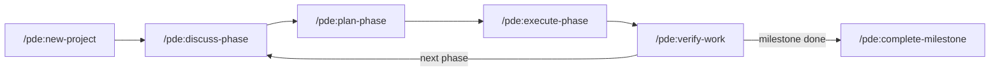

# Phase 8: Onboarding & Distribution - Research

**Researched:** 2026-03-14
**Domain:** Claude Code plugin distribution, technical documentation writing, git release tagging
**Confidence:** HIGH

## Summary

Phase 8 delivers the final mile: README, GETTING-STARTED.md, install validation, and a version bump to 1.0.0. All four deliverables are pure documentation and process work — no new code features. The research focus is on two domains: (1) the exact mechanics of how Claude Code plugin distribution works so the install instructions are accurate, and (2) documentation writing patterns for developer tools (Stripe/Vercel style).

The critical discovery from research is that PDE's current `plugin.json` satisfies internal plugin structure requirements, but to be installable by a naive user from GitHub, the repo also needs a `.claude-plugin/marketplace.json` file. Without `marketplace.json`, users cannot run `/plugin marketplace add Grey-Altr/pde` and discover the plugin. The install instruction sequence must account for this. Phase 8 MUST create `marketplace.json` as part of the distribution work.

The documentation itself is straightforward: GETTING-STARTED.md follows a numbered walk-through format (already decided in CONTEXT.md), and README.md is a value-pitch landing page with a workflow diagram. Both are Markdown files at the repo root. No tooling is required — these are authored files.

**Primary recommendation:** Create `marketplace.json` first (it unblocks accurate install instructions), then write README and GETTING-STARTED.md, then bump version and tag.

<user_constraints>
## User Constraints (from CONTEXT.md)

### Locked Decisions

**Getting Started guide:**
- Format: walk-through tutorial + command cheat sheet at the end
- Scope: full end-to-end lifecycle — install through discuss → plan → execute → verify and beyond
- Sample project: offer 2-3 project ideas (user picks one, or brings their own idea)
- Location: GETTING-STARTED.md at repo root, linked from README
- Structure: numbered sections per stage (1. Install, 2. Create Project, 3. Discuss, 4. Plan, 5. Execute, 6. Verify)
- Philosophy: brief philosophy section upfront (2-3 paragraphs on the workflow loop) AND contextual explanations woven into each stage
- Terminal output examples shown as code blocks — no screenshots
- Show key .planning/ file snippets at milestones (PROJECT.md after new-project, PLAN.md after plan-phase, etc.)
- Cheat sheet: all commands grouped by workflow stage (setup, planning, execution, maintenance)
- Short prerequisites section upfront (Claude Code, active subscription, git)
- Explain /clear between stages — why and when to use it for fresh context
- Brief "What's Next" section at the end: milestones, adding phases, auto-advance (--auto), /pde:settings, /pde:set-profile
- /pde:quick mentioned in cheat sheet only, not in tutorial
- No troubleshooting section — point to GitHub issues
- No time estimates
- No mention of GSD — PDE stands on its own
- Tone: professional but approachable (Stripe/Vercel docs style)

**README:**
- Purpose: sell the value + link to guide (GitHub landing page that convinces people to try it)
- ASCII or Mermaid workflow diagram showing discuss → plan → execute → verify loop
- Short bullet list of 6-8 key capabilities (scannable, one-liner each)
- 2-3 sentence "How it works" summary + link to GETTING-STARTED.md
- Version badge showing 1.0.0
- No GSD references

**Install validation:**
- Dual approach: manual checklist + lightweight automated validation script
- Success bar: plugin installs, /pde: commands visible in palette, /pde:help runs and returns expected output
- Test environment: ask a friend/collaborator to install from GitHub URL and report back
- Validation script: grep for hardcoded usernames (belt-and-suspenders on top of Phase 7's BRAND-03 verification)
- Manual checklist documents the full verification flow

**Version bump & release:**
- Bump 0.1.0 → 1.0.0 when PDE is feature-complete (all Phase 8 deliverables done)
- Files to update: VERSION, plugin.json, README (version badge/mention)
- Git tag v1.0.0 — no full GitHub Release with notes for now
- Manual push after review — user reviews the commit before pushing to make the release public

### Claude's Discretion
- Exact sample project suggestions (2-3 ideas that demonstrate PDE well)
- Mermaid vs ASCII for the workflow diagram
- Exact feature bullet points in README
- Validation script implementation details
- README section ordering

### Deferred Ideas (OUT OF SCOPE)
None — discussion stayed within phase scope
</user_constraints>

<phase_requirements>
## Phase Requirements

| ID | Description | Research Support |
|----|-------------|-----------------|
| BRAND-06 | README and any documentation reference PDE, not GSD | README.md and GETTING-STARTED.md are the primary deliverables; all content is PDE-branded; validation script grep confirms zero GSD references |
</phase_requirements>

## Standard Stack

### Core
| Library/Tool | Version | Purpose | Why Standard |
|---------|---------|---------|--------------|
| Markdown | N/A | README.md, GETTING-STARTED.md | GitHub renders natively; no toolchain required |
| Mermaid (flowcharts) | Native in GitHub | Workflow diagram in README | GitHub renders `mermaid` code blocks natively since 2022; no build step |
| git tag | N/A | v1.0.0 release marker | Standard git release mechanism; lightweight tags for simple version markers |
| bash/zsh | N/A | Validation script | No external deps; grep + exit code is sufficient |

### Supporting
| Tool | Purpose | When to Use |
|------|---------|-------------|
| `claude plugin validate .` | Validate marketplace.json structure | Run during development to catch JSON errors before pushing |
| `/plugin marketplace add Grey-Altr/pde` | User-facing install command | This is the install command to document |
| `/plugin install platform-development-engine@pde` | User-facing plugin install command | Second step after adding marketplace |

### Alternatives Considered
| Instead of | Could Use | Tradeoff |
|------------|-----------|----------|
| Mermaid diagram | ASCII art diagram | ASCII has wider compatibility (renders anywhere) but is harder to maintain; Mermaid renders better on GitHub |
| `git tag` | GitHub Release | GitHub Release requires release notes UI; git tag is simpler for a first release |

**Installation:**
No npm packages needed — this phase creates Markdown files and a bash script.

## Architecture Patterns

### Recommended Project Structure After Phase 8
```
/ (repo root)
├── README.md                    # GitHub landing page — new
├── GETTING-STARTED.md           # Walk-through guide — new
├── VERSION                      # Bumped from 0.1.0 to 1.0.0
├── .claude-plugin/
│   ├── plugin.json              # Version bumped to 1.0.0
│   └── marketplace.json         # NEW — required for distribution
├── scripts/
│   └── validate-install.sh      # NEW — install validation script
└── .planning/phases/08-*/       # Phase artifacts
```

### Pattern 1: Claude Code Plugin Distribution (Two-Step Install)

**What:** Users must first add the PDE repo as a marketplace, then install the plugin from it.
**When to use:** Required for any plugin distributed via GitHub.
**Example:**
```bash
# Step 1: Register the PDE repository as a marketplace
/plugin marketplace add Grey-Altr/pde

# Step 2: Install the plugin from that marketplace
/plugin install platform-development-engine@pde
```

This requires a `.claude-plugin/marketplace.json` file in the PDE repo with the following minimum structure:
```json
{
  "name": "pde",
  "owner": {
    "name": "GreyA"
  },
  "plugins": [
    {
      "name": "platform-development-engine",
      "source": "./",
      "description": "Full lifecycle platform: from raw idea to shipped product"
    }
  ]
}
```

Source: Official Claude Code docs — https://code.claude.com/docs/en/plugin-marketplaces

### Pattern 2: Mermaid Workflow Diagram (README)

**What:** Fenced code block with `mermaid` language identifier renders as diagram on GitHub.
**When to use:** README workflow diagram (decide at planning time: Mermaid or ASCII).
**Example:**
```markdown
```mermaid
flowchart LR
    A[/pde:new-project] --> B[/pde:discuss-phase]
    B --> C[/pde:plan-phase]
    C --> D[/pde:execute-phase]
    D --> E[/pde:verify-work]
    E --> B
```
```

Source: GitHub Docs — https://docs.github.com/en/get-started/writing-on-github/working-with-advanced-formatting/creating-diagrams

### Pattern 3: Version Badge in README

**What:** Static badge in README header showing current version.
**When to use:** Version display at top of README.
**Example:**
```markdown

```

Or as plain text if badge services are unavailable:
```markdown
**Version:** 1.0.0
```

### Pattern 4: Stripe/Vercel Documentation Tone

**What:** Short sentences. Active voice. Show the outcome before explaining the mechanism. No jargon without definition.
**When to use:** All prose in README and GETTING-STARTED.md.
**Characteristics observed from Stripe/Vercel docs:**
- H2 section headings, numbered steps for procedural content
- Code blocks for every command — never inline code for multi-step sequences
- "What you'll build" or "What you'll learn" framing at the start
- Concrete examples over abstract descriptions
- No marketing superlatives ("amazing", "powerful", "blazing fast")

### Anti-Patterns to Avoid
- **GSD references anywhere in README or GETTING-STARTED.md:** Violates BRAND-06; validation script must catch this
- **Documenting `/pde:quick` in the tutorial body:** User decided it belongs only in the cheat sheet
- **Adding a troubleshooting section:** User explicitly excluded this — point to GitHub issues instead
- **Time estimates in the guide:** User explicitly excluded these
- **Screenshots:** Use terminal output code blocks only
- **Describing marketplace.json as optional:** It is required for distribution; omitting it means the install command fails
- **`/plugin install` without first adding marketplace:** Users who skip the marketplace add step will see "marketplace not found" errors

## Don't Hand-Roll

| Problem | Don't Build | Use Instead | Why |
|---------|-------------|-------------|-----|
| Plugin discovery | Custom install script | `.claude-plugin/marketplace.json` + standard `/plugin marketplace add` | Claude Code has native marketplace resolution; custom scripts break when Claude Code updates |
| Username detection | Manual path scanning | `grep -r "$USER\|/Users/" .` in validation script | Standard grep covers both macOS and Linux path patterns; edge case: CI environments may have service usernames in paths |
| Version badge | Custom badge service | `shields.io` static badge URL or plain text | shields.io is standard; plain text is more reliable if you don't want external deps |
| Diagram rendering | External diagram tool | Mermaid in README (GitHub renders natively) | No build toolchain, renders in PR previews and on GitHub |

**Key insight:** The entire distribution mechanism is provided by Claude Code's plugin system. PDE only needs to add `marketplace.json` to enable it — everything else (caching, updates, version tracking) is handled by Claude Code.

## Common Pitfalls

### Pitfall 1: Missing marketplace.json — Install Command Fails
**What goes wrong:** User runs `/plugin marketplace add Grey-Altr/pde` and gets a "marketplace.json not found" error because the file doesn't exist.
**Why it happens:** The `plugin.json` file handles plugin metadata but is separate from `marketplace.json` which is the catalog file needed for marketplace registration.
**How to avoid:** Create `.claude-plugin/marketplace.json` as the first deliverable in Phase 8 before writing any install instructions that reference it.
**Warning signs:** If you can't successfully run `/plugin marketplace add Grey-Altr/pde` in Claude Code, the documentation will be inaccurate.

### Pitfall 2: Plugin Name Mismatch in Install Command
**What goes wrong:** Install command uses wrong plugin name, giving "plugin not found" error.
**Why it happens:** The `name` field in `marketplace.json`'s `plugins` array must exactly match the `name` in `plugin.json`. PDE's `plugin.json` uses `"platform-development-engine"`.
**How to avoid:** Verify both files use identical plugin names. The install command will be `/plugin install platform-development-engine@pde`.
**Warning signs:** Test the actual install command before finalizing GETTING-STARTED.md.

### Pitfall 3: Version Out of Sync Between VERSION and plugin.json
**What goes wrong:** VERSION file says `1.0.0` but plugin.json still says `0.1.0` (or vice versa). Claude Code's cache may deliver wrong version; `/pde:update` check will show inconsistency.
**Why it happens:** Two files need to be updated atomically but are modified in separate edits.
**How to avoid:** Update both files in a single commit. Validation script can grep both for version string consistency.
**Warning signs:** `cat VERSION` and `jq .version .claude-plugin/plugin.json` return different values.

### Pitfall 4: Documentation Written Before Install Works
**What goes wrong:** GETTING-STARTED.md describes install steps that have never been tested end-to-end on a fresh machine.
**Why it happens:** Writing docs is done before validating the distribution mechanism.
**How to avoid:** Test the full install flow locally (add marketplace, install plugin, verify commands appear) before finalizing written steps.
**Warning signs:** The "test environment" step (friend/collaborator install) surfaces errors that break the guide.

### Pitfall 5: Residual GSD References in New Documentation
**What goes wrong:** Drafted docs contain "GSD" references from copy-pasting from internal notes or AI drafts trained on GSD.
**Why it happens:** BRAND-06 requirement; natural language drift when discussing the project history.
**How to avoid:** Run validation script grep against README.md and GETTING-STARTED.md as a final pre-commit check.
**Warning signs:** `grep -i "gsd\|get-shit-done" README.md GETTING-STARTED.md` returns any results.

### Pitfall 6: Git Tag Not Pushed Separately
**What goes wrong:** `git tag v1.0.0` is created locally but `git push` only pushes commits, not the tag. The tag never appears on GitHub.
**Why it happens:** `git push` does not push tags by default; requires `git push origin v1.0.0` or `git push --tags`.
**How to avoid:** The version bump plan must include explicit `git push origin v1.0.0` as a manual step the user performs after review.
**Warning signs:** Tag exists locally (`git tag --list`) but not visible on GitHub releases/tags page.

## Code Examples

Verified patterns from official sources:

### marketplace.json for PDE Distribution
```json
// Source: https://code.claude.com/docs/en/plugin-marketplaces
{
  "name": "pde",
  "owner": {
    "name": "GreyA",
    "email": "grey.altaer@gmail.com"
  },
  "metadata": {
    "description": "Platform Development Engine — full lifecycle platform for solo agentic development"
  },
  "plugins": [
    {
      "name": "platform-development-engine",
      "source": "./",
      "description": "Full lifecycle platform: from raw idea to shipped product with research, planning, execution, and verification",
      "version": "1.0.0",
      "homepage": "https://github.com/Grey-Altr/pde"
    }
  ]
}
```

Note: `"source": "./"` references the repo root (relative to the marketplace root, which is one level up from `.claude-plugin/`). This resolves to the directory containing `.claude-plugin/marketplace.json`.

### Install Validation Script
```bash
#!/usr/bin/env bash
# validate-install.sh — PDE install validation
# Checks for hardcoded usernames and path portability issues

set -e

ERRORS=0
WARNINGS=0

echo "PDE Install Validation"
echo "======================"

# Check 1: No hardcoded usernames in source files
echo ""
echo "Checking for hardcoded usernames..."
HARDCODED=$(grep -r --include="*.md" --include="*.json" --include="*.cjs" --include="*.sh" \
  -l "/Users/[a-zA-Z]" bin/ lib/ commands/ workflows/ templates/ references/ .claude-plugin/ \
  2>/dev/null || true)
if [ -n "$HARDCODED" ]; then
  echo "ERROR: Hardcoded absolute paths found in:"
  echo "$HARDCODED"
  ERRORS=$((ERRORS + 1))
else
  echo "  OK: No hardcoded usernames found"
fi

# Check 2: No GSD references in documentation
echo ""
echo "Checking for GSD references in documentation..."
GSD_REFS=$(grep -ril "gsd\|get-shit-done" README.md GETTING-STARTED.md 2>/dev/null || true)
if [ -n "$GSD_REFS" ]; then
  echo "ERROR: GSD references found in documentation:"
  echo "$GSD_REFS"
  ERRORS=$((ERRORS + 1))
else
  echo "  OK: No GSD references in documentation"
fi

# Check 3: VERSION and plugin.json in sync
echo ""
echo "Checking version consistency..."
VERSION_FILE=$(cat VERSION 2>/dev/null | tr -d '[:space:]')
PLUGIN_VERSION=$(grep '"version"' .claude-plugin/plugin.json | sed 's/.*"version": "\([^"]*\)".*/\1/')
if [ "$VERSION_FILE" != "$PLUGIN_VERSION" ]; then
  echo "ERROR: Version mismatch — VERSION=$VERSION_FILE, plugin.json=$PLUGIN_VERSION"
  ERRORS=$((ERRORS + 1))
else
  echo "  OK: Version consistent ($VERSION_FILE)"
fi

# Check 4: marketplace.json exists
echo ""
echo "Checking marketplace.json..."
if [ ! -f ".claude-plugin/marketplace.json" ]; then
  echo "ERROR: .claude-plugin/marketplace.json not found — plugin not distributable"
  ERRORS=$((ERRORS + 1))
else
  echo "  OK: marketplace.json exists"
fi

echo ""
echo "======================"
if [ "$ERRORS" -gt 0 ]; then
  echo "FAILED: $ERRORS error(s) found"
  exit 1
else
  echo "PASSED: All checks clean"
fi
```

### Git Tag Creation
```bash
# Create annotated tag (preferred for releases)
git tag -a v1.0.0 -m "PDE v1.0.0 — initial public release"

# Push the tag explicitly (git push alone does NOT push tags)
git push origin v1.0.0
```

### README Version Badge
```markdown


```

### Mermaid Workflow Diagram (README)
```markdown

```
Source: https://docs.github.com/en/get-started/writing-on-github/working-with-advanced-formatting/creating-diagrams

## State of the Art

| Old Approach | Current Approach | When Changed | Impact |
|--------------|------------------|--------------|--------|
| `claude plugin install github-url` | `/plugin marketplace add owner/repo` then `/plugin install name@marketplace` | Claude Code 1.0.33 | Two-step install required; must document both steps |
| No native diagram support in GitHub | Mermaid rendered natively in GitHub Markdown | 2022 | Can use Mermaid without external tooling |

**Deprecated/outdated:**
- `claude plugin install <git-url>` (single-step direct install): This command syntax exists in older documentation but the current model requires marketplace registration first. Do not document the single-step syntax.

## Open Questions

1. **Source path in marketplace.json for same-repo plugin**
   - What we know: `"source": "./"` should reference the plugin directory; the marketplace root is one level above `.claude-plugin/`
   - What's unclear: Whether `"./"` resolves to the repo root (which contains `commands/`, `workflows/`, etc.) or to `.claude-plugin/` itself
   - Recommendation: Test locally with `/plugin marketplace add ./` before writing the final install docs; if `"./"` fails, try `"source": { "source": "github", "repo": "Grey-Altr/pde" }` as fallback

2. **Plugin name shown in `/pde:` command palette**
   - What we know: Commands are namespaced by the plugin name in `plugin.json`; PDE's commands are already registered as `/pde:*`
   - What's unclear: Whether the `name` field in `marketplace.json`'s plugin entry affects command namespace or only the install command syntax
   - Recommendation: Test the marketplace install on a local machine and verify commands still appear as `/pde:*` before documenting

3. **Claude Code minimum version requirement**
   - What we know: Plugin support requires Claude Code 1.0.33 or later (per official docs)
   - What's unclear: Whether the current Claude Code version widely available satisfies this
   - Recommendation: Include version requirement in prerequisites section of GETTING-STARTED.md

## Validation Architecture

### Test Framework
| Property | Value |
|----------|-------|
| Framework | None — no automated test framework exists in this project |
| Config file | none |
| Quick run command | `bash scripts/validate-install.sh` |
| Full suite command | `bash scripts/validate-install.sh` |

### Phase Requirements → Test Map
| Req ID | Behavior | Test Type | Automated Command | File Exists? |
|--------|----------|-----------|-------------------|-------------|
| BRAND-06 | README and docs reference PDE not GSD | automated grep | `bash scripts/validate-install.sh` | Wave 0 — file must be created |

### Sampling Rate
- **Per task commit:** `bash scripts/validate-install.sh`
- **Per wave merge:** `bash scripts/validate-install.sh`
- **Phase gate:** All checks pass before `/gsd:verify-work`

### Wave 0 Gaps
- [ ] `scripts/validate-install.sh` — covers BRAND-06 and portability checks

## Sources

### Primary (HIGH confidence)
- Official Claude Code docs — https://code.claude.com/docs/en/discover-plugins — Plugin install mechanism, marketplace add command, two-step flow
- Official Claude Code docs — https://code.claude.com/docs/en/plugin-marketplaces — marketplace.json schema, plugin source types, distribution model
- GitHub Docs — https://docs.github.com/en/get-started/writing-on-github/working-with-advanced-formatting/creating-diagrams — Mermaid in GitHub Markdown

### Secondary (MEDIUM confidence)
- Existing project file: `.claude-plugin/plugin.json` — current plugin name (`platform-development-engine`), version (`0.1.0`), repo URL
- Existing project file: `VERSION` — current version (`0.1.0`)
- Existing project file: `workflows/help.md` — 34 commands inventory, command naming patterns, install URL reference

### Tertiary (LOW confidence)
- WebSearch results on README best practices — Stripe/Vercel doc tone confirmed as community standard; no single authoritative source

## Metadata

**Confidence breakdown:**
- Standard stack: HIGH — documentation tools are stable and well-understood; Mermaid/GitHub confirmed via official docs
- Architecture: HIGH — marketplace.json requirement confirmed via official Claude Code docs; file structure verified against actual project
- Distribution mechanics: HIGH — install command sequence confirmed from official docs; two-step model is current
- Pitfalls: HIGH — marketplace.json missing is the main risk; confirmed by reading official requirements
- Open questions: MEDIUM — source path resolution for same-repo plugin needs local testing

**Research date:** 2026-03-14
**Valid until:** 2026-04-14 (Claude Code plugin API changes slowly; marketplace.json schema stable)
