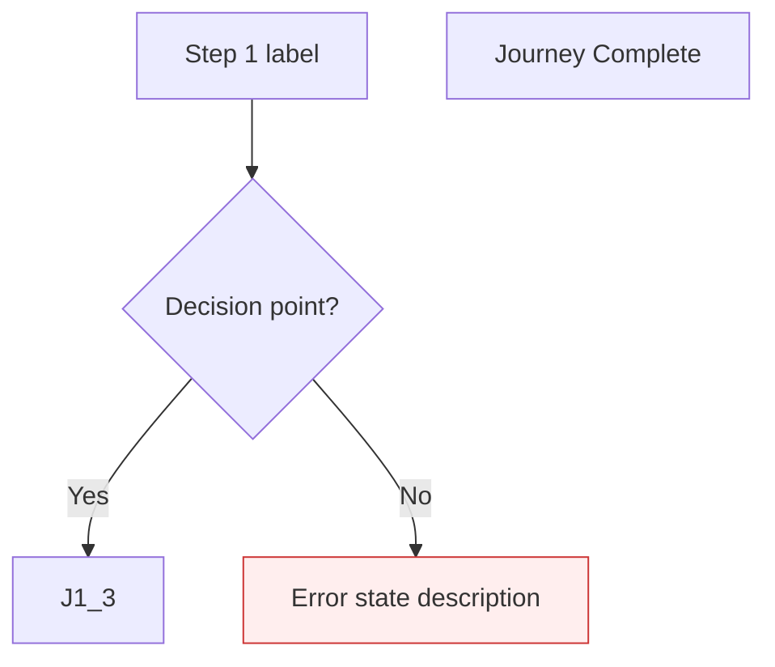

<objective>
Create the /pde:flows skill — a 7-step workflow that reads the product brief, generates Mermaid flowchart diagrams per persona/journey, and extracts a machine-readable screen inventory JSON that /pde:wireframe consumes as its screen list.

Purpose: This is the user journey mapper that bridges the brief (what the product does) to wireframes (what the screens look like). Without it, wireframe has no screen list to generate from.

Output: workflows/flows.md (full skill workflow), commands/flows.md (updated delegation)
</objective>

<execution_context>
@/Users/greyaltaer/.claude/get-shit-done/workflows/execute-plan.md
@/Users/greyaltaer/.claude/get-shit-done/templates/summary.md
</execution_context>

<context>
@.planning/PROJECT.md
@.planning/ROADMAP.md
@.planning/STATE.md
@.planning/phases/15-user-flow-mapping-pde-flows/15-RESEARCH.md

@.planning/phases/14-design-system-pde-system/14-01-SUMMARY.md

<interfaces>
<!-- Key infrastructure functions from design.cjs that the workflow calls via pde-tools.cjs -->

From bin/lib/design.cjs:
```javascript
// Directory init (idempotent)
function ensureDesignDirs(cwd) // Creates .planning/design/ + 6 subdirs + DESIGN-STATE.md + manifest

// Write-lock protocol
function acquireWriteLock(cwd, owner) // Returns {acquired: true/false}
function releaseWriteLock(cwd) // Always call after lock-acquire, even on error

// Manifest operations
function updateManifestArtifact(cwd, code, fields) // Upserts artifact entry (Object.assign merge)
function cmdManifestSetTopLevel(cwd, field, value, raw) // Sets manifest[field] = value (FLAT key only)
```

CLI invocation pattern (from pde-tools.cjs):
```bash
node "${CLAUDE_PLUGIN_ROOT}/bin/pde-tools.cjs" design ensure-dirs
node "${CLAUDE_PLUGIN_ROOT}/bin/pde-tools.cjs" design lock-acquire pde-flows
node "${CLAUDE_PLUGIN_ROOT}/bin/pde-tools.cjs" design lock-release
node "${CLAUDE_PLUGIN_ROOT}/bin/pde-tools.cjs" design manifest-update FLW code FLW
node "${CLAUDE_PLUGIN_ROOT}/bin/pde-tools.cjs" design manifest-set-top-level designCoverage '{"hasFlows":true,...}'
node "${CLAUDE_PLUGIN_ROOT}/bin/pde-tools.cjs" design coverage-check
```

From workflows/brief.md and workflows/system.md (7-step pattern to mirror):
```
Step 1/7: Initialize design directories (ensureDesignDirs)
Step 2/7: Check prerequisites (read brief, detect context, version gate)
Step 3/7: Probe MCP (Sequential Thinking)
Step 4/7: Core generation logic
Step 5/7: Write output artifacts
Step 6/7: Update domain DESIGN-STATE
Step 7/7: Update root DESIGN-STATE + manifest (write-lock, release, coverage flag)
```

From commands/system.md (delegation pattern):
```markdown
---
name: pde:system
description: ...
allowed-tools: [Read, Write, Edit, Bash, Glob, Grep, Task]
---
<objective>
Execute the /pde:system command.
</objective>

<process>
@workflows/system.md
@references/skill-style-guide.md
</process>
```

From templates/user-flow.md (Mermaid conventions):


Screen inventory JSON format (from 15-RESEARCH.md):
```json
{
  "schemaVersion": "1.0",
  "generatedAt": "2026-03-15",
  "source": ".planning/design/ux/FLW-flows-v1.md",
  "screens": [
    {
      "slug": "onboarding-welcome",
      "label": "Welcome Screen",
      "journey": "J1",
      "journeyName": "New User Onboarding",
      "persona": "First-time User",
      "type": "screen"
    }
  ]
}
```
</interfaces>
</context>

<tasks>

<task type="auto">
  <name>Task 1: Create workflows/flows.md — full /pde:flows skill workflow</name>
  <files>workflows/flows.md</files>
  <read_first>
    - workflows/system.md (canonical 7-step workflow pattern — mirror the top-level structure exactly: purpose, required_reading, flags, process with 7 steps, output section, anti-patterns)
    - workflows/brief.md (prerequisite soft-dependency pattern, version gate pattern, --force flag behavior)
    - templates/user-flow.md (output scaffold — Mermaid conventions, node ID rules, frontmatter fields, journey section structure, flow summary table)
    - templates/design-state-domain.md (domain DESIGN-STATE template for ux/ directory)
    - templates/design-manifest.json (manifest schema — designCoverage shape with hasFlows field)
    - references/skill-style-guide.md (universal flags, output formatting, error messaging, summary table format)
    - references/mcp-integration.md (MCP probe pattern)
    - bin/lib/design.cjs (infrastructure function signatures — ensureDesignDirs, acquireWriteLock, releaseWriteLock, updateManifestArtifact, cmdManifestSetTopLevel)
    - .planning/phases/15-user-flow-mapping-pde-flows/15-RESEARCH.md (architecture patterns, screen inventory format, pitfalls, code examples)
  </read_first>
  <action>
Create workflows/flows.md as a self-contained workflow file following the exact same structural pattern as workflows/system.md. The file must have these sections in order:

**Top-level structure (mirrors system.md):**

1. `<purpose>` block — one paragraph: map user journeys from the product brief as Mermaid flowchart diagrams, extract a machine-readable screen inventory for downstream wireframe consumption. Produces versioned flow documents with happy paths, decision branches, and error states per persona journey.

2. `<required_reading>` block with these @references:
   - @references/skill-style-guide.md
   - @references/mcp-integration.md

3. `<flags>` section — table listing all universal flags plus skill-specific --force:
   | Flag | Type | Behavior |
   |------|------|----------|
   | `--dry-run` | Boolean | Show planned output without executing. Runs Steps 1-3 (init, prerequisites, MCP probe) but writes NO files. Displays planned file paths, detected personas, estimated journey count. |
   | `--quick` | Boolean | Skip MCP enhancements (Sequential Thinking MCP probe) for faster execution. |
   | `--verbose` | Boolean | Show detailed progress and MCP probe results, timing per step, reference loading details. |
   | `--no-mcp` | Boolean | Skip ALL MCP probes. Pure baseline mode using training knowledge and local files only. |
   | `--no-sequential-thinking` | Boolean | Skip Sequential Thinking MCP specifically while allowing other MCPs. |
   | `--force` | Boolean | Skip the confirmation prompt when flow documents already exist and auto-increment to the next version. |

4. `<process>` section — the 7-step pipeline:

**Step 1/7: Initialize design directories**
- Identical to system.md Step 1: call `node "${CLAUDE_PLUGIN_ROOT}/bin/pde-tools.cjs" design ensure-dirs`, parse JSON with @file: pattern, halt on error, display progress.
- Display: `Step 1/7: Design directories initialized.`

**Step 2/7: Check prerequisites**
- **Read the brief (soft dependency):** Glob for `.planning/design/strategy/BRF-brief-v*.md`, sort by version number descending, read the highest version. If no brief found:
  - Display WARNING (never error): `Warning: No design brief found.\n  /pde:flows produces richer output when a brief exists.\n  Run /pde:brief first for better results, or continue without it.`
  - Continue without brief — Claude uses PROJECT.md as fallback context to identify user types and journeys.
- **If brief found**, extract:
  - All personas from the brief's personas/target users section
  - Product name and product type
  - Key user goals and tasks
  - Constraints that affect user flow (e.g., offline-first, accessibility requirements)
- **Version gate (existing flow documents):**
  - Glob for `.planning/design/ux/FLW-flows-v*.md`
  - Sort descending by version number, find max version N
  - If N > 0 AND --force flag NOT present: prompt user whether to re-generate flows. On confirmation: increment to N+1. On rejection: HALT, preserving existing version.
  - If N > 0 AND --force IS present: auto-increment to N+1.
  - If N = 0: set N = 1.
- Display: `Step 2/7: Prerequisites satisfied. Brief: v{X} loaded (or "no brief"). Flow version: v{N}.`

**Step 3/7: Probe MCP (Sequential Thinking)**
- Mirror system.md Step 3 exactly: check flags (--no-mcp, --no-sequential-thinking, --quick), probe mcp__sequential-thinking__think, set SEQUENTIAL_THINKING_AVAILABLE boolean, display result.
- If available, display: `  -> Sequential Thinking MCP: available`
- If unavailable or skipped, display: `  -> Sequential Thinking MCP: unavailable (continuing without)`

**Step 4/7: Generate flow diagrams**
This is the core generation step. Write detailed instructions for Claude to:

*Persona and journey identification:*
- If brief available: extract each persona from the brief. For each persona, identify 2-4 major journeys (major user goals). A single persona may have multiple journeys.
- If no brief: read PROJECT.md, identify obvious user types (at minimum: primary user), infer 2-3 core journeys per user type.
- If SEQUENTIAL_THINKING_AVAILABLE: use Sequential Thinking to reason through journey branches, edge cases, and error states before generating diagrams.

*Overview diagram:*
- Generate a top-level overview diagram showing all journeys as a hub-and-spoke from the product entry point. Follow the template's Overview section format exactly:
  ```mermaid
  flowchart TD
      START["Product Entry"]
      J1["{Journey 1 Name}"]
      J2["{Journey 2 Name}"]
      ...
      OUTCOME_J1["{Journey 1 Outcome}"]
      ...
      START --> J1
      START --> J2
      J1 --> OUTCOME_J1
      ...
  ```

*Per-journey diagrams:*
- For each journey, generate a `## Journey {N}: {Journey Name}` section with:
  - **User:** {persona name}
  - **Goal:** {what the user wants to accomplish}
  - **Entry point:** {where the user starts}
  - A Mermaid `flowchart TD` diagram following these node ID rules:
    - Screen nodes: `J{N}_{step}["{screen label}"]` — rectangular brackets
    - Decision nodes: `J{N}_{step}{"{decision label?}"}` — curly braces (diamond shape)
    - Error nodes: `J{N}_ERR{n}["{error state description}"]` — rectangular but styled with `style J{N}_ERR{n} fill:#fee,stroke:#c33`
    - Terminal nodes: `J{N}_DONE["{completion label}"]` — NEVER use bare `end` as node ID (Mermaid reserved keyword)
    - All node labels in double quotes
    - All node IDs prefixed with journey number (J1_, J2_, etc.) to prevent collisions in overview
  - Edge labels using `-->|label|` syntax for decision branches (Yes/No, Success/Failure, etc.)
  - Error recovery paths: error nodes link back to a retry step or show a dead-end with clear label
  - A "### Step Descriptions" section with numbered descriptions for each node
- Each journey should have a MINIMUM of: 3 screen nodes, 1 decision node, 1 error node.
- Decision nodes represent real user choices or system validation points (e.g., "Is email valid?", "Has account?", "Meets criteria?").
- Error nodes represent real UI error states that need wireframing (e.g., "Form validation error", "Payment declined", "Permission denied").

*Flow summary table:*
- After all journeys, generate a summary table matching the template:
  ```
  | Journey | Steps | Decision Points | Error States | Complexity |
  ```

*Screen inventory extraction (FLW-02):*
- After generating all flow diagrams, extract unique screen nodes into a JSON object.
- **Include** rectangular screen nodes: lines matching `J{N}_{step}["{label}"]` pattern
- **Include** error nodes (nodes whose IDs appear in a `style ... fill:#fee` line) with `"type": "error"`
- **Exclude** decision nodes: lines matching `J{N}_{step}{"{label}"}` pattern
- **Exclude** terminal/completion nodes: `J{N}_DONE`
- **Exclude** overview diagram nodes (START, OUTCOME_*)
- For each included node:
  - `slug`: label.toLowerCase().replace(/[^a-z0-9]+/g, '-').replace(/(^-|-$)/g, '')
  - `label`: the original node label text
  - `journey`: parent journey ID (e.g., "J1")
  - `journeyName`: the journey's title
  - `persona`: the journey's **User:** field value
  - `type`: "error" if styled with fill:#fee, else "screen"
- Deduplication: if the same screen label appears in multiple journeys, emit one entry per journey occurrence (wireframe may need distinct states per journey context).
- Structure the JSON as:
  ```json
  {
    "schemaVersion": "1.0",
    "generatedAt": "{ISO date}",
    "source": ".planning/design/ux/FLW-flows-v{N}.md",
    "screens": [ ... ]
  }
  ```

**Step 5/7: Write output artifacts**

Write these files using the Write tool:

1. `ux/FLW-flows-v{N}.md` — the versioned Mermaid flow document. Use the structure from templates/user-flow.md. Populate frontmatter:
   - Generated: {ISO date}
   - Skill: /pde:flows (FLW)
   - Version: v{N}
   - Status: draft
   - Source Brief: {brief path or "none"}
   - Enhanced By: {MCP list or "none"}

2. `ux/FLW-screen-inventory.json` — the screen inventory JSON (unversioned, always same path, always reflects latest run).

Display after each file: `  -> Created: {absolute_path} ({size})`
Display: `Step 5/7: Flow artifacts written.`

**Step 6/7: Update ux domain DESIGN-STATE**
- Check if `.planning/design/ux/DESIGN-STATE.md` exists using Glob.
- If NOT exists: create from templates/design-state-domain.md, replacing {domain_name} with "ux", {Domain} with "UX", {date} with ISO date.
- Add/update FLW artifact row in the Artifact Index table:
  ```
  | FLW | User Flows | /pde:flows | draft | v{N} | {MCP list or "none"} | -- | {YYYY-MM-DD} |
  ```
- Display: `Step 6/7: UX DESIGN-STATE.md updated with FLW artifact entry.`

**Step 7/7: Update root DESIGN-STATE and manifest**
- Acquire write lock: `node "${CLAUDE_PLUGIN_ROOT}/bin/pde-tools.cjs" design lock-acquire pde-flows`
  - Parse JSON result with @file: pattern.
  - If lock not acquired (acquired: false), wait 5 seconds, retry up to 3 times (same pattern as system.md).
- Update root `.planning/design/DESIGN-STATE.md` using Edit:
  1. Cross-Domain Dependency Map: add row `| FLW | ux | BRF | current |`
  2. Quick Reference: add row `| User Flows | v{N} |`
  3. Decision Log: append `| FLW | user flows mapped, {journey_count} journeys, {screen_count} screens | {date} |`
  4. Iteration History: append `| FLW-flows-v{N}.md | v{N} | Created by /pde:flows | {date} |`
- ALWAYS release write lock: `node "${CLAUDE_PLUGIN_ROOT}/bin/pde-tools.cjs" design lock-release`
- Update manifest:
  ```bash
  node "${CLAUDE_PLUGIN_ROOT}/bin/pde-tools.cjs" design manifest-update FLW code FLW
  node "${CLAUDE_PLUGIN_ROOT}/bin/pde-tools.cjs" design manifest-update FLW name "User Flows"
  node "${CLAUDE_PLUGIN_ROOT}/bin/pde-tools.cjs" design manifest-update FLW type user-flows
  node "${CLAUDE_PLUGIN_ROOT}/bin/pde-tools.cjs" design manifest-update FLW domain ux
  node "${CLAUDE_PLUGIN_ROOT}/bin/pde-tools.cjs" design manifest-update FLW path ".planning/design/ux/FLW-flows-v{N}.md"
  node "${CLAUDE_PLUGIN_ROOT}/bin/pde-tools.cjs" design manifest-update FLW status draft
  node "${CLAUDE_PLUGIN_ROOT}/bin/pde-tools.cjs" design manifest-update FLW version {N}
  ```
- Set coverage flag (CRITICAL: preserve existing flags):
  - Read current coverage: `node "${CLAUDE_PLUGIN_ROOT}/bin/pde-tools.cjs" design coverage-check`
  - Parse JSON result to extract current flag values for: hasBrief, hasDesignSystem, hasWireframes, hasCritique, hasHandoff, hasHardwareSpec
  - Merge hasFlows: true into the existing values
  - Write full object: `node "${CLAUDE_PLUGIN_ROOT}/bin/pde-tools.cjs" design manifest-set-top-level designCoverage '{"hasFlows":true,"hasBrief":{current},"hasDesignSystem":{current},"hasWireframes":{current},"hasCritique":{current},"hasHandoff":{current},"hasHardwareSpec":{current}}'`
- Display: `Step 7/7: Root DESIGN-STATE and manifest updated.`

5. `<output>` section listing all artifacts produced (same format as system.md).

6. Anti-patterns section (at bottom of `<process>`, before `</process>`):
   - NEVER use bare `end` as a Mermaid node ID (reserved keyword — use J{N}_DONE or J{N}_END)
   - NEVER include non-prefixed node IDs (always J{N}_ prefix to prevent collisions in overview diagram)
   - NEVER include decision nodes ({} shape) in FLW-screen-inventory.json (they are control flow, not screens)
   - NEVER skip ux/DESIGN-STATE.md creation (wireframe skill reads it to discover UX artifacts)
   - NEVER set hasFlows in designCoverage without reading current coverage first (clobbers other flags)
   - NEVER skip write-lock for root DESIGN-STATE.md updates
   - ALWAYS release write lock even on error
   - ALWAYS include error nodes in screen inventory with type "error" (they represent real UI states)

7. Summary display section (mirrors system.md): table with Files created, Files modified, Next suggested skill (/pde:wireframe), Elapsed time, Estimated tokens, MCP enhancements.
  </action>
  <verify>
    <automated>grep -c "Step [1-7]/7" workflows/flows.md | xargs test 7 -le</automated>
    <automated>grep -q "pde-tools.cjs.*design ensure-dirs" workflows/flows.md</automated>
    <automated>grep -q "pde-tools.cjs.*design lock-acquire" workflows/flows.md</automated>
    <automated>grep -q "pde-tools.cjs.*design lock-release" workflows/flows.md</automated>
    <automated>grep -q "pde-tools.cjs.*design manifest-update FLW" workflows/flows.md</automated>
    <automated>grep -q "pde-tools.cjs.*design manifest-set-top-level" workflows/flows.md</automated>
    <automated>grep -q "pde-tools.cjs.*design coverage-check" workflows/flows.md</automated>
    <automated>grep -q "@references/skill-style-guide.md" workflows/flows.md</automated>
    <automated>grep -q "flowchart TD" workflows/flows.md</automated>
    <automated>grep -q "FLW-screen-inventory.json" workflows/flows.md</automated>
    <automated>grep -q "FLW-flows-v" workflows/flows.md</automated>
    <automated>grep -q 'fill:#fee,stroke:#c33' workflows/flows.md</automated>
    <automated>grep -q "schemaVersion" workflows/flows.md</automated>
    <automated>grep -q "DESIGN-STATE.md" workflows/flows.md</automated>
    <automated>wc -l < workflows/flows.md | xargs test 300 -le</automated>
  </verify>
  <acceptance_criteria>
    - workflows/flows.md exists and contains >= 300 lines
    - Contains all 7 steps labeled "Step N/7:" (N=1 through 7)
    - Contains `<purpose>` block, `<required_reading>` block, `<flags>` section, `<process>` section
    - Step 1 calls `pde-tools.cjs design ensure-dirs`
    - Step 2 globs for `BRF-brief-v*.md` with soft-dependency warning pattern (warning, not error), globs for `FLW-flows-v*.md` for version gate, handles --force flag
    - Step 3 probes Sequential Thinking MCP with flag checks
    - Step 4 contains instructions for overview diagram, per-journey Mermaid diagrams with J{N}_ prefixed node IDs, screen/decision/error node types, step descriptions section, flow summary table, and screen inventory extraction logic
    - Step 4 contains the slug derivation formula: `label.toLowerCase().replace(/[^a-z0-9]+/g, '-').replace(/(^-|-$)/g, '')`
    - Step 4 contains the screen inventory JSON schema with fields: schemaVersion, generatedAt, source, screens[] with slug, label, journey, journeyName, persona, type
    - Step 5 writes 2 files: FLW-flows-v{N}.md and FLW-screen-inventory.json
    - Step 6 creates ux/DESIGN-STATE.md from template if absent, adds FLW row
    - Step 7 uses lock-acquire/lock-release protocol with `pde-flows` owner, updates root DESIGN-STATE.md (4 sections), registers FLW artifact in manifest (7 manifest-update calls), sets designCoverage as full JSON object after reading coverage-check
    - Contains anti-patterns section warning about bare `end` node ID, non-prefixed node IDs, decision nodes in screen inventory, coverage flag clobbering
    - References @references/skill-style-guide.md in required_reading
    - Contains `@templates/user-flow.md` reference (output scaffold)
  </acceptance_criteria>
  <done>workflows/flows.md is a complete, self-contained workflow file that an executor Claude can follow step-by-step to generate Mermaid flow diagrams per persona journey and extract a machine-readable screen inventory — mirroring the proven system.md 7-step pattern exactly</done>
</task>

<task type="auto">
  <name>Task 2: Update commands/flows.md — delegate to workflow</name>
  <files>commands/flows.md</files>
  <read_first>
    - commands/flows.md (current stub content to be replaced)
    - commands/system.md (delegation pattern to follow — the target format)
  </read_first>
  <action>
Replace the stub content in commands/flows.md with the standard delegation pattern used by commands/system.md.

Keep the existing YAML frontmatter fields (name, description, argument-hint, allowed-tools) but update the description to: "Map user journeys as Mermaid flowchart diagrams with screen inventory".

Replace the `<objective>` and `<process>` blocks with:

```xml
<objective>
Execute the /pde:flows command.
</objective>

<process>
@workflows/flows.md
@references/skill-style-guide.md
</process>
```

Remove ALL of the following text that currently exists in the stub:
- "**Status:** Planned -- available in PDE v2 (design pipeline)."
- "This command maps your product's user journeys as Mermaid flowchart diagrams..."
- "Related design-pipeline commands: brief, system, wireframe, mockup, critique, hig, iterate, handoff."
- "See references/skill-style-guide.md for documentation on the design pipeline workflow."

The final file should be approximately 15-20 lines: YAML frontmatter + objective + process with two @references. Match commands/system.md structure exactly.
  </action>
  <verify>
    <automated>grep -q "@workflows/flows.md" commands/flows.md</automated>
    <automated>grep -q "@references/skill-style-guide.md" commands/flows.md</automated>
    <automated>grep -qv "Planned -- available in PDE v2" commands/flows.md</automated>
    <automated>grep -q "pde:flows" commands/flows.md</automated>
  </verify>
  <acceptance_criteria>
    - commands/flows.md contains "@workflows/flows.md" in the process block
    - commands/flows.md contains "@references/skill-style-guide.md" in the process block
    - commands/flows.md does NOT contain "Planned -- available in PDE v2"
    - commands/flows.md does NOT contain "Related design-pipeline commands"
    - commands/flows.md YAML frontmatter has name: pde:flows
    - commands/flows.md is approximately 15-20 lines (not the current 27-line stub)
  </acceptance_criteria>
  <done>commands/flows.md delegates to workflows/flows.md using the same pattern as commands/system.md, with no stub/placeholder text remaining</done>
</task>

</tasks>

<verification>
1. `grep -c "Step [1-7]/7" workflows/flows.md` returns >= 7 (all 7 steps present)
2. `wc -l < workflows/flows.md` returns >= 300 (comprehensive workflow)
3. `grep -q "@workflows/flows.md" commands/flows.md` confirms delegation
4. `grep -qv "Planned" commands/flows.md` confirms stub text removed
5. `node bin/pde-tools.cjs test design` still passes (no infrastructure changes, regression check)
</verification>

<success_criteria>
- workflows/flows.md exists as a 300+ line self-contained workflow mirroring the system.md 7-step pattern
- Flow generation covers: overview diagram, per-journey diagrams with decision/error/screen nodes, step descriptions, flow summary table
- Screen inventory extraction is fully specified: JSON schema, slug derivation, node type filtering (include screen+error, exclude decision+terminal)
- Brief is a soft dependency (warning, not error) following skill-style-guide.md pattern
- Version gate with --force flag follows brief.md/system.md pattern
- DESIGN-STATE and manifest update protocol matches system.md pattern (lock-acquire pde-flows, coverage-check, full JSON designCoverage)
- commands/flows.md delegates cleanly with no stub text
- Existing design.cjs self-tests pass (no regressions)
</success_criteria>

<output>
After completion, create `.planning/phases/15-user-flow-mapping-pde-flows/15-01-SUMMARY.md`
</output>
