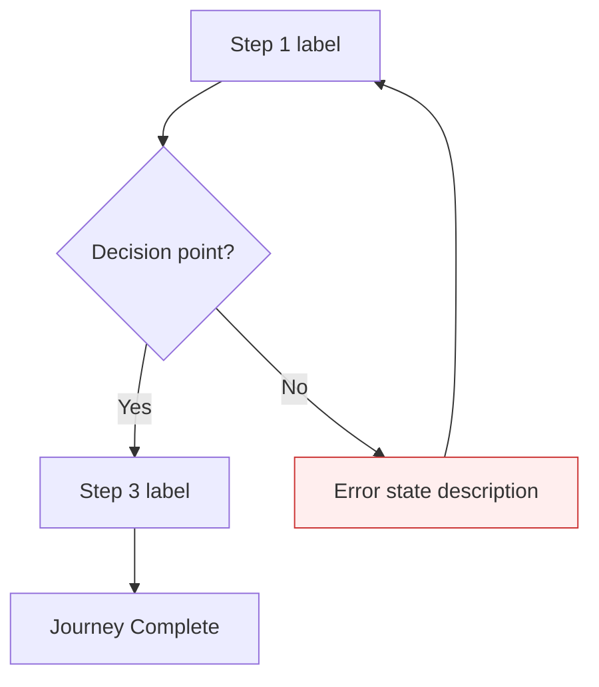

# Phase 15: User Flow Mapping (/pde:flows) - Research

**Researched:** 2026-03-15
**Domain:** User flow authoring, Mermaid flowchart syntax, screen inventory extraction, PDE skill workflow pattern
**Confidence:** HIGH

---

<phase_requirements>
## Phase Requirements

| ID | Description | Research Support |
|----|-------------|-----------------|
| FLW-01 | /pde:flows generates Mermaid flowchart diagrams for happy paths and error states | `templates/user-flow.md` specifies exact Mermaid conventions (flowchart TD, journey-prefixed node IDs, error node styling, decision nodes with `{}` shape). The brief's personas section drives one diagram per persona. The workflow follows the 7-step pattern from brief.md and system.md. |
| FLW-02 | Flow diagrams derive screen inventory used downstream by wireframe stage | Screen inventory is a separate JSON file (`ux/FLW-screen-inventory.json`) extracted from the Mermaid node labels. `/pde:wireframe` reads this file as its screen list. The extraction is done inline by the workflow — no new pde-tools.cjs function is needed. |
</phase_requirements>

---

## Summary

Phase 15 implements the `/pde:flows` skill — the user journey mapper that reads the product brief, generates Mermaid flowchart diagrams per persona, and extracts a machine-readable screen inventory that `/pde:wireframe` consumes as its screen list. This phase is a pure workflow-authoring phase with no new infrastructure code.

All required infrastructure is already in place from Phase 12: `design.cjs` provides write-lock, manifest update, coverage-check, and domain DESIGN-STATE operations. The output template is `templates/user-flow.md` (already exists). The Mermaid conventions are embedded in that template as a comment block. The workflow pattern to follow is `workflows/system.md` — a 7-step pipeline with init, prerequisites, MCP probe, generation, file writes, domain DESIGN-STATE update, and root DESIGN-STATE + manifest update.

The one novel engineering concern for this phase is the screen inventory format. The wireframe skill (Phase 16) will read it as its canonical screen list, so the format must be stable. A JSON array of screen objects (slug, label, journey, persona, type) stored in `ux/FLW-screen-inventory.json` is the correct approach: machine-readable for Phase 16, human-readable as JSON, and derivable without any code beyond inline string extraction from node labels.

**Primary recommendation:** Author `workflows/flows.md` as a 7-step workflow mirroring system.md's pattern, update `commands/flows.md` to delegate to it via `@workflows/flows.md`, and produce three output artifacts: the Mermaid flow document (`ux/FLW-flows-v{N}.md`), the screen inventory JSON (`ux/FLW-screen-inventory.json`), and a UX domain DESIGN-STATE update. No new Node.js code is required.

---

## Standard Stack

### Core

| Library / Tool | Version | Purpose | Why Standard |
|----------------|---------|---------|--------------|
| Mermaid flowchart syntax | Current (GitHub/GitLab renders natively) | Diagram language for user flows | Already specified in `templates/user-flow.md`; renders in GitHub MD, Claude UI, VSCode preview |
| pde-tools.cjs design subcommands | Existing (Phase 12) | Init, lock, manifest, coverage | Already built; all skills use the same pattern |
| Sequential Thinking MCP | Optional | Structured reasoning for complex multi-persona flows | Same pattern as brief.md and system.md |

### Supporting

| Library / Tool | Version | Purpose | When to Use |
|----------------|---------|---------|-------------|
| `templates/user-flow.md` | Existing | Output scaffold for FLW document | Always — same as system.md uses `templates/design-system.md` |
| `templates/design-state-domain.md` | Existing | UX domain DESIGN-STATE scaffold | First run creates `ux/DESIGN-STATE.md` from this template |

### Alternatives Considered

| Instead of | Could Use | Tradeoff |
|------------|-----------|----------|
| Mermaid `flowchart TD` | `sequenceDiagram` or `stateDiagram-v2` | flowchart TD is already in the template and better for user journeys with branches; sequence diagrams are for system interactions |
| JSON screen inventory | YAML or Markdown table | JSON is unambiguous for machine-reading by Phase 16; wireframe skill can parse it without regex |

**Installation:** No new packages. All tooling is existing pde-tools.cjs and design.cjs.

---

## Architecture Patterns

### Recommended Project Structure

```
workflows/
└── flows.md              # Full /pde:flows skill workflow (7-step pipeline)

commands/
└── flows.md              # Slash command — delegates to @workflows/flows.md

.planning/design/ux/
├── DESIGN-STATE.md       # UX domain state (created on first flows run)
├── FLW-flows-v1.md       # Mermaid flow document (versioned)
└── FLW-screen-inventory.json   # Machine-readable screen list for wireframe

.planning/design/
└── design-manifest.json  # Updated with FLW artifact entry + hasFlows: true
```

### Pattern 1: 7-Step Skill Workflow (Established Convention)

**What:** Every PDE skill workflow follows a 7-step structure: init dirs, check prerequisites, probe MCP, generate output, write files, update domain DESIGN-STATE, update root DESIGN-STATE and manifest.

**When to use:** Always — this is the mandatory pattern for all pipeline skills.

**Example (from `workflows/system.md`):**

```bash
# Step 1: Init
INIT=$(node "${CLAUDE_PLUGIN_ROOT}/bin/pde-tools.cjs" design ensure-dirs)
if [[ "$INIT" == @file:* ]]; then INIT=$(cat "${INIT#@file:}"); fi

# Step 7: Lock, update, release
LOCK=$(node "${CLAUDE_PLUGIN_ROOT}/bin/pde-tools.cjs" design lock-acquire pde-flows)
if [[ "$LOCK" == @file:* ]]; then LOCK=$(cat "${LOCK#@file:}"); fi
# ... edits to DESIGN-STATE.md ...
node "${CLAUDE_PLUGIN_ROOT}/bin/pde-tools.cjs" design lock-release

# Coverage update (CRITICAL: preserve other flags)
node "${CLAUDE_PLUGIN_ROOT}/bin/pde-tools.cjs" design coverage-check
node "${CLAUDE_PLUGIN_ROOT}/bin/pde-tools.cjs" design manifest-set-top-level designCoverage \
  '{"hasFlows":true,"hasDesignSystem":{current},"hasBrief":{current},...}'
```

**Source:** `workflows/system.md` Step 7 (lines 1250-1335)

### Pattern 2: Mermaid Flowchart Conventions

**What:** All flow diagrams use `flowchart TD` with journey-prefixed node IDs, double-quoted labels, decision nodes in `{}` shape, and error nodes styled with `fill:#fee,stroke:#c33`.

**When to use:** Every Mermaid diagram in the FLW document.

**Example (from `templates/user-flow.md`):**



**Source:** `templates/user-flow.md`

### Pattern 3: Screen Inventory JSON Format

**What:** After generating all flow diagrams, extract unique screen nodes (non-decision, non-error nodes) into a JSON array. Each entry has `slug`, `label`, `journey`, `persona`, and `type` fields.

**When to use:** End of Step 5 (file writes) — always generated from the FLW document.

**Example:**

```json
{
  "schemaVersion": "1.0",
  "generatedAt": "2026-03-15",
  "source": ".planning/design/ux/FLW-flows-v1.md",
  "screens": [
    {
      "slug": "onboarding-welcome",
      "label": "Welcome Screen",
      "journey": "J1",
      "journeyName": "New User Onboarding",
      "persona": "First-time User",
      "type": "screen"
    },
    {
      "slug": "dashboard",
      "label": "Main Dashboard",
      "journey": "J2",
      "journeyName": "Returning User Session",
      "persona": "Power User",
      "type": "screen"
    }
  ]
}
```

**Key rules:**
- `slug` is kebab-case derived from the node label (lowercase, spaces to hyphens, special chars stripped)
- `type` is `screen` for regular nodes, `error` for nodes styled with `fill:#fee`, omit decision nodes entirely
- Deduplication: if the same screen label appears in multiple journeys, emit one entry per journey occurrence (wireframe may need distinct states)
- File path: `ux/FLW-screen-inventory.json` (fixed, no versioning — always reflects latest flow run)

### Pattern 4: Prerequisite Warning (Soft Dependency)

**What:** Brief is a soft prerequisite — skill works without it but warns.

**When to use:** Step 2 (prerequisites check), always.

**Example (from `references/skill-style-guide.md`):**

```
Warning: No design brief found.
  /pde:flows produces richer output when a brief exists.
  Run /pde:brief first for better results, or continue without it.
```

**Source:** `references/skill-style-guide.md` — Error Messaging Standards section

### Pattern 5: Versioned Flow Document + Unversioned Screen Inventory

**What:** The FLW Mermaid document is versioned (`FLW-flows-v1.md`, `FLW-flows-v2.md`) — each run creates a new version. The screen inventory is always written to the same path (`FLW-screen-inventory.json`) — no versioning, always reflects the latest run.

**Rationale:** The wireframe skill (Phase 16) will look up a fixed path for the inventory. Versioning the inventory would require wireframe to discover the latest version, adding complexity. The flow document is versioned to preserve history (same reason brief and system version their outputs).

### Anti-Patterns to Avoid

- **Using `end` as a node ID:** Mermaid reserves `end` as a keyword; it breaks diagram parsing. Always use a descriptive ID like `J1_DONE` or `J1_END`.
- **Non-prefixed node IDs:** Node IDs without journey prefix (e.g., `STEP1` instead of `J1_1`) cause collisions in the overview diagram which combines all journeys.
- **Setting `hasBrief` in coverage update:** Only set `hasFlows: true`; all other flags must be read from `coverage-check` and preserved verbatim.
- **Using `@import` or external links:** Output markdown files are read directly by Claude, not rendered in a browser, so this is a non-issue — but don't use browser-specific constructs.
- **Skipping the write-lock:** Root DESIGN-STATE.md writes MUST use `design lock-acquire` / `design lock-release` with the `pde-flows` owner identifier.
- **Decision nodes in screen inventory:** `{...}` decision nodes are control flow, not screens. Never include them in `FLW-screen-inventory.json`.

---

## Don't Hand-Roll

| Problem | Don't Build | Use Instead | Why |
|---------|-------------|-------------|-----|
| Directory init | Custom mkdir logic | `pde-tools.cjs design ensure-dirs` | Already built, idempotent, handles templates |
| Write-lock | Custom file locking | `pde-tools.cjs design lock-acquire/release` | 60s TTL, stale-lock auto-clear, tested in Phase 12 |
| Manifest update | Direct JSON editing | `pde-tools.cjs design manifest-update` + `manifest-set-top-level` | Atomic, handles existing entries correctly |
| Coverage flag | Custom field setter | `pde-tools.cjs design coverage-check` + `manifest-set-top-level designCoverage` | Prevents flag clobbering across skills |
| Mermaid rendering | Custom diagram syntax | Standard `flowchart TD` as in `templates/user-flow.md` | GitHub/Claude renders it natively, template already defines conventions |

**Key insight:** The entire infrastructure layer is already built. Phase 15 is purely a workflow-authoring task — no new Node.js code is required.

---

## Common Pitfalls

### Pitfall 1: `end` as Node ID Breaks Mermaid Parser

**What goes wrong:** Mermaid treats `end` as a reserved keyword. Using it as a node ID causes a parse error; the diagram fails to render.

**Why it happens:** Authors write `end` intuitively as a terminal node ID.

**How to avoid:** The template already documents this: `NEVER use bare 'end' as node ID`. Use `J1_DONE`, `J1_END`, or `J1_COMPLETE` instead. The workflow document should reinforce this and provide the correct node ID pattern.

**Warning signs:** Mermaid syntax error on render; node label "end" appears disconnected.

### Pitfall 2: Coverage Flag Clobbering

**What goes wrong:** Setting `designCoverage` with a hardcoded object resets flags set by other skills (e.g., `hasDesignSystem: true` becomes `false`).

**Why it happens:** The `manifest-set-top-level` command does FLAT key assignment — it replaces the entire `designCoverage` object. If you construct the object without reading current state, you overwrite existing `true` values.

**How to avoid:** Always run `design coverage-check` first, parse all current flags, then construct the full JSON object merging `hasFlows: true` into the current values. Exactly as system.md Step 7 does it.

**Warning signs:** After `/pde:flows` runs, `hasDesignSystem` is `false` even though `/pde:system` ran successfully.

### Pitfall 3: Screen Inventory Includes Decision Nodes

**What goes wrong:** Decision nodes (the `{}` shape in Mermaid) are control flow, not screens. If wireframe reads them as screens, it tries to generate a wireframe for "Is email valid?" — which has no UI.

**Why it happens:** Authors extract all non-error nodes without distinguishing decision nodes from screen nodes.

**How to avoid:** Only extract `[...]` (rectangular) nodes into the screen inventory. Identify decision nodes by their `{}` delimiter in the Mermaid source. Error nodes (styled with `fill:#fee`) should be included with `"type": "error"` — they represent real UI states that need wireframing.

**Warning signs:** Wireframe phase receives question-phrased screen slugs like `is-email-valid`.

### Pitfall 4: Missing UX Domain DESIGN-STATE

**What goes wrong:** The `ux/DESIGN-STATE.md` domain file must exist for the wireframe skill to discover UX artifacts. If it is skipped, Phase 16 has no domain file to update and may behave inconsistently.

**Why it happens:** Authors model Phase 15 on the brief workflow, but brief uses `strategy/` as its domain. Flows uses `ux/`. The UX domain DESIGN-STATE has never been written before; the file must be created on the first flows run.

**How to avoid:** Step 6 of the workflow must explicitly check if `ux/DESIGN-STATE.md` exists. If not, create it from `templates/design-state-domain.md` with `Domain: ux`. Then append the FLW artifact row. This is the same pattern system.md uses for `visual/DESIGN-STATE.md`.

**Warning signs:** `ux/` directory exists but `ux/DESIGN-STATE.md` is missing after `/pde:flows` runs.

### Pitfall 5: Forgetting --force Flag Behavior

**What goes wrong:** If `/pde:flows` is run twice without `--force`, the user should be prompted whether to overwrite the existing flow document. If this check is skipped, the skill silently overwrites v1 with v2 with no user confirmation.

**Why it happens:** Authors copy the system.md pattern but miss the version-gate in Step 2.

**How to avoid:** Step 2 must: glob for `ux/FLW-flows-v*.md`, find the max version, and prompt the user if N > 0 and `--force` is absent. On confirmation: increment to v2. On rejection: halt, preserving v1.

**Warning signs:** Flow document versions are not incrementing (always v1, always overwritten).

---

## Code Examples

Verified patterns from existing project workflows:

### Step 1: Initialize Design Directories

```bash
# Source: workflows/system.md Step 1/7
INIT=$(node "${CLAUDE_PLUGIN_ROOT}/bin/pde-tools.cjs" design ensure-dirs)
if [[ "$INIT" == @file:* ]]; then INIT=$(cat "${INIT#@file:}"); fi
```

### Step 2: Locate Existing Flow Documents

```bash
# Glob for existing FLW documents in ux/
# Pattern: .planning/design/ux/FLW-flows-v*.md
# Sort descending by version, take max
# If none found: N = 1
# If found AND no --force: prompt user for re-generation
```

### Step 2: Brief Discovery (Soft Dependency)

```bash
# Source: workflows/brief.md Step 2/7 pattern
# Glob for .planning/design/strategy/BRF-brief-v*.md
# Sort descending, read highest version
# If not found: warn (never error), continue
```

### Step 7: Coverage Update (Preserving Other Flags)

```bash
# Source: workflows/system.md Step 7/7
COV=$(node "${CLAUDE_PLUGIN_ROOT}/bin/pde-tools.cjs" design coverage-check)
if [[ "$COV" == @file:* ]]; then COV=$(cat "${COV#@file:}"); fi
# Parse COV JSON to extract: hasBrief, hasDesignSystem, hasWireframes, hasCritique, hasHandoff, hasHardwareSpec
# Merge hasFlows: true
node "${CLAUDE_PLUGIN_ROOT}/bin/pde-tools.cjs" design manifest-set-top-level designCoverage \
  '{"hasFlows":true,"hasBrief":{current},"hasDesignSystem":{current},...}'
```

### Step 7: Manifest Registration

```bash
# Source: workflows/system.md Step 7/7
node "${CLAUDE_PLUGIN_ROOT}/bin/pde-tools.cjs" design manifest-update FLW code FLW
node "${CLAUDE_PLUGIN_ROOT}/bin/pde-tools.cjs" design manifest-update FLW name "User Flows"
node "${CLAUDE_PLUGIN_ROOT}/bin/pde-tools.cjs" design manifest-update FLW type user-flows
node "${CLAUDE_PLUGIN_ROOT}/bin/pde-tools.cjs" design manifest-update FLW domain ux
node "${CLAUDE_PLUGIN_ROOT}/bin/pde-tools.cjs" design manifest-update FLW path ".planning/design/ux/FLW-flows-v{N}.md"
node "${CLAUDE_PLUGIN_ROOT}/bin/pde-tools.cjs" design manifest-update FLW status draft
node "${CLAUDE_PLUGIN_ROOT}/bin/pde-tools.cjs" design manifest-update FLW version {N}
```

### Mermaid Node ID Conventions

```
# Source: templates/user-flow.md comment block

flowchart TD
    J{N}_{step}["{screen label}"]         # Screen node (rectangular)
    J{N}_{step}{"{decision label?}"}       # Decision node (diamond) — NOT a screen
    J{N}_ERR{n}["{error description}"]     # Error node — IS a screen (type: error)

# Node ID rules:
# - J1_1, J1_2, J1_3 — journey 1, steps 1, 2, 3
# - J1_ERR1, J1_ERR2 — journey 1, error states
# - J1_DONE — terminal/completion node
# - NEVER: end, start (reserved keywords)
```

### Screen Inventory Extraction Logic

```
# Workflow instruction (not bash — inline logic):
#
# For each Mermaid diagram section in FLW-flows-v{N}.md:
#   Scan source for rectangular nodes: lines matching /^\s+J\d+_\d+\["(.+)"\]/
#   Scan source for error nodes: lines where the node ID appears in a `style ... fill:#fee` line
#   Exclude decision nodes: lines matching /^\s+J\d+_\d+\{".+"\}/
#   Exclude terminal nodes: J{n}_DONE
#
# For each found screen node:
#   slug = label.toLowerCase().replace(/[^a-z0-9]+/g, '-').replace(/(^-|-$)/g, '')
#   type = "error" if styled with fill:#fee, else "screen"
#   journey = parent journey section number
#   persona = parent journey's **User:** field value
#
# Write FLW-screen-inventory.json
```

---

## State of the Art

| Old Approach | Current Approach | When Changed | Impact |
|--------------|------------------|--------------|--------|
| Separate flow diagrams per file | Single versioned FLW document with all journeys | Established in `templates/user-flow.md` | Simpler discovery; one Glob call finds all flows |
| Screen list as markdown table | JSON screen inventory (`FLW-screen-inventory.json`) | Decision for Phase 15 (this phase) | Wireframe can parse without regex; machine-readable |
| flows.md as stub command | flows.md delegates to workflows/flows.md | This phase implements it | Follows system.md pattern established in Phase 14 |

**Deprecated/outdated:**
- `commands/flows.md` status "Planned -- available in PDE v2": This stub text is replaced by `@workflows/flows.md` delegation in this phase.

---

## Open Questions

1. **How does wireframe read the screen inventory?**
   - What we know: `FLW-screen-inventory.json` path is fixed at `ux/FLW-screen-inventory.json`. Phase 16 hasn't been planned yet.
   - What's unclear: Whether wireframe uses `pde-tools.cjs artifact-path FLW` (which returns `FLW-flows-v{N}.md`) or reads the inventory JSON directly. The inventory path is not registered via manifest-update — it's a derived artifact.
   - Recommendation: Document in `workflows/flows.md` that `ux/FLW-screen-inventory.json` is the canonical screen list, use a fixed path (no manifest entry needed for the inventory itself), and note this in the output section. Phase 16 research can confirm the read pattern.

2. **Persona count: one flow per persona or one per journey?**
   - What we know: FLW-01 says "for each persona in the brief." `templates/user-flow.md` models journeys, not personas, as the top-level grouping.
   - What's unclear: If a persona has 3 journeys, is that 3 diagrams or 1 diagram with 3 sub-sections?
   - Recommendation: The template shows one `## Journey {N}` section per journey, all in one document. Multiple journeys per persona is the expected pattern. The workflow should instruct: "one journey section per major user goal per persona; a single persona may have 2-4 journey sections."

---

## Validation Architecture

### Test Framework

| Property | Value |
|----------|-------|
| Framework | Node.js built-in assert (no test runner — same as design.cjs self-test) |
| Config file | None — tests are inline `runSelfTest()` blocks in .cjs files |
| Quick run command | `node bin/pde-tools.cjs test design` |
| Full suite command | `node bin/pde-tools.cjs test design` |

### Phase Requirements → Test Map

| Req ID | Behavior | Test Type | Automated Command | File Exists? |
|--------|----------|-----------|-------------------|-------------|
| FLW-01 | `/pde:flows` produces Mermaid flowchart in `ux/` with happy path and error states per persona | manual | Run `/pde:flows` on a project with a brief, verify `ux/FLW-flows-v1.md` contains `flowchart TD`, `style ... fill:#fee`, and `{...}` decision nodes | ❌ Wave 0 (workflow authoring) |
| FLW-02 | `FLW-screen-inventory.json` is derived from flow nodes and is machine-readable | manual + smoke | After `/pde:flows`, verify `ux/FLW-screen-inventory.json` exists, is valid JSON, contains `screens[]` array, each screen has `slug`, `label`, `journey`, `persona`, `type` | ❌ Wave 0 (workflow authoring) |

### Sampling Rate

- **Per task commit:** `node bin/pde-tools.cjs test design` (covers Phase 12 infrastructure)
- **Per wave merge:** Manual: run `/pde:flows` end-to-end and inspect output files
- **Phase gate:** Both `ux/FLW-flows-v1.md` and `ux/FLW-screen-inventory.json` created, valid, registered in manifest before `/gsd:verify-work`

### Wave 0 Gaps

- [ ] `workflows/flows.md` — the workflow document (primary deliverable, Wave 1)
- [ ] `commands/flows.md` — updated to delegate to `@workflows/flows.md` (Wave 1)
- [ ] No new test file needed in `design.cjs` — flows uses no new infrastructure code

*(No new test infrastructure gaps — existing `design.cjs` self-tests cover all infrastructure calls the workflow makes. The workflow itself is validated by manual end-to-end execution.)*

---

## Sources

### Primary (HIGH confidence)

- `templates/user-flow.md` — Mermaid conventions, node ID rules, document structure, reserved keyword warnings
- `workflows/system.md` — 7-step skill workflow pattern (Steps 1-7), manifest update pattern, coverage flag preservation pattern, write-lock pattern
- `workflows/brief.md` — prerequisite soft-dependency pattern, version gate pattern, --force flag behavior
- `bin/lib/design.cjs` — All pde-tools.cjs `design` subcommand signatures: `ensure-dirs`, `lock-acquire`, `lock-release`, `manifest-update`, `manifest-set-top-level`, `coverage-check`
- `references/skill-style-guide.md` — Universal flag requirements, output ordering convention, prerequisite warning format, summary table format
- `templates/design-state-domain.md` — Domain DESIGN-STATE scaffold (Artifact Index, Staleness Tracker)
- `templates/design-manifest.json` — `designCoverage` shape: `hasFlows`, `hasDesignSystem`, `hasBrief`, `hasWireframes`, `hasCritique`, `hasHandoff`, `hasHardwareSpec`

### Secondary (MEDIUM confidence)

- `commands/wireframe.md` — Confirmed wireframe is still a stub ("Planned -- available in PDE v2"); screen inventory format decision is not yet locked by Phase 16 design
- `.planning/phases/14-design-system-pde-system/14-01-PLAN.md` — Structural reference for plan format; confirms one plan per phase is the expected scope for workflow-authoring phases

### Tertiary (LOW confidence)

- None — all findings are verified from project source files.

---

## Metadata

**Confidence breakdown:**

- Standard stack: HIGH — All tooling is existing project infrastructure; no external libraries
- Architecture patterns: HIGH — Directly derived from `workflows/system.md` and `workflows/brief.md` (implemented, working)
- Mermaid conventions: HIGH — Specified verbatim in `templates/user-flow.md` comment block
- Screen inventory format: MEDIUM — Format is proposed (not yet implemented by any phase); logical derivation from requirements, but Phase 16 will be the authoritative consumer
- Pitfalls: HIGH — Coverage clobbering and `end` node ID are documented in existing anti-patterns; UX domain DESIGN-STATE gap is deduced from system.md's creation of `visual/DESIGN-STATE.md`

**Research date:** 2026-03-15
**Valid until:** Stable — no external dependencies; all tooling is in-project
