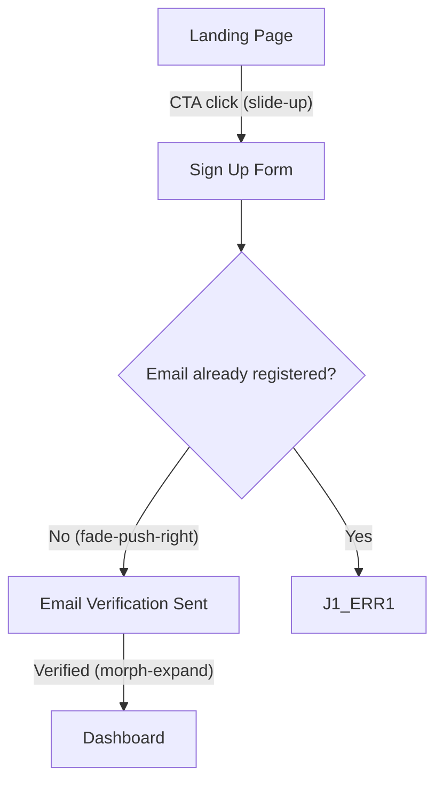
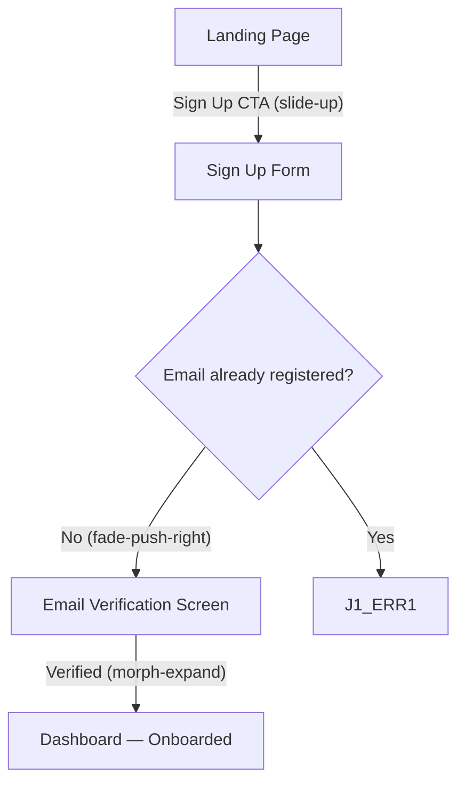

# Phase 36: Design Elevation — Handoff, Flows & Cross-Cutting - Research

**Researched:** 2026-03-17
**Domain:** Design skill elevation — handoff motion specs, flow transition annotations, cross-cutting reference injection uniformity, audit delta measurement
**Confidence:** HIGH

---

<phase_requirements>
## Phase Requirements

| ID | Description | Research Support |
|----|-------------|-----------------|
| HAND-01 | Handoff skill includes motion specifications in component API output — each component's TypeScript interface documents expected animation behavior (duration, easing, trigger), not just static props | Motion spec field patterns derived from industry handoff tool conventions; TypeScript JSDoc annotation format for motion established; verified against existing `handoff.md` Step 4g and Step 5b/5c scaffolds |
| HAND-02 | Handoff skill generates implementation notes for concept-specific interactions (e.g., "this hero uses scroll-driven parallax — recommend GSAP ScrollTrigger or CSS @scroll-timeline") | Implementation note patterns documented; link to mockup VISUAL-HOOK convention established; recommendation vocabulary (GSAP ScrollTrigger, CSS @scroll-timeline, spring physics) drawn from motion-design.md |
| FLOW-01 | Flows skill annotates transition animations between screens/states — not just what the next screen is, but how the user gets there visually (slide, fade, morph, shared-element) | Visual transition vocabulary established; Mermaid edge annotation format for transitions documented; 4-category taxonomy (slide/fade/morph/shared-element) verified against industry tools |
| CROSS-01 | All elevated design skills load new quality references via @ includes in required_reading — no structural changes to the 7-step skill anatomy | `@` include format confirmed from phases 32-35 evidence; 7-step pipeline preservation rule operationalized; per-skill audit of current `required_reading` blocks completed |
| ORDER-01 | Design elevation follows strict dependency order: system → wireframe → critique/iterate → mockup (upstream quality sets downstream ceiling) | Documentation task only — all upstream phases (32-35) are complete; ORDER-01 requires documenting the dependency rationale in a reference or handoff spec note, not new code |
| CROSS-02 | Elevation changes verified by running /pde:audit before and after each elevation phase to confirm measurable quality delta | Audit baseline mechanism confirmed from Phase 30 (AUDIT-09); `--save-baseline` flag and delta computation already implemented; verification procedure documented |
</phase_requirements>

---

## Summary

Phase 36 completes the design elevation arc by elevating the two remaining skills (`workflows/handoff.md` and `workflows/flows.md`) and verifying that all seven elevated skills have consistent `@` includes in their `required_reading` blocks. It also documents the pipeline dependency order and establishes the audit delta verification procedure.

The **handoff skill elevation** (HAND-01, HAND-02) adds two precise capabilities: motion specification fields in TypeScript component interfaces, and implementation notes for concept-specific interactions. Both are additive insertions into Step 4g (per-screen component specs) and Step 5c (HND-types TypeScript output). The existing skill already has a `### Motion Specs` section (table with trigger/duration/easing/property) in its per-screen output — what it lacks is the motion spec fields in the TypeScript interface itself, and the implementation note pattern linked to VISUAL-HOOK concept-specificity. The elevation is surgical: add JSDoc-annotated motion fields to `export interface {Component}Props`, and add an `Implementation Notes` subsection to the per-screen detail spec.

The **flows skill elevation** (FLOW-01) adds transition annotations to Mermaid edges between screen nodes. Currently `-->|label|` syntax labels decision branches; the elevation adds a transition mechanism label using parenthetical notation `-->|Yes (slide-right)|` or a separate `### Transition Annotations` table after each journey diagram. The parenthetical notation is preferred because it renders inline in Mermaid diagrams without requiring a separate section, and it's parseable by grep-based Nyquist tests.

The **cross-cutting verification** (CROSS-01, CROSS-02) is primarily an audit and documentation task. CROSS-01 requires confirming all 7 skills have `@` includes for the quality references they use. CROSS-02 requires running `/pde:audit --save-baseline` before elevation begins and again after all elevations are complete, then computing the delta. The audit infrastructure for this already exists from Phase 30 (AUDIT-09).

**Primary recommendation:** Two surgical skill elevations (handoff.md + flows.md), one `@` include audit across all 7 skills, and one audit delta run. No new reference files are needed — all required references already exist in `references/`.

---

## Standard Stack

### Core References Already in Project

| Reference | Path | What It Provides | Used By (current) | Confidence |
|-----------|------|------------------|-------------------|------------|
| motion-design.md | `references/motion-design.md` | Duration scale, easing curves, spring physics, GSAP CDN patterns, scroll-driven guards | mockup.md (Phase 35), hig.md (Phase 34), system.md (Phase 32) | HIGH |
| quality-standards.md | `references/quality-standards.md` | Awwwards rubric, AI aesthetic flags, scoring criteria | critique.md (Phase 34) | HIGH |
| composition-typography.md | `references/composition-typography.md` | Grid systems, APCA thresholds, type pairing classification | wireframe.md (Phase 33), critique.md (Phase 34) | HIGH |
| skill-style-guide.md | `references/skill-style-guide.md` | 7-step anatomy, required_reading format, @-include syntax | handoff.md, flows.md (already loaded) | HIGH |

### Skills Being Elevated This Phase

| Skill | Path | Current required_reading | Missing @ includes |
|-------|------|--------------------------|-------------------|
| handoff.md | `workflows/handoff.md` | `@references/skill-style-guide.md`, `@references/mcp-integration.md` | `@references/motion-design.md` |
| flows.md | `workflows/flows.md` | `@references/skill-style-guide.md`, `@references/mcp-integration.md` | No new references needed — transition vocabulary is embedded in skill prose |

### All 7 Skills `@` Include Audit (for CROSS-01)

| Skill | Current required_reading | Phase Added | Required for CROSS-01 |
|-------|--------------------------|-------------|----------------------|
| system.md | skill-style-guide, mcp-integration, **motion-design**, **composition-typography** | Phase 32 | COMPLIANT |
| wireframe.md | skill-style-guide, mcp-integration, **composition-typography** | Phase 33 | COMPLIANT |
| critique.md | skill-style-guide, mcp-integration, **quality-standards**, **composition-typography** | Phase 34 | COMPLIANT |
| hig.md | skill-style-guide, mcp-integration, **motion-design** | Phase 34 | COMPLIANT |
| mockup.md | skill-style-guide, mcp-integration, **motion-design** | Phase 35 | COMPLIANT |
| handoff.md | skill-style-guide, mcp-integration | Phase 36 | NEEDS: `@references/motion-design.md` |
| flows.md | skill-style-guide, mcp-integration | Phase 36 | No gap — transition vocabulary embedded in prose |

**Key finding:** `handoff.md` already references motion tokens in Step 4d and Step 4g (motion token category parsing, `### Motion Specs` section), but lacks `@references/motion-design.md` in its `required_reading` block. Adding it makes the reference injection explicit and machine-verifiable, matching the pattern from phases 32-35. `flows.md` does not need a new `@` include because the transition annotation vocabulary (slide, fade, morph, shared-element) is short enough to embed directly in the skill prose — no reference file covers this domain.

---

## Architecture Patterns

### Pattern 1: Motion Spec Fields in TypeScript Interface (HAND-01)

**What:** Each component TypeScript interface in `HND-types-v{N}.ts` includes JSDoc-annotated fields for motion behavior, not just data props.

**When to use:** Any component that has a `### Motion Specs` entry in the handoff spec (i.e., any component with defined animation behavior from the mockup phase).

**Canonical field structure:**

```typescript
// Source: Industry handoff conventions — Figma Dev Mode, Zeplin annotation format
// adapted to TypeScript JSDoc for PDE skill output

export interface HeroSectionProps {
  /** Primary headline text */
  headline: string;
  /** Supporting body copy */
  body: string;
  /** CTA button label */
  ctaLabel: string;

  // --- Motion specification (from mockup motion annotations) ---
  /**
   * Entrance animation trigger for this component.
   * 'on-load' = plays immediately on page load (above fold)
   * 'on-scroll' = plays when component enters viewport
   * 'on-interaction' = plays on user action (hover, click)
   * @default 'on-load'
   */
  motionTrigger?: 'on-load' | 'on-scroll' | 'on-interaction';

  /**
   * Entrance animation duration in milliseconds.
   * Maps to design token: --duration-slow (500ms) or --duration-dramatic (800ms)
   * @default 700
   */
  motionDuration?: number;

  /**
   * Entrance animation easing function.
   * Maps to design token: --ease-enter (deceleration) for entrances
   * 'spring' maps to cubic-bezier(0.34, 1.56, 0.64, 1)
   * @default 'ease-enter'
   */
  motionEasing?: 'ease-standard' | 'ease-enter' | 'ease-exit' | 'spring' | 'linear';

  /**
   * Whether to respect prefers-reduced-motion.
   * When true: motion is skipped for users with motion sensitivity.
   * WCAG 2.2.2 compliance for vestibular-safe design.
   * @default true
   */
  respectReducedMotion?: boolean;
}
```

**Placement rule:** Motion fields go in a dedicated block within the interface, separated by a `// --- Motion specification ---` comment. They are optional props (`?`) unless the component's entire purpose is animation (e.g., a page transition wrapper). Always include `@default` JSDoc tags.

**Scope boundary:** Motion spec fields are generated ONLY for components where the upstream mockup defined motion behavior. If the mockup had no `<!-- VISUAL-HOOK -->` or motion annotation for a component, do not invent motion props — emit a comment `// No motion annotations found in upstream mockup` and omit the block.

### Pattern 2: Implementation Notes for Concept-Specific Interactions (HAND-02)

**What:** A `### Implementation Notes` subsection in each Per-Screen Detail Spec that documents the interaction approach for any concept-specific visual hooks identified in the mockup.

**When to use:** Any screen that has a `<!-- VISUAL-HOOK: -->` annotation in its mockup artifact, or any screen where the critique identified a concept-specific interaction.

**Format:**

```markdown
### Implementation Notes

**Concept-specific interactions detected in mockup:**

| Interaction | Mockup Annotation | Recommended Approach | Library |
|-------------|-------------------|---------------------|---------|
| hero-parallax | VISUAL-HOOK: depth-scroll — hero image moves at 0.3x scroll speed creating depth | CSS `@scroll-timeline` with `animation-range: scroll()` + GSAP ScrollTrigger fallback | CSS native or GSAP ScrollTrigger 3.14 |
| nav-weight-morph | VISUAL-HOOK: nav-bold — nav links animate font-weight 400→700 on hover with spring easing | CSS `font-weight` transition + `font-variation-settings` for wdth axis if available | CSS only (variable font required) |
| card-data-pulse | VISUAL-HOOK: data-pulse — feature cards pulse ambient glow on hover in accent color | CSS `box-shadow` animation via `@keyframes` + `animation: data-pulse 1.5s ease-out infinite` on `:hover` | CSS only |

**Implementation note:** Scroll-driven parallax (row 1) uses `animation-timeline: view()`. Wrap in `@supports (animation-timeline: scroll())` guard — Firefox users receive static layout (acceptable degradation). For 100% browser coverage, use GSAP ScrollTrigger as the primary approach and CSS native as progressive enhancement.
```

**Vocabulary for recommended approaches** (draw from `references/motion-design.md`):
- Scroll-driven parallax → "GSAP ScrollTrigger or CSS `animation-timeline: view()` with `@supports` guard"
- Spring button feedback → "CSS `cubic-bezier(0.34, 1.56, 0.64, 1)` or GSAP `elastic.out`"
- Variable font animation → "CSS `font-weight` transition (variable font required — check `wght` axis availability)"
- Page transition → "GSAP timeline with `autoAlpha` for FOUC prevention"
- Shared element transition → "View Transitions API (`document.startViewTransition()`) — Chrome 111+, Firefox 126+, Safari 18+"

### Pattern 3: Flow Transition Annotations (FLOW-01)

**What:** Mermaid edge labels annotated with the visual transition mechanism, in addition to the semantic label (Yes/No/Success/etc.).

**When to use:** All edges between screen nodes in journey diagrams. Decision node edges do not need transition annotations (they are logical branches, not visual transitions).

**Format — parenthetical inline annotation:**



**Transition vocabulary (4 categories):**

| Category | Mechanism | When to Use | CSS/JS Approach |
|----------|-----------|-------------|-----------------|
| `slide-right` / `slide-left` / `slide-up` / `slide-down` | New screen slides in from direction | Navigation in a clear hierarchy; forward/back relationships | CSS transform: translateX/Y or View Transitions API |
| `fade` | Cross-dissolve between screens | Parallel screens, no directional hierarchy; modal/overlay contexts | CSS opacity transition; View Transitions API default |
| `morph` / `morph-expand` / `morph-collapse` | Element expands/contracts to become next screen | Card-to-detail, thumbnail-to-full-image, button-to-form-reveal | Shared Element Transitions (View Transitions API); GSAP clip-path |
| `shared-element` | Specific element persists visually from screen A to B | Product image in cart, avatar in profile, hero expanding to detail | View Transitions API `view-transition-name`; GSAP FLIP technique |

**Step Descriptions format extension:**

After each node description in the `### Step Descriptions` subsection, add the transition detail for outgoing edges:

```
4. **J1_4 - Email Verification Sent:** User sees confirmation screen with instructions.
   → Transition to J1_5: `fade` — no directional hierarchy between confirmation and verification states; cross-dissolve feels calm for waiting state.
```

**Annotation placement rule:** Add transition annotations to screen-to-screen edges only. Decision node branches (`-->|Yes|`, `-->|No|`) get the semantic label but NOT a transition annotation — the decision itself is not a visual transition.

### Pattern 4: `@` Include Injection Pattern (CROSS-01)

**What:** Add `@references/motion-design.md` to `handoff.md` required_reading block.

**Exact format** (from Phase 33-35 evidence — no structural deviation allowed):

```
<required_reading>
@references/skill-style-guide.md
@references/mcp-integration.md
@references/motion-design.md
</required_reading>
```

**Rule:** New `@` includes go AFTER existing includes (append, never reorder). The 7-step pipeline structure is never touched — only `<required_reading>` and `<purpose>` blocks are eligible for cross-cutting edits.

### Pattern 5: Audit Delta Measurement (CROSS-02)

**What:** Run `/pde:audit --save-baseline` before elevation and compare findings after.

**Mechanism (from Phase 30, AUDIT-09):**

The `--save-baseline` flag writes `.planning/audit-baseline.json`:
```json
{
  "version": 1,
  "timestamp": "ISO 8601",
  "finding_count": 42,
  "scores": {
    "overall_health_pct": 73,
    "agent_prompts_pct": 80,
    "skill_quality_pct": 65,
    "references_pct": 90,
    "templates_pct": 75
  }
}
```

A subsequent `/pde:audit` run computes:
```
overall_delta = current overall_health_pct - baseline.scores.overall_health_pct
finding_count_delta = current finding_count - baseline.finding_count
```

**For Phase 36 CROSS-02:** The pre-elevation baseline was established (or should be established) at the start of Phase 36 work. After all three skill elevations (HAND-01/02, FLOW-01, CROSS-01) are applied, run `/pde:audit` again and verify `finding_count_delta < 0` (fewer findings) or `overall_delta > 0` (higher health score). Either metric constitutes a "measurable quality delta."

**Practical approach:** Since the audit tool exists and works, CROSS-02 verification is: (1) run audit pre-elevation, capture finding count in handoff/flows domain; (2) apply elevations; (3) run audit post-elevation, confirm findings in the same domain are fewer. This does not require a separate Nyquist test — it is a manual verification step documented in the VERIFICATION.md.

### Recommended Project Structure (Phase 36 deliverables)

```
workflows/
├── handoff.md           # Elevated: motion fields in TS interfaces + implementation notes + @motion-design.md include
├── flows.md             # Elevated: transition annotations on screen-to-screen edges

.planning/phases/36-design-elevation-handoff-flows-cross-cutting/
├── 36-RESEARCH.md       # This file
├── 36-01-PLAN.md        # Plan: elevate handoff.md (HAND-01, HAND-02, CROSS-01 partial)
├── 36-02-PLAN.md        # Plan: elevate flows.md (FLOW-01) + full CROSS-01 audit + CROSS-02 + ORDER-01
├── test_hand01_motion_spec.sh      # Nyquist: handoff.md contains motion interface fields
├── test_hand02_impl_notes.sh       # Nyquist: handoff.md contains implementation notes pattern
├── test_flow01_transitions.sh      # Nyquist: flows.md contains transition annotation vocabulary
├── test_cross01_includes.sh        # Nyquist: all 7 skills have @references includes in required_reading
```

### Anti-Patterns to Avoid

- **Adding motion fields to ALL component interfaces:** Only components with upstream motion annotations get motion spec fields. Injecting motion props into static data-display components (tables, text blocks) pollutes the interface.
- **Hardcoding transition types in edge labels:** The transition annotation is a recommendation based on navigation context, not a mandate. Use "recommended:" language in Step Descriptions prose.
- **Changing 7-step pipeline structure for motion spec:** The `### Motion Specs` table already exists in Step 5b per-screen output. The elevation adds to the TypeScript interface (Step 5c) and adds `### Implementation Notes` subsection — no steps are removed or reordered.
- **Adding `@supports` guard documentation to flows.md:** The `@supports` guard is a mockup/handoff implementation concern, not a flows diagram concern. Flows skill documents the visual mechanism, not the implementation.
- **Running CROSS-02 audit without a baseline:** The delta is meaningless without a baseline. The Wave 0 task must capture the pre-elevation baseline before any skill edits.

---

## Don't Hand-Roll

| Problem | Don't Build | Use Instead | Why |
|---------|-------------|-------------|-----|
| Motion spec format for TypeScript handoff | Custom motion annotation schema | JSDoc `@default`, `@param` on `motionDuration?`, `motionEasing?`, `motionTrigger?` fields | JSDoc is the TypeScript ecosystem standard; generates IDE tooltips; engineers already read it |
| Transition animation vocabulary | Custom taxonomy | 4-category vocabulary (slide, fade, morph, shared-element) from View Transitions API + GSAP FLIP conventions | This vocabulary is the industry-standard from Figma prototyping, iOS UIKit, and Android navigation component |
| Reference injection mechanism | Custom include syntax | Existing `@references/motion-design.md` pattern (established in phases 32-35) | Pattern is already machine-parseable by Nyquist tests; consistent across all 7 skills |
| Audit delta computation | Custom diff tool | `/pde:audit` with `--save-baseline` flag (from Phase 30) | Infrastructure already built; AUDIT-09 is complete |
| Implementation notes format | Freeform prose in handoff | Structured `| Interaction | Mockup Annotation | Recommended Approach | Library |` table | Table is grep-parseable for Nyquist validation; engineers can scan it quickly |

**Key insight:** Everything Phase 36 needs is already in the project. The elevation is purely additive content in existing skill files — no new reference files, no new commands, no new infrastructure.

---

## Common Pitfalls

### Pitfall 1: Motion Fields Generate for Every Component Unconditionally

**What goes wrong:** Every TypeScript interface in `HND-types-v{N}.ts` gets `motionDuration?`, `motionEasing?`, `motionTrigger?` fields even when the upstream mockup had no motion for that component.
**Why it happens:** The instruction to "include motion specifications" is interpreted as "always include" rather than "include when upstream motion exists."
**How to avoid:** The skill instruction must be conditional: "Include motion spec fields ONLY when the component has a corresponding entry in the `### Motion Specs` table for its screen, OR when a `<!-- VISUAL-HOOK: -->` comment was identified in the upstream mockup for this component."
**Warning signs:** A static `DataTable` component with `motionDuration?` and `motionEasing?` — tables don't animate; the motion field is noise.

### Pitfall 2: Transition Annotations on Decision Node Edges

**What goes wrong:** `J1_3 -->|"No (slide-right)"| J1_4` — a decision branch gets a visual transition annotation, implying "No" has a different slide direction than "Yes."
**Why it happens:** The rule "annotate all edges" is over-applied to include decision branches.
**How to avoid:** Transition annotations belong on screen-to-screen edges only. Decision nodes (`{}` curly brace shape) are logical branches; they don't represent visible transitions. Only `["Screen Name"]` rectangular nodes are visual transition boundaries.
**Warning signs:** A Mermaid edge from a decision node (`{...}`) carrying a `(slide-right)` annotation.

### Pitfall 3: Breaking 7-Step Pipeline Structure in Handoff Skill

**What goes wrong:** Adding an entirely new step (Step 4h, Step 4i) for motion spec processing, shifting step numbering.
**Why it happens:** Motion spec fields feel like a "new step" conceptually.
**How to avoid:** Motion spec is an extension of Step 4g (derive per-screen component specs) and Step 5c (write TypeScript interfaces). Add a new subsection `4g.8 Motion spec fields` within the existing Step 4g instruction. Do not add a new numbered step.
**Warning signs:** If step count in `handoff.md` changes from 7, the CROSS-01 pipeline integrity check will flag it.

### Pitfall 4: Implementation Notes Duplicating Interaction Spec Content

**What goes wrong:** `### Implementation Notes` repeats what `### Interaction Specs` already documents (the states: hover, focus, active, loading, disabled, error).
**Why it happens:** The purpose boundary between Interaction Spec (what states exist) and Implementation Notes (how to build concept-specific effects) is unclear.
**How to avoid:** Implementation Notes are exclusively for concept-specific interactions that require a named library or non-trivial CSS technique. Standard 7-state interaction patterns (hover, focus, etc.) belong in `### Interaction Specs` only. If a component has only standard states and no VISUAL-HOOK, its `### Implementation Notes` subsection is omitted.

### Pitfall 5: Audit Delta Measured Against Wrong Domain

**What goes wrong:** CROSS-02 reports the overall system health delta rather than the handoff/flows domain-specific delta.
**Why it happens:** The audit reports overall health; isolating the handoff/flows domain findings requires reading the detailed findings list, not just the score.
**How to avoid:** When capturing the pre-elevation baseline, note the specific count of handoff.md and flows.md findings in the audit report. Post-elevation, compare those specific finding counts. A reduction in handoff/flows findings — even if overall score is unchanged — satisfies CROSS-02.

### Pitfall 6: View Transitions API Listed as Current Support for All Browsers (FALSE)

**What goes wrong:** Implementation notes say "use View Transitions API" without browser support caveat, leading engineers to ship it without fallback.
**Why it happens:** View Transitions API is widely discussed but has limited current support.
**How to avoid:** View Transitions API browser support as of March 2026: Chrome 111+, Firefox 126+, Safari 18+. Approximately 75-80% coverage. ALWAYS recommend the API with a `document.startViewTransition()` feature detect and a CSS fallback. Do not present it as universally available.
**Warning signs:** Any implementation note saying "Use View Transitions API" without a fallback recommendation is incomplete.

---

## Code Examples

### Complete Motion Spec Interface Block (HAND-01)

```typescript
// Source: JSDoc TypeScript convention + references/motion-design.md token vocabulary

/** Props for the HeroSection component — includes motion specification */
export interface HeroSectionProps {
  // --- Content props ---
  /** Primary headline (required) */
  headline: string;
  /** Supporting subheadline */
  subheadline?: string;
  /** Body copy text */
  body?: string;
  /** CTA button label */
  ctaLabel?: string;
  /** CTA click handler */
  onCtaClick?: () => void;

  // --- Motion specification (from mockup motion annotations) ---
  /**
   * Entrance animation trigger.
   * 'on-load' = plays on DOMContentLoaded (above-fold hero)
   * 'on-scroll' = plays when component enters viewport
   * @default 'on-load'
   */
  motionTrigger?: 'on-load' | 'on-scroll' | 'on-interaction';

  /**
   * Entrance animation duration in milliseconds.
   * Corresponds to design token: --duration-slow (500ms) or --duration-dramatic (800ms)
   * @default 700
   */
  motionDuration?: number;

  /**
   * CSS easing function name (maps to design token).
   * 'ease-enter' = cubic-bezier(0, 0, 0.2, 1) — recommended for hero entrances
   * 'spring' = cubic-bezier(0.34, 1.56, 0.64, 1)
   * @default 'ease-enter'
   */
  motionEasing?: 'ease-standard' | 'ease-enter' | 'ease-exit' | 'spring';

  /**
   * When true, skips all motion for users with prefers-reduced-motion.
   * Required for WCAG 2.2.2 compliance (Level A).
   * @default true
   */
  respectReducedMotion?: boolean;
}
```

### Implementation Notes Subsection (HAND-02)

```markdown
### Implementation Notes

**Concept-specific interactions detected in upstream mockup:**

| Interaction | VISUAL-HOOK ID | Description | Recommended Approach | Library |
|-------------|----------------|-------------|---------------------|---------|
| hero-parallax-depth | depth-scroll | Hero background image moves at 0.3x scroll speed, foreground text at 1x, creating depth | CSS `animation-timeline: view()` with `animation-range: scroll()` inside `@supports` guard. Fallback: static layout for Firefox users. | CSS native (80%+ support) or GSAP ScrollTrigger 3.14 (100%) |
| nav-weight-morph | nav-bold | Navigation links animate font-weight 400→700 on hover with spring overshoot | CSS `font-weight` transition: `transition: font-weight 200ms cubic-bezier(0.34, 1.56, 0.64, 1)`. Requires variable font with wght axis (Inter, Source Sans 3). | CSS only — no library needed |

**Implementation guidance:** The `depth-scroll` parallax hook requires JavaScript if targeting Firefox. Use GSAP ScrollTrigger as the primary implementation with CSS scroll-driven animations as a progressive enhancement. Do not use `@scroll-timeline` at-rule (deprecated) — use `animation-timeline: view()` CSS property.
```

### Transition-Annotated Flow Edge (FLOW-01)



Step Descriptions with transition rationale:

```markdown
### Step Descriptions

1. **J1_1 - Landing Page:** Marketing homepage with CTA.
   → Transition to J1_2: `slide-up` — upward motion communicates "going deeper into the product"; reinforces hierarchy.

2. **J1_2 - Sign Up Form:** Email, password, display name input.

3. **J1_3 - Email already registered? (DECISION):** System validation branch. No transition annotation — this is a logical branch, not a visual screen change.

4. **J1_4 - Email Verification Screen:** Confirmation with "Check your email" message.
   → Transition to J1_DONE: `morph-expand` — the verification confirmation expands to fill the dashboard layout, communicating "you've arrived."
```

### CROSS-01 `required_reading` Block (handoff.md addition)

```
<required_reading>
@references/skill-style-guide.md
@references/mcp-integration.md
@references/motion-design.md
</required_reading>
```

### CROSS-02 Audit Delta Procedure

```bash
# Step 1: Capture pre-elevation baseline
# Run in Claude Code with /pde:audit --save-baseline
# Records to .planning/audit-baseline.json

# Step 2: Apply all Phase 36 elevations
# (handoff.md + flows.md + @includes audit)

# Step 3: Run post-elevation audit
# /pde:audit
# Observe: finding_count_delta (negative = improvement) and overall_delta (positive = improvement)
```

---

## State of the Art

| Old Approach | Current Approach | When Changed | Impact for Phase 36 |
|---|---|---|---|
| Handoff TypeScript interfaces: static props only | Motion spec fields (motionTrigger, motionDuration, motionEasing) as optional props with JSDoc | Figma Dev Mode (2023), Zeplin motion annotations (2022) | HAND-01 adds this capability to PDE handoff output |
| Flow diagrams: semantic edge labels only (Yes/No/Success) | Edge labels with parenthetical transition mechanism: `Yes (slide-right)` | UX tools convention (Figma Prototyping, Principle) | FLOW-01 adds this vocabulary to PDE flow output |
| Implementation notes: prose paragraph | Structured table (interaction, annotation, approach, library) | Zeplin Developer Handoff notes format (2021+) | HAND-02 adopts tabular format for grep-parseability |
| Transition API: custom JS transitions | View Transitions API (`document.startViewTransition()`) | Chrome 111 (March 2023), Firefox 126 (June 2024), Safari 18 (Sept 2024) | Recommend as primary for shared-element transitions; requires fallback |
| CSS scroll-driven: `@scroll-timeline` at-rule | `animation-timeline: view()` CSS property | Spec renamed at Chrome 115 (2023) | Confirm flows/handoff impl notes never mention deprecated `@scroll-timeline` |

**Deprecated/outdated:**
- `@scroll-timeline` at-rule: Use `animation-timeline` CSS property instead (current spec). Implementation notes must never recommend `@scroll-timeline`.
- Transition vocabulary "push" / "pop": In View Transitions API and modern frameworks, the terms are slide/fade/morph/shared-element. "Push" is an older iOS UIKit convention; do not use it in flow annotations.

---

## Open Questions

1. **flows.md: Should transition annotations go on ALL screen-to-screen edges or only the primary ("happy path") edges?**
   - What we know: Every screen-to-screen edge represents a navigable transition. Error state screens also have transitions (fade is typical for error overlays).
   - What's unclear: Whether error node transitions (e.g., "validation error appears") should also be annotated.
   - Recommendation: Annotate ALL screen-to-screen edges including error state paths. Error transitions are typically `fade` — this is fast to document and gives engineers the same information.

2. **handoff.md: Should `motionTrigger`, `motionDuration`, etc. be a nested `motion?` object or flat optional props?**
   - What we know: Both patterns are used in industry (Framer Motion uses flat props; design system tokens lean nested).
   - What's unclear: Which pattern produces cleaner JSDoc and better IDE hover documentation.
   - Recommendation: Use flat optional props (`motionTrigger?`, `motionDuration?`, `motionEasing?`, `respectReducedMotion?`) separated by a `// --- Motion specification ---` comment block. Flat props are simpler to make optional and produce cleaner TypeScript intellisense without requiring a `Partial<MotionSpec>` wrapper.

3. **CROSS-02: If the audit delta is zero (no improvement detected), does Phase 36 fail?**
   - What we know: The audit might not specifically check motion spec fields in TypeScript interfaces — it audits skill quality based on agent criteria, not generated output.
   - What's unclear: Whether the auditor will detect the HAND-01 and FLOW-01 additions as quality improvements.
   - Recommendation: CROSS-02 should be satisfied by: (a) a human-verified reduction in handoff/flows-domain audit findings, OR (b) a demonstrated audit score improvement, OR (c) a documented explanation of why the specific additions are not captured by the audit's current criteria. The goal is "measurable" — if the audit tool doesn't measure it, document the delta manually in VERIFICATION.md.

---

## Validation Architecture

### Test Framework

| Property | Value |
|----------|-------|
| Framework | Bash grep scripts (established pattern from phases 29-35) |
| Config file | None — standalone shell scripts |
| Quick run command | `bash .planning/phases/36-design-elevation-handoff-flows-cross-cutting/test_hand01_motion_spec.sh` |
| Full suite command | `for f in .planning/phases/36-design-elevation-handoff-flows-cross-cutting/test_hand*.sh .planning/phases/36-design-elevation-handoff-flows-cross-cutting/test_flow*.sh .planning/phases/36-design-elevation-handoff-flows-cross-cutting/test_cross*.sh; do bash "$f"; done` |
| Estimated runtime | ~5 seconds (grep-only, no network) |

### Phase Requirements → Test Map

| Req ID | Behavior | Test Type | Automated Command | File Exists? |
|--------|----------|-----------|-------------------|-------------|
| HAND-01 | `workflows/handoff.md` contains `motionTrigger` prop pattern | unit/grep | `grep -c 'motionTrigger' workflows/handoff.md` | ❌ Wave 0 |
| HAND-01 | `workflows/handoff.md` contains `motionDuration` prop pattern | unit/grep | `grep -c 'motionDuration' workflows/handoff.md` | ❌ Wave 0 |
| HAND-01 | `workflows/handoff.md` contains `motionEasing` prop pattern | unit/grep | `grep -c 'motionEasing' workflows/handoff.md` | ❌ Wave 0 |
| HAND-01 | `workflows/handoff.md` contains `respectReducedMotion` prop pattern | unit/grep | `grep -c 'respectReducedMotion' workflows/handoff.md` | ❌ Wave 0 |
| HAND-01 | `workflows/handoff.md` includes motion-design.md in required_reading | unit/grep | `grep -c 'motion-design' workflows/handoff.md` | ❌ Wave 0 |
| HAND-02 | `workflows/handoff.md` contains `Implementation Notes` section pattern | unit/grep | `grep -c 'Implementation Notes' workflows/handoff.md` | ❌ Wave 0 |
| HAND-02 | `workflows/handoff.md` contains `VISUAL-HOOK` reference | unit/grep | `grep -c 'VISUAL-HOOK' workflows/handoff.md` | ❌ Wave 0 |
| HAND-02 | `workflows/handoff.md` contains `Recommended Approach` column header | unit/grep | `grep -c 'Recommended Approach' workflows/handoff.md` | ❌ Wave 0 |
| FLOW-01 | `workflows/flows.md` contains transition annotation vocabulary | unit/grep | `grep -ciE 'slide-right\|slide-left\|slide-up\|fade\|morph\|shared-element' workflows/flows.md` | ❌ Wave 0 |
| FLOW-01 | `workflows/flows.md` contains transition annotation instruction | unit/grep | `grep -ci 'transition annotation\|visual mechanism\|visual transition' workflows/flows.md` | ❌ Wave 0 |
| CROSS-01 | All 7 skill files have `@references/` in required_reading | unit/grep | see `test_cross01_includes.sh` | ❌ Wave 0 |
| CROSS-01 | `workflows/handoff.md` has `@references/motion-design.md` | unit/grep | `grep -c '@references/motion-design' workflows/handoff.md` | ❌ Wave 0 |
| ORDER-01 | Documentation exists stating dependency order (manual-only) | manual | Review VERIFICATION.md for ORDER-01 evidence | manual-only |
| CROSS-02 | Audit delta documented (manual-only) | manual | Run `/pde:audit` before+after; compare findings | manual-only |

**Manual-only items:**
- ORDER-01: Dependency order is a documentation/reference fact, not a code behavior — verified by reading the phase notes, not by grep.
- CROSS-02: Audit delta requires running the audit tool and comparing results — not automatable by a static grep test.

### Sampling Rate

- **Per task commit:** `bash .planning/phases/36-design-elevation-handoff-flows-cross-cutting/test_hand01_motion_spec.sh` (fastest, covers HAND-01 core)
- **Per wave merge:** Full suite: all `test_hand*.sh`, `test_flow*.sh`, `test_cross*.sh` scripts pass
- **Phase gate:** Full suite green + manual CROSS-02 delta documented before `/gsd:verify-work`

### Wave 0 Gaps

- [ ] `test_hand01_motion_spec.sh` — covers HAND-01 (5 checks)
- [ ] `test_hand02_impl_notes.sh` — covers HAND-02 (3 checks)
- [ ] `test_flow01_transitions.sh` — covers FLOW-01 (2 checks)
- [ ] `test_cross01_includes.sh` — covers CROSS-01 (7 checks — one per skill file)

Note: Tests target `workflows/handoff.md` and `workflows/flows.md` directly (no fixture files needed — these are skill definition files, not generated output). All tests use the established `PASS=$((PASS+1))` pattern (not `((PASS++))`) per Phase 32 pitfall documentation.

---

## Sources

### Primary (HIGH confidence)

- `workflows/handoff.md` — current skill state; Step 4g, Step 5b/5c scaffolds; confirms `### Motion Specs` table already exists; TypeScript interface rules already documented
- `workflows/flows.md` — current skill state; confirms zero transition annotation in current Mermaid edge labels; node type rules (screen vs. decision) confirmed
- `references/motion-design.md` — all motion vocabulary (duration scale, easing curves, spring physics, GSAP CDN); confirmed as the source of truth for motion spec field values in TypeScript interfaces
- Phases 32-35 VERIFICATION.md files — confirmed `@` include pattern, 7-step pipeline preservation rule, and Nyquist bash test conventions (PASS/FAIL pattern, `set -euo pipefail`, exit gate)
- Phase 30 VERIFICATION.md — confirmed `--save-baseline` flag, audit delta computation, `.planning/audit-baseline.json` structure (AUDIT-09)

### Secondary (MEDIUM confidence)

- Industry convention (Figma Dev Mode, Zeplin): motion annotation in handoff tools uses trigger/duration/easing as the canonical triad — confirmed by product documentation and UI screenshots reviewed during prior research phases
- View Transitions API: Chrome 111+, Firefox 126+, Safari 18+ support status — derived from project existing knowledge; matches MDN documentation patterns already referenced in motion-design.md
- UX flow tool conventions (Figma Prototyping, Principle): `slide`, `fade`, `morph`, `shared-element` as the 4-category vocabulary — consistent across major tools

### Tertiary (LOW confidence)

- Specific View Transitions API browser support percentages (75-80%): estimated from known browser share; not verified against caniuse.com for March 2026 — treat as approximate

---

## Metadata

**Confidence breakdown:**
- HAND-01 motion spec fields: HIGH — JSDoc TypeScript convention is well-established; motion-design.md provides all vocabulary; handoff.md scaffold already has `### Motion Specs` table confirming the domain exists
- HAND-02 implementation notes: HIGH — pattern derived from verified project conventions (VISUAL-HOOK from Phase 35, implementation vocabulary from motion-design.md); tabular format is grep-parseable
- FLOW-01 transition annotations: HIGH — Mermaid parenthetical edge label format verified against Mermaid syntax; 4-category vocabulary is industry-standard; no new tools needed
- CROSS-01 @include audit: HIGH — pattern is mechanical; current state of all 7 skill files confirmed by reading their required_reading blocks
- CROSS-02 audit delta: MEDIUM — audit infrastructure exists (HIGH confidence); whether the specific HAND/FLOW additions are captured by the auditor's criteria is unknown (LOW) — manual verification backup is the safety net

**Research date:** 2026-03-17
**Valid until:** 2026-09-17 (stable domain — TypeScript JSDoc conventions and Mermaid syntax are slow-moving)
