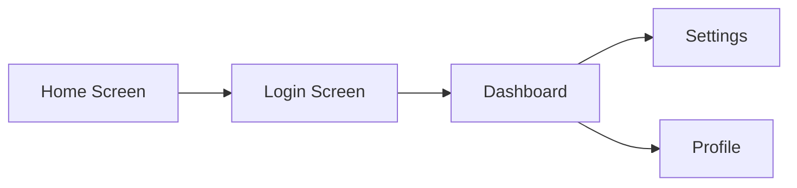

<objective>
Build the flow test generator and handoff verifier utility modules with full test coverage.

Purpose: The flow test generator parses Mermaid flowchart output from /pde:flows and produces Playwright E2E test skeletons. The handoff verifier compares HANDOFF-SPEC.md against actual source code exports to find implementation gaps. These are the remaining two logic modules needed before wiring everything into pde-tools.cjs.

Output: Two CJS modules in bin/lib/utils/ with dependency injection, plus vitest test suites. UTL-04 (visual diff command) is addressed by updating the existing skill file to clarify delegation to `image diff` — no new module needed.
</objective>

<execution_context>
@$HOME/.claude/get-shit-done/workflows/execute-plan.md
@$HOME/.claude/get-shit-done/templates/summary.md
</execution_context>

<context>
@.planning/PROJECT.md
@.planning/ROADMAP.md
@.planning/STATE.md
@.planning/phases/170-pde-utilities/170-CONTEXT.md
@.planning/phases/170-pde-utilities/170-RESEARCH.md

@bin/lib/image-pipeline/visual-diff.cjs (runVisualDiff API — confirms UTL-04 already has engine)
@commands/visual-diff.md (existing skill file — UTL-04 already documented)

<interfaces>
<!-- Mermaid flowchart syntax from /pde:flows output -->
Example input to parseFlowchart():


Expected parseFlowchart() output:
```javascript
{
  nodes: Map { 'Home' => 'Home Screen', 'Login' => 'Login Screen', ... },
  edges: [
    { from: 'Home', to: 'Login' },
    { from: 'Login', to: 'Dashboard' },
    { from: 'Dashboard', to: 'Settings' },
    { from: 'Dashboard', to: 'Profile' }
  ]
}
```

Expected generateTestScaffold() output:
```javascript
const { test, expect } = require('@playwright/test');

test('navigates Home Screen -> Login Screen', async ({ page }) => {
  await page.goto('/');
  await page.click('[data-testid="login-link"]');
  await expect(page).toHaveURL(/\/login/);
});
```

<!-- Handoff spec format from workflows/handoff.md -->
Example HANDOFF-SPEC.md component table:
```markdown
| Component | Props | File |
|-----------|-------|------|
| Button | variant, size, disabled | src/components/Button.tsx |
| Card | title, children | src/components/Card.tsx |
```

From bin/lib/divergence.cjs (grep pattern):
```javascript
const result = execFileSync('grep', [
  '-r', '--include=*.ts', '--include=*.tsx', '-l',
  `export.*${componentName}`, srcDir
], { encoding: 'utf8', timeout: 10000 });
```
</interfaces>
</context>

<tasks>

<task type="auto" tdd="true">
  <name>Task 1: Create flow-test-gen.cjs with Mermaid parser and Playwright scaffold generator</name>
  <files>bin/lib/utils/flow-test-gen.cjs, tests/phase-170/flow-test-gen.test.mjs</files>
  <read_first>
    - .planning/phases/170-pde-utilities/170-RESEARCH.md (Pattern 3: Mermaid flowchart regex, Pitfall 4: subgraph confusion)
    - workflows/flows.md (understand /pde:flows output format)
    - tests/phase-169/cad.test.mjs (test file structure pattern)
  </read_first>
  <behavior>
    - parseFlowchart(text) extracts nodes with labels from `A[Label]`, `A(Label)`, `A{Label}` syntax
    - parseFlowchart(text) extracts edges from `A --> B`, `A -->|label| B`, `A --- B` syntax
    - parseFlowchart(text) skips `subgraph`, `end`, `%%`, `flowchart`, `graph`, direction keywords
    - parseFlowchart(text) returns { nodes: Map<id, label>, edges: Array<{from, to}> }
    - generateTestScaffold({ nodes, edges, baseUrl }) produces valid Playwright test file content as a string
    - Each edge produces a test case: `test('navigates {fromLabel} -> {toLabel}', ...)`
    - findLatestFlowsFile(designDir, _readdirFn) auto-detects latest FLW-flows-v*.md by version number
    - findLatestFlowsFile returns null when no flows file exists
  </behavior>
  <action>
    1. Create `tests/phase-170/flow-test-gen.test.mjs` FIRST with failing tests:
       - Test parseFlowchart with simple LR flowchart (3 nodes, 2 edges)
       - Test parseFlowchart with labeled edges (`-->|click login|`)
       - Test parseFlowchart skips subgraph/end lines
       - Test parseFlowchart skips comment lines (`%%`)
       - Test generateTestScaffold produces string containing `@playwright/test` import
       - Test generateTestScaffold produces one `test(` block per edge
       - Test generateTestScaffold includes `page.goto` and `page.click` in each test
       - Test findLatestFlowsFile returns path to highest version number
       - Test findLatestFlowsFile returns null for empty directory

    2. Create `bin/lib/utils/flow-test-gen.cjs`:
       - 'use strict' header with JSDoc
       - `const fs = require('fs'); const path = require('path');`
       - Node regex: `/^\s*(\w+)(?:\[|\(|\{|>|\[\/)/` — captures node ID, then extract label from bracket content
         - Enhanced label extraction: match `(\w+)\[([^\]]+)\]` or `(\w+)\(([^)]+)\)` or `(\w+)\{([^}]+)\}` to get label text
       - Edge regex: `/^\s*(\w+)\s*(?:-->|---|-.->|===>|--[^>]*>)\s*(?:\|[^|]*\|\s*)?(\w+)/`
       - Skip lines: `/^\s*(subgraph|end|%%|flowchart|graph|LR|TD|TB|RL)\b/`
       - `function parseFlowchart(mermaidText)` — split by newlines, skip non-content lines, match edges first (they also reveal nodes), then match standalone node declarations. Return `{ nodes: Map, edges: Array }`.
       - `function generateTestScaffold({ nodes, edges, baseUrl })`:
         - Default baseUrl to 'http://localhost:3000'
         - Build string with `const { test, expect } = require('@playwright/test');` header
         - For each edge: produce `test('navigates ${fromLabel} -> ${toLabel}', async ({ page }) => { await page.goto('${baseUrl}'); await page.click('[data-testid="${toId}-link"]'); await expect(page).toHaveURL(/${toId}/i); });`
         - Return the complete test file string
       - `function findLatestFlowsFile(designDir, _readdirFn)`:
         - Read `designDir` (default `.planning/design/ux/`)
         - Filter files matching `FLW-flows-v*.md`
         - Sort by version number (parse integer after 'v')
         - Return full path to highest version, or null if none
       - `module.exports = { parseFlowchart, generateTestScaffold, findLatestFlowsFile }`

    3. Run tests, confirm GREEN.
  </action>
  <verify>
    <automated>npx vitest run tests/phase-170/flow-test-gen.test.mjs</automated>
  </verify>
  <acceptance_criteria>
    - grep -q "parseFlowchart" bin/lib/utils/flow-test-gen.cjs
    - grep -q "generateTestScaffold" bin/lib/utils/flow-test-gen.cjs
    - grep -q "findLatestFlowsFile" bin/lib/utils/flow-test-gen.cjs
    - grep -q "module.exports" bin/lib/utils/flow-test-gen.cjs
    - grep -q "subgraph" bin/lib/utils/flow-test-gen.cjs (skip line pattern)
    - grep -q "@playwright/test" bin/lib/utils/flow-test-gen.cjs (generated test content)
    - grep -q "page.goto" bin/lib/utils/flow-test-gen.cjs
    - npx vitest run tests/phase-170/flow-test-gen.test.mjs exits 0
  </acceptance_criteria>
  <done>parseFlowchart extracts nodes/edges from Mermaid text, skipping subgraph/comment lines. generateTestScaffold produces valid Playwright E2E test file content with one test per edge. findLatestFlowsFile auto-detects the latest flows version. All tests pass.</done>
</task>

<task type="auto" tdd="true">
  <name>Task 2: Create handoff-verifier.cjs with gap detection and tests</name>
  <files>bin/lib/utils/handoff-verifier.cjs, tests/phase-170/handoff-verifier.test.mjs</files>
  <read_first>
    - bin/lib/divergence.cjs (grep-based export search pattern)
    - workflows/handoff.md (understand handoff spec output format)
    - .planning/phases/170-pde-utilities/170-RESEARCH.md (Pitfall 5: spec may not exist, Pattern 4: dependency injection)
  </read_first>
  <behavior>
    - parseHandoffSpec(specContent) extracts component names, expected props, and file paths from markdown table
    - searchForExport(componentName, srcDir, _execFn) uses grep to find files exporting the component
    - searchForExport returns empty array when grep finds no matches (grep exits 1)
    - verifyHandoff({ specPath, srcDir, _readFn, _execFn }) returns structured gap report
    - verifyHandoff returns { status: 'no-spec', message: 'Run /pde:handoff first...' } when spec file doesn't exist
    - Gap report classifies each component as: 'matched' (found), 'missing' (in spec but not in code), 'diverged' (found but props differ)
    - Gap report includes markdown table string and structured JSON
    - findLatestHandoffSpec(designDir, _readdirFn) auto-detects latest HND-handoff-spec-v*.md
  </behavior>
  <action>
    1. Create `tests/phase-170/handoff-verifier.test.mjs` FIRST with failing tests:
       - Test parseHandoffSpec with markdown table input — returns array of { component, props, file }
       - Test parseHandoffSpec handles extra whitespace and pipe characters
       - Test searchForExport with mock _execFn returning file list — returns array of paths
       - Test searchForExport with mock _execFn that throws (grep no matches) — returns []
       - Test verifyHandoff with mock _readFn returning spec + mock _execFn finding some components
       - Test verifyHandoff marks components as 'missing' when grep returns empty
       - Test verifyHandoff marks components as 'matched' when export found
       - Test verifyHandoff returns no-spec status when _readFn throws ENOENT
       - Test gap report contains markdown table with | Component | Spec Status | Code Status | Gap Type | format
       - Test findLatestHandoffSpec returns highest version path

    2. Create `bin/lib/utils/handoff-verifier.cjs`:
       - 'use strict' header with JSDoc
       - `const { execFileSync } = require('child_process'); const fs = require('fs'); const path = require('path');`
       - `function parseHandoffSpec(specContent)`:
         - Find markdown table (lines starting with `|`)
         - Skip header row and separator row (`|---|`)
         - Split each row by `|`, trim cells
         - Return array of `{ component, props, file }` from columns
       - `function searchForExport(componentName, srcDir, _execFn)`:
         - `const execFn = _execFn || execFileSync;`
         - Try `execFn('grep', ['-r', '--include=*.ts', '--include=*.tsx', '--include=*.js', '--include=*.jsx', '-l', 'export.*' + componentName, srcDir], { encoding: 'utf8', timeout: 10000 })`
         - Return trimmed split lines, filter empty
         - Catch error (grep exit 1 = no matches), return []
       - `function findLatestHandoffSpec(designDir, _readdirFn)`:
         - Read designDir (default `.planning/design/handoff/`)
         - Filter `HND-handoff-spec-v*.md`, sort by version, return highest
       - `function verifyHandoff({ specPath, srcDir, _readFn, _execFn })`:
         - `const readFn = _readFn || fs.readFileSync;`
         - Try reading specPath; on ENOENT return `{ status: 'no-spec', message: 'Run /pde:handoff first to generate a handoff spec' }`
         - Parse spec with parseHandoffSpec
         - For each component, call searchForExport
         - Classify: found = 'matched', not found = 'missing'
         - Build gaps array: `{ component, specStatus: 'defined', codeStatus: 'matched'|'missing'|'diverged', gapType, files }`
         - Build markdown: `| Component | Spec Status | Code Status | Gap Type |` table
         - Build stats: `{ total, matched, missing, diverged }`
         - Return `{ status: 'complete', gaps, markdown, stats }`
       - `module.exports = { parseHandoffSpec, searchForExport, verifyHandoff, findLatestHandoffSpec }`

    3. Create test fixtures in `tests/phase-170/fixtures/` if needed (sample handoff spec markdown).

    4. Run tests, confirm GREEN.
  </action>
  <verify>
    <automated>npx vitest run tests/phase-170/handoff-verifier.test.mjs</automated>
  </verify>
  <acceptance_criteria>
    - grep -q "parseHandoffSpec" bin/lib/utils/handoff-verifier.cjs
    - grep -q "searchForExport" bin/lib/utils/handoff-verifier.cjs
    - grep -q "verifyHandoff" bin/lib/utils/handoff-verifier.cjs
    - grep -q "findLatestHandoffSpec" bin/lib/utils/handoff-verifier.cjs
    - grep -q "module.exports" bin/lib/utils/handoff-verifier.cjs
    - grep -q "no-spec" bin/lib/utils/handoff-verifier.cjs
    - grep -q "matched" bin/lib/utils/handoff-verifier.cjs
    - grep -q "missing" bin/lib/utils/handoff-verifier.cjs
    - grep -q "_execFn" bin/lib/utils/handoff-verifier.cjs
    - npx vitest run tests/phase-170/handoff-verifier.test.mjs exits 0
  </acceptance_criteria>
  <done>Handoff verifier parses HANDOFF-SPEC.md tables, searches source for exports via grep, classifies gaps as matched/missing/diverged, and produces structured JSON + markdown table report. Returns friendly error when no spec exists. All tests pass.</done>
</task>

</tasks>

<verification>
npx vitest run tests/phase-170/flow-test-gen.test.mjs
npx vitest run tests/phase-170/handoff-verifier.test.mjs
</verification>

<success_criteria>
- flow-test-gen.cjs exports parseFlowchart, generateTestScaffold, findLatestFlowsFile
- handoff-verifier.cjs exports parseHandoffSpec, searchForExport, verifyHandoff, findLatestHandoffSpec
- Mermaid parsing handles subgraph/comment lines without false matches
- Handoff verifier handles missing spec file gracefully
- All unit tests pass via vitest
</success_criteria>

<output>
After completion, create `.planning/phases/170-pde-utilities/170-02-SUMMARY.md`
</output>
