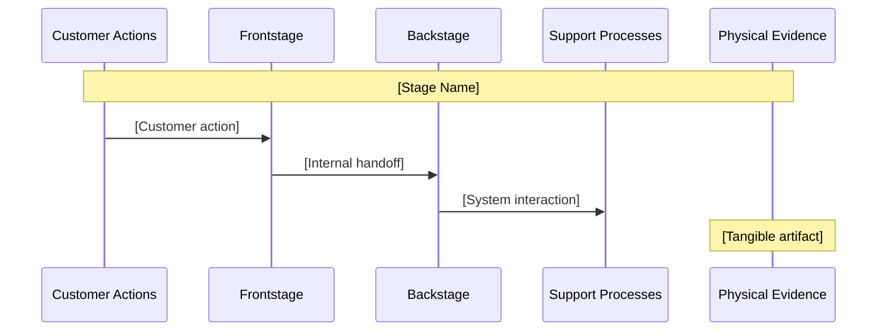

<objective>
Create the four business reference files that every downstream workflow loads for track branching, artifact templates, and financial/legal guardrails.

Purpose: Without these reference files, workflow authors in Phases 85-92 will invent their own interpretations of track depth, lean canvas format, and financial placeholder rules — leading to inconsistencies that are expensive to fix post-hoc.
Output: Four new reference markdown files in references/ directory.
</objective>

<execution_context>
@/Users/greyaltaer/.claude/get-shit-done/workflows/execute-plan.md
@/Users/greyaltaer/.claude/get-shit-done/templates/summary.md
</execution_context>

<context>
@.planning/PROJECT.md
@.planning/ROADMAP.md
@.planning/STATE.md
@.planning/phases/84-foundation/84-RESEARCH.md

<interfaces>
<!-- Reference file structure precedent — all new files follow this pattern exactly -->

From references/experience-disclaimer.md (full structural pattern):
```markdown
# [Title] — [Context]

> [VERIFY TAG] — [Main disclaimer prose]
> [Continuation prose]

## Usage

[Where and how this disclaimer MUST appear inline]

## Consumers

- `workflows/[name].md` — [phase]: [what section uses it]

## Prohibited Patterns

- [Anti-pattern 1]
- [Anti-pattern 2]
```

From references/strategy-frameworks.md (lines 1-12, reference file header pattern):
```markdown
# Strategy Frameworks Reference Library

> Shared reference loaded by `/pde:competitive` and `/pde:opportunity` skills.
> Loaded via `@` reference from skill files during analysis and scoring.

---

**Version:** 1.0
**Scope:** [what this file covers]
**Ownership:** [which skills own this]
**Boundary:** [what this file does NOT cover]
```
</interfaces>
</context>

<tasks>

<task type="auto">
  <name>Task 1: Create business-track.md with track vocabulary, depth thresholds, and artifact format differences</name>
  <files>references/business-track.md</files>
  <read_first>
    - references/strategy-frameworks.md
    - references/experience-disclaimer.md
    - .planning/phases/84-foundation/84-RESEARCH.md
  </read_first>
  <action>
Create `references/business-track.md` following the strategy-frameworks.md header pattern. The file must contain ALL of the following sections with CONCRETE values (not placeholders):

**Header block:**
```markdown
# Business Track Reference

> Shared reference loaded by all business-mode workflows.
> Loaded via `@references/business-track.md` from workflow files.
> Defines the single source of truth for track-specific vocabulary, depth thresholds, and artifact format differences.

---

**Version:** 1.0
**Scope:** Track detection signals, vocabulary substitutions, depth thresholds, artifact format differences
**Ownership:** Shared (all business-mode workflows)
**Boundary:** This file defines HOW track branching works. It does NOT contain artifact templates (see launch-frameworks.md) or financial guardrails (see business-financial-disclaimer.md).
```

**Section 1 — Track Definitions:**

Three subsections (## solo_founder, ## startup_team, ## product_leader) each containing:
- **Description:** 1-2 sentences defining this track
- **Detection signals:** Exact keyword list for brief.md to use:
  - solo_founder: "solo", "indie", "solo founder", "one person", "bootstrapped", "side project", "just me"
  - startup_team: "startup", "seed", "early stage", "founding team", "co-founder", "pre-seed", "Series A"
  - product_leader: "product leader", "PM", "head of product", "enterprise", "director", "VP", "product manager"
- **Default:** solo_founder if no signals detected or signals are ambiguous

**Section 2 — Depth Thresholds:**

A markdown table with these exact columns and values:

| Dimension | solo_founder | startup_team | product_leader |
|-----------|-------------|--------------|----------------|
| Brief section length | < 60 lines per section | 60-120 lines per section | 120+ lines per section |
| Competitive depth | 3 competitors, 1-2 paragraphs each | 5-8 competitors, scoring matrix | 8+ competitors, full positioning matrix |
| Market landscape format | 1-page summary | Competitive deep-dive | Build-vs-buy analysis |
| Pitch deck format | YC 10-slide | YC 10-slide, expandable to Sequoia 13 | Internal business case format |
| Service blueprint | Single-product flow | Multi-channel flow | Cross-functional flow |
| Email sequence depth | 5 onboarding emails | 5-7 onboarding + 3 investor outreach | 7 onboarding + 3 investor + executive summary |

**Section 3 — Vocabulary Substitutions:**

A markdown table with these exact columns and values:

| Concept | solo_founder | startup_team | product_leader |
|---------|-------------|--------------|----------------|
| Revenue target | "revenue goal" | "ARR target" | "P&L impact" |
| Customers | "customers" | "ICP" | "key accounts" / "target segments" |
| Launch | "going live" | "launch" / "ship" | "go-to-market" |
| Competitors | "competing tools" | "competitive landscape" | "market alternatives" / "build-vs-buy" |
| Pricing | "what you charge" | "pricing tiers" / "pricing model" | "monetization strategy" / "packaging" |
| Team | "you" | "your team" / "co-founders" | "your organization" / "stakeholders" |

**Section 4 — Artifact Format Differences:**

A prose section explaining:
- solo_founder: Markdown, skimmable bullets, action-first language, plain English with no jargon
- startup_team: Structured docs, investor-presentation-ready, startup terminology permitted (ARR, MRR, CAC, LTV, churn)
- product_leader: Executive summary + detail sections, board-ready formatting, OKR framing, P&L vocabulary, build-vs-buy language

**Section 5 — Consumers:**

List ALL downstream workflow files that will load this reference:
```
- `workflows/brief.md` — Phase 85: track detection and vocabulary
- `workflows/competitive.md` — Phase 86: market landscape depth
- `workflows/opportunity.md` — Phase 86: RICE scoring framing
- `workflows/flows.md` — Phase 87: service blueprint depth
- `workflows/system.md` — Phase 88: brand system vocabulary
- `workflows/wireframe.md` — Phase 89: pitch deck format selection
- `workflows/critique.md` — Phase 90: critique perspective depth
- `workflows/handoff.md` — Phase 91: launch kit assembly depth
```
  </action>
  <verify>
    <automated>grep -c "solo_founder\|startup_team\|product_leader" references/business-track.md</automated>
  </verify>
  <acceptance_criteria>
    - references/business-track.md exists
    - File contains all three track names: "solo_founder", "startup_team", "product_leader" (each appears 5+ times)
    - File contains "## Depth Thresholds" section with the depth table
    - File contains "## Vocabulary Substitutions" section with the vocabulary table
    - File contains "## Consumers" section listing 8 workflow files
    - File contains detection signal keywords: "indie", "bootstrapped", "Series A", "head of product"
    - File does NOT contain dollar amounts or financial projections
  </acceptance_criteria>
  <done>business-track.md is a complete reference that a workflow author can read and immediately know how to branch their output by track — no ambiguity, no interpretation needed.</done>
</task>

<task type="auto">
  <name>Task 2: Create launch-frameworks.md with lean canvas, pitch deck, service blueprint, and pricing config templates</name>
  <files>references/launch-frameworks.md</files>
  <read_first>
    - references/strategy-frameworks.md
    - .planning/phases/84-foundation/84-RESEARCH.md
  </read_first>
  <action>
Create `references/launch-frameworks.md` following the strategy-frameworks.md header pattern. The file must contain ALL of the following sections:

**Header block:**
```markdown
# Launch Frameworks Reference Library

> Shared reference loaded by business-mode workflow skills.
> Loaded via `@references/launch-frameworks.md` from workflow files during artifact generation.

---

**Version:** 1.0
**Scope:** Lean canvas schema, pitch deck slide formats, service blueprint lanes, pricing config schema
**Ownership:** Shared (BRF, WFR, FLW, HND)
**Boundary:** This file provides artifact TEMPLATES and SCHEMAS. It does NOT own track branching logic (see business-track.md) or financial guardrails (see business-financial-disclaimer.md).
```

**Section 1 — Lean Canvas (9-Box Schema):**

Subsection header: `## Lean Canvas`
Source attribution: `Source: Ash Maurya, Running Lean`

A markdown table with 9 rows, each containing:
- Box number (1-9)
- Box name
- Key question
- Content placeholder
- Status field (validated | assumed | unknown)
- Evidence field

The 9 boxes in canonical order:
```
1. Problem — Top 3 problems the customer faces
2. Solution — Top 3 features that address the problem
3. Unique Value Proposition — Single clear compelling message — why you are different
4. Unfair Advantage — Cannot be easily copied or bought
5. Customer Segments — Target customers and users
6. Key Metrics — Key activities you measure
7. Channels — Path to customers
8. Cost Structure — Customer acquisition costs, distribution costs, hosting, people
9. Revenue Streams — Revenue model, lifetime value, revenue, gross margin
```

Include the PDE-specific confidence annotation format:
```markdown
### Confidence Annotation Format

Each box includes:
- `status`: validated | assumed | unknown
- `evidence`: Brief description of supporting evidence, or "none yet"
```

**Section 2 — Pitch Deck Formats:**

Subsection header: `## Pitch Deck Formats`

**YC 10-Slide Format** (default for all tracks):

A numbered table with slide number, title, and key question:

| Slide | Title | Key Question |
|-------|-------|-------------|
| 1 | Problem | What pain exists and who has it? |
| 2 | Solution | What do you do? |
| 3 | Market Size | How big is the opportunity (TAM/SAM/SOM)? |
| 4 | Product | How does it work? |
| 5 | Business Model | How do you make money? |
| 6 | Traction | What have you proven so far? |
| 7 | Go-to-Market | How do you reach customers? |
| 8 | Competition | How are you different? |
| 9 | Team | Why are you the team to do this? |
| 10 | Ask | What do you need and what will you do with it? |

**Sequoia 13-Slide Expansion** (startup_team with funding context, product_leader):

Adds 3 slides to the YC format:
- Purpose/Mission (inserted before Problem, becomes slide 1)
- Why Now (inserted after Market Size)
- Financials (inserted after Traction)

**Product Leader Internal Business Case:**

Replace slide 9 "Team" with "Resource Requirements" and slide 10 "Ask" with "Initiative ROI".

**Track-to-format mapping:**
- solo_founder: YC 10-slide
- startup_team: YC 10-slide default, expandable to Sequoia 13 if external funding context detected
- product_leader: Internal business case format (Sequoia 13 base with Team→Resource Requirements, Ask→Initiative ROI)

**Section 3 — Service Blueprint (5-Lane Schema):**

Subsection header: `## Service Blueprint`
Source attribution: `Source: Nielsen Norman Group`

The 5 lanes in canonical order with descriptions:
```
Lane 1: Customer Actions — What the customer does (journey stages)
Lane 2: Frontstage Interactions — Direct touchpoints (UI, staff, communications)
         ─── LINE OF VISIBILITY ───
Lane 3: Backstage Actions — Internal processes not visible to customer
Lane 4: Support Processes — Internal systems/tools that enable frontstage
Lane 5: Physical Evidence — Tangible artifacts at each touchpoint
```

Include a Mermaid sequence diagram template showing the lane structure:


**Section 4 — Stripe Pricing Config Schema:**

Subsection header: `## Pricing Config Schema`
Note: `All monetary values MUST use structural placeholders per @references/business-financial-disclaimer.md`

The exact JSON schema template:
```json
{
  "product": {
    "name": "[YOUR_PRODUCT_NAME]",
    "description": "[YOUR_PRODUCT_DESCRIPTION]",
    "metadata": {}
  },
  "prices": [
    {
      "nickname": "[YOUR_PLAN_NAME e.g. Starter]",
      "currency": "usd",
      "unit_amount": "[YOUR_PRICE_IN_CENTS]",
      "recurring": {
        "interval": "month",
        "interval_count": 1
      },
      "lookup_key": "[YOUR_LOOKUP_KEY]",
      "trial_period_days": null
    }
  ],
  "checkout_mode": "subscription"
}
```

Note that `unit_amount` is a placeholder string `[YOUR_PRICE_IN_CENTS]` — never a number. Include a note: "When generating STR artifacts, populate the nickname and lookup_key with descriptive names from the lean canvas revenue streams, but always leave unit_amount as a placeholder."

**Section 5 — Consumers:**

```
- `workflows/brief.md` — Phase 85: lean canvas generation
- `workflows/flows.md` — Phase 87: service blueprint generation
- `workflows/wireframe.md` — Phase 89: landing page wireframe, pricing config, pitch deck
- `workflows/handoff.md` — Phase 91: launch kit references service blueprint and pricing
```
  </action>
  <verify>
    <automated>grep -c "Lean Canvas\|Pitch Deck\|Service Blueprint\|Pricing Config" references/launch-frameworks.md</automated>
  </verify>
  <acceptance_criteria>
    - references/launch-frameworks.md exists
    - File contains "## Lean Canvas" section with 9 box definitions (grep "Box" returns 9 lines OR grep each box name: Problem, Solution, Unique Value Proposition, Unfair Advantage, Customer Segments, Key Metrics, Channels, Cost Structure, Revenue Streams)
    - File contains "## Pitch Deck Formats" section with YC 10-slide table (10 rows)
    - File contains "## Service Blueprint" section with 5 lane definitions
    - File contains "## Pricing Config Schema" section with JSON template
    - File contains "[YOUR_PRICE_IN_CENTS]" (placeholder pattern, not a real number)
    - File contains "## Consumers" section
    - File does NOT contain any real dollar amounts (no "$29", "$99", etc.)
  </acceptance_criteria>
  <done>launch-frameworks.md provides complete, concrete templates for all 4 business artifact types. A workflow author can generate lean canvas, pitch deck, service blueprint, or pricing config artifacts by following these templates exactly.</done>
</task>

<task type="auto">
  <name>Task 3: Create financial and legal disclaimer reference files</name>
  <files>references/business-financial-disclaimer.md, references/business-legal-disclaimer.md</files>
  <read_first>
    - references/experience-disclaimer.md
    - .planning/phases/84-foundation/84-RESEARCH.md
  </read_first>
  <action>
Create two new disclaimer files mirroring the STRUCTURE of `references/experience-disclaimer.md` but with entirely DIFFERENT content. These files enforce financial and legal guardrails across all business-mode workflows.

**File 1: `references/business-financial-disclaimer.md`**

```markdown
# Business Product Type — Financial Disclaimer

> [VERIFY FINANCIAL ASSUMPTIONS] — All financial projections, pricing recommendations,
> revenue estimates, and unit economics values generated by PDE are structural placeholders
> only. They represent framework suggestions, not validated business assumptions. Replace
> every `[YOUR_X]` placeholder with your own researched values before using in any business
> plan, pitch deck, or investor communication.

## Usage

This disclaimer block MUST appear inline in every section of business-mode output that
contains financial values (pricing, revenue projections, unit economics, market sizing
numbers, cost structures).

The `[VERIFY FINANCIAL ASSUMPTIONS]` tag must appear on the same line as or immediately
adjacent to every structural placeholder that represents a financial value. Do not group
disclaimers at the end of a section.

### Structural Placeholder Format

All financial fields MUST use the `[YOUR_X]` format:

- `[YOUR_PRICE_IN_CENTS]` — pricing values
- `[YOUR_ARR_TARGET]` — revenue targets
- `[YOUR_CAC_CEILING]` — customer acquisition cost
- `[YOUR_LTV_ESTIMATE]` — lifetime value
- `[YOUR_CHURN_RATE]` — churn percentage
- `[YOUR_PAYBACK_PERIOD]` — months to recoup CAC
- `[YOUR_TAM_SIZE]` — total addressable market
- `[YOUR_SAM_SIZE]` — serviceable addressable market
- `[YOUR_SOM_SIZE]` — serviceable obtainable market
- `[YOUR_MONTHLY_REVENUE]` — monthly revenue target
- `[YOUR_GROSS_MARGIN]` — gross margin percentage

## Consumers

- `workflows/brief.md` — Phase 85: lean canvas cost structure and revenue streams
- `workflows/competitive.md` — Phase 86: TAM/SAM/SOM market sizing
- `workflows/opportunity.md` — Phase 86: unit economics inputs in RICE scoring
- `workflows/wireframe.md` — Phase 89: Stripe pricing config generation
- `workflows/critique.md` — Phase 90: unit economics viability critique
- `workflows/handoff.md` — Phase 91: launch kit financial summary

## Prohibited Patterns

- Generating specific dollar amounts (e.g., "$29/month", "$99/year", "$50 CAC")
- Generating specific percentage values as facts (e.g., "15% churn rate", "80% gross margin")
- Stating market size as a researched fact without `[Source required]` annotation
- Using "recommended pricing" or "optimal price point" language — use "pricing placeholder" instead
- Generating financial projections (revenue forecasts, growth curves) with specific numbers
- Presenting unit economics calculations with filled-in values — always structural placeholders
```

**File 2: `references/business-legal-disclaimer.md`**

```markdown
# Business Product Type — Legal Disclaimer

> [CONSULT LEGAL COUNSEL] — PDE does not generate legal documents. All legal references
> in business-mode output are structural checklists and service recommendations only.
> Consult qualified legal counsel in your jurisdiction before creating any legal
> agreements, terms of service, privacy policies, or regulatory filings.

## Usage

This disclaimer block MUST appear inline in every section of business-mode output that
references legal requirements, compliance obligations, or contractual structures.

The `[CONSULT LEGAL COUNSEL]` tag must appear on the same line as or immediately adjacent
to every legal checklist item or service recommendation.

### Legal Checklist Format

All legal references MUST use the checklist pattern:

- `[ ] Terms of Service — [CONSULT LEGAL COUNSEL] Engage a business attorney to draft`
- `[ ] Privacy Policy — [CONSULT LEGAL COUNSEL] Engage a privacy attorney or use a compliant generator service`
- `[ ] Cookie Consent — [CONSULT LEGAL COUNSEL] Implement consent management per applicable regulations`
- `[ ] Subscription Agreement — [CONSULT LEGAL COUNSEL] Draft with legal counsel covering cancellation, refunds, auto-renewal`
- `[ ] Data Processing Agreement — [CONSULT LEGAL COUNSEL] Required if handling customer PII`
- `[ ] Intellectual Property — [CONSULT LEGAL COUNSEL] Review IP ownership, licensing, and trademark registration`

### Recommended Legal Services (not endorsements)

PDE may reference categories of legal services (e.g., "business formation attorney",
"privacy compliance service", "contract review platform") but MUST NOT recommend
specific vendors or services by name.

## Consumers

- `workflows/wireframe.md` — Phase 89: landing page footer legal links checklist
- `workflows/critique.md` — Phase 90: investor readiness legal checklist
- `workflows/handoff.md` — Phase 91: launch kit legal readiness section
- `workflows/deploy.md` — Phase 92: pre-deployment legal verification checklist

## Prohibited Patterns

- Generating Terms of Service, Privacy Policy, or any legal document text
- Generating cookie consent banner copy or GDPR/CCPA compliance text
- Stating specific legal requirements as universal facts (laws vary by jurisdiction)
- Recommending specific legal service providers by brand name
- Generating contract clauses, indemnification language, or liability limitations
- Using "legally compliant" or "meets legal requirements" language — use "legal checklist item" instead
```

CRITICAL: Neither file may contain ANY content from `experience-disclaimer.md` (no AHJ, occupancy limits, noise ordinances, egress, fire marshal references). The files share only the structural PATTERN, not any text content.
  </action>
  <verify>
    <automated>echo "=== Financial ===" && grep -c "YOUR_" references/business-financial-disclaimer.md && grep -c "Prohibited" references/business-financial-disclaimer.md && echo "=== Legal ===" && grep -c "CONSULT LEGAL" references/business-legal-disclaimer.md && grep -c "checklist" references/business-legal-disclaimer.md</automated>
  </verify>
  <acceptance_criteria>
    - references/business-financial-disclaimer.md exists and contains "[YOUR_" placeholder pattern (10+ occurrences)
    - references/business-financial-disclaimer.md contains "## Prohibited Patterns" section
    - references/business-financial-disclaimer.md contains "[VERIFY FINANCIAL ASSUMPTIONS]" tag
    - references/business-financial-disclaimer.md does NOT contain "$" followed by a digit anywhere
    - references/business-financial-disclaimer.md does NOT contain "AHJ", "occupancy", "egress", or "fire marshal"
    - references/business-legal-disclaimer.md exists and contains "checklist" (case-insensitive)
    - references/business-legal-disclaimer.md contains "## Prohibited Patterns" section
    - references/business-legal-disclaimer.md contains "[CONSULT LEGAL COUNSEL]" tag
    - references/business-legal-disclaimer.md does NOT contain "AHJ", "occupancy", "egress", or "fire marshal"
    - references/business-legal-disclaimer.md lists "Terms of Service" and "Privacy Policy" ONLY in prohibited patterns or checklist format, never as generated content
  </acceptance_criteria>
  <done>Both disclaimer files exist with the correct structural pattern, enforce their respective guardrails, and contain no content from the experience disclaimer.</done>
</task>

</tasks>

<verification>
After all 3 tasks complete:

1. `test -f references/business-track.md && test -f references/launch-frameworks.md && test -f references/business-financial-disclaimer.md && test -f references/business-legal-disclaimer.md && echo "ALL EXIST"` — prints ALL EXIST
2. `grep -c "solo_founder" references/business-track.md` — returns 5+
3. `grep -c "YOUR_" references/business-financial-disclaimer.md` — returns 10+
4. `grep -l "AHJ\|occupancy\|egress" references/business-*.md` — returns NO matches (no experience-disclaimer content leaked)
5. `node .planning/phases/84-foundation/tests/test-foundation.cjs` — FOUND-04 through FOUND-07 tests now pass (combined with Plan 01 completing FOUND-01 through FOUND-03, all 7 tests should pass)
</verification>

<success_criteria>
- All 4 reference files exist in references/ directory
- business-track.md has concrete depth thresholds and vocabulary tables for all 3 tracks
- launch-frameworks.md has complete templates for lean canvas (9 boxes), pitch deck (10+ slides), service blueprint (5 lanes), and pricing config (JSON schema)
- Financial disclaimer enforces [YOUR_X] placeholder pattern with no dollar amounts
- Legal disclaimer enforces checklist pattern with no generated legal documents
- No content from experience-disclaimer.md appears in either business disclaimer
</success_criteria>

<output>
After completion, create `.planning/phases/84-foundation/84-02-SUMMARY.md`
</output>
