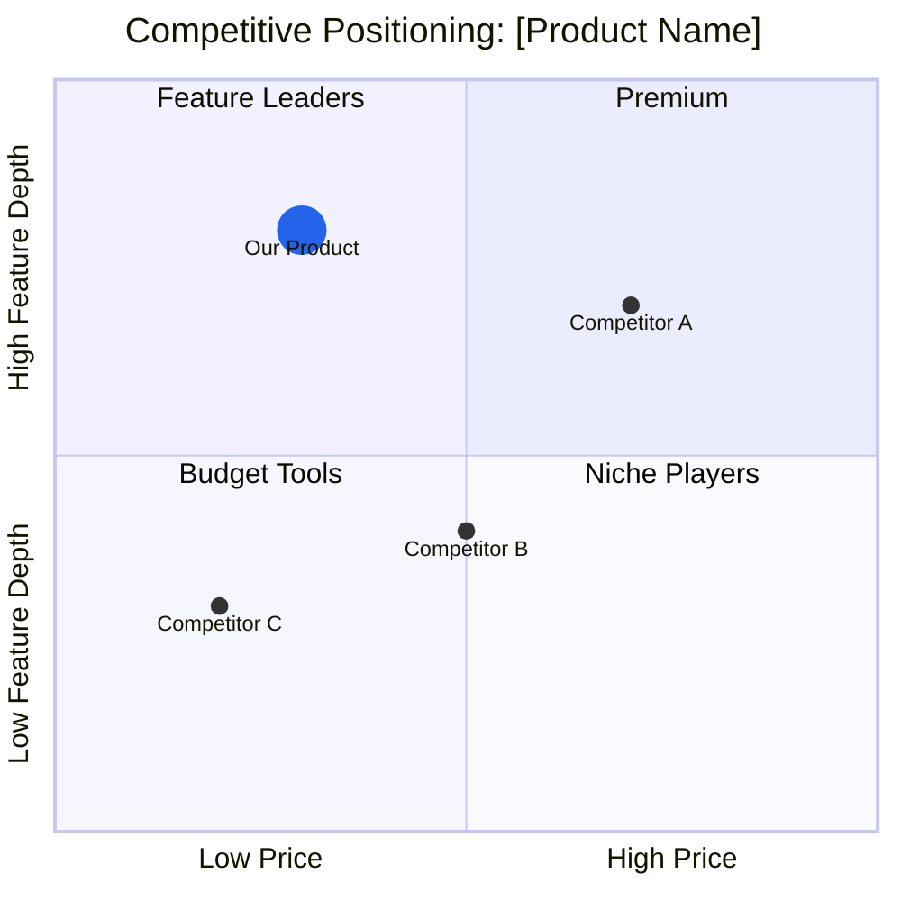

# Phase 86: Competitive + Opportunity Extensions — Research

**Researched:** 2026-03-22
**Domain:** Workflow prompt engineering — extending `workflows/competitive.md` and `workflows/opportunity.md` with business-mode market analysis and RICE scoring extensions
**Confidence:** HIGH

---

<phase_requirements>
## Phase Requirements

| ID | Description | Research Support |
|----|-------------|-----------------|
| MRKT-01 | `competitive.md` produces MLS (Market Landscape) artifact with TAM/SAM/SOM sizing using `[Source required]` when user-provided sources are absent | Extends Step 4 of competitive.md with new subsection `4i`; uses `[YOUR_TAM_SIZE]`, `[YOUR_SAM_SIZE]`, `[YOUR_SOM_SIZE]` + `[Source required]` per business-financial-disclaimer.md |
| MRKT-02 | Competitive positioning matrix generated as 2x2 quadrant diagram (Mermaid or ASCII) with differentiation analysis | Mermaid `quadrantChart` type confirmed working; syntax verified against official docs; inserted as Step 4j in competitive.md |
| MRKT-03 | `opportunity.md` extends RICE scoring with business initiative framing — unit economics inputs (LTV formula, CAC ceiling, payback period at 3 churn scenarios) as structural placeholders | New Step 4 sub-section in opportunity.md, conditional on `businessMode == true`; uses `[YOUR_LTV_ESTIMATE]`, `[YOUR_CAC_CEILING]`, `[YOUR_PAYBACK_PERIOD]` |
| MRKT-04 | `hasMarketLandscape` set to true in designCoverage after MLS artifact creation | 20-field pass-through-all pattern (identical to Phase 85 pattern); coverage-check → write all 20 fields with `hasMarketLandscape: true` |
| MRKT-05 | Market landscape content depth differs by businessTrack: solo (1-page summary), startup (competitive deep-dive), leader (build-vs-buy analysis) | Track branching pattern established in Phase 85 (Step 5b/5c); apply identical `IF businessTrack == "solo_founder"` conditional structure |
</phase_requirements>

---

## Summary

Phase 86 extends two existing workflows — `competitive.md` (601 lines) and `opportunity.md` (523 lines) — with business-mode conditional sections. This is pure prompt-engineering work. No new reference files, commands, or npm dependencies are needed. All infrastructure was created in Phase 84; all business-mode patterns were established in Phase 85.

The competitive.md extension adds two new analysis subsections within Step 4 (the core analysis step): `4i` for TAM/SAM/SOM market landscape sizing and `4j` for the Mermaid quadrant chart positioning matrix. A new MLS artifact file is written alongside the existing CMP artifact. The `hasMarketLandscape` coverage flag (one of the 4 new Phase 84 fields) is set to `true` using the 20-field pass-through-all pattern.

The opportunity.md extension adds a business initiative framing section to Step 4 (RICE scoring), conditional on `businessMode == true`. It appends unit economics structural inputs — LTV formula, CAC ceiling, payback period at three churn scenarios — all as `[YOUR_X]` placeholders per `business-financial-disclaimer.md`. No new artifact file is created; the business framing appears as an additional section within the existing OPP artifact.

**Primary recommendation:** Implement Phase 86 as two sequential plans. Plan 1 extends `competitive.md` with MLS artifact generation and Mermaid quadrant chart (MRKT-01, MRKT-02, MRKT-04, MRKT-05). Plan 2 extends `opportunity.md` with RICE business initiative framing (MRKT-03).

---

## Standard Stack

### Core — No New Dependencies

| File | Current State | Modification | Change Size |
|------|--------------|--------------|-------------|
| `workflows/competitive.md` | 601 lines, 7 steps | Add businessMode detection; add Steps 4i/4j (MLS sizing + Mermaid matrix); write MLS artifact; update designCoverage with 20-field pattern | ~120 lines added |
| `workflows/opportunity.md` | 523 lines, 7 steps | Add businessMode check in Step 4; add unit economics placeholder section to OPP artifact output | ~60 lines added |
| `references/business-track.md` | COMPLETE — Phase 84 | Read-only; `@references/business-track.md` in required_reading block | None |
| `references/business-financial-disclaimer.md` | COMPLETE — Phase 84 | Read-only; `@references/business-financial-disclaimer.md` in required_reading block | None |

### No New Reference Files, No New Commands

Phase 86 adds zero new reference files and zero new pde-tools.cjs commands. The MLS artifact follows the same versioned markdown pattern as CMP and OPP.

### Required Reading Block Extensions

Both extended workflows must add to their `<required_reading>` blocks:

```
@references/business-track.md
@references/business-financial-disclaimer.md
```

`competitive.md` already loads `@references/strategy-frameworks.md` — retain it.

---

## Architecture Patterns

### How the Existing Workflow Step Structure Works

**competitive.md (7 steps):**
```
Step 1/7: Initialize design directories
Step 2/7: Check prerequisites and determine scope
Step 3/7: Probe MCP capabilities
Step 4/7: Competitive analysis          <- MRKT-01, MRKT-02, MRKT-05 inserted here as 4i and 4j
Step 5/7: Write competitive artifact    <- MLS artifact write triggered here
Step 6/7: Update domain DESIGN-STATE
Step 7/7: Update root DESIGN-STATE and manifest   <- hasMarketLandscape flag set here (MRKT-04)
```

**opportunity.md (7 steps):**
```
Step 1/7: Initialize design directories
Step 2/7: Check prerequisites and discover candidates
Step 3/7: Probe MCP availability
Step 4/7: Interactive RICE scoring     <- MRKT-03 business framing inserted as new section at end of Step 4
Step 5/7: Write opportunity artifact   <- unit economics section added to OPP artifact
Step 6/7: Update domain DESIGN-STATE
Step 7/7: Update root DESIGN-STATE and manifest
```

### Pattern 1: Business-Mode Conditional Insertion

This is the identical pattern used in `brief.md` for Steps 5b/5c. Apply it consistently.

**What:** Wrap new content in `IF businessMode == true:` conditional block. Read `businessMode` from the manifest before the gate.

**When to use:** Any content that only appears when `businessMode === true` in the project manifest.

**Implementation (same as brief.md pattern):**
```
IF businessMode == true AND businessTrack is not null:
  [execute new section]
ELSE:
  Skip silently. Display nothing. Continue to next step.
```

**How to detect businessMode:** Read manifest via pde-tools and parse:
```bash
BM=$(node "${CLAUDE_PLUGIN_ROOT}/bin/pde-tools.cjs" design manifest-get-top-level businessMode 2>/dev/null)
BT=$(node "${CLAUDE_PLUGIN_ROOT}/bin/pde-tools.cjs" design manifest-get-top-level businessTrack 2>/dev/null)
```

### Pattern 2: MLS Artifact — Versioned Markdown in Strategy Domain

**What:** A new artifact file `MLS-market-landscape-v{N}.md` written to `.planning/design/strategy/` following the same versioned-artifact convention as CMP and OPP.

**When to use:** Only when `businessMode == true`. Non-business projects must produce byte-identical CMP output to the pre-v0.12 baseline (INTG-02 requirement).

**Artifact structure:**
```
---
Generated: "{ISO 8601 date}"
Skill: /pde:competitive (MLS)
Version: v{N}
businessTrack: {solo_founder|startup_team|product_leader}
dependsOn: CMP
---

# Market Landscape Sizing: {product_name}

## TAM/SAM/SOM Overview
[structured content per track depth — see Track Depth section below]

## Competitive Positioning Matrix
[Mermaid quadrantChart or ASCII fallback]

## Differentiation Analysis
[per-quadrant interpretation]
```

**Artifact registration:** Use manifest-update MLS pattern (7 calls identical to BTH/LCV/CMP/OPP registration).

### Pattern 3: Track Depth Differentiation (MRKT-05)

From `references/business-track.md` — the authoritative source. Apply EXACTLY:

| Track | Market Landscape Format | Competitive Depth |
|-------|------------------------|-------------------|
| `solo_founder` | 1-page summary | 3 competitors, 1-2 paragraphs each |
| `startup_team` | Competitive deep-dive | 5-8 competitors, scoring matrix |
| `product_leader` | Build-vs-buy analysis | 8+ competitors, full positioning matrix |

**Implementation — three discrete blocks, not a single branching if/else:**

```
IF businessTrack == "solo_founder":
  [1-page MLS: TAM/SAM/SOM table with 3 placeholder rows + simple paragraph]
  [Mermaid quadrant: 3 competitors only, minimal labeling]

IF businessTrack == "startup_team":
  [Deep-dive MLS: top-down + bottom-up methodology sections + competitive matrix table]
  [Mermaid quadrant: 5-8 competitors, quadrant interpretation per segment]

IF businessTrack == "product_leader":
  [Build-vs-buy MLS: decision matrix per competitor category + P&L impact placeholder]
  [Mermaid quadrant: 8+ competitors, stakeholder vocabulary, OKR framing]
```

**Vocabulary substitutions (from business-track.md):**
- solo_founder: "competing tools" | startup_team: "competitive landscape" | product_leader: "market alternatives / build-vs-buy"

### Pattern 4: 20-Field Pass-Through-All for designCoverage (MRKT-04)

The critical field is `hasMarketLandscape` — one of the 4 new fields from Phase 84. The competitive.md workflow currently writes a 16-field designCoverage object. Phase 86 MUST extend it to 20 fields. This is identical to the breaking change handled in Phase 85 (BRIEF-06).

**Full 20-field canonical order (copy verbatim into workflow):**
```
hasDesignSystem, hasWireframes, hasFlows, hasHardwareSpec, hasCritique, hasIterate, hasHandoff,
hasIdeation, hasCompetitive, hasOpportunity, hasMockup, hasHigAudit, hasRecommendations,
hasStitchWireframes, hasPrintCollateral, hasProductionBible,
hasBusinessThesis, hasMarketLandscape, hasServiceBlueprint, hasLaunchKit
```

**Bash pattern (identical to brief.md BRIEF-06):**
```bash
COV=$(node "${CLAUDE_PLUGIN_ROOT}/bin/pde-tools.cjs" design coverage-check)
if [[ "$COV" == @file:* ]]; then COV=$(cat "${COV#@file:}"); fi
# Parse all 20 fields from COV JSON, default absent to false
node "${CLAUDE_PLUGIN_ROOT}/bin/pde-tools.cjs" design manifest-set-top-level designCoverage \
  '{"hasDesignSystem":{val},"hasWireframes":{val},...,"hasMarketLandscape":true,...,"hasLaunchKit":{val}}'
```

**Critical anti-pattern:** competitive.md's current Step 7 writes only 16 fields. The Phase 86 plan MUST update this to 20 fields regardless of businessMode — even for non-business projects. Failure to do so will erase `hasBusinessThesis`, `hasServiceBlueprint`, and `hasLaunchKit` whenever `/pde:competitive` runs after `/pde:brief` on a business project.

### Anti-Patterns to Avoid

- **Inserting MLS content inside the CMP artifact:** MLS is a separate artifact file (`MLS-market-landscape-v{N}.md`). Do not add TAM/SAM/SOM sections to the CMP artifact itself — they have different lifecycles and the CMP is already well-structured.
- **Skipping businessMode check:** Both competitive.md and opportunity.md must explicitly check `businessMode` before entering any business-mode section. Non-business projects must be unaffected (INTG-02).
- **Writing financial dollar amounts:** TAM/SAM/SOM sizing MUST use `[YOUR_TAM_SIZE]` + `[VERIFY FINANCIAL ASSUMPTIONS]` inline. Never write `$XB` or `$XM` values as facts.
- **Writing designCoverage with 16 fields after Phase 85:** From Phase 86 onward, all workflows that write designCoverage must use the 20-field object. The 16-field version is a regression.
- **Skipping [Source required] for market sizing claims:** Per MRKT-01, any TAM/SAM/SOM data not provided by the user must carry `[Source required]` annotation, not inferred numbers.

---

## Don't Hand-Roll

| Problem | Don't Build | Use Instead | Why |
|---------|-------------|-------------|-----|
| Positioning matrix rendering | Custom SVG quadrant from scratch | Mermaid `quadrantChart` type | Built-in, markdown-native, no separate SVG authoring needed — and competitive.md already uses SVG for positioning maps (Step 4d), so Mermaid quadrant is the appropriate complement for the business-mode addition |
| Market sizing methodology | Custom TAM calculation engine | Structural placeholder table with `[YOUR_X]` format | LLM hallucination exceeds 15% on financial data (per REQUIREMENTS.md out-of-scope rationale); only structural framework, not numbers |
| Track detection logic | New detection keyword system | `references/business-track.md` signals (already defined) | Single source of truth exists; re-reading PROJECT.md for track signals is handled by reading manifest `businessTrack` field already set in Phase 85 |
| Unit economics calculator | Formula engine with computations | Structural formula template with placeholders | Out of scope per REQUIREMENTS.md: "Full financial model / P&L generation" is explicitly excluded |
| Build-vs-buy decision matrix | Custom scoring engine | Markdown table template with weighted criteria rows | The analysis is a prompt template, not a computation — the LLM reasons over product context, user fills in weights |

**Key insight:** Every deliverable in Phase 86 is a prompt template that emits structured placeholder-filled markdown. The complexity is in conditional branching logic and placeholder format compliance, not in new data processing.

---

## Common Pitfalls

### Pitfall 1: 16-Field designCoverage Regression
**What goes wrong:** competitive.md's current Step 7 writes a 16-field designCoverage JSON. If Phase 86 only adds `hasMarketLandscape: true` without adding the other 3 new fields from Phase 84, the write will silently erase `hasBusinessThesis`, `hasServiceBlueprint`, and `hasLaunchKit`.
**Why it happens:** The current competitive.md hardcodes 16 field names in the manifest-set-top-level call (line ~554 in current competitive.md). The Phase 84 extension added 4 more fields to the manifest template but did not update competitive.md's write call.
**How to avoid:** The plan MUST update the designCoverage write in competitive.md Step 7 to include all 20 fields — this is required even for non-business projects.
**Warning signs:** Tests checking `hasBusinessThesis` fail after running `/pde:competitive` on a business project.

### Pitfall 2: MLS Artifact Created for Non-Business Projects
**What goes wrong:** The MLS artifact write runs even when `businessMode == false`, creating orphan files.
**Why it happens:** The businessMode guard is added to the analysis step (Step 4i) but not also to the artifact write step (Step 5).
**How to avoid:** The businessMode conditional must wrap both the analysis content AND the artifact write. Use a flag variable: `MLS_WRITTEN=false`, set to true only if businessMode and artifact write succeeds. Reference `MLS_WRITTEN` in Step 7 to decide whether to register MLS in the manifest.
**Warning signs:** MLS-market-landscape-v1.md appears for projects with `businessMode: false`.

### Pitfall 3: Mermaid quadrantChart Points Outside [0,1] Range
**What goes wrong:** Competitor coordinates are scored on a 0-10 scale (matching the existing SVG positioning map in Step 4d of competitive.md), but Mermaid quadrantChart requires coordinates in [0,1] range.
**Why it happens:** The existing competitive.md SVG uses a 0-10 scoring scale. If the same scores are naively reused for the Mermaid chart, all points will be pushed to the extreme edges or errors will occur.
**How to avoid:** When generating Mermaid quadrant points, normalize scores: `x_mermaid = x_score / 10`, `y_mermaid = y_score / 10`. Document this normalization in the workflow instruction.
**Warning signs:** Points cluster at [0.9, 0.1] range or Mermaid rendering fails.

### Pitfall 4: Dollar Amounts in TAM/SAM/SOM Output
**What goes wrong:** The LLM "helpfully" fills in market size numbers like "$4.2B" based on training knowledge, violating MRKT-01 and business-financial-disclaimer.md.
**Why it happens:** Market sizing is the most tempting place for an LLM to assert numbers — it has training data for common markets.
**How to avoid:** The workflow instruction must explicitly state: "Do NOT generate specific dollar amounts for TAM, SAM, or SOM. Use `[YOUR_TAM_SIZE] [Source required]` for every sizing cell." Include a post-write verification bash check identical to the BRIEF-07 pattern.
**Post-write verification bash check:**
```bash
if grep -qE '\$[0-9]' ".planning/design/strategy/MLS-market-landscape-v${N}.md" 2>/dev/null; then
  echo "ERROR: Dollar amount detected in MLS artifact. Use [YOUR_X] placeholders."
  grep -nE '\$[0-9]' ".planning/design/strategy/MLS-market-landscape-v${N}.md"
fi
```
**Warning signs:** MLS artifact contains `$` followed by digits.

### Pitfall 5: RICE Unit Economics Section Runs for Non-Business Projects
**What goes wrong:** The unit economics section in opportunity.md appears even for software-only projects with `businessMode: false`, adding confusing placeholder tables that don't apply.
**Why it happens:** The businessMode gate is added to Step 4 interactive scoring prompt but not to the OPP artifact write in Step 5.
**How to avoid:** The businessMode conditional must wrap both the Step 4 unit economics section AND the corresponding section in the Step 5 artifact template. Use: `IF businessMode == true: [include unit economics section] ELSE: [omit silently]`.
**Warning signs:** OPP artifacts for non-business projects contain LTV/CAC/payback placeholder tables.

---

## Code Examples

Verified patterns from official sources and established project conventions:

### Mermaid quadrantChart Exact Syntax (MRKT-02)

Source: [Mermaid official documentation](https://mermaid.js.org/syntax/quadrantChart.html) — verified 2026-03-22



**Key syntax rules (verified against official docs):**
- Type declaration: `quadrantChart` (no hyphen)
- Coordinates: `[x, y]` where both x and y are in range **0 to 1** (not 0-10)
- Point styling: `radius: 14, color: #2563eb` (inline after coordinates)
- Quadrant numbering: quadrant-1=top-right, quadrant-2=top-left, quadrant-3=bottom-left, quadrant-4=bottom-right
- Axis labels: `x-axis Left Label --> Right Label` and `y-axis Bottom Label --> Top Label`

**Normalization from existing SVG scores:** `mermaid_coord = svg_score / 10`

**Axis pair selection by product domain (standard pairs from market analysis literature):**
- Software/SaaS: Price vs. Feature Depth; Ease of Use vs. Power
- Developer tools: Abstraction Level vs. Customization
- Enterprise software: Deployment Complexity vs. Capability Breadth
- Consumer apps: Social Reach vs. Engagement Depth

### TAM/SAM/SOM Placeholder Table Structure (MRKT-01)

Source: business-financial-disclaimer.md + standard market analysis conventions

```markdown
## Market Landscape Sizing
> [VERIFY FINANCIAL ASSUMPTIONS] — Replace all [YOUR_X] placeholders with your own researched market data before using in investor communications.

| Market Level | Definition | Size Estimate | Methodology | Sources |
|-------------|-----------|---------------|-------------|---------|
| TAM (Total Addressable Market) | Full market if 100% captured | [YOUR_TAM_SIZE] [VERIFY FINANCIAL ASSUMPTIONS] | [Top-down: industry report] / [Bottom-up: unit × addressable users] | [Source required] |
| SAM (Serviceable Addressable Market) | Portion reachable with current product and GTM | [YOUR_SAM_SIZE] [VERIFY FINANCIAL ASSUMPTIONS] | [Geographic or segment filter applied to TAM] | [Source required] |
| SOM (Serviceable Obtainable Market) | Realistic capture in 3-year horizon | [YOUR_SOM_SIZE] [VERIFY FINANCIAL ASSUMPTIONS] | [Market share assumption × SAM] | [Source required] |

**Sizing Methodology Notes:**
- Top-down approach: Start with industry total → apply segment filters → apply geographic scope → apply product category
- Bottom-up approach: [YOUR_UNIT_PRICE] × [YOUR_ADDRESSABLE_USERS] = SOM baseline
- Reconcile both approaches — credible investor presentations show both

**Market Trend Context:**
[Qualitative trend description derived from competitive context — no dollar amounts]
```

### Unit Economics Structural Template (MRKT-03)

Source: Standard SaaS unit economics formulas (LTV formula verified against industry sources) + business-financial-disclaimer.md

```markdown
## Business Initiative Framing
*(Generated when businessMode = true)*

> [VERIFY FINANCIAL ASSUMPTIONS] — All unit economics below are structural placeholders.
> Replace [YOUR_X] values with your own researched figures before financial modeling.

### Core Unit Economics Inputs

| Metric | Formula | Placeholder Value |
|--------|---------|-------------------|
| Customer Lifetime Value (LTV) | (ARPU × Gross Margin) / Churn Rate | ([YOUR_ARPU] × [YOUR_GROSS_MARGIN]) / [YOUR_CHURN_RATE] [VERIFY FINANCIAL ASSUMPTIONS] |
| CAC Ceiling | LTV / [YOUR_LTV_CAC_RATIO_TARGET] | [YOUR_CAC_CEILING] [VERIFY FINANCIAL ASSUMPTIONS] |
| Payback Period | CAC / (Monthly Revenue per Customer × Gross Margin) | [YOUR_PAYBACK_PERIOD] months [VERIFY FINANCIAL ASSUMPTIONS] |

### Payback Period at 3 Churn Scenarios

| Churn Scenario | Monthly Churn | LTV Impact | Payback Period |
|----------------|--------------|-----------|----------------|
| Optimistic | [YOUR_CHURN_RATE_LOW] | [YOUR_LTV_HIGH] [VERIFY FINANCIAL ASSUMPTIONS] | [YOUR_PAYBACK_OPTIMISTIC] months |
| Base Case | [YOUR_CHURN_RATE_BASE] | [YOUR_LTV_BASE] [VERIFY FINANCIAL ASSUMPTIONS] | [YOUR_PAYBACK_BASE] months |
| Pessimistic | [YOUR_CHURN_RATE_HIGH] | [YOUR_LTV_LOW] [VERIFY FINANCIAL ASSUMPTIONS] | [YOUR_PAYBACK_PESSIMISTIC] months |

**Standard SaaS benchmarks (for calibration only — do not use as your numbers):**
- Healthy LTV/CAC ratio: 3:1 or higher
- Target payback period: < 12 months (B2C), < 18 months (B2B)
- Gross margin target: 70%+ (SaaS)

### RICE Score Business Context

| RICE Dimension | Standard Interpretation | Business Initiative Lens |
|---------------|------------------------|--------------------------|
| Reach | Users affected per quarter | [YOUR_ICP_SEGMENT_SIZE] potential customers |
| Impact | Per-user value delta | Revenue impact per account × LTV multiplier |
| Confidence | Data quality level | Higher if supported by pricing validation data |
| Effort | Person-months | Include GTM effort (sales cycles, onboarding) for business initiatives |
```

### Build-vs-Buy Analysis Template (product_leader track, MRKT-05)

Source: Standard product leader decision framework conventions

```markdown
## Build vs. Buy Analysis
*(product_leader track — appears when businessTrack = "product_leader")*

> P&L impact values use structural placeholders. Replace with your organization's financial model.

### Decision Matrix

| Alternative | Category | Core Capability | Integration Effort | TCO [VERIFY FINANCIAL ASSUMPTIONS] | Differentiating? |
|------------|---------|----------------|-------------------|-------------------------------------|------------------|
| [Competitor A] | Buy | [feature] | [Low/Med/High] | [YOUR_TCO_VENDOR_A] | No — commodity |
| [Competitor B] | Buy | [feature] | [Low/Med/High] | [YOUR_TCO_VENDOR_B] | No — commodity |
| Build in-house | Build | Full control | Internal roadmap | [YOUR_BUILD_COST] | Yes — core differentiator |

### Recommendation Framework

**Build when:** Core to competitive differentiation AND in-house expertise exists AND long-term maintenance cost < vendor TCO
**Buy when:** Commodity capability AND vendor roadmap aligns AND integration < build cost

### Initiative ROI Placeholder (for business case)

| Metric | Value |
|--------|-------|
| Expected ROI | [YOUR_INITIATIVE_ROI] [VERIFY FINANCIAL ASSUMPTIONS] |
| Payback Period | [YOUR_PAYBACK_PERIOD] months [VERIFY FINANCIAL ASSUMPTIONS] |
| P&L Impact | [YOUR_PL_IMPACT] [VERIFY FINANCIAL ASSUMPTIONS] |
| Success Metric | [YOUR_OKR_METRIC] |
```

### 20-Field designCoverage Write Pattern (MRKT-04)

Source: Phase 85 established pattern (BRIEF-06) — extended to 20 fields

```bash
# Read all current flags
COV=$(node "${CLAUDE_PLUGIN_ROOT}/bin/pde-tools.cjs" design coverage-check)
if [[ "$COV" == @file:* ]]; then COV=$(cat "${COV#@file:}"); fi

# Parse all 20 fields from COV JSON (default absent fields to false)
# Fields 1-16: existing fields
# Fields 17-20: Phase 84 new fields: hasBusinessThesis, hasMarketLandscape, hasServiceBlueprint, hasLaunchKit

# Write all 20 fields, setting hasMarketLandscape to true
node "${CLAUDE_PLUGIN_ROOT}/bin/pde-tools.cjs" design manifest-set-top-level designCoverage \
  '{"hasDesignSystem":{c},"hasWireframes":{c},"hasFlows":{c},"hasHardwareSpec":{c},"hasCritique":{c},"hasIterate":{c},"hasHandoff":{c},"hasIdeation":{c},"hasCompetitive":{c},"hasOpportunity":{c},"hasMockup":{c},"hasHigAudit":{c},"hasRecommendations":{c},"hasStitchWireframes":{c},"hasPrintCollateral":{c},"hasProductionBible":{c},"hasBusinessThesis":{c},"hasMarketLandscape":true,"hasServiceBlueprint":{c},"hasLaunchKit":{c}}'
```

**Note:** `{c}` denotes replacement with actual boolean value from COV JSON. Never use dot-notation. Always write all 20 fields.

---

## State of the Art

| Old Approach | Current Approach | When Changed | Impact |
|--------------|------------------|--------------|--------|
| SVG-only positioning maps in competitive.md | Mermaid `quadrantChart` available as markdown-native alternative | Mermaid v10+ (2023) | No external SVG authoring needed; renders in GitHub, Obsidian, most markdown editors |
| 16-field designCoverage write | 20-field designCoverage write | Phase 84 (manifest template extended) | All workflows must be updated before Phase 86 goes live — competitive.md currently writes 16 fields |
| Single CMP artifact for all competitive analysis | CMP artifact + separate MLS artifact for market sizing | Phase 86 (this phase) | Separation of concerns: competitive landscape vs. market sizing have different update frequencies |

**Current competitive.md writes a 16-field designCoverage. This MUST be updated to 20 fields in Phase 86 regardless of whether businessMode is active — it is a pipeline integrity requirement (INTG-01).**

---

## Open Questions

1. **Mermaid quadrantChart rendering in Claude artifact previews**
   - What we know: Mermaid quadrantChart syntax is confirmed working in official Mermaid 10+ (verified via official docs). The existing competitive.md uses SVG maps because they render in the Claude artifact. Mermaid diagrams in `.md` files may or may not render depending on the viewer.
   - What's unclear: Whether Claude's artifact renderer supports `quadrantChart` type natively, or whether the SVG approach from Step 4d should be used as the primary with Mermaid as supplementary.
   - Recommendation: **Include both.** Primary: Mermaid `quadrantChart` (markdown-native, renders in GitHub/Obsidian). Fallback: ASCII art positioning matrix using the `|` table format. The plan should specify: generate Mermaid first, then provide ASCII fallback in a code block so the artifact is always human-readable.

2. **MLS artifact versioning when CMP is re-run**
   - What we know: CMP artifacts auto-increment (v1→v2→v3). MLS artifact is dependent on CMP.
   - What's unclear: Should MLS version number always match CMP version number, or track independently?
   - Recommendation: **Lock MLS version to CMP version** (if CMP is v2, MLS is MLS-market-landscape-v2.md). This preserves the dependent-artifact coherence established by BTH/LCV in Phase 85 (both used BRF version number).

3. **businessMode read mechanism in competitive.md and opportunity.md**
   - What we know: The `manifest-get-top-level` command exists in pde-tools.cjs (established in Phase 85 usage). Brief.md reads businessMode from manifest in Step 7 for coverage writes.
   - What's unclear: The exact command signature for reading businessMode vs. businessTrack. Phase 85 research did not explicitly document this read path in competitive/opportunity contexts.
   - Recommendation: Use `node "${CLAUDE_PLUGIN_ROOT}/bin/pde-tools.cjs" design manifest-get-top-level businessMode` at the start of Step 4 (before the analysis begins), cache as `$BUSINESS_MODE` bash variable, and use throughout Step 4.

---

## Deep Research Findings

### Verified: Mermaid quadrantChart Full Syntax

From official Mermaid documentation (mermaid.js.org/syntax/quadrantChart.html), confirmed 2026-03-22:

**Complete syntax:**
```
quadrantChart
    title <optional title>
    x-axis <left label> --> <right label>
    y-axis <bottom label> --> <top label>
    quadrant-1 <top-right label>
    quadrant-2 <top-left label>
    quadrant-3 <bottom-left label>
    quadrant-4 <bottom-right label>
    <Point Name>: [x, y]
    <Point Name>: [x, y] radius: 12, color: #ff3300
    <Point Name>:::className: [x, y]
    classDef className color: #109060, radius: 10
```

**Coordinate range:** x and y MUST be in [0, 1]. Values outside this range are undefined behavior.

**Quadrant layout:**
- quadrant-1: top-right (high x, high y)
- quadrant-2: top-left (low x, high y)
- quadrant-3: bottom-left (low x, low y)
- quadrant-4: bottom-right (high x, low y)

**Point styling:** `radius` (default ~10px), `color` (fill), `stroke-color`, `stroke-width`

**Our Product styling (match existing CMP SVG convention):** `radius: 14, color: #2563eb`

**Confidence: HIGH** — Verified from official Mermaid documentation directly.

### Verified: Standard TAM/SAM/SOM Methodology

From market analysis literature and professional templates:

**Two accepted methodologies:**
1. **Top-down:** Industry total (from analyst reports) → apply segment filter → apply geographic scope → apply product category penetration rate
2. **Bottom-up:** Unit price × addressable user count = SOM; extrapolate up to SAM and TAM

**Standard format:** Size + methodology note + source citation. The placeholder format `[YOUR_X] [Source required]` accurately represents the structural relationship: the user must supply both the number AND cite the source.

**Hierarchy:** TAM > SAM > SOM always (SOM is the most conservative/realistic)

**Confidence: HIGH** — Consistent across multiple market analysis sources.

### Verified: Standard SaaS Unit Economics Formulas

From industry sources (confirmed via search):

```
LTV = (ARPU × Gross Margin) / Monthly Churn Rate
    = Average Revenue Per User × (1 / Churn Rate) × Gross Margin

CAC Payback Period = CAC / (Monthly Revenue per Customer × Gross Margin)

LTV/CAC Ratio = LTV / CAC  (healthy threshold: 3:1 or higher)
```

**Three-churn-scenario framework (MRKT-03 requirement):**
- Optimistic: churn_rate_low (e.g., 1-2% monthly for B2B SaaS)
- Base case: churn_rate_base (industry median)
- Pessimistic: churn_rate_high (high-churn scenario)

**Current benchmarks (2025, for calibration language only — do not hardcode):**
- Median CAC payback: 8.6 months (B2B SaaS)
- Healthy gross margin: 70%+ for SaaS
- Minimum LTV/CAC for investor interest: 3:1

**Confidence: MEDIUM** — Formulas are HIGH confidence (standard industry definitions). Benchmark numbers are MEDIUM (sourced from search, not official standards body).

### Verified: Build-vs-Buy Framework Structure

Standard structure used by product leaders (from multiple sources including Thoughtworks, HatchWorks):

1. **Requirements definition** — What must the solution do?
2. **Decision matrix** — Weighted scorecard with criteria: cost, capability fit, integration effort, roadmap alignment, differentiation value, vendor risk
3. **TCO comparison** — Build cost vs. vendor license + integration + maintenance
4. **Recommendation** — Build when core differentiator AND in-house capability exists; Buy when commodity AND vendor roadmap fits
5. **Initiative ROI** — ROI, payback period, P&L impact (all placeholders)

**Confidence: MEDIUM** — Multiple consistent sources, no single authoritative standard.

### Verified: Competitive Positioning Matrix Axis Selection

Standard practice from competitive intelligence and product management literature:

**Software/SaaS axis pairs in common use:**
- Price (Low → High) vs. Feature Depth (Shallow → Deep)
- Ease of Use (Simple → Complex) vs. Power/Capability (Limited → Full)
- Integration Breadth (Narrow → Wide) vs. Customization (Rigid → Flexible)
- Deployment Speed (Slow → Fast) vs. Enterprise Readiness (Consumer → Enterprise)

**Selection principle (from Competitive Intelligence Alliance):** Axes should reflect how buyers actually sort the category — the strongest axes come from recurring disqualification patterns (speed vs. depth, simplicity vs. control, breadth vs. specialization).

**In competitive.md:** The existing Step 4d already selects axis pairs based on product domain with specific guidance for software vs. hardware. The Mermaid quadrant chart should use the SAME axis pairs already determined in Step 4d — no new axis selection logic needed.

**Confidence: MEDIUM** — Multiple consistent sources; axis selection guidance is well-established in PM practice.

---

## Validation Architecture

### Test Framework

| Property | Value |
|----------|-------|
| Framework | node:test (built-in) — same as Phase 85 |
| Config file | None — runs directly with `node --test` |
| Quick run command | `node --test .planning/phases/86-competitive-opportunity-extensions/tests/*.cjs` |
| Full suite command | `node --test .planning/phases/86-competitive-opportunity-extensions/tests/*.cjs` |

### Phase Requirements → Test Map

| Req ID | Behavior | Test Type | Automated Command | File Exists? |
|--------|----------|-----------|-------------------|-------------|
| MRKT-01 | `competitive.md` contains MLS artifact write instruction with TAM/SAM/SOM placeholder table | structural | `node --test .../tests/test-competitive-mls.cjs` | ❌ Wave 0 |
| MRKT-01 | `[Source required]` annotation present in TAM/SAM/SOM template in competitive.md | structural | `node --test .../tests/test-competitive-mls.cjs` | ❌ Wave 0 |
| MRKT-02 | `competitive.md` contains `quadrantChart` Mermaid diagram syntax | structural | `node --test .../tests/test-competitive-mls.cjs` | ❌ Wave 0 |
| MRKT-02 | Mermaid quadrant point coordinates use `[x, y]` format with values 0-1 | structural | `node --test .../tests/test-competitive-mls.cjs` | ❌ Wave 0 |
| MRKT-03 | `opportunity.md` contains unit economics section with LTV formula | structural | `node --test .../tests/test-opportunity-rice.cjs` | ❌ Wave 0 |
| MRKT-03 | Unit economics section gated on `businessMode == true` conditional | structural | `node --test .../tests/test-opportunity-rice.cjs` | ❌ Wave 0 |
| MRKT-03 | Three churn scenario rows present in opportunity.md payback table | structural | `node --test .../tests/test-opportunity-rice.cjs` | ❌ Wave 0 |
| MRKT-04 | `competitive.md` Step 7 contains `hasMarketLandscape` in designCoverage write | structural | `node --test .../tests/test-competitive-mls.cjs` | ❌ Wave 0 |
| MRKT-04 | `competitive.md` designCoverage write contains all 20 field names | structural | `node --test .../tests/test-competitive-mls.cjs` | ❌ Wave 0 |
| MRKT-05 | `competitive.md` contains three track-specific conditionals for market landscape depth | structural | `node --test .../tests/test-competitive-mls.cjs` | ❌ Wave 0 |
| MRKT-05 | `solo_founder` track section is 1-page summary format | structural | `node --test .../tests/test-competitive-mls.cjs` | ❌ Wave 0 |
| MRKT-05 | `product_leader` track section contains build-vs-buy analysis language | structural | `node --test .../tests/test-competitive-mls.cjs` | ❌ Wave 0 |

### Sampling Rate
- **Per task commit:** `node --test .planning/phases/86-competitive-opportunity-extensions/tests/*.cjs`
- **Per wave merge:** Same command
- **Phase gate:** Full suite green before `/gsd:verify-work`

### Wave 0 Gaps

- [ ] `.planning/phases/86-competitive-opportunity-extensions/tests/test-competitive-mls.cjs` — covers MRKT-01, MRKT-02, MRKT-04, MRKT-05
- [ ] `.planning/phases/86-competitive-opportunity-extensions/tests/test-opportunity-rice.cjs` — covers MRKT-03
- [ ] Framework install: none needed — `node:test` is built-in

**Test pattern (identical to Phase 85):**
```javascript
'use strict';
const { describe, it } = require('node:test');
const assert = require('node:assert');
const fs = require('node:fs');
const path = require('node:path');
const ROOT = path.resolve(__dirname, '..', '..', '..', '..');
const competitiveContent = fs.readFileSync(path.join(ROOT, 'workflows', 'competitive.md'), 'utf-8');
// Pattern assertions on workflow file content
```

---

## Sources

### Primary (HIGH confidence)
- [Mermaid quadrantChart official documentation](https://mermaid.js.org/syntax/quadrantChart.html) — syntax, coordinate range, point styling, quadrant numbering verified 2026-03-22
- `workflows/competitive.md` (project file, read directly) — existing step structure, SVG positioning map pattern, designCoverage write location, current 16-field list
- `workflows/opportunity.md` (project file, read directly) — RICE scoring formula, interactive Step 4 structure, OPP artifact format, designCoverage field list
- `references/business-track.md` (project file, read directly) — authoritative track depth thresholds and vocabulary substitutions
- `references/business-financial-disclaimer.md` (project file, read directly) — all `[YOUR_X]` placeholder names and `[VERIFY FINANCIAL ASSUMPTIONS]` tag placement rules
- `references/launch-frameworks.md` (project file, read directly) — lean canvas schema, service blueprint lanes, pricing config schema
- `.planning/phases/85-brief-extensions-detection/85-RESEARCH.md` (project file) — established 20-field designCoverage pattern, businessMode gate pattern
- `.planning/phases/85-brief-extensions-detection/tests/test-brief-detection.cjs` (project file) — node:test structural test pattern for workflow prompt-engineering tests

### Secondary (MEDIUM confidence)
- WebSearch + official sources: Standard SaaS unit economics formulas (LTV, CAC, payback) — verified against multiple financial analysis sources
- WebSearch: Build-vs-buy framework structure — consistent across Thoughtworks, HatchWorks, and PM literature
- WebSearch: Competitive positioning matrix axis selection — consistent across Competitive Intelligence Alliance and PM practice sources

### Tertiary (LOW confidence)
- WebSearch: 2025 SaaS benchmark numbers (23-month payback, 14% CAC increase) — single-year data, flagged as calibration reference only, not for inclusion in templates

---

## Metadata

**Confidence breakdown:**
- Standard stack: HIGH — All files exist and were read directly; no new dependencies
- Architecture patterns: HIGH — Derived from direct reading of competitive.md, opportunity.md, and Phase 85 established patterns
- Mermaid quadrant syntax: HIGH — Verified against official Mermaid documentation
- Unit economics formulas: HIGH — Standard industry definitions; MEDIUM for 2025 benchmark numbers
- Pitfalls: HIGH — Derived from direct analysis of current workflow code and Phase 84/85 decisions
- Build-vs-buy framework: MEDIUM — Consistent across sources but no single authoritative standard

**Research date:** 2026-03-22
**Valid until:** 2026-04-22 (30 days — stable domain, Mermaid syntax changes slowly)
