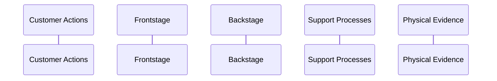
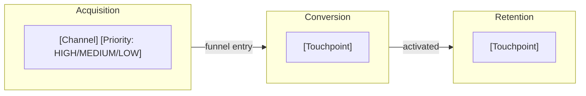

<objective>
Add business-mode service blueprint (SBP) generation to flows.md with Nyquist test scaffold, business mode detection, 5-lane Mermaid sequence diagram generation per track depth, SBP artifact write to strategy/ domain, and required_reading extensions.

Purpose: OPS-01/OPS-03/OPS-04 require flows.md to produce a service blueprint when businessMode is active, adapting depth per businessTrack, and setting hasServiceBlueprint in designCoverage.
Output: Test scaffold + flows.md extended with Steps 4f (SBP generation), Step 5 SBP write, manifest registration, and required_reading additions.
</objective>

<execution_context>
@/Users/greyaltaer/.claude/get-shit-done/workflows/execute-plan.md
@/Users/greyaltaer/.claude/get-shit-done/templates/summary.md
</execution_context>

<context>
@.planning/PROJECT.md
@.planning/ROADMAP.md
@.planning/STATE.md
@.planning/phases/87-flows-stage/87-RESEARCH.md

<interfaces>
<!-- Key patterns the executor needs from existing codebase -->

From workflows/flows.md (line 5-8) — required_reading block to extend:
```
<required_reading>
@references/skill-style-guide.md
@references/mcp-integration.md
</required_reading>
```

From workflows/flows.md (line 147-151) — Step 4 entry point where businessMode detection inserts:
```
### Step 4/7: Generate flow diagrams
...
**IF `PRODUCT_TYPE == "experience"`:** skip Steps 4a through 4e (software path) and jump to Step 4-EXP below.
```

From workflows/flows.md (line 317-319) — experience block early return that needs modification for experience+business:
```
After generating all four artifacts in memory, jump to Step 5-EXP.
**End experience flow generation block.** Non-experience products skip this entire Step 4-EXP and proceed to Step 4a as before.
```

From workflows/competitive.md (line 237-238) — canonical businessMode detection pattern:
```bash
BM=$(node "${CLAUDE_PLUGIN_ROOT}/bin/pde-tools.cjs" design manifest-get-top-level businessMode 2>/dev/null)
BT=$(node "${CLAUDE_PLUGIN_ROOT}/bin/pde-tools.cjs" design manifest-get-top-level businessTrack 2>/dev/null)
```

From workflows/competitive.md — canonical manifest-update pattern (7 calls per artifact):
```bash
node "${CLAUDE_PLUGIN_ROOT}/bin/pde-tools.cjs" design manifest-update MLS code MLS
node "${CLAUDE_PLUGIN_ROOT}/bin/pde-tools.cjs" design manifest-update MLS name "Market Landscape"
node "${CLAUDE_PLUGIN_ROOT}/bin/pde-tools.cjs" design manifest-update MLS type market-landscape
node "${CLAUDE_PLUGIN_ROOT}/bin/pde-tools.cjs" design manifest-update MLS domain strategy
node "${CLAUDE_PLUGIN_ROOT}/bin/pde-tools.cjs" design manifest-update MLS path "..."
node "${CLAUDE_PLUGIN_ROOT}/bin/pde-tools.cjs" design manifest-update MLS status draft
node "${CLAUDE_PLUGIN_ROOT}/bin/pde-tools.cjs" design manifest-update MLS dependsOn '["CMP"]'
```

From .planning/phases/86-competitive-opportunity-extensions/tests/test-competitive-mls.cjs — test scaffold pattern:
```javascript
const { describe, it } = require('node:test');
const assert = require('node:assert');
const fs = require('node:fs');
const path = require('node:path');
const ROOT = path.resolve(__dirname, '..', '..', '..', '..');
const content = fs.readFileSync(path.join(ROOT, 'workflows', 'competitive.md'), 'utf-8');
```
</interfaces>
</context>

<tasks>

<task type="auto" tdd="true">
  <name>Task 1: Create Nyquist test scaffold for SBP and GTM structural assertions</name>
  <files>.planning/phases/87-flows-stage/tests/test-flows-sbp.cjs</files>
  <read_first>
    - .planning/phases/86-competitive-opportunity-extensions/tests/test-competitive-mls.cjs (pattern to follow exactly)
    - .planning/phases/87-flows-stage/87-RESEARCH.md (validation architecture section — 10 test assertions listed)
    - workflows/flows.md (current state — tests must FAIL against this)
  </read_first>
  <behavior>
    - OPS-01a: flows.md contains "SBP-service-blueprint" filename pattern -> FAIL (not yet present)
    - OPS-01b: flows.md contains "participant C as Customer Actions" (5-participant sequence diagram) -> FAIL
    - OPS-01c: flows.md contains "Note over C,E:" spanning syntax for line of visibility -> FAIL
    - OPS-02a: flows.md contains "GTM-channel-flow" filename pattern -> FAIL
    - OPS-02b: flows.md contains subgraph structure with acquisition/conversion/retention -> FAIL
    - OPS-02c: flows.md contains "flowchart LR" for GTM chart -> FAIL
    - OPS-03a: flows.md contains "hasServiceBlueprint" field reference -> FAIL
    - OPS-03b: flows.md coverage write contains all 20 fields (count hasDesignSystem through hasLaunchKit) -> FAIL (currently 16)
    - OPS-04: flows.md contains "solo_founder", "startup_team", "product_leader" in SBP section -> FAIL
    - OPS-01d: flows.md contains "businessMode" detection before SBP generation -> FAIL
  </behavior>
  <action>
Create `.planning/phases/87-flows-stage/tests/test-flows-sbp.cjs` following the exact pattern from Phase 86 test `test-competitive-mls.cjs`:

1. Use `require('node:test')` and `require('node:assert')` — no npm dependencies
2. `const ROOT = path.resolve(__dirname, '..', '..', '..', '..');` — 4 levels up from tests/
3. `const content = fs.readFileSync(path.join(ROOT, 'workflows', 'flows.md'), 'utf-8');` — single file read
4. Create 10 test cases organized by requirement ID:

**OPS-01 describe block (4 tests):**
- `it('flows.md contains "SBP-service-blueprint" artifact filename pattern')` — `content.includes('SBP-service-blueprint')`
- `it('flows.md contains 5-participant sequence diagram syntax')` — `content.includes('participant C as Customer Actions')`
- `it('flows.md contains "Note over C,E:" line-of-visibility spanning syntax')` — `content.includes('Note over C,E:')`
- `it('flows.md contains businessMode detection before SBP generation')` — verify `manifest-get-top-level businessMode` appears before `SBP-service-blueprint` in the file (use `content.indexOf()` comparison)

**OPS-02 describe block (3 tests):**
- `it('flows.md contains "GTM-channel-flow" filename pattern')` — `content.includes('GTM-channel-flow')`
- `it('flows.md contains acquisition/conversion/retention subgraph structure')` — check for all three of `Acquisition`, `Conversion`, `Retention` as subgraph labels
- `it('flows.md contains "flowchart LR" for GTM chart')` — `content.includes('flowchart LR')`

**OPS-03 describe block (2 tests):**
- `it('flows.md contains hasServiceBlueprint field reference')` — `content.includes('hasServiceBlueprint')`
- `it('flows.md coverage write contains all 20 designCoverage fields')` — count occurrences of all 20 field names: `hasDesignSystem, hasWireframes, hasFlows, hasHardwareSpec, hasCritique, hasIterate, hasHandoff, hasIdeation, hasCompetitive, hasOpportunity, hasMockup, hasHigAudit, hasRecommendations, hasStitchWireframes, hasPrintCollateral, hasProductionBible, hasBusinessThesis, hasMarketLandscape, hasServiceBlueprint, hasLaunchKit`. Each must appear at least once. Current file has only 16 of these so this test fails.

**OPS-04 describe block (1 test):**
- `it('flows.md contains track-specific branching for SBP')` — verify `solo_founder`, `startup_team`, and `product_leader` all appear in content

5. Header comment: `Phase 87 Plan 01+02 structural validation tests. Covers OPS-01 through OPS-04.`
6. Run command: `node --test .planning/phases/87-flows-stage/tests/test-flows-sbp.cjs`

After creating the file, run it to confirm RED state (all 10 tests should fail).
  </action>
  <verify>
    <automated>node --test .planning/phases/87-flows-stage/tests/test-flows-sbp.cjs 2>&1 | grep -c "fail" | grep -q "10" || node --test .planning/phases/87-flows-stage/tests/test-flows-sbp.cjs 2>&1 | tail -5</automated>
  </verify>
  <acceptance_criteria>
    - .planning/phases/87-flows-stage/tests/test-flows-sbp.cjs exists and is >80 lines
    - File contains `require('node:test')` and `require('node:assert')`
    - File contains `const content = fs.readFileSync(path.join(ROOT, 'workflows', 'flows.md')`
    - File contains 10 `it(` test case declarations
    - File contains all 20 designCoverage field names as string literals in the 20-field test
    - Running `node --test .planning/phases/87-flows-stage/tests/test-flows-sbp.cjs` produces 10 failing tests (RED state)
  </acceptance_criteria>
  <done>Test scaffold exists with 10 structural assertions covering OPS-01 through OPS-04, all failing against unmodified flows.md</done>
</task>

<task type="auto">
  <name>Task 2: Add business mode detection, SBP generation, SBP artifact write, and required_reading to flows.md</name>
  <files>workflows/flows.md</files>
  <read_first>
    - workflows/flows.md (full file — current 860 lines, understand all insertion points)
    - workflows/competitive.md (lines 230-430 — businessMode detection pattern, MLS generation, track branching)
    - references/launch-frameworks.md (SBP Mermaid template — use verbatim)
    - references/business-track.md (service blueprint depth table row)
    - references/business-financial-disclaimer.md (placeholder format)
  </read_first>
  <action>
Modify `workflows/flows.md` with four insertions. Use the Edit tool for each insertion point. Do NOT rewrite the entire file.

**Insertion 1: Extend required_reading block (line 5-8)**

Add 3 entries after the existing 2 entries, before `</required_reading>`:
```
@references/business-track.md
@references/business-financial-disclaimer.md
@references/launch-frameworks.md
```

Result: 5 entries total in `<required_reading>`.

**Insertion 2: Business mode detection at TOP of Step 4 (after line 149, before line 151)**

Insert BEFORE the `IF PRODUCT_TYPE == "experience"` check:

```markdown
**Business mode detection (cached for Steps 4f, 4g, 5, and 7):**

```bash
BM=$(node "${CLAUDE_PLUGIN_ROOT}/bin/pde-tools.cjs" design manifest-get-top-level businessMode 2>/dev/null)
if [[ "$BM" == @file:* ]]; then BM=$(cat "${BM#@file:}"); fi
BT=$(node "${CLAUDE_PLUGIN_ROOT}/bin/pde-tools.cjs" design manifest-get-top-level businessTrack 2>/dev/null)
if [[ "$BT" == @file:* ]]; then BT=$(cat "${BT#@file:}"); fi
```

Cache `$BM` and `$BT` for use in Steps 4f, 4g, 5, and 7.
```

Also modify the Step 4-EXP early return (line 317, "After generating all four artifacts in memory, jump to Step 5-EXP.") to:

```markdown
After generating all four experience artifacts in memory:

**IF `$BM == "true"`:** proceed to Step 4f below (business artifacts apply to experience+business compositions too) before jumping to Step 5-EXP.

**ELSE:** jump directly to Step 5-EXP.
```

**Insertion 3: Steps 4f and 4g (after line 538, the Step 4 display line, before Step 5)**

Insert two new sub-steps after the `Display: Step 4/7: Flow diagrams generated...` line:

```markdown
---

#### Step 4f: Service Blueprint generation (business mode only)

**IF `$BM == "true"` AND `$BT` is not null:**

Read `@references/launch-frameworks.md` for the canonical 5-lane service blueprint Mermaid template.
Read `@references/business-track.md` for track depth thresholds (Service blueprint row).

Generate a 5-lane service blueprint as a Mermaid `sequenceDiagram` held in memory. Use the EXACT participant declarations:



Use `Note over C,E: [Stage Name]` to mark each journey stage (spanning ALL 5 participants — this represents the line of visibility divider). Between frontstage and backstage stages, insert `Note over C,E: LINE OF VISIBILITY`.

**Track depth differentiation:**

**IF `$BT == "solo_founder"`:**
Generate single-product SBP:
- 3-4 journey stages: Awareness, Onboarding, First Value, Retention
- Each stage: `Note over C,E: [Stage]` + `C->>F:` + `F->>B:` + `B->>S:` + `Note over E:`
- Core touchpoints only — no channel variants, no alt blocks
- All financial references use `[YOUR_X]` placeholder format per `business-financial-disclaimer.md`

**IF `$BT == "startup_team"`:**
Generate multi-channel SBP:
- 4-5 journey stages with channel branching
- `alt` blocks within stages for web vs mobile vs email channels
- Support Processes lane populated with tools (CRM, email platform, analytics)
- Frontstage shows distinct touchpoints per channel
- All financial references use `[YOUR_X]` placeholder format

**IF `$BT == "product_leader"`:**
Generate cross-functional SBP:
- 5+ stages including stakeholder handoffs
- Frontstage includes both user-facing and internal stakeholder interactions
- Backstage includes organizational handoffs (team handoffs, department boundaries)
- After the Mermaid diagram, add a supplementary Stakeholder Map table:
  `| Role | Stage | Responsibility | Handoff To |`
- All financial references use `[YOUR_X]` placeholder format

SET flag: `SBP_CONTENT_GENERATED=true`

Also generate a Stage Breakdown table (all tracks):
```
| Stage | Customer Action | Frontstage | Backstage | Support | Evidence |
```

**ELSE (`$BM != "true"`):** Skip silently. Set `SBP_CONTENT_GENERATED=false`. Continue to Step 4g.

Display (if generated): `  -> Service blueprint generated ({stage_count} stages, {track} track depth)`

---

#### Step 4g: GTM Channel Flow generation (business mode only)

**IF `$BM == "true"` AND `SBP_CONTENT_GENERATED == true`:**

Generate a GTM channel flow as a Mermaid `flowchart LR` with three subgraph stages held in memory. Use self-contained subgraphs — connect ONLY at the subgraph level (`ACQ --> CONV --> RET`), NEVER link individual nodes across subgraph boundaries (this would override subgraph internal `direction TB`).

Structure:



**Track depth differentiation:**

**IF `$BT == "solo_founder"`:**
- Acquisition: 3 channels (Content marketing [HIGH], Word-of-mouth [HIGH], Direct outreach [MEDIUM])
- Conversion: 2 touchpoints (Landing page, Free trial/demo)
- Retention: 2 touchpoints (Email sequence, Core feature adoption)

**IF `$BT == "startup_team"`:**
- Acquisition: 5+ channels with priority labels (Paid ads [HIGH], Content [HIGH], Referrals [MEDIUM], Product Hunt [MEDIUM], Partnerships [LOW])
- Conversion: 4 touchpoints (Landing page, Free trial signup, Onboarding flow, First value milestone)
- Retention: 3 touchpoints (Onboarding emails, Feature adoption nudges, Referral invite)

**IF `$BT == "product_leader"`:**
- Acquisition: 5+ channels with org ownership labels (Enterprise sales [HIGH], Inbound [HIGH], Partner channel [MEDIUM], ABM [MEDIUM], Events [LOW])
- Conversion: 4 touchpoints (Procurement/legal review, Pilot, POC, Contract)
- Retention: 3 touchpoints (CSM onboarding, QBR, Expansion opportunities)

Also generate a Channel Priority Annotations table:
```
| Channel | Stage | Priority | Notes |
```

SET flag: `GTM_CONTENT_GENERATED=true`

**ELSE:** Skip silently. Set `GTM_CONTENT_GENERATED=false`.

Display (if generated): `  -> GTM channel flow generated ({channel_count} channels, {track} track depth)`
```

**Insertion 4: SBP and GTM artifact writes in Step 5 (after line 582, before Step 5-EXP)**

Insert after the standard Step 5 `Display: Step 5/7: Flow artifacts written.` line but BEFORE Step 5-EXP:

```markdown
---

#### Step 5-BIZ: Write business flow artifacts (business mode only)

**IF `SBP_CONTENT_GENERATED == true`:**

Write SBP artifact to `.planning/design/strategy/SBP-service-blueprint-v{N}.md` (N = same version as FLW artifact for this run, or v1 if first run).

Include YAML frontmatter:
```yaml
---
Generated: "{ISO 8601 date}"
Skill: /pde:flows (SBP)
Version: v{N}
businessTrack: {solo_founder|startup_team|product_leader}
dependsOn: FLW
---
```

Sections in order:
1. `# Service Blueprint: {product_name}`
2. `## Blueprint Overview` — lane definitions table (5 rows: Customer Actions, Frontstage, Line of Visibility, Backstage, Support Processes, Physical Evidence) + line of visibility note
3. `## Service Blueprint Diagram` — the Mermaid `sequenceDiagram` from Step 4f (all stages)
4. `## Stage Breakdown` — the Stage Breakdown table from Step 4f
5. `## Stakeholder Map` — product_leader track only (table from Step 4f)
6. Footer: `---\n*Generated by /pde:flows (SBP) v{N} | {ISO date}*`

**Post-write verification — no dollar amounts:**
```bash
if grep -qE '\$[0-9]' ".planning/design/strategy/SBP-service-blueprint-v${N}.md" 2>/dev/null; then
  echo "ERROR: Dollar amount detected in SBP artifact. Use [YOUR_X] placeholders only."
  grep -nE '\$[0-9]' ".planning/design/strategy/SBP-service-blueprint-v${N}.md"
fi
```

Register SBP artifact in manifest (7 calls):
```bash
node "${CLAUDE_PLUGIN_ROOT}/bin/pde-tools.cjs" design manifest-update SBP code SBP
node "${CLAUDE_PLUGIN_ROOT}/bin/pde-tools.cjs" design manifest-update SBP name "Service Blueprint"
node "${CLAUDE_PLUGIN_ROOT}/bin/pde-tools.cjs" design manifest-update SBP type service-blueprint
node "${CLAUDE_PLUGIN_ROOT}/bin/pde-tools.cjs" design manifest-update SBP domain strategy
node "${CLAUDE_PLUGIN_ROOT}/bin/pde-tools.cjs" design manifest-update SBP path ".planning/design/strategy/SBP-service-blueprint-v${N}.md"
node "${CLAUDE_PLUGIN_ROOT}/bin/pde-tools.cjs" design manifest-update SBP status draft
node "${CLAUDE_PLUGIN_ROOT}/bin/pde-tools.cjs" design manifest-update SBP dependsOn '["FLW"]'
```

Display: `  -> Created: .planning/design/strategy/SBP-service-blueprint-v{N}.md`

SET flag: `SBP_WRITTEN=true`

**IF `GTM_CONTENT_GENERATED == true`:**

Write GTM artifact to `.planning/design/strategy/GTM-channel-flow-v{N}.md`.

Include YAML frontmatter:
```yaml
---
Generated: "{ISO 8601 date}"
Skill: /pde:flows (GTM)
Version: v{N}
businessTrack: {solo_founder|startup_team|product_leader}
dependsOn: SBP
---
```

Sections in order:
1. `# GTM Channel Flow: {product_name}`
2. `## Channel Strategy Overview` — channel list + priority table
3. `## GTM Channel Flow Diagram` — the Mermaid `flowchart LR` from Step 4g
4. `## Channel Priority Annotations` — the annotations table from Step 4g
5. Footer: `---\n*Generated by /pde:flows (GTM) v{N} | {ISO date}*`

Register GTM artifact in manifest (7 calls):
```bash
node "${CLAUDE_PLUGIN_ROOT}/bin/pde-tools.cjs" design manifest-update GTM code GTM
node "${CLAUDE_PLUGIN_ROOT}/bin/pde-tools.cjs" design manifest-update GTM name "GTM Channel Flow"
node "${CLAUDE_PLUGIN_ROOT}/bin/pde-tools.cjs" design manifest-update GTM type gtm-channel-flow
node "${CLAUDE_PLUGIN_ROOT}/bin/pde-tools.cjs" design manifest-update GTM domain strategy
node "${CLAUDE_PLUGIN_ROOT}/bin/pde-tools.cjs" design manifest-update GTM path ".planning/design/strategy/GTM-channel-flow-v${N}.md"
node "${CLAUDE_PLUGIN_ROOT}/bin/pde-tools.cjs" design manifest-update GTM status draft
node "${CLAUDE_PLUGIN_ROOT}/bin/pde-tools.cjs" design manifest-update GTM dependsOn '["SBP"]'
```

Display: `  -> Created: .planning/design/strategy/GTM-channel-flow-v{N}.md`

**End Step 5-BIZ.** Continue to Step 5-EXP (experience products) or Step 6 (all others).
```

After all 4 insertions, run the test scaffold to confirm progress: at least OPS-01 and OPS-04 tests should now pass (SBP-service-blueprint, participant declarations, Note over C,E, businessMode detection, track branching). OPS-02 tests should also pass (GTM-channel-flow, subgraph, flowchart LR). OPS-03 tests will be addressed in Plan 02 (20-field coverage upgrade).

Run `node --test .planning/phases/87-flows-stage/tests/test-flows-sbp.cjs` — expect 8-9 of 10 tests passing (the 20-field coverage test may still fail until Plan 02).
  </action>
  <verify>
    <automated>node --test .planning/phases/87-flows-stage/tests/test-flows-sbp.cjs 2>&1 | tail -10</automated>
  </verify>
  <acceptance_criteria>
    - workflows/flows.md `<required_reading>` block contains 5 entries: skill-style-guide.md, mcp-integration.md, business-track.md, business-financial-disclaimer.md, launch-frameworks.md
    - workflows/flows.md contains `manifest-get-top-level businessMode` BEFORE `SBP-service-blueprint` (indexOf check)
    - workflows/flows.md contains `participant C as Customer Actions` and `participant F as Frontstage` and `participant B as Backstage` and `participant S as Support Processes` and `participant E as Physical Evidence`
    - workflows/flows.md contains `Note over C,E:` (full-width line of visibility)
    - workflows/flows.md contains `SBP-service-blueprint-v` artifact filename pattern
    - workflows/flows.md contains `GTM-channel-flow-v` artifact filename pattern
    - workflows/flows.md contains `flowchart LR` for GTM chart
    - workflows/flows.md contains `subgraph ACQ` and `subgraph CONV` and `subgraph RET` (or equivalent Acquisition/Conversion/Retention subgraph labels)
    - workflows/flows.md contains `solo_founder`, `startup_team`, `product_leader` branching
    - workflows/flows.md contains `SBP_CONTENT_GENERATED` and `GTM_CONTENT_GENERATED` flags
    - workflows/flows.md contains 7 `manifest-update SBP` calls and 7 `manifest-update GTM` calls
    - workflows/flows.md contains `grep -qE '\$[0-9]'` post-write verification for SBP
    - At least 8 of 10 test assertions pass in test-flows-sbp.cjs
  </acceptance_criteria>
  <done>flows.md extended with business mode detection, SBP service blueprint generation (Step 4f), GTM channel flow generation (Step 4g), artifact writes (Step 5-BIZ), manifest registration, and required_reading extensions. OPS-01, OPS-02, OPS-04 structurally complete.</done>
</task>

</tasks>

<verification>
node --test .planning/phases/87-flows-stage/tests/test-flows-sbp.cjs
</verification>

<success_criteria>
- Test scaffold exists with 10 structural assertions in RED state before implementation
- flows.md extended with businessMode detection, SBP generation, GTM generation, artifact writes
- At least 8/10 tests pass after Plan 01 (20-field coverage test deferred to Plan 02)
- Step count remains at 7 (4f/4g are sub-steps of Step 4, 5-BIZ is sub-step of Step 5)
</success_criteria>

<output>
After completion, create `.planning/phases/87-flows-stage/87-01-SUMMARY.md`
</output>
