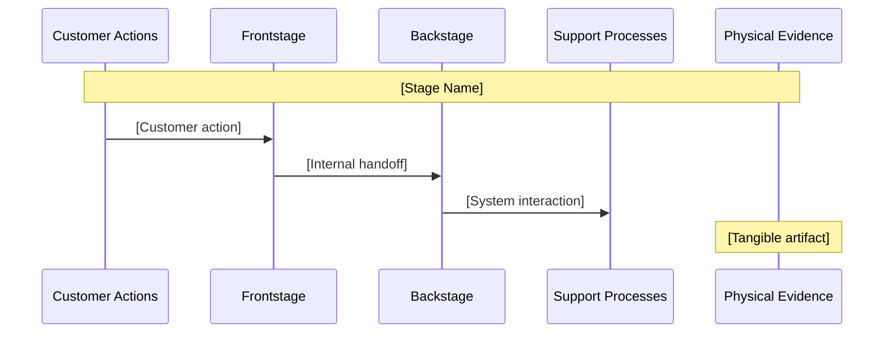
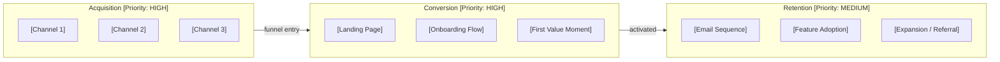
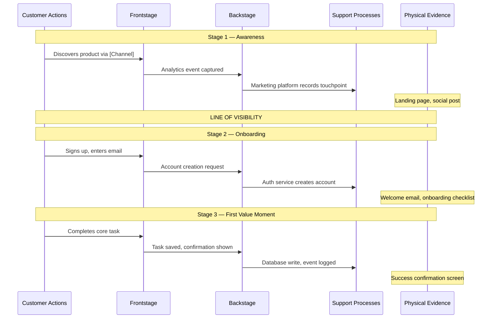

# Phase 87: Flows Stage — Research

**Researched:** 2026-03-22
**Domain:** Workflow prompt engineering — extending `workflows/flows.md` with business-mode SBP (Service Blueprint) and GTM Channel Flow artifacts
**Confidence:** HIGH

---

<phase_requirements>
## Phase Requirements

| ID | Description | Research Support |
|----|-------------|-----------------|
| OPS-01 | `flows.md` produces SBP (Service Blueprint) artifact as 5-lane Mermaid sequence diagram (customer actions, frontstage, line of visibility, backstage, support processes) | Mermaid `sequenceDiagram` supports N named participants; `Note over C,E:` spans all 5 participants and represents line-of-visibility divider; exact template confirmed in `references/launch-frameworks.md` |
| OPS-02 | GTM channel flow artifact produced as acquisition → conversion → retention Mermaid flowchart with channel priority annotations | Mermaid `flowchart LR` with three named `subgraph` blocks (acquisition/conversion/retention); `[Priority: HIGH]` annotations on node labels; subgraphs stay self-contained (no cross-subgraph links avoids direction override) |
| OPS-03 | `hasServiceBlueprint` coverage flag set in designCoverage after SBP artifact creation | 20-field pass-through-all pattern — same as Phase 85 `hasBusinessThesis` and Phase 86 `hasMarketLandscape`; read coverage-check first, write all 20 fields with `hasServiceBlueprint: true` |
| OPS-04 | Service blueprint and GTM flow depth adapt per `businessTrack` (solo: single-product flow, startup: multi-channel, leader: cross-functional) | business-track.md depth table row "Service blueprint": solo=single-product, startup=multi-channel, leader=cross-functional + stakeholder map; same IF/ELSE branching pattern as competitive.md Steps 4i/4j |
</phase_requirements>

---

## Summary

Phase 87 extends `workflows/flows.md` (860 lines, 7 steps) with two business-mode artifacts generated when `businessMode == true`: (1) an SBP (Service Blueprint) artifact as a Mermaid sequence diagram using all 5 canonical lanes, and (2) a GTM (Go-to-Market) channel flow artifact as a Mermaid flowchart with acquisition/conversion/retention subgraph stages. This is pure prompt-engineering work — no new reference files, no new pde-tools.cjs commands, and no new npm dependencies.

The existing `references/launch-frameworks.md` already contains the definitive Mermaid template for the service blueprint (5-participant sequence diagram with `Note over C,E:` spanning all participants to mark the line of visibility). The planner must use this template verbatim — it is the canonical specification established in Phase 84. The `references/business-track.md` depth thresholds table row "Service blueprint" defines exactly how many lanes/nodes each track gets. Business mode detection follows the identical pattern used in competitive.md Step 4 (`manifest-get-top-level businessMode` + `manifest-get-top-level businessTrack`).

The coverage write for `hasServiceBlueprint` follows the established 20-field pass-through-all pattern. The existing flows.md Step 7 currently writes only 16 fields — this is a known regression that Phase 87 must fix alongside adding the `hasServiceBlueprint: true` write (identical issue was fixed for competitive.md in Phase 86).

**Primary recommendation:** Implement Phase 87 as a single plan with two sequential tasks. Task 1 adds businessMode detection and the SBP artifact to flows.md (OPS-01, OPS-03, OPS-04). Task 2 adds the GTM channel flow artifact and upgrades the designCoverage write from 16 to 20 fields (OPS-02, INTG-01 partial).

---

## Standard Stack

### Core — No New Dependencies

| File | Current State | Modification | Change Size |
|------|--------------|--------------|-------------|
| `workflows/flows.md` | 860 lines, 7 steps, 16-field coverage write | Add businessMode/businessTrack detection; add Steps 4f/4g (SBP artifact + GTM flow); write SBP artifact; upgrade designCoverage write from 16 to 20 fields; set `hasServiceBlueprint: true` | ~150 lines added |
| `references/launch-frameworks.md` | COMPLETE — Phase 84 | Read-only; add `@references/launch-frameworks.md` to flows.md `<required_reading>` block | None |
| `references/business-track.md` | COMPLETE — Phase 84 | Read-only; add `@references/business-track.md` to flows.md `<required_reading>` block | None |
| `references/business-financial-disclaimer.md` | COMPLETE — Phase 84 | Read-only; add `@references/business-financial-disclaimer.md` to flows.md `<required_reading>` block | None |

### No New Reference Files, No New Commands

Phase 87 adds zero new reference files and zero new pde-tools.cjs commands. The SBP artifact follows the same versioned markdown pattern as CMP, MLS, and OPP.

### Required Reading Block Extensions

`workflows/flows.md` currently loads only:
```
@references/skill-style-guide.md
@references/mcp-integration.md
```

Phase 87 must add three entries to the `<required_reading>` block:
```
@references/business-track.md
@references/business-financial-disclaimer.md
@references/launch-frameworks.md
```

---

## Architecture Patterns

### Existing flows.md Step Structure (Complete Map)

```
Step 1/7: Initialize design directories
Step 2/7: Check prerequisites (brief, version gate)
Step 3/7: Probe MCP (Sequential Thinking)
Step 4/7: Generate flow diagrams        <- New Steps 4f/4g inserted here (business mode only)
  4-EXP: Experience flow generation (experience products only — jumps to Step 5-EXP)
  4a: Persona and journey identification
  4b: Overview diagram
  4c: Per-journey diagrams
  4d: Flow summary table
  4e: Screen inventory extraction
  *** 4f: Service Blueprint generation (business mode only) — INSERT HERE ***
  *** 4g: GTM Channel Flow generation (business mode only) — INSERT HERE ***
Step 5/7: Write output artifacts        <- SBP artifact write triggered here (business mode only)
  5-EXP: Write experience flow artifacts (experience products only)
Step 6/7: Update ux domain DESIGN-STATE
Step 7/7: Update root DESIGN-STATE and manifest   <- hasServiceBlueprint flag set here (20-field write)
```

Step count stays at 7 — sub-steps 4f and 4g inserted within Step 4, same pattern as Phase 85 (Steps 5b/5c within Step 5) and Phase 86 (Steps 4i/4j within Step 4 of competitive.md).

### Business Mode Detection Block

Insert at the TOP of Step 4, before `4-EXP` check (same placement as competitive.md Step 4 detection):

```bash
BM=$(node "${CLAUDE_PLUGIN_ROOT}/bin/pde-tools.cjs" design manifest-get-top-level businessMode 2>/dev/null)
BT=$(node "${CLAUDE_PLUGIN_ROOT}/bin/pde-tools.cjs" design manifest-get-top-level businessTrack 2>/dev/null)
```

Cache `$BM` and `$BT` for use in Steps 4f, 4g, and 7.

### Pattern 1: Service Blueprint (Step 4f) — SBP Artifact

**What:** When `businessMode == true`, generate a 5-lane service blueprint using the Mermaid template from `references/launch-frameworks.md`. Hold content in memory; write to `SBP-service-blueprint-v{N}.md` in Step 5.

**Canonical 5 Lanes (from launch-frameworks.md — verbatim):**
```
Lane 1: Customer Actions     — What the customer does (journey stages)
Lane 2: Frontstage Interactions — Direct touchpoints (UI, staff, communications)
         ─── LINE OF VISIBILITY ───
Lane 3: Backstage Actions    — Internal processes not visible to customer
Lane 4: Support Processes    — Internal systems/tools that enable frontstage
Lane 5: Physical Evidence    — Tangible artifacts at each touchpoint
```

**Mermaid Sequence Diagram — Exact Syntax (from launch-frameworks.md):**



**Key syntax facts (HIGH confidence, verified from official Mermaid docs):**
- `participant X as Label` — declare named participants with display alias
- `Note over C,E: text` — spans from participant C to participant E (all 5 lanes when C=Customer, E=Physical Evidence)
- This Note spanning all participants is the machine representation of the Line of Visibility — it separates frontstage/backstage visually when placed between F and B participants
- 5 participants is fully supported — no participant count limit in Mermaid sequence diagrams
- `box` keyword (optional) can group participants: `box Frontstage\n participant C\n participant F\nend` — groups above line of visibility visually
- No native horizontal "line" separator in sequence diagrams; `Note over C,E: LINE OF VISIBILITY` is the correct idiom

**Track Depth Differentiation (from business-track.md):**

| Track | Service Blueprint Depth | Journey Stages | Lanes Used |
|-------|------------------------|----------------|------------|
| `solo_founder` | Single-product flow — one journey, core touchpoints only | 3-4 stages (Awareness, Onboarding, First Value, Retention) | All 5 lanes, minimal nodes per lane |
| `startup_team` | Multi-channel flow — web, mobile, email, and support channels | 4-5 stages + channel branching per stage | All 5 lanes, channel variants shown |
| `product_leader` | Cross-functional flow — includes stakeholder map and organizational handoffs | 5+ stages + org handoffs + stakeholder map section | All 5 lanes + supplementary stakeholder map table |

**Conditional generation (Step 4f):**

```
IF businessMode == true AND businessTrack is not null:

  IF businessTrack == "solo_founder":
    Generate single-product SBP:
    - 3-4 journey stages (Awareness, Onboarding, First Value, Retention)
    - Each stage: Note over C,E + C->>F + F->>B + B->>S + Note over E
    - Core touchpoints only — no channel variants
    - Limit to 1 repeat block per stage (no alt blocks)

  IF businessTrack == "startup_team":
    Generate multi-channel SBP:
    - 4-5 journey stages with channel branching
    - alt blocks within stages for web vs mobile vs email channels
    - Support Processes lane populated with tools (CRM, email platform, analytics)
    - Frontstage shows distinct touchpoints per channel

  IF businessTrack == "product_leader":
    Generate cross-functional SBP:
    - 5+ stages including stakeholder handoffs
    - Frontstage includes both user-facing and internal stakeholder interactions
    - Backstage includes organizational handoffs (team handoffs, department boundaries)
    - Add supplementary Stakeholder Map table AFTER the Mermaid diagram
    - Stakeholder Map: | Role | Stage | Responsibility | Handoff To |

SET flag: SBP_CONTENT_GENERATED=true

ELSE (businessMode != true):
  Skip silently. Display nothing. Continue to 4g check.
  SET flag: SBP_CONTENT_GENERATED=false
```

### Pattern 2: GTM Channel Flow (Step 4g) — GTM Artifact

**What:** When `businessMode == true` AND `SBP_CONTENT_GENERATED == true`, generate a GTM channel flow as a Mermaid `flowchart LR` with three subgraph stages. Hold in memory; write to `GTM-channel-flow-v{N}.md` in Step 5.

**Direction choice:** `flowchart LR` — left-to-right follows acquisition→conversion→retention reading order. `flowchart TD` would stack stages vertically and obscures the funnel progression. Use LR.

**Subgraph structure (each stage self-contained — no cross-subgraph links to avoid direction override):**



**Key syntax facts (HIGH confidence, verified from official Mermaid docs):**
- `subgraph ID["Label"]` — creates named, labeled subgraph
- `direction TB` inside subgraph controls internal direction when subgraph has NO external links TO individual nodes inside it — only the subgraph-to-subgraph edges (`ACQ --> CONV`) avoid the direction override issue
- Channel priority annotations go on subgraph labels: `ACQ["Acquisition [Priority: HIGH]"]`
- Cross-subgraph links between individual nodes (e.g., `A1 --> C1`) would override subgraph direction — avoid this; link only at the subgraph level
- `-->|"label"|` syntax for annotated edges between subgraphs

**Track Depth Differentiation:**

| Track | GTM Depth | Acquisition Channels | Conversion Touchpoints | Retention Touchpoints |
|-------|-----------|---------------------|----------------------|----------------------|
| `solo_founder` | 3 channels in acquisition, 2 conversion, 2 retention | Content marketing, word-of-mouth, direct outreach | Landing page, free trial/demo | Email sequence, core feature |
| `startup_team` | 5+ channels with priority labels (HIGH/MEDIUM/LOW), multi-path conversion | Paid ads, content, partnerships, product hunt, referrals | Multi-step onboarding, activation milestone | Onboarding emails, feature adoption, referral program |
| `product_leader` | 5+ channels with org ownership labels, stakeholder-gated conversion | Enterprise sales, inbound, partner channel, ABM, events | Procurement/legal review, pilot, POC | CSM onboarding, QBR, expansion opportunities |

**Conditional generation (Step 4g):**

```
IF businessMode == true AND SBP_CONTENT_GENERATED == true:
  Generate GTM channel flow per track depth above
  SET flag: GTM_CONTENT_GENERATED=true

ELSE:
  Skip silently.
  SET flag: GTM_CONTENT_GENERATED=false
```

### Pattern 3: Artifact Writes (Step 5 — Business Mode Extension)

Add to existing Step 5 (after standard FLW and screen-inventory writes):

```
IF SBP_CONTENT_GENERATED == true:

  Write SBP artifact to: .planning/design/strategy/SBP-service-blueprint-v{N}.md
  (N = same version as FLW artifact for this run)

  YAML frontmatter:
  ---
  Generated: "{ISO 8601 date}"
  Skill: /pde:flows (SBP)
  Version: v{N}
  businessTrack: {solo_founder|startup_team|product_leader}
  dependsOn: FLW
  ---

  Sections in order:
  1. # Service Blueprint: {product_name}
  2. ## Blueprint Overview (lane definitions table + line of visibility note)
  3. ## Service Blueprint Diagram (Mermaid sequenceDiagram — all stages)
  4. ## Stage Breakdown (table: Stage | Customer Action | Frontstage | Backstage | Support | Evidence)
  5. ## Stakeholder Map (product_leader only)
  6. Footer

  Register SBP artifact in manifest (7 calls):
  node "${CLAUDE_PLUGIN_ROOT}/bin/pde-tools.cjs" design manifest-update SBP code SBP
  node "${CLAUDE_PLUGIN_ROOT}/bin/pde-tools.cjs" design manifest-update SBP name "Service Blueprint"
  node "${CLAUDE_PLUGIN_ROOT}/bin/pde-tools.cjs" design manifest-update SBP type service-blueprint
  node "${CLAUDE_PLUGIN_ROOT}/bin/pde-tools.cjs" design manifest-update SBP domain strategy
  node "${CLAUDE_PLUGIN_ROOT}/bin/pde-tools.cjs" design manifest-update SBP path ".planning/design/strategy/SBP-service-blueprint-v{N}.md"
  node "${CLAUDE_PLUGIN_ROOT}/bin/pde-tools.cjs" design manifest-update SBP status draft
  node "${CLAUDE_PLUGIN_ROOT}/bin/pde-tools.cjs" design manifest-update SBP dependsOn '["FLW"]'

IF GTM_CONTENT_GENERATED == true:

  Write GTM artifact to: .planning/design/strategy/GTM-channel-flow-v{N}.md

  YAML frontmatter:
  ---
  Generated: "{ISO 8601 date}"
  Skill: /pde:flows (GTM)
  Version: v{N}
  businessTrack: {solo_founder|startup_team|product_leader}
  dependsOn: SBP
  ---

  Sections in order:
  1. # GTM Channel Flow: {product_name}
  2. ## Channel Strategy Overview (channel list + priority table)
  3. ## GTM Channel Flow Diagram (Mermaid flowchart LR with subgraphs)
  4. ## Channel Priority Annotations (table: Channel | Stage | Priority | Notes)
  5. Footer

  Register GTM artifact in manifest (7 calls — same pattern as SBP):
  node "${CLAUDE_PLUGIN_ROOT}/bin/pde-tools.cjs" design manifest-update GTM code GTM
  node "${CLAUDE_PLUGIN_ROOT}/bin/pde-tools.cjs" design manifest-update GTM name "GTM Channel Flow"
  node "${CLAUDE_PLUGIN_ROOT}/bin/pde-tools.cjs" design manifest-update GTM type gtm-channel-flow
  node "${CLAUDE_PLUGIN_ROOT}/bin/pde-tools.cjs" design manifest-update GTM domain strategy
  node "${CLAUDE_PLUGIN_ROOT}/bin/pde-tools.cjs" design manifest-update GTM path ".planning/design/strategy/GTM-channel-flow-v{N}.md"
  node "${CLAUDE_PLUGIN_ROOT}/bin/pde-tools.cjs" design manifest-update GTM status draft
  node "${CLAUDE_PLUGIN_ROOT}/bin/pde-tools.cjs" design manifest-update GTM dependsOn '["SBP"]'
```

Both artifacts go in `strategy/` domain (same as CMP and MLS) — they are strategic artifacts, not UX artifacts.

### Pattern 4: 20-Field designCoverage Write (Step 7 — Critical Fix)

**CRITICAL FINDING:** `workflows/flows.md` Step 7 currently writes only 16 fields in its `designCoverage` write (it predates Phase 84 which added 4 new fields). Phase 87 MUST upgrade this to 20 fields as a mandatory fix, alongside setting `hasServiceBlueprint: true`.

**Current (broken — 16 fields, will erase Phase 84/85/86 flags):**
```bash
node "${CLAUDE_PLUGIN_ROOT}/bin/pde-tools.cjs" design manifest-set-top-level designCoverage \
  '{"hasDesignSystem":{current},...,"hasProductionBible":{current}}'
```

**Required (correct — 20 fields):**
```bash
node "${CLAUDE_PLUGIN_ROOT}/bin/pde-tools.cjs" design manifest-set-top-level designCoverage \
  '{"hasDesignSystem":{current},"hasWireframes":{current},"hasFlows":true,"hasHardwareSpec":{current},"hasCritique":{current},"hasIterate":{current},"hasHandoff":{current},"hasIdeation":{current},"hasCompetitive":{current},"hasOpportunity":{current},"hasMockup":{current},"hasHigAudit":{current},"hasRecommendations":{current},"hasStitchWireframes":{current},"hasPrintCollateral":{current},"hasProductionBible":{current},"hasBusinessThesis":{current},"hasMarketLandscape":{current},"hasServiceBlueprint":{SBP_WRITTEN_VALUE},"hasLaunchKit":{current}}'
```

Where `{SBP_WRITTEN_VALUE}` is `true` if `SBP_CONTENT_GENERATED == true`, else pass through current value.

**Canonical 20-field order (from competitive.md Step 7 — authoritative):**
`hasDesignSystem, hasWireframes, hasFlows, hasHardwareSpec, hasCritique, hasIterate, hasHandoff, hasIdeation, hasCompetitive, hasOpportunity, hasMockup, hasHigAudit, hasRecommendations, hasStitchWireframes, hasPrintCollateral, hasProductionBible, hasBusinessThesis, hasMarketLandscape, hasServiceBlueprint, hasLaunchKit`

### Anti-Patterns to Avoid

- **Using `flowchart TD` for GTM flow:** Vertical stacking loses the left-to-right funnel narrative. Always use `flowchart LR`.
- **Cross-subgraph node links in GTM flowchart:** Linking `A1 --> C1` (individual node in ACQ subgraph to individual node in CONV subgraph) overrides subgraph's internal direction. Connect only at subgraph level (`ACQ --> CONV`).
- **Placing SBP/GTM artifacts in `ux/` domain:** They are strategic artifacts. Path is `.planning/design/strategy/SBP-*` and `.planning/design/strategy/GTM-*`, not `ux/`.
- **Writing SBP artifact inside FLW artifact:** SBP is a separate artifact file (separate from `FLW-flows-v{N}.md`). Same separation principle as MLS vs CMP in Phase 86.
- **Hardcoding `Note over F,B: LINE OF VISIBILITY`:** The line of visibility note should span ALL participants `Note over C,E:` — this creates the full-width divider. Spanning only F and B would make it look like a partial annotation.
- **Skipping the 20-field upgrade:** Writing 16 fields in Step 7 will erase `hasBusinessThesis`, `hasMarketLandscape`, `hasServiceBlueprint`, `hasLaunchKit`. This is the most dangerous pitfall — always read coverage-check first and write all 20 fields.

---

## Don't Hand-Roll

| Problem | Don't Build | Use Instead | Why |
|---------|-------------|-------------|-----|
| Service blueprint 5-lane structure | Custom lane schema | Template in `references/launch-frameworks.md` | Already canonicalized in Phase 84 — any divergence breaks downstream handoff.md consumption |
| Track depth thresholds | Inline numbers in workflow | `references/business-track.md` depth table | Single source of truth; changing track definitions in one place would break inline copies |
| Financial placeholder format | New placeholder naming convention | `[YOUR_X]` format from `references/business-financial-disclaimer.md` | Downstream post-write `grep` checks look for `\$[0-9]` pattern — violating placeholder format breaks verification |
| 20-field coverage write | Hand-building the JSON | coverage-check + 20-field template from competitive.md Step 7 | The canonical 20-field order is defined in competitive.md; divergence causes field ordering inconsistency |
| Business mode detection | Custom flag reading | `manifest-get-top-level businessMode` / `manifest-get-top-level businessTrack` | These commands handle JSON parsing — don't parse manifest.json directly |

---

## Common Pitfalls

### Pitfall 1: Mermaid Note Direction for Line of Visibility

**What goes wrong:** Developer places `Note over F,B: LINE OF VISIBILITY` between Frontstage and Backstage to represent the visibility boundary — but this only spans 2 of 5 participants, rendering as a narrow annotation rather than a full-width divider.

**Why it happens:** Natural thinking is to place the note between the two relevant participants. But service blueprint diagrams represent the line of visibility as spanning the FULL diagram width.

**How to avoid:** Always use `Note over C,E: LINE OF VISIBILITY` — spanning from the first participant (C = Customer Actions) to the last participant (E = Physical Evidence). This is the exact pattern in `references/launch-frameworks.md`.

**Warning signs:** If the Note only references 2 adjacent participants rather than the full span.

### Pitfall 2: Subgraph Direction Override in GTM Flowchart

**What goes wrong:** Adding edges from individual nodes inside ACQ subgraph to individual nodes inside CONV subgraph (e.g., `A1 --> C1`) causes Mermaid to ignore the `direction TB` statements inside subgraphs, making all nodes inherit `LR` from the parent.

**Why it happens:** Mermaid's documented behavior: "If any of a subgraph's nodes are linked to the outside, subgraph direction will be ignored."

**How to avoid:** Only link subgraphs to subgraphs at the group level: `ACQ --> CONV --> RET`. Never link individual nodes across subgraph boundaries.

**Warning signs:** Internal subgraph layout renders horizontally instead of vertically when cross-subgraph node links exist.

### Pitfall 3: Writing 16-Field Coverage — Erasing Phase 84/85/86 Flags

**What goes wrong:** The existing flows.md Step 7 writes 16 fields. If Phase 87 only adds `hasServiceBlueprint` without upgrading to 20 fields, a user who runs `/pde:flows` after `/pde:competitive` will have `hasMarketLandscape: false` (erased by the 16-field write).

**Why it happens:** flows.md was written before Phase 84 added the 4 new fields. The existing coverage write is simply stale.

**How to avoid:** Replace the entire Step 7 coverage write with the 20-field version. Read `coverage-check` first. Write all 20 fields with `hasFlows: true` and `hasServiceBlueprint: {SBP_WRITTEN_VALUE}`.

**Warning signs:** `npm test` regression on Phase 84 or 85 test that checks the 20-field count.

### Pitfall 4: SBP Artifact Domain — `strategy/` vs `ux/`

**What goes wrong:** Writing `SBP-service-blueprint-v{N}.md` to `.planning/design/ux/` instead of `.planning/design/strategy/`.

**Why it happens:** flows.md already writes to `ux/` for FLW and screen-inventory artifacts. Natural assumption is all flows.md artifacts go to `ux/`.

**How to avoid:** SBP and GTM are strategic artifacts consumed by downstream strategy workflows (handoff.md, wireframe.md). They live in `strategy/` domain — same as CMP, MLS, OPP. The FLW artifact stays in `ux/`.

**Warning signs:** Strategy DESIGN-STATE.md not updated after SBP write; manifest shows SBP with `domain: ux` instead of `domain: strategy`.

### Pitfall 5: Inserting Business Mode Block After Experience Product Type Check

**What goes wrong:** Business mode detection inserted AFTER the `IF PRODUCT_TYPE == "experience"` branch, which means a business-mode experience product would skip business artifact generation (experience block does an early return to Step 5-EXP).

**Why it happens:** Experience block is the first thing in Step 4 — easy to insert business mode detection after it.

**How to avoid:** Insert business mode detection at the TOP of Step 4, before the `IF PRODUCT_TYPE == "experience"` check. Cache `$BM` and `$BT` early. The experience-product gate can proceed independently. The 4f/4g steps execute after 4e (screen inventory), which runs only for non-experience products — this is fine since experience products have different flow structures.

**Note:** For experience+business composition, the SBP/GTM steps (4f/4g) still need to run — they are product-type-agnostic. This means the early return in `Step 4-EXP` to `Step 5-EXP` must be modified to allow 4f/4g to execute for experience+business products before jumping to 5-EXP.

---

## Code Examples

Verified patterns from official sources and launch-frameworks.md:

### Service Blueprint — Solo Founder (3-Stage Example)



Source: `references/launch-frameworks.md` (Mermaid Sequence Diagram Template section) + Mermaid official docs

### GTM Channel Flow — Startup Team (Multi-Channel Example)


Source: Mermaid flowchart official docs (subgraph syntax) + REQUIREMENTS.md OPS-02

### 20-Field Coverage Write with hasServiceBlueprint

```bash
# Step 1: Read current coverage
COV=$(node "${CLAUDE_PLUGIN_ROOT}/bin/pde-tools.cjs" design coverage-check)
if [[ "$COV" == @file:* ]]; then COV=$(cat "${COV#@file:}"); fi

# Step 2: Parse all 20 flags (default absent to false)
# ... extract each flag from $COV JSON ...

# Step 3: Write full 20-field object
node "${CLAUDE_PLUGIN_ROOT}/bin/pde-tools.cjs" design manifest-set-top-level designCoverage \
  '{"hasDesignSystem":{current},"hasWireframes":{current},"hasFlows":true,"hasHardwareSpec":{current},"hasCritique":{current},"hasIterate":{current},"hasHandoff":{current},"hasIdeation":{current},"hasCompetitive":{current},"hasOpportunity":{current},"hasMockup":{current},"hasHigAudit":{current},"hasRecommendations":{current},"hasStitchWireframes":{current},"hasPrintCollateral":{current},"hasProductionBible":{current},"hasBusinessThesis":{current},"hasMarketLandscape":{current},"hasServiceBlueprint":{SBP_WRITTEN_VALUE},"hasLaunchKit":{current}}'
```

Source: competitive.md Step 7 (authoritative 20-field pattern) + REQUIREMENTS.md FOUND-02

### Financial Disclaimer Post-Write Verification

```bash
# Verify no dollar amounts snuck into SBP artifact
if grep -qE '\$[0-9]' ".planning/design/strategy/SBP-service-blueprint-v${N}.md" 2>/dev/null; then
  echo "ERROR: Dollar amount detected in SBP artifact. Use [YOUR_X] placeholders only."
  grep -nE '\$[0-9]' ".planning/design/strategy/SBP-service-blueprint-v${N}.md"
fi
```

Source: competitive.md Step 5 MLS post-write verification pattern

---

## State of the Art

| Old Approach | Current Approach | When Changed | Impact |
|--------------|------------------|--------------|--------|
| flows.md only generates UX artifacts (FLW + screen-inventory) | flows.md also generates strategy artifacts (SBP, GTM) when businessMode=true | Phase 87 | Strategy artifacts go to `strategy/` domain; FLW stays in `ux/` — two domains written in single skill run |
| 16-field designCoverage write in flows.md | 20-field designCoverage write (upgrade required) | Phase 84 added 4 fields; Phase 87 fixes flows.md regression | Without the upgrade, running `/pde:flows` after `/pde:competitive` would erase `hasMarketLandscape` and `hasBusinessThesis` |
| flows.md `<required_reading>` has only 2 entries | flows.md `<required_reading>` grows to 5 entries | Phase 87 | business-track.md, business-financial-disclaimer.md, launch-frameworks.md all needed |

**Deprecated/outdated:**
- `flows.md` 16-field coverage write: regression from pre-Phase 84. Must be replaced in Phase 87. Using it after v0.12 milestone start will silently corrupt the manifest.

---

## Validation Architecture

> `workflow.nyquist_validation` is `true` in `.planning/config.json` — this section is required.

### Test Framework

| Property | Value |
|----------|-------|
| Framework | node:test (built-in Node.js test runner, no install needed) |
| Config file | none — inline test files, same as Phase 85/86 |
| Quick run command | `node --test .planning/phases/87-flows-stage/tests/test-flows-sbp.cjs` |
| Full suite command | `npm test` |
| Estimated runtime | ~5 seconds |

### Phase Requirements → Test Map

| Req ID | Behavior | Test Type | Automated Command | File Exists? |
|--------|----------|-----------|-------------------|-------------|
| OPS-01 | `flows.md` contains `SBP-service-blueprint` filename pattern | structural | `node --test .planning/phases/87-flows-stage/tests/test-flows-sbp.cjs` | ❌ Wave 0 |
| OPS-01 | `flows.md` references 5-participant sequence diagram syntax (`participant C as Customer`) | structural | `node --test .planning/phases/87-flows-stage/tests/test-flows-sbp.cjs` | ❌ Wave 0 |
| OPS-01 | `flows.md` contains `Note over C,E:` spanning syntax for line of visibility | structural | `node --test .planning/phases/87-flows-stage/tests/test-flows-sbp.cjs` | ❌ Wave 0 |
| OPS-02 | `flows.md` contains `GTM-channel-flow` filename pattern | structural | `node --test .planning/phases/87-flows-stage/tests/test-flows-sbp.cjs` | ❌ Wave 0 |
| OPS-02 | `flows.md` contains `subgraph ACQ` and `subgraph CONV` and `subgraph RET` or equivalent acquisition/conversion/retention subgraph structure | structural | `node --test .planning/phases/87-flows-stage/tests/test-flows-sbp.cjs` | ❌ Wave 0 |
| OPS-02 | `flows.md` contains `flowchart LR` for GTM chart (not TD) | structural | `node --test .planning/phases/87-flows-stage/tests/test-flows-sbp.cjs` | ❌ Wave 0 |
| OPS-03 | `flows.md` contains `hasServiceBlueprint` field reference | structural | `node --test .planning/phases/87-flows-stage/tests/test-flows-sbp.cjs` | ❌ Wave 0 |
| OPS-03 | `flows.md` coverage write contains all 20 fields (not 16) | structural | `node --test .planning/phases/87-flows-stage/tests/test-flows-sbp.cjs` | ❌ Wave 0 |
| OPS-04 | `flows.md` contains `solo_founder`, `startup_team`, `product_leader` conditional branching within SBP section | structural | `node --test .planning/phases/87-flows-stage/tests/test-flows-sbp.cjs` | ❌ Wave 0 |
| OPS-01 | `flows.md` contains `businessMode` detection before SBP generation | structural | `node --test .planning/phases/87-flows-stage/tests/test-flows-sbp.cjs` | ❌ Wave 0 |

### Sampling Rate

- **Per task commit:** `node --test .planning/phases/87-flows-stage/tests/test-flows-sbp.cjs`
- **Per wave merge:** `npm test`
- **Phase gate:** Full suite green before `/gsd:verify-work`

### Wave 0 Gaps

- [ ] `.planning/phases/87-flows-stage/tests/test-flows-sbp.cjs` — covers OPS-01 through OPS-04 (10 structural assertions against `workflows/flows.md`)

*(No framework install needed — node:test is built-in to Node.js.)*

---

## Open Questions

1. **Experience + business composition — 4f/4g execution path**
   - What we know: Experience products do an early jump from Step 4-EXP to Step 5-EXP, bypassing 4a-4e. Steps 4f/4g are defined after 4e.
   - What's unclear: Should 4f/4g run for experience+business products (e.g., a festival that also has a business track)? The REQUIREMENTS.md OPS-01 says `flows.md` produces SBP — doesn't restrict to non-experience products.
   - Recommendation: Modify Step 4-EXP early return to check `$BM` before jumping — if `businessMode == true`, execute 4f/4g before jumping to Step 5-EXP. This ensures experience+business composition works. If this adds complexity, the planner can defer experience+business composition to Phase 93/94 integration testing (INTG-03 to INTG-05 cover compositions).

2. **SBP artifact path — strategy/ vs launch/**
   - What we know: `references/launch-frameworks.md` section `## Consumers` lists `workflows/flows.md — Phase 87: service blueprint generation` without specifying a path. The `launch/` subdirectory was created in Phase 84 (FOUND-03) specifically for launch artifacts.
   - What's unclear: SBP is a design/service artifact — does it go in `strategy/` (alongside CMP, MLS) or in `launch/` (the new Phase 84 directory)?
   - Recommendation: Use `strategy/` domain. SBP is upstream of launch — it defines service delivery architecture. `launch/` is for deployment-ready artifacts (LDP wireframe, STR Stripe config, etc.). This matches the "domain = strategy" pattern for all Phase 86 artifacts.

---

## Sources

### Primary (HIGH confidence)
- `references/launch-frameworks.md` (project file) — canonical Mermaid sequence diagram template for 5-lane service blueprint, track depth thresholds for operational artifacts
- `references/business-track.md` (project file) — service blueprint depth row: solo=single-product, startup=multi-channel, leader=cross-functional+stakeholder map
- `workflows/flows.md` (project file) — full step structure mapped (860 lines, 7 steps); 16-field coverage write confirmed as regression to fix
- `workflows/competitive.md` (project file) — authoritative 20-field coverage write pattern (Step 7); business mode detection pattern (Step 4); MLS artifact pattern
- `references/business-financial-disclaimer.md` (project file) — `[YOUR_X]` placeholder format; post-write `grep -qE '\$[0-9]'` verification pattern
- Mermaid official docs (mermaid.js.org) — sequence diagram participant syntax, Note over spanning, box keyword; flowchart subgraph direction behavior

### Secondary (MEDIUM confidence)
- Mermaid WebFetch (mermaid.js.org/syntax/sequenceDiagram.html) — confirmed: 5 participants supported, `Note over A,B:` spans multiple participants, no built-in separator — `Note over C,E:` is correct idiom
- Mermaid WebFetch (mermaid.js.org/syntax/flowchart.html) — confirmed: subgraph direction override behavior: "If any of a subgraph's nodes are linked to the outside, subgraph direction will be ignored"

### Tertiary (LOW confidence)
- None — all critical claims verified against project files or official docs

---

## Metadata

**Confidence breakdown:**
- Standard stack (what to modify): HIGH — files exist, step structure fully read, no ambiguity
- Architecture (insertion points, patterns): HIGH — competitive.md provides the exact template to follow; launch-frameworks.md has the SBP template
- Mermaid syntax: HIGH — verified from official mermaid.js.org documentation via WebFetch
- Track depth differentiation: HIGH — business-track.md explicitly defines "Service blueprint" row
- 20-field coverage write: HIGH — competitive.md Step 7 is the authoritative source, confirmed pattern
- Pitfalls: HIGH — flows.md 16-field regression is directly observed in code; Mermaid subgraph direction behavior is documented

**Research date:** 2026-03-22
**Valid until:** 2026-04-22 (Mermaid syntax is stable; project reference files are locked)
