# Stack Research

**Domain:** Experience product type extensions — additions to existing PDE platform (v0.11)
**Researched:** 2026-03-21
**Confidence:** HIGH — all key techniques verified against MDN, SVG specification, Mermaid documentation, and the existing PDE codebase directly.

---

## Scope

This document covers ONLY the net-new stack additions required for the v0.11 Experience Product Type milestone. The existing PDE stack (Node.js CommonJS, DTCG 2025.10 JSON tokens, OKLCH CSS custom properties, HTML/CSS wireframes, Mermaid flowcharts, TypeScript interface generation, zero npm deps at plugin root) is validated, stable, and out of scope.

**Core verdict:** No new npm packages are required. All five new capability areas (floor plan SVG, timeline visualization, multi-sensory token extensions, print-ready artifacts, production bible documents) are implementable using SVG, HTML/CSS, Mermaid, and Node.js built-ins — the same formats already established in the pipeline.

---

## Recommended Stack

### Core Technologies: New Additions

| Technology | Version | Purpose | Why Recommended |
|------------|---------|---------|-----------------|
| Inline SVG (within self-contained HTML) | SVG 1.1 / SVG 2 — all modern browsers | Floor plan and spatial zone artifacts (FLP artifact code) | SVG is the only vector format renderable in a browser via `file://` with no server. It uses the same self-contained HTML pattern already established by the wireframe and mockup pipeline. `viewBox` enables physical-unit-agnostic coordinate spaces. `<rect>`, `<polygon>`, `<path>`, `<text>`, `<g>` provide all primitives needed for rooms, walls, zones, and labels without external libraries. The existing `WFR-*.html` files prove this pattern works. |
| Mermaid `gantt` diagram (extended) | Current — Claude Code renders Mermaid natively | Timeline and running order visualization (TML artifact code) | The pipeline already uses Mermaid flowcharts for user flows. Mermaid's `gantt` type adds time-axis scheduling with sections, milestones, and task blocks — exactly what a running order needs. No new format, no new renderer. `timeline` type (Mermaid's simpler chronological diagram) is an alternative for high-level event arcs but lacks the parallel-track and duration semantics needed for multi-stage festival schedules. Gantt is the right choice. |
| DTCG 2025.10 JSON (extended schema) | DTCG 2025.10 — already in pipeline | Multi-sensory design token categories (sonic, lighting, spatial, atmospheric) | The existing DTCG JSON schema is unopinionated about token names — only the `$type` and `$value` fields are constrained. New experiential categories (sonic, lighting, spatial, thermal) follow the same token structure as existing motion and color categories. No schema change, no parser change — the existing `design tokens-to-css` tooling in `pde-tools.cjs` handles any new category name correctly. |
| CSS `@page` at-rule with physical dimensions | CSS Paged Media Level 3 — supported in Chrome/Edge for print | Print-ready flyer and poster artifacts (FLY, POS artifact codes) | `@page { size: 210mm 297mm; }` (A4 portrait) or `@page { size: 297mm 420mm; }` (A3 poster) combined with physical unit-based layout (`mm` or `cm`) produces HTML files that print at correct physical dimensions from the browser's print dialog. This is the same self-contained HTML pattern as wireframes — open in browser, print. No server, no PDF renderer, no external library. |
| Markdown (structured) | Standard — already used for all PDE document artifacts | Production bible, advance document, run sheet, staffing plan, budget template, post-event review (BIB artifact code) | All existing PDE handoff documents (HND-handoff-spec, HND-types) are markdown. Production bible sections (run sheet, staffing plan, advance document) are tabular and narrative — markdown renders them cleanly. The handoff workflow's document generation pattern (synthesize upstream artifacts → write structured markdown) applies directly. No new format needed. |

### Supporting Techniques: New Additions

| Technique | Applies To | Rationale |
|-----------|-----------|-----------|
| SVG `viewBox="0 0 1000 750"` abstract coordinate system | Floor plan generation | Decouples floor plan geometry from physical dimensions. The LLM generates room polygons in a 1000×750 abstract space (4:3 ratio matching typical venue footprint proportions). The SVG viewport scales to fit the container. This is identical to how architectural SVG tools work: draw in abstract units, let `viewBox` handle the mapping. Avoids the need to know physical venue dimensions at generation time. |
| SVG `<g>` layer grouping with `data-zone` attributes | Floor plan generation | Zones (stage, bar, floor, backstage, FOH, toilets, first aid) are each wrapped in a `<g data-zone="stage">` group. CSS class selectors can then color zones semantically using design tokens: `[data-zone="stage"] { fill: var(--zone-primary); }`. This maps directly to the existing token consumption pattern in wireframes. |
| SVG `<text>` with `text-anchor="middle"` and `dominant-baseline="central"` | Floor plan room and zone labels | Centers text within room bounds without JavaScript. `x` and `y` set to the centroid of the room's bounding box. Same technique used in architectural diagrams and SVG-based maps. No external label library needed. |
| Mermaid `gantt` with `dateFormat HH:mm` and section grouping | Timeline / running order | Configuring `dateFormat HH:mm` and `axisFormat %H:%M` in the Mermaid gantt makes it render as a time-of-day chart rather than a date-range chart — ideal for event running orders (e.g., `18:00 to 18:30: Doors`). Sections become stages or areas (Main Stage, Second Stage, Bar, Hospitality). Tasks within sections are time-blocked schedule items. |
| CSS `@media print` + `@page` physical size | Print-ready artifacts | The HTML file contains both screen-preview styles (viewport-scaled, looks like a poster in browser) and print styles (`@media print { @page { size: 210mm 297mm; margin: 10mm; } }`). One file serves both preview and print. No server, no PDF generation step. Browser print dialog handles the rest. Chrome and Edge respect `@page size` when "print to PDF" is selected — producing a correctly-sized PDF for print shop submission. |
| OKLCH palette for print-intent colors with explicit sRGB hex fallbacks | Print-ready artifacts | OKLCH is already used throughout the pipeline. For print flyers, include both `color: oklch(0.48 0.22 350)` (screen rendering) and a hex fallback comment `/* sRGB approx: #c0234f */` in the CSS. Printers and print-to-PDF convert from the screen color space. CMYK conversion is a pre-press step done by the print shop from the PDF — PDE does not need to produce native CMYK values. Documenting the hex values in the token file gives the printer unambiguous sRGB references. |
| CSS column grid for A-series poster proportions | Print-ready flyer/poster layout | A4 (210×297mm, portrait) and A3 (297×420mm, portrait) maintain the same `1 : √2` aspect ratio. A CSS grid using `grid-template-rows` and `grid-template-columns` with `mm` units produces a layout that transfers accurately to print. Bleed (3mm) is handled by extending the background color beyond the margin rather than requiring CSS `bleed` property support (which no browser implements). |
| DTCG JSON custom category names for experiential tokens | Multi-sensory design system | DTCG 2025.10 does not constrain top-level category names. Categories named `sonic`, `lighting`, `spatial`, `atmospheric` follow the same `{ "$type": "string", "$value": "..." }` or `{ "$type": "dimension", "$value": "..." }` schema as `color` and `motion`. The `design tokens-to-css` command in `pde-tools.cjs` iterates all categories generically — no code change needed. New categories become CSS custom properties with the `--sonic-*`, `--lighting-*`, `--spatial-*`, `--atmospheric-*` prefix pattern. |

---

## Installation

No new packages. No new system dependencies. All capabilities use:
- Native SVG (browser built-in)
- Native CSS (`@page`, physical units — browser built-in)
- Mermaid (already rendered by Claude Code for flow diagrams)
- Node.js built-ins (`fs`, `path` — already used in `pde-tools.cjs`)
- Markdown (already used for all PDE document artifacts)

```bash
# No installation steps required.
# All new artifact types follow existing generation patterns:
#   HTML/CSS self-contained file → .planning/design/ux/ or .planning/design/visual/
#   Mermaid gantt in markdown → .planning/design/ux/
#   DTCG JSON with new categories → .planning/design/visual/SYS-tokens.json
#   Markdown documents → .planning/design/handoff/
```

The only PDE infrastructure changes needed are:
1. `bin/lib/design.cjs` — add `physical` to the `DOMAIN_DIRS` array for print artifacts
2. `templates/design-manifest.json` — add `hasFloorPlan`, `hasTimeline`, `hasPrintArtifacts`, `hasProductionBible` coverage flags
3. `workflows/brief.md` — add experience-type signals to Step 4 product type detection
4. `workflows/system.md` — add experiential token category generation when `product_type === "experience"`

---

## Artifact Code Schema (New)

New artifact codes for the experience product type, following the existing three-letter pattern:

| Code | Artifact | Format | Output Path |
|------|----------|--------|-------------|
| `FLP` | Floor Plan | Self-contained HTML with inline SVG | `ux/FLP-{venue-slug}-v{N}.html` |
| `TML` | Timeline / Running Order | Markdown with Mermaid gantt | `ux/TML-{event-slug}-v{N}.md` |
| `FLY` | Event Flyer | Self-contained HTML with CSS `@page` | `visual/FLY-{event-slug}-v{N}.html` |
| `POS` | Poster / Series Identity | Self-contained HTML with CSS `@page` | `visual/POS-{event-slug}-v{N}.html` |
| `PRG` | Festival Programme | Self-contained HTML with CSS `@page` | `visual/PRG-{event-slug}-v{N}.html` |
| `BIB` | Production Bible | Markdown (multi-section) | `handoff/BIB-{event-slug}-v{N}.md` |

---

## Multi-Sensory Token Schema Extension

New DTCG JSON categories added to `SYS-tokens.json` when `product_type === "experience"`. All values are strings (CSS custom property values) unless noted.

### `sonic` category

```json
"sonic": {
  "bpm-target": { "$type": "number", "$value": 128, "$description": "Target BPM for music programming. Reference only — not a CSS property." },
  "bpm-range-min": { "$type": "number", "$value": 110 },
  "bpm-range-max": { "$type": "number", "$value": 140 },
  "genre-primary": { "$type": "string", "$value": "house", "$description": "Primary music genre. Reference for DJ/booking briefs." },
  "genre-secondary": { "$type": "string", "$value": "techno" },
  "spl-target-db": { "$type": "number", "$value": 103, "$description": "Target sound pressure level in dB SPL at FOH. Reference for PA spec." },
  "spl-max-db": { "$type": "number", "$value": 107 },
  "decay-rt60": { "$type": "string", "$value": "1.2s", "$description": "Target room reverberation time (RT60). Reference for acoustic treatment." },
  "vibe-descriptor": { "$type": "string", "$value": "intimate and immersive", "$description": "Plain-language description of the sonic identity. Used in booking briefs and artist riders." }
}
```

CSS derivation: `--sonic-bpm-target`, `--sonic-genre-primary`, `--sonic-vibe-descriptor`. Numeric values render as unitless CSS custom properties — useful for data attributes and JavaScript but not for CSS layout. Clearly document that `bpm-target` and `spl-target-db` are reference tokens (production spec), not style tokens.

### `lighting` category

```json
"lighting": {
  "color-primary": { "$type": "color", "$value": "oklch(0.55 0.28 290)", "$description": "Primary wash color for stage and floor lighting." },
  "color-secondary": { "$type": "color", "$value": "oklch(0.48 0.22 200)" },
  "color-accent": { "$type": "color", "$value": "oklch(0.72 0.18 60)" },
  "color-blackout": { "$type": "color", "$value": "oklch(0 0 0)" },
  "intensity-ambient": { "$type": "string", "$value": "15%", "$description": "Ambient (house) lighting level. Reference for lighting console programming." },
  "intensity-performance": { "$type": "string", "$value": "85%" },
  "intensity-transition": { "$type": "string", "$value": "40%" },
  "tempo-sync": { "$type": "boolean", "$value": true, "$description": "Whether lighting should sync to beat. Reference for lighting director brief." },
  "fixture-key-type": { "$type": "string", "$value": "LED moving head", "$description": "Primary fixture type. Reference for production rider." },
  "hazer-enabled": { "$type": "boolean", "$value": true }
}
```

CSS derivation: `--lighting-color-primary`, `--lighting-color-secondary`, `--lighting-color-accent` become OKLCH CSS custom properties — directly usable in floor plan zone overlays and flyer design. Intensity tokens become CSS `--lighting-intensity-ambient: 15%` for use in opacity-based preview overlays.

### `spatial` category

```json
"spatial": {
  "capacity-total": { "$type": "number", "$value": 500, "$description": "Total licensed capacity." },
  "capacity-dance-floor": { "$type": "number", "$value": 300 },
  "capacity-seated": { "$type": "number", "$value": 80 },
  "zone-stage-sqm": { "$type": "number", "$value": 48, "$description": "Stage footprint in square meters. Reference for floor plan generation." },
  "zone-floor-sqm": { "$type": "number", "$value": 280 },
  "zone-bar-sqm": { "$type": "number", "$value": 35 },
  "ceiling-height-m": { "$type": "number", "$value": 4.5 },
  "stage-height-m": { "$type": "number", "$value": 0.6 },
  "density-target": { "$type": "string", "$value": "0.5 m²/person", "$description": "Standing density target. Reference for safety planning." },
  "egress-route-count": { "$type": "number", "$value": 3, "$description": "Number of emergency egress routes. Reference for venue safety brief." }
}
```

CSS derivation: Spatial tokens are primarily reference tokens (production spec, not visual style). However, proportional values like `zone-stage-sqm` and `zone-floor-sqm` can be used algorithmically by the floor plan generation step to set SVG `viewBox` proportions and zone polygon areas.

### `atmospheric` category

```json
"atmospheric": {
  "temperature-target-c": { "$type": "number", "$value": 21, "$description": "Target ambient temperature in Celsius. Reference for venue HVAC brief." },
  "humidity-target-pct": { "$type": "number", "$value": 55 },
  "scent-profile": { "$type": "string", "$value": "neutral with light cedar", "$description": "Scent design intent. Reference for venue operations." },
  "fog-haze-type": { "$type": "string", "$value": "water-based haze", "$description": "Atmospheric haze type. Reference for production rider." },
  "co2-budget-kg": { "$type": "number", "$value": 2, "$description": "CO2 effects budget in kg. Reference for sustainability audit." },
  "crowd-energy": { "$type": "string", "$value": "peak club energy", "$description": "Intended crowd energy descriptor. Reference for programming brief." }
}
```

CSS derivation: Atmospheric tokens are reference-only in almost all cases. They document the sensory design intent for the production team rather than driving CSS output. The `pde-tools.cjs tokens-to-css` command will generate CSS custom properties for them (e.g., `--atmospheric-temperature-target-c: 21`) but they should be treated as data attributes rather than style values.

---

## Floor Plan SVG: Generation Approach

The floor plan is generated as a self-contained HTML file containing inline SVG. This follows the identical pattern as `WFR-*.html` wireframes — one file, opens in any browser via `file://`.

### Coordinate Strategy

Use `viewBox="0 0 1000 750"` as the abstract coordinate system for all floor plans (4:3 ratio, suitable for landscape venue plans). Rooms and zones are drawn as `<rect>` elements (for rectangular spaces) or `<polygon>` elements (for non-rectangular spaces). Walls use `stroke="black" stroke-width="4" fill="none"` on a `<path>` layer above zone fills.

```svg
<svg width="100%" viewBox="0 0 1000 750" xmlns="http://www.w3.org/2000/svg">
  <!-- Layer 1: Zone fills (uses lighting and spatial tokens via CSS vars) -->
  <g id="zones">
    <rect data-zone="stage" x="350" y="50" width="300" height="200"
          fill="var(--lighting-color-primary, oklch(0.55 0.28 290))" opacity="0.3"/>
    <rect data-zone="floor" x="100" y="250" width="800" height="400"
          fill="var(--spatial-zone-floor-color, oklch(0.92 0.02 250))" opacity="0.5"/>
  </g>
  <!-- Layer 2: Walls (architectural outline) -->
  <g id="walls">
    <rect x="50" y="20" width="900" height="710"
          fill="none" stroke="#1a1a1a" stroke-width="6"/>
  </g>
  <!-- Layer 3: Labels -->
  <g id="labels" font-family="system-ui, sans-serif">
    <text x="500" y="155" text-anchor="middle" dominant-baseline="central"
          font-size="24" font-weight="600" fill="#1a1a1a">Main Stage</text>
  </g>
  <!-- Layer 4: Annotations (capacity, safety notes) -->
  <g id="annotations" font-size="14" fill="#555">
    <text x="500" y="185" text-anchor="middle">Cap: 300 standing</text>
  </g>
</svg>
```

### Zone Color System

Zone colors in the floor plan consume `lighting.*` tokens for colored zones and `spatial.*` tokens for capacity annotations. This means the floor plan automatically reflects the event's lighting design palette — stage is lit in the primary wash color, ancillary zones in neutral.

### What NOT to generate for floor plans

Do not attempt to generate scale-accurate architectural drawings. The LLM produces a diagrammatic layout (proportionally representative, not dimensionally precise) that communicates spatial relationships and zone identities. This is consistent with how wireframes work — they are design communication artifacts, not engineering specifications.

---

## Timeline / Running Order: Generation Approach

The running order is generated as a markdown file containing one or more Mermaid `gantt` diagrams. This follows the identical pattern as `FLW-*.md` flow documents.

### Time-of-Day Configuration

```mermaid
gantt
    title [Event Name] — Running Order
    dateFormat HH:mm
    axisFormat %H:%M

    section Doors & Entry
    Venue opens           :done,    18:00, 18:30
    Support act setup     :active,  18:00, 18:45

    section Main Stage
    Support Act 1         :         18:45, 19:30
    Change-over           :crit,    19:30, 19:55
    Headline Act          :         20:00, 21:30
    Encore                :         21:30, 21:45

    section Operations
    Bar service opens     :done,    18:00, 22:00
    Merchandising         :         18:30, 21:00
    Venue curfew          :milestone, 22:00, 22:00
```



### Multi-stage / Multi-area Events

For festivals with multiple stages or areas, use separate gantt diagrams per area (one `gantt` block per section of the markdown document). This produces one visible timeline per stage/zone and avoids illegibility from too many parallel sections in a single chart.

### Limitation and Workaround

Mermaid's `gantt` does not support sub-minute precision or visual track separation beyond sections. For granular technical cue sheets (30-second accuracy), the production bible's run sheet (BIB artifact) provides the tabular precision that gantt cannot. The timeline is the communication artifact; the run sheet is the operational document.

---

## Print-Ready Artifacts: Generation Approach

### Physical Dimensions via CSS `@page`

All print artifacts are self-contained HTML files. The `@page` at-rule sets the physical output size. Chrome and Edge honor `@page size` when printing to PDF — the print shop receives a correctly-sized PDF without any server-side rendering.

```css
/* A4 portrait flyer */
@page {
  size: 210mm 297mm;
  margin: 0; /* bleed handled by extending background to edge */
}

/* A3 landscape poster */
@page {
  size: 420mm 297mm landscape;
  margin: 0;
}
```

### Bleed Simulation (Browser-Compatible)

CSS `bleed` and `marks` properties (crop marks) are not implemented in any browser. The practical approach for print-ready artifacts:

1. Set `@page { margin: 0; }` to produce a borderless PDF
2. Extend all background colors to fill `100vw × 100vh` in the print view (no white edges)
3. Document in a `<!-- PRINT NOTES -->` comment block within the HTML: "Add 3mm bleed in print software. Safe zone is 210mm × 297mm minus 5mm margin."
4. This matches what professional print templates (Canva, Adobe Express) do for browser-based print exports

The print shop adds crop marks and trapping from the PDF — that is pre-press work, not design tool work. PDE's role is to produce correctly-sized, correctly-colored, correctly-typeset HTML that prints clean.

### CMYK Color Handling

Browsers do not support `device-cmyk()` (confirmed: no browser implements it as of early 2026). The correct approach:

- Design in OKLCH (already the PDE standard)
- Include both OKLCH value and a `/* sRGB hex: #rrggbb */` comment annotation for every brand color token used in print artifacts
- Add a `## Print Color Notes` section to every print artifact documenting the color intent: "These colors are specified in sRGB. For professional offset printing, provide hex values to your print shop for CMYK conversion using their ICC color profile."
- The hex approximations are computable inline without npm packages using the same `hexToOklch` / inverse pattern already in `handoff.md`

### Paper Size Token Additions

Add a `print` category to the DTCG JSON for experience type products:

```json
"print": {
  "format-flyer": { "$type": "string", "$value": "210mm 297mm", "$description": "A4 portrait. Standard DL envelope flyer or half-A4 variant." },
  "format-poster-a3": { "$type": "string", "$value": "297mm 420mm", "$description": "A3 portrait. Standard venue poster size." },
  "format-programme": { "$type": "string", "$value": "148mm 210mm", "$description": "A5 portrait. Festival programme / folded A4." },
  "bleed-standard": { "$type": "string", "$value": "3mm", "$description": "Standard bleed allowance. Extend background 3mm beyond trim edge." },
  "safe-zone-margin": { "$type": "string", "$value": "5mm", "$description": "Safe zone inset from trim edge. Keep text and key graphics within this margin." },
  "resolution-target-dpi": { "$type": "number", "$value": 300, "$description": "Target image resolution for embedded rasters. SVG and CSS are resolution-independent." }
}
```

---

## Production Bible: Generation Approach

The production bible (BIB artifact) is a structured markdown document generated by an extended handoff workflow. It synthesizes the brief (venue constraints, event sub-type, capacity, repeatability), the floor plan, the timeline/running order, and the design system into a single operational document.

### Required Sections (derived from industry templates)

| Section | Derives From | Format |
|---------|-------------|--------|
| Event Overview | BRF brief (promise statement, vibe contract, audience archetype) | Narrative prose |
| Venue & Site Plan | FLP floor plan (zone list, capacity per zone, egress routes) | Table + reference to FLP |
| Schedule & Running Order | TML timeline (full running order with cue notes) | Table (more precise than gantt) |
| Staffing Plan | spatial tokens (capacity) + brief (repeatability) | Table: role, count, area, notes |
| Artist Advance | Brief (artist context) + technical rider notes | Structured template per artist |
| Technical Rider Summary | lighting tokens, sonic tokens | Bulleted spec per zone |
| Budget Outline | brief (scope) + capacity tokens | Table: line item, estimated cost, notes |
| Health & Safety | spatial tokens (egress, capacity, density) | Checklist + table |
| Sustainability Notes | atmospheric tokens (CO2 budget) | Checklist |
| Post-Event Review Template | Blank template for completion after the event | Sections: attendance, feedback, lessons |

### Key Decision: Markdown Not HTML

The production bible is markdown (not HTML) because:
1. It needs to be readable and editable by production staff in any text editor
2. It will be referenced by the HIG stage (physical interface guidelines) and critique stage (operations, safety perspectives)
3. It maps to the existing HND-handoff-spec pattern which is also markdown
4. Printers and venue teams receive Word/PDF exports — markdown converts cleanly to both via any standard tool

---

## Alternatives Considered

| Recommended | Alternative | When to Use Alternative |
|-------------|-------------|-------------------------|
| Inline SVG in self-contained HTML for floor plans | Canvas API (`<canvas>`) | Never for PDE: Canvas is pixel-based and not scalable for print or large displays. SVG is resolution-independent and human-readable — the LLM can generate and edit SVG source directly. Canvas requires JavaScript runtime and cannot be inspected or modified by the agent after generation. |
| Mermaid `gantt` with `dateFormat HH:mm` for timelines | Plain HTML/CSS timeline (custom) | If the event has extremely complex multi-track scheduling with 50+ items, a custom HTML table-based timeline would be more readable. For most experience events (1-4 stages, 10-30 line items), Mermaid gantt is sufficient and reuses the existing Mermaid render path. |
| CSS `@page` with physical `mm` units for print | External PDF generator (WeasyPrint, PDFreactor, Puppeteer) | Never for PDE at the plugin level: all of these require a server-side process or npm package installation. WeasyPrint requires Python. Puppeteer requires Node.js and Chromium. The constraint is zero npm deps at plugin root. Browser print-to-PDF via `@page` is sufficient for event collateral (not commercial press). |
| DTCG JSON custom categories for sensory tokens | Separate YAML / frontmatter files for sonic/lighting specs | DTCG JSON keeps all design tokens in a single source of truth that the existing `tokens-to-css` pipeline already processes. Separate files create a second source of truth and break the existing manifest/coverage tracking. Custom DTCG categories add zero complexity to the existing parser. |
| Markdown for production bible | Word/DOCX format | DOCX requires a library to generate (e.g., docx npm package) — violates zero-npm-deps. Markdown is the native format of all PDE documents and can be exported to DOCX by the user if needed (Pandoc, VS Code extensions). |

---

## What NOT to Add

| Avoid | Why | Use Instead |
|-------|-----|-------------|
| Any npm package for SVG generation (svg.js, d3, konva) | Violates zero-npm-deps-at-plugin-root. The LLM generates SVG source directly as text — no SVG library is needed for generation. Libraries add value for interactive SVG manipulation at runtime, which is not PDE's use case. | Pure inline SVG hand-generated by the LLM |
| Any npm package for PDF generation (Puppeteer, jsPDF, PDFKit) | Violates zero-npm-deps. Requires server-side process or Chromium binary. Browser print-to-PDF is sufficient for event collateral. | CSS `@page` + browser print dialog |
| `device-cmyk()` CSS color function | Not implemented in any browser (confirmed early 2026). Will silently fail or render as invalid. | OKLCH with sRGB hex annotations in comments |
| CSS `bleed` and `marks` properties | Not implemented in any browser (confirmed early 2026 per MDN). Will be silently ignored. | `@page { margin: 0; }` + documentation comment instructing print shop to add bleed |
| Mermaid `timeline` type for running orders | The timeline type lacks duration semantics — it shows "what happened" not "how long". A running order requires duration blocks (this act plays 19:00-20:30). Use `gantt` type with `dateFormat HH:mm`. | Mermaid `gantt` with time-of-day configuration |
| Separate physical artifacts directory at plugin root | The `DOMAIN_DIRS` array in `design.cjs` already includes `hardware` as a precedent for physical artifacts. Add `physical` to the same array rather than creating a parallel directory structure. | Extend `DOMAIN_DIRS = [...existing, 'physical']` in `design.cjs` |
| Custom font embedding via `@font-face` in print artifacts | External font files break the self-contained-file invariant. The artifact must work offline. | System font stack: `font-family: "Helvetica Neue", Arial, system-ui, sans-serif` — the standard sans-serif of event print collateral |
| Acoustic simulation or lighting simulation calculations | Physics simulation requires domain-specific libraries (e.g., room acoustics models). PDE generates specification tokens and reference values — not simulation outputs. | Sonic and lighting tokens as production spec references, not computed simulation values |

---

## Stack Patterns by Experience Sub-type

**If sub-type is `single-night` (club night, one-off show):**
- FLP: single floor plan showing one venue configuration
- TML: single gantt covering the event date/evening (18:00-02:00)
- FLY: A4 portrait flyer — primary print artifact
- BIB: focused on run sheet and staffing (no multi-day complexity)

**If sub-type is `multi-day` (festival):**
- FLP: one floor plan per site zone (main arena, camping, hospitality)
- TML: one gantt per day AND one gantt per stage (separate `.md` sections)
- POS + PRG: A3 poster + A5 programme — print artifacts for site distribution
- BIB: full production bible with advance document, site operations, artist management per day

**If sub-type is `recurring-series` (weekly residency, monthly event):**
- FLP: single floor plan (venue is fixed between editions)
- TML: template gantt with variable slots (artist names as placeholders)
- FLY: series identity template HTML (swaps date/lineup text per edition)
- BIB: template production bible with edition-variable sections clearly marked

**If sub-type is `installation` (gallery, immersive experience):**
- FLP: floor plan emphasizing visitor flow paths and zone dwell times rather than stage/bar topology
- TML: not a running order — use temporal flow diagram showing visitor journey phases
- FLY: not applicable (installations use exhibition materials, not event flyers)
- BIB: operation manual format: daily opening procedure, technical monitoring, maintenance schedule

**If sub-type is `hybrid-event` (conference + party, dinner + performance):**
- Generate both software-type wireframes (registration flow, agenda app) AND experience-type artifacts (floor plan, timeline, production bible)
- The brief stage must capture both the digital and physical product surfaces
- Handoff produces both TypeScript interfaces (for the app) and a production bible (for the physical event)

---

## Version Compatibility

| Component | Compatible With | Notes |
|-----------|-----------------|-------|
| Inline SVG with CSS custom properties | All modern browsers (Chrome 111+, Firefox 113+, Safari 15.4+, Edge 111+) | Same browser targets as existing OKLCH wireframes. No compatibility issues. |
| CSS `@page` with `size` in `mm` | Chrome/Edge for print (reliable); Firefox (partial); Safari (partial) | Chrome is the recommended print-to-PDF browser for PDE print artifacts. Document this in the artifact's `<!-- PRINT NOTES -->` comment. |
| Mermaid `gantt` with `dateFormat HH:mm` | Claude Code (native Mermaid rendering) | Mermaid `dateFormat HH:mm` is supported in current Mermaid versions. Claude Code renders Mermaid natively in markdown previews. |
| DTCG 2025.10 JSON with custom category names | `pde-tools.cjs design tokens-to-css` (existing) | The `tokens-to-css` command iterates all categories generically. New category names generate CSS custom properties with `--{category}-{key}` prefix. No code change needed — verified by reading `design.cjs` directly. |
| `DOMAIN_DIRS` extension in `design.cjs` | Node.js 18+ (CommonJS) | Adding `'physical'` to the array is a one-line change. All downstream `ensure-dirs` calls will create the new directory. Zero behavior change for existing non-experience projects. |

---

## Sources

- MDN Web Docs: [CSS @page](https://developer.mozilla.org/en-US/docs/Web/CSS/@page) — `size` property, physical units, `@media print` interaction, `margin: 0` for bleed; confirmed `bleed` and `marks` not implemented (HIGH confidence — official specification documentation, fetched 2026-03-21)
- MDN Web Docs: [device-cmyk()](https://developer.mozilla.org/en-US/docs/Web/CSS/color_value/device-cmyk) — confirmed no browser support (HIGH confidence — official docs, fetched 2026-03-21)
- Mermaid documentation: [Gantt diagrams](https://mermaid.ai/open-source/syntax/gantt.html) — `dateFormat`, `axisFormat`, sections, milestones, task tags; [Timeline diagram](https://mermaid.js.org/syntax/timeline.html) — limitations vs gantt for scheduled events (HIGH confidence — official Mermaid docs, fetched 2026-03-21)
- Sara Soueidan: [Understanding SVG Coordinate Systems](https://www.sarasoueidan.com/blog/svg-coordinate-systems/) — `viewBox`, `preserveAspectRatio`, abstract coordinate system pattern (MEDIUM confidence — widely cited authoritative tutorial)
- Design Tokens Community Group: [DTCG Format Module 2025.10](https://www.designtokens.org/tr/drafts/format/) — confirmed schema allows arbitrary category names; only `$type` and `$value` are constrained (HIGH confidence — official specification, verified 2026-03-21)
- Festival and Event Production: [Templates and Forms](https://festivalandeventproduction.com/special-guides/all-downloadable-templates-and-forms/) — industry-standard document types: advance sheet, run of show script, stage labor sheet, staffing template, production timeline (MEDIUM confidence — industry resource, fetched 2026-03-21)
- `bin/lib/design.cjs` (read directly from repo) — `DOMAIN_DIRS` array, `ensure-dirs` implementation, `tokens-to-css` generic iteration over all categories (HIGH confidence — primary source)
- `templates/design-manifest.json` (read directly from repo) — `designCoverage` flags schema, artifact code pattern, `productType` enum values (HIGH confidence — primary source)
- `workflows/brief.md` (read directly from repo) — product type detection signal list (Step 4), `software | hardware | hybrid` enum, platform detection (HIGH confidence — primary source)
- `workflows/system.md` (read directly from repo) — DTCG token category structure, CSS custom property generation, `tokens-to-css` usage pattern (HIGH confidence — primary source)

---

*Stack research for: PDE v0.11 Experience Product Type — new capability stack only*
*Researched: 2026-03-21*
