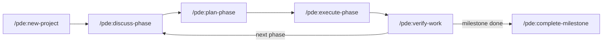

# Platform Development Engine (PDE)

 

A full lifecycle development platform for Claude Code — from raw idea to shipped product through structured phases of discussion, planning, execution, and verification.

## Workflow



## Key Capabilities

- **Structured phases** — discuss, plan, execute, verify — with explicit gates between each
- **Adaptive questioning** to capture project vision before any code is written
- **Parallel task execution** with wave-based orchestration across multiple agents
- **Automatic state persistence** across context resets — no lost progress between sessions
- **Requirements traceability** from initial idea to shipped feature
- **Atomic git commits** with per-task verification gates
- **34 slash commands** covering the full development lifecycle
- **Works with any project type** — web apps, CLIs, APIs, libraries, or platforms

## How It Works

PDE organizes development into named phases. Each phase moves through a discuss → plan → execute → verify loop, building up a `.planning/` directory that serves as persistent memory across sessions. State is preserved in plain files, so context resets never lose progress.

See the [Getting Started guide](GETTING-STARTED.md) for a complete walk-through.

## Quick Install

> Requires Claude Code and an active Anthropic subscription.

```
/plugin marketplace add Grey-Altr/pde
/plugin install platform-development-engine@pde
```

## License

MIT — see [LICENSE](LICENSE) for details.

## Questions?

Open an issue on [GitHub](https://github.com/Grey-Altr/pde/issues).
