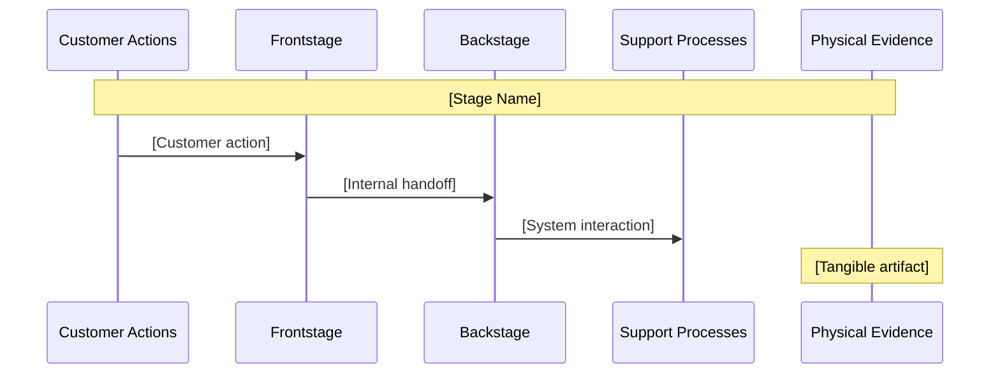

# Launch Frameworks Reference Library

> Shared reference loaded by business-mode workflow skills.
> Loaded via `@references/launch-frameworks.md` from workflow files during artifact generation.

---

**Version:** 1.0
**Scope:** Lean canvas schema, pitch deck slide formats, service blueprint lanes, pricing config schema
**Ownership:** Shared (BRF, WFR, FLW, HND)
**Boundary:** This file provides artifact TEMPLATES and SCHEMAS. It does NOT own track branching logic (see business-track.md) or financial guardrails (see business-financial-disclaimer.md).

---

## Lean Canvas

Source: Ash Maurya, Running Lean

The Lean Canvas is a 9-box one-page business model schema. Each box captures a distinct dimension of the business hypothesis. Complete all 9 boxes before authoring any other business artifact.

| # | Box | Key Question | Content Placeholder | Status | Evidence |
|---|-----|-------------|---------------------|--------|----------|
| 1 | Problem | What are the top 3 problems the customer faces? | [YOUR_PROBLEM_1], [YOUR_PROBLEM_2], [YOUR_PROBLEM_3] | unknown | none yet |
| 2 | Solution | What are the top 3 features that address the problem? | [YOUR_SOLUTION_1], [YOUR_SOLUTION_2], [YOUR_SOLUTION_3] | unknown | none yet |
| 3 | Unique Value Proposition | What is the single clear compelling message — why are you different? | [YOUR_UVP] | unknown | none yet |
| 4 | Unfair Advantage | What cannot be easily copied or bought? | [YOUR_UNFAIR_ADVANTAGE] | unknown | none yet |
| 5 | Customer Segments | Who are your target customers and users? | [YOUR_CUSTOMER_SEGMENT_1], [YOUR_CUSTOMER_SEGMENT_2] | unknown | none yet |
| 6 | Key Metrics | What are the key activities you measure? | [YOUR_METRIC_1], [YOUR_METRIC_2] | unknown | none yet |
| 7 | Channels | What is the path to customers? | [YOUR_CHANNEL_1], [YOUR_CHANNEL_2] | unknown | none yet |
| 8 | Cost Structure | What are the customer acquisition costs, distribution costs, hosting, people? | [YOUR_CAC_CEILING], [YOUR_HOSTING_COST] | unknown | none yet |
| 9 | Revenue Streams | What is the revenue model, lifetime value, revenue, gross margin? | [YOUR_ARR_TARGET], [YOUR_LTV_ESTIMATE] | unknown | none yet |

### Confidence Annotation Format

Each box includes:
- `status`: validated | assumed | unknown
- `evidence`: Brief description of supporting evidence, or "none yet"

When generating a Lean Canvas artifact, mark each box status based on evidence provided in the brief. Default to `unknown` if no evidence is present. Do not mark any financial value as `validated` without explicit evidence from the user.

---

## Pitch Deck Formats

Track-to-format mapping:
- `solo_founder`: YC 10-slide
- `startup_team`: YC 10-slide default, expandable to Sequoia 13 if external funding context detected
- `product_leader`: Internal business case format (Sequoia 13 base with Team → Resource Requirements, Ask → Initiative ROI)

### YC 10-Slide Format

Default format for all tracks. Clear, direct, investor-tested structure.

| Slide | Title | Key Question |
|-------|-------|-------------|
| 1 | Problem | What pain exists and who has it? |
| 2 | Solution | What do you do? |
| 3 | Market Size | How big is the opportunity (TAM/SAM/SOM)? |
| 4 | Product | How does it work? |
| 5 | Business Model | How do you make money? |
| 6 | Traction | What have you proven so far? |
| 7 | Go-to-Market | How do you reach customers? |
| 8 | Competition | How are you different? |
| 9 | Team | Why are you the team to do this? |
| 10 | Ask | What do you need and what will you do with it? |

### Sequoia 13-Slide Expansion

Used by `startup_team` with external funding context and `product_leader`. Adds 3 slides to the YC format:

- **Purpose/Mission** — inserted before Problem (becomes slide 1): Why does this company exist? What change in the world does it enable?
- **Why Now** — inserted after Market Size (becomes slide 5): What market, regulatory, or technology shift makes this the right time?
- **Financials** — inserted after Traction (becomes slide 9): Historical performance and forward projections (use structural placeholders — see business-financial-disclaimer.md)

Final slide order: Purpose/Mission → Problem → Solution → Market Size → Why Now → Product → Business Model → Traction → Financials → Go-to-Market → Competition → Team → Ask

### Product Leader Internal Business Case Format

Base: Sequoia 13-slide structure with two substitutions:
- Slide 12 "Team" → "Resource Requirements": What headcount, budget, and systems are required?
- Slide 13 "Ask" → "Initiative ROI": What is the expected return, payback period, and success metric? (use structural placeholders per business-financial-disclaimer.md)

---

## Service Blueprint

Source: Nielsen Norman Group

The Service Blueprint maps the full service delivery system across 5 lanes separated by the line of visibility. Use this schema when generating service blueprint artifacts.

```
Lane 1: Customer Actions     — What the customer does (journey stages)
Lane 2: Frontstage Interactions — Direct touchpoints (UI, staff, communications)
         ─── LINE OF VISIBILITY ───
Lane 3: Backstage Actions    — Internal processes not visible to customer
Lane 4: Support Processes    — Internal systems/tools that enable frontstage
Lane 5: Physical Evidence    — Tangible artifacts at each touchpoint
```

Depth by track (see business-track.md Depth Thresholds):
- `solo_founder`: Single-product flow — one journey, core touchpoints only
- `startup_team`: Multi-channel flow — web, mobile, email, and support channels
- `product_leader`: Cross-functional flow — includes stakeholder map and organizational handoffs

### Mermaid Sequence Diagram Template

Use this template for each journey stage in the service blueprint:



Repeat the stage block for each journey stage (e.g., Awareness, Onboarding, First Value, Retention, Expansion).

---

## Pricing Config Schema

Note: All monetary values MUST use structural placeholders per @references/business-financial-disclaimer.md

Use this JSON schema when generating Stripe Pricing Config (STR) artifacts. The schema maps directly to the Stripe Products and Prices API.

```json
{
  "product": {
    "name": "[YOUR_PRODUCT_NAME]",
    "description": "[YOUR_PRODUCT_DESCRIPTION]",
    "metadata": {}
  },
  "prices": [
    {
      "nickname": "[YOUR_PLAN_NAME e.g. Starter]",
      "currency": "usd",
      "unit_amount": "[YOUR_PRICE_IN_CENTS]",
      "recurring": {
        "interval": "month",
        "interval_count": 1
      },
      "lookup_key": "[YOUR_LOOKUP_KEY]",
      "trial_period_days": null
    }
  ],
  "checkout_mode": "subscription"
}
```

Note: `unit_amount` is a placeholder string `[YOUR_PRICE_IN_CENTS]` — never a number. When generating STR artifacts, populate the `nickname` and `lookup_key` with descriptive names from the lean canvas revenue streams, but always leave `unit_amount` as a placeholder.

For multi-tier pricing (e.g., Starter, Pro, Enterprise), repeat the prices array entry for each tier. Each entry gets its own `nickname` (e.g., `[YOUR_PLAN_NAME e.g. Pro]`) and `lookup_key` (e.g., `[YOUR_LOOKUP_KEY_PRO]`).

---

## Consumers

- `workflows/brief.md` — Phase 85: lean canvas generation
- `workflows/flows.md` — Phase 87: service blueprint generation
- `workflows/wireframe.md` — Phase 89: landing page wireframe, pricing config, pitch deck
- `workflows/handoff.md` — Phase 91: launch kit references service blueprint and pricing
