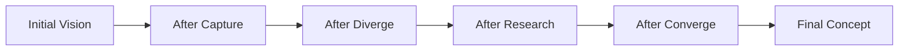

# Exploration Log: {{concept_name}}

## Phase 1: Capture (Explore)

### Round {{N}}

**User Vision:**
> {{verbatim user language}}

**Claude Interpretation:**
{{Claude's synthesis of user intent}}

[Claude: Asked about X because...]

**Decisions Made:**
| Decision | Rationale | Provenance |
|----------|-----------|------------|
| {{decision}} | {{why}} | {{user-stated / claude-suggested / research-informed}} |

---

## Phase 2: Diverge (Explore)

### Technique: {{technique_name}}
**Artifact:** `techniques/{{technique-slug}}-{{N}}.md`

### Variants
| Variant | Description | Key Differentiator |
|---------|-------------|-------------------|
| A | {{description}} | {{differentiator}} |
| B | {{description}} | {{differentiator}} |
| C | {{description}} | {{differentiator}} |

---

## Phase 3: Research (Validate)

### Research Findings
| Question | Finding | Confidence | Source |
|----------|---------|------------|--------|
| {{question}} | {{finding}} | {{high/medium/low}} | {{source}} |

### Conflicting Signals
| Signal A | Signal B | Sources | Synthesis |
|----------|----------|---------|-----------|
| {{finding_a}} | {{finding_b}} | {{sources}} | {{claude_synthesis}} |

---

## Phase 4: Converge (Refine)

### Cherry-Picked Elements
| Element | From Variant | Rationale |
|---------|-------------|-----------|
| {{element}} | {{variant}} | {{why}} |

### Rejected Directions
| Direction | Reason | Could Revisit? |
|-----------|--------|----------------|
| {{direction}} | {{reason}} | {{yes/no}} |

---

## Phase 5: Synthesize (Refine)

### Concept Evolution

### Assumptions
| Assumption | Confidence | Source | Validated? |
|------------|------------|--------|------------|
| {{assumption}} | {{high/medium/low}} | {{source}} | {{yes/no/pending}} |

### Inspiration Log
| Inspiration | Source | How Applied |
|-------------|--------|-------------|
| {{inspiration}} | {{source}} | {{application}} |

### Brief Readiness
**Readiness:** {{ready / needs-more-exploration / blocked}}
**Confidence:** problem: {{tag}} | market: {{tag}} | users: {{tag}} | feasibility: {{tag}}
**Recommendation:** {{next step recommendation}}
