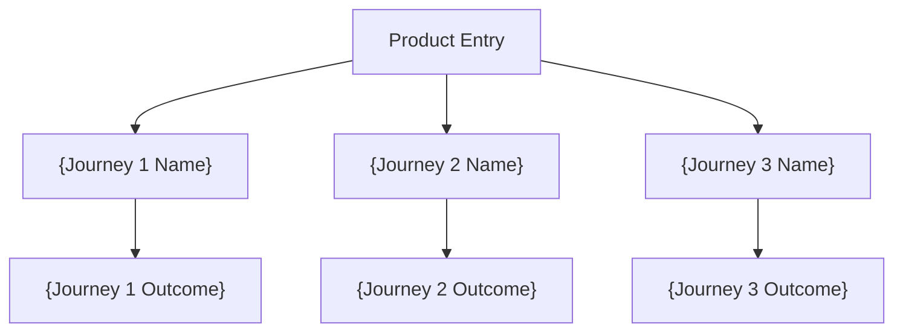
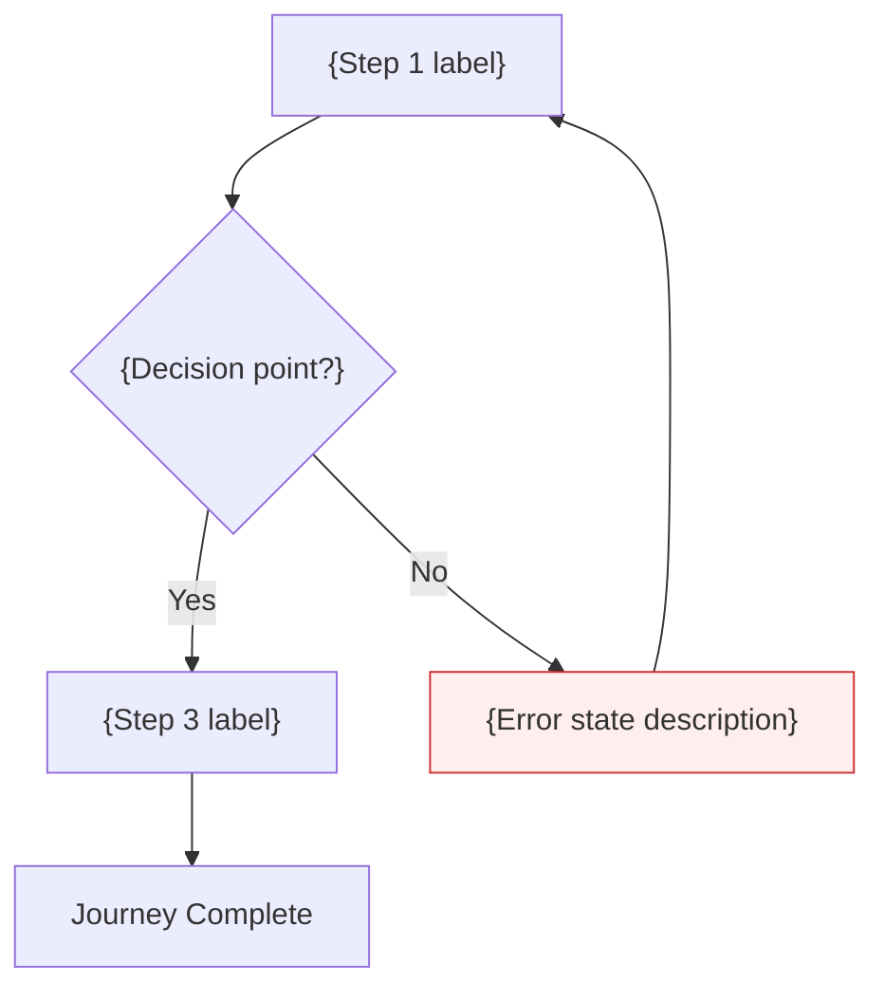

# User Flows

<!-- Mermaid conventions: flowchart TD, node IDs with journey prefix (J1_1, J1_2),
     labels in double quotes, error styles: style NODE fill:#fee,stroke:#c33,
     NEVER use bare 'end' as node ID -->

---

## Overview: All User Journeys

---

## Journey {N}: {Journey Name}

**User:** {persona name}
**Goal:** {what the user wants to accomplish}
**Entry point:** {where the user starts}

### Step Descriptions

1. **J1_1 - {Step Name}:** {Description of what happens at this step}
2. **J1_2 - {Decision Name}:** {Description of the decision point -- what determines the branch}
3. **J1_3 - {Step Name}:** {Description of the happy path continuation}
4. **J1_ERR1 - {Error Name} (ERROR):** {Description of the error state and recovery path}
5. **J1_DONE - {Completion}:** {Description of the journey outcome}

---

## Flow Summary

| Journey | Steps | Decision Points | Error States | Complexity |
|---------|-------|-----------------|--------------|------------|
| {Journey 1 Name} | {count} | {count} | {count} | {low/medium/high} |
| {Journey 2 Name} | {count} | {count} | {count} | {low/medium/high} |
| {Journey 3 Name} | {count} | {count} | {count} | {low/medium/high} |

---

*Generated by PDE-OS /pde:flows | {date}*
*Source: {brief_path}*
