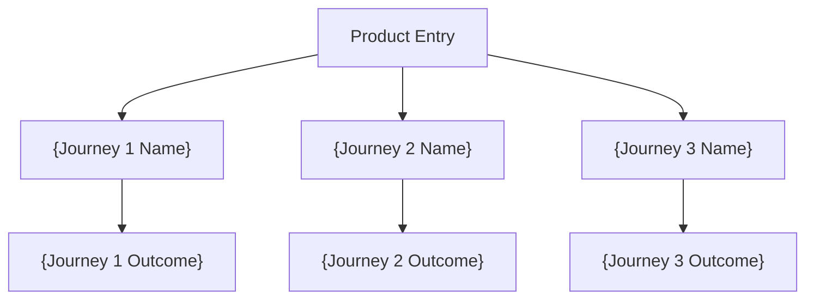
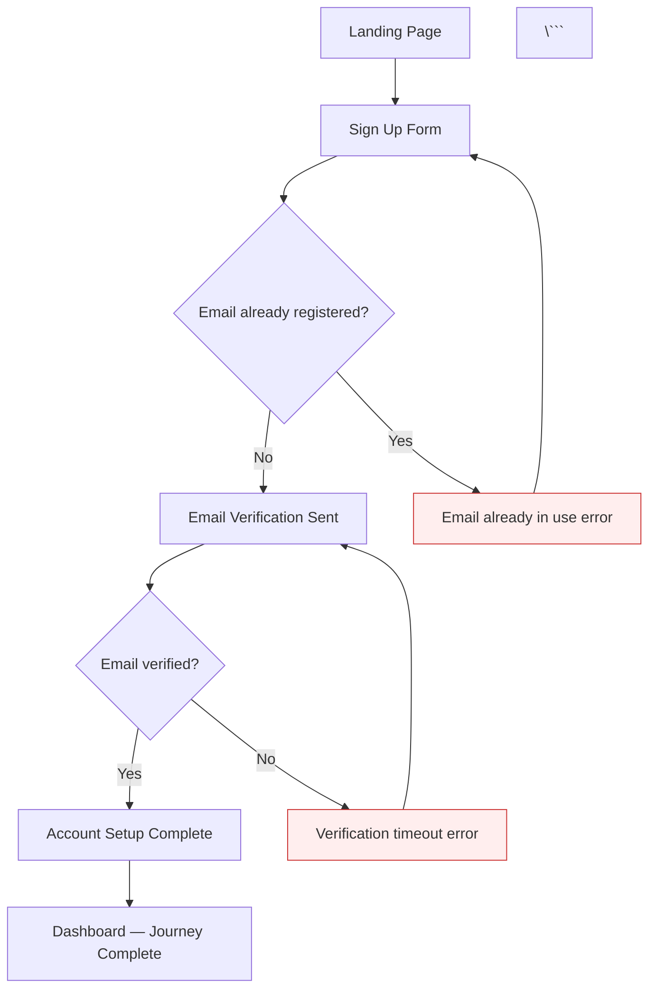

<purpose>
Map user journeys from the product brief as Mermaid flowchart diagrams per persona, and extract a machine-readable screen inventory that downstream wireframe consumption requires. Produces versioned flow documents with happy paths, decision branches, and error states per persona journey, plus a fixed-path JSON screen inventory that /pde:wireframe reads as its canonical screen list.
</purpose>

<required_reading>
@references/skill-style-guide.md
@references/mcp-integration.md
</required_reading>

<flags>
## Supported Flags

| Flag | Type | Behavior |
|------|------|----------|
| `--dry-run` | Boolean | Show planned output without executing. Runs Steps 1-3 (init, prerequisites, MCP probe) but writes NO files. Displays planned file paths, detected personas, estimated journey count. |
| `--quick` | Boolean | Skip MCP enhancements (Sequential Thinking MCP probe) for faster execution. |
| `--verbose` | Boolean | Show detailed progress and MCP probe results, timing per step, reference loading details. |
| `--no-mcp` | Boolean | Skip ALL MCP probes. Pure baseline mode using training knowledge and local files only. |
| `--no-sequential-thinking` | Boolean | Skip Sequential Thinking MCP specifically while allowing other MCPs. |
| `--force` | Boolean | Skip the confirmation prompt when flow documents already exist and auto-increment to the next version. |
</flags>

<process>

## /pde:flows — User Flow Mapping Pipeline

Check for flags in $ARGUMENTS before beginning: `--dry-run`, `--quick`, `--verbose`, `--no-mcp`, `--no-sequential-thinking`, `--force`.

---

### Step 1/7: Initialize design directories

```bash
INIT=$(node "${CLAUDE_PLUGIN_ROOT}/bin/pde-tools.cjs" design ensure-dirs)
if [[ "$INIT" == @file:* ]]; then INIT=$(cat "${INIT#@file:}"); fi
```

Parse the JSON result. If the result contains an error field or the command exits non-zero:

```
Error: Failed to initialize design directories.
  The design directory structure could not be created.
  Check that .planning/ exists and is writable, then re-run /pde:flows.
```

Halt on error. On success, display: `Step 1/7: Design directories initialized.`

---

### Step 2/7: Check prerequisites

**Read the brief (soft dependency):**

Use the Glob tool to check for `.planning/design/strategy/BRF-brief-v*.md`. Sort all matches descending by version number (parse the `v{N}` suffix), then read the highest version using the Read tool.

If no brief found, display the following WARNING (never halt — this is never an error):

```
Warning: No design brief found.
  /pde:flows produces richer output when a brief exists.
  Run /pde:brief first for better results, or continue without it.
```

Continue without brief — Claude uses `.planning/PROJECT.md` as fallback context to identify user types and journeys. Use the Read tool to load `.planning/PROJECT.md` as fallback context.

**If brief found**, extract the following from the brief content:
- All personas (names, roles, goals, pain points) from the Target Users section
- Product name and product type from the brief frontmatter or Product Type section
- Key user goals and tasks from Jobs to Be Done section
- Constraints that affect user flow (e.g., offline-first, accessibility requirements, platform constraints)

**Version gate (existing flow documents):**

Use the Glob tool to check for `.planning/design/ux/FLW-flows-v*.md`. Sort all matches descending by version number (parse the `v{N}` suffix), find the maximum version N.

- If N > 0 AND `--force` flag is NOT present: prompt the user:
  ```
  Flow documents already exist (FLW-flows-v{N}.md). Generate a new version?
  This will create FLW-flows-v{N+1}.md without modifying the existing v{N}.
  (yes / no)
  ```
  If user answers "no": display `Aborted. Existing flows preserved at .planning/design/ux/FLW-flows-v{N}.md` and halt.
  If user answers "yes": set version to N + 1.
- If N > 0 AND `--force` flag IS present: auto-increment to N + 1. Log: `  -> --force flag detected, auto-incrementing to v{N+1}.`
- If N = 0 (no existing flow documents): set version to 1.

**If `--dry-run` flag is active:** Display planned output at end of Step 2:

```
Dry run mode. No files will be written.

Planned output:
  File: .planning/design/ux/FLW-flows-v{N}.md
  File: .planning/design/ux/FLW-screen-inventory.json
  File: .planning/design/ux/DESIGN-STATE.md (if it does not exist)

Source brief: {brief path or "none — using PROJECT.md"}
Detected personas: {comma-separated list of persona names or "TBD from PROJECT.md"}
Estimated journey count: {estimated N journeys}

MCP enhancements: {Sequential Thinking: available/unavailable}
```
HALT — do not write files in dry-run mode.

Display: `Step 2/7: Prerequisites satisfied. Brief: v{X} loaded (or "no brief"). Flow version: v{N}.`

---

### Step 3/7: Probe MCP (Sequential Thinking)

**Check flags first:**

```
IF --no-mcp in $ARGUMENTS:
  SET SEQUENTIAL_THINKING_AVAILABLE = false
  SET ALL_MCP_DISABLED = true
  SKIP all MCP probes
  continue to Step 4

IF --no-sequential-thinking in $ARGUMENTS:
  SET SEQUENTIAL_THINKING_AVAILABLE = false
  SKIP Sequential Thinking probe
  continue to Step 4

IF --quick in $ARGUMENTS:
  SET SEQUENTIAL_THINKING_AVAILABLE = false
  SKIP Sequential Thinking probe (quick mode — no MCP overhead)
  continue to Step 4
```

**Probe Sequential Thinking MCP:**

Attempt to call `mcp__sequential-thinking__think` with test prompt `"Analyze the following: test"`.

- Timeout: 30 seconds
- If tool responds with reasoning: SET `SEQUENTIAL_THINKING_AVAILABLE = true`. Log: `  -> Sequential Thinking MCP: available`
- If tool not found or errors: retry once (same 30s timeout)
  - If retry succeeds: `SEQUENTIAL_THINKING_AVAILABLE = true`
  - If retry fails: `SEQUENTIAL_THINKING_AVAILABLE = false`. Log: `  -> Sequential Thinking MCP: unavailable (continuing without)`

Display: `Step 3/7: MCP probes complete. Sequential Thinking: {available | unavailable}.`

---

### Step 4/7: Generate flow diagrams

This is the core generation step. Claude synthesizes and generates all diagram content in memory before writing to files in Step 5.

#### 4a: Persona and journey identification

**If brief is available:**
- Extract each persona from the brief's Target Users section
- For each persona, identify 2-4 major journeys — each journey represents a major user goal (e.g., "New User Onboarding", "Password Reset", "Core Task Completion", "Account Management")
- A single persona may have multiple journey sections; all journeys for one persona are included in the same FLW document

**If no brief:**
- Read `.planning/PROJECT.md` to identify obvious user types (at minimum: identify the primary user)
- Infer 2-3 core journeys per user type from the project description and stated goals

**If SEQUENTIAL_THINKING_AVAILABLE:**
- Use `mcp__sequential-thinking__think` with prompt: `"Review the following product context and identify all major user journeys. For each journey, reason through: (1) the happy path steps, (2) the key decision points the user or system encounters, (3) the error states that require UI screens. Context: [brief or PROJECT.md content summary]"`
- Use the structured reasoning output to inform journey identification and branch coverage before generating diagrams
- Tag each journey section that benefited from Sequential Thinking reasoning with: `[Enhanced by Sequential Thinking MCP -- journey branch analysis]`

#### 4b: Overview diagram

Generate a top-level overview diagram showing all journeys as a hub-and-spoke from the product entry point. Follow the template's Overview section format exactly:



Add all journeys from all personas to this overview — it is a product-level summary, not per-persona.

#### 4c: Per-journey diagrams

For each journey, generate a `## Journey {N}: {Journey Name}` section with:

- **User:** {persona name}
- **Goal:** {what the user wants to accomplish}
- **Entry point:** {where the user starts in the product}

Followed by a Mermaid `flowchart TD` diagram following these node ID and shape rules:

**Node ID rules (MANDATORY):**
- Screen nodes: `J{N}_{step}["Label"]` — rectangular brackets (e.g., `J1_1["Welcome Screen"]`)
- Decision nodes: `J{N}_{step}{"Label?"}` — curly braces, diamond shape (e.g., `J1_2{"Has account?"}`)
- Error nodes: `J{N}_ERR{n}["Error description"]` — rectangular brackets with `style J{N}_ERR{n} fill:#fee,stroke:#c33` (e.g., `J1_ERR1["Invalid email error"]`)
- Terminal nodes: `J{N}_DONE["Completion label"]` — NEVER use bare `end` as a node ID (Mermaid reserved keyword; use `J{N}_DONE` or `J{N}_END`)
- All node labels in double quotes
- All node IDs prefixed with journey number (J1_, J2_, etc.) to prevent ID collisions when the overview combines all journeys

**Edge rules:**
- Edge labels using `-->|label|` syntax for decision branches: `-->|Yes|`, `-->|No|`, `-->|Success|`, `-->|Failure|`
- Error nodes must have a recovery path: link back to a retry step OR show a dead-end with a clear terminal label

**Minimum content requirements per journey:**
- At minimum: 3 screen nodes, 1 decision node, 1 error node
- Decision nodes represent real user choices or system validation points (e.g., "Is email valid?", "Has account?", "Meets criteria?", "Payment authorized?")
- Error nodes represent real UI error states that require wireframing (e.g., "Form validation error", "Payment declined", "Permission denied", "Network timeout")

**Example journey section:**

```
## Journey 1: New User Onboarding

**User:** First-time User
**Goal:** Create an account and complete initial setup
**Entry point:** Landing page / marketing site



**Step Descriptions subsection (mandatory for each journey):**

After the Mermaid block, add a `### Step Descriptions` section with numbered descriptions for each node in the diagram:

```
### Step Descriptions

1. **J1_1 - Landing Page:** User arrives at the marketing landing page; calls-to-action drive sign-up flow.
2. **J1_2 - Sign Up Form:** User enters email, password, and display name. Submit triggers validation.
3. **J1_3 - Email already registered? (DECISION):** System checks if the submitted email exists in the database.
4. **J1_4 - Email Verification Sent:** System sends a verification email; user is shown a confirmation screen with instructions.
5. **J1_5 - Email verified? (DECISION):** System checks whether the user has clicked the verification link.
6. **J1_ERR1 - Email already in use (ERROR):** Error state shown when submitted email is already registered. Offers "Sign in instead" and "Reset password" CTAs.
7. **J1_ERR2 - Verification timeout (ERROR):** Error state shown when verification email is not confirmed within the session. Offers "Resend verification email" CTA.
8. **J1_6 - Account Setup Complete:** User completes post-registration steps (profile info, preferences).
9. **J1_DONE - Dashboard — Journey Complete:** User lands on the main dashboard; onboarding journey is complete.
```

#### 4d: Flow summary table

After all journey sections, generate the flow summary table matching the template format:

```
## Flow Summary

| Journey | Steps | Decision Points | Error States | Complexity |
|---------|-------|-----------------|--------------|------------|
| {Journey 1 Name} | {count of screen nodes} | {count of decision nodes} | {count of error nodes} | {low/medium/high} |
```

Complexity guidance: low = 1-2 decision points; medium = 3-4 decision points; high = 5+ decision points or 3+ error states.

#### 4e: Screen inventory extraction

After generating all flow diagrams, extract unique screen nodes into the JSON object that will be written as `FLW-screen-inventory.json`.

**Node type inclusion rules:**
- **Include** rectangular screen nodes: lines matching `J{N}_{step}["label"]` pattern (nodes NOT in a `style` line with `fill:#fee`)
- **Include** error nodes: nodes whose IDs appear in a `style ... fill:#fee` line — include these with `"type": "error"`
- **Exclude** decision nodes: lines matching `J{N}_{step}{"label?"}` pattern (curly braces — diamond shape)
- **Exclude** terminal/completion nodes: `J{N}_DONE`, `J{N}_END`, `J{N}_COMPLETE`
- **Exclude** overview diagram nodes: `START`, `OUTCOME_*`

**For each included node, construct:**
- `slug`: `label.toLowerCase().replace(/[^a-z0-9]+/g, '-').replace(/(^-|-$)/g, '')`
- `label`: the original node label text (the string inside the `["..."]` brackets)
- `journey`: parent journey ID (e.g., `"J1"`, `"J2"`)
- `journeyName`: the journey's `## Journey {N}: {Journey Name}` title text
- `persona`: the journey's `**User:**` field value
- `type`: `"error"` if the node ID appears in a `style ... fill:#fee` line, else `"screen"`

**Deduplication rule:** If the same screen label appears in multiple journeys, emit one entry per journey occurrence. The wireframe skill may need distinct states per journey context (e.g., "Dashboard" after onboarding vs. "Dashboard" for a returning user).

**Screen inventory JSON structure:**

```json
{
  "schemaVersion": "1.0",
  "generatedAt": "{ISO 8601 date}",
  "source": ".planning/design/ux/FLW-flows-v{N}.md",
  "screens": [
    {
      "slug": "{kebab-case-slug}",
      "label": "{original node label}",
      "journey": "J{N}",
      "journeyName": "{journey title}",
      "persona": "{persona name}",
      "type": "screen"
    }
  ]
}
```

Display: `Step 4/7: Flow diagrams generated. {total journey count} journeys across {persona count} personas. {total screen count} screens in inventory (excluding decisions and terminals).`

---

### Step 5/7: Write output artifacts

Write all files using the Write tool. Display confirmation after each file.

**File 1: Versioned flow document**

Write to `.planning/design/ux/FLW-flows-v{N}.md`. Use the structure from `@templates/user-flow.md` as the output scaffold. Populate the frontmatter:

```yaml
---
Generated: "{ISO 8601 date}"
Skill: /pde:flows (FLW)
Version: v{N}
Status: draft
Source Brief: "{.planning/design/strategy/BRF-brief-v{X}.md or "none"}"
Enhanced By: "{comma-separated MCP names actually used, or "none"}"
---
```

After the frontmatter, include the document sections in this order:
1. `# User Flows` heading
2. Mermaid conventions comment block (copied from template)
3. `---` separator
4. `## Overview: All User Journeys` section with overview diagram
5. `---` separator
6. All `## Journey {N}: {Journey Name}` sections in order, each followed by `---`
7. `## Flow Summary` table
8. `---` separator
9. Footer: `*Generated by PDE-OS /pde:flows | {ISO date}*` and `*Source: {brief path}*`

Display: `  -> Created: .planning/design/ux/FLW-flows-v{N}.md ({size})`

**File 2: Screen inventory JSON**

Write to `.planning/design/ux/FLW-screen-inventory.json` (fixed path, always reflects latest run, unversioned).

Write the full JSON object constructed in Step 4e.

Display: `  -> Created: .planning/design/ux/FLW-screen-inventory.json ({size}) — {screen count} screens`

Display: `Step 5/7: Flow artifacts written.`

---

### Step 6/7: Update ux domain DESIGN-STATE

**Check if domain DESIGN-STATE exists:**

Use the Glob tool to check for `.planning/design/ux/DESIGN-STATE.md`.

**If it does NOT exist:** Create it from `templates/design-state-domain.md`:
- Replace `{domain_name}` with `ux`
- Replace `{Domain}` with `UX`
- Replace `{date}` with the current ISO 8601 date
- Use the Write tool to create `.planning/design/ux/DESIGN-STATE.md`

**If it already exists:** Use the Edit tool to update it.

**Add or update the FLW artifact row in the Artifact Index table:**

If the file was just created: the Artifact Index table is empty (comment-only). Add the FLW row after the header row.
If the file already exists (re-run scenario, v2+): update the existing FLW row's Version and Updated columns in place.

```
| FLW | User Flows | /pde:flows | draft | v{N} | {comma-separated MCP names actually used, or "none"} | -- | {YYYY-MM-DD} |
```

Display: `Step 6/7: UX DESIGN-STATE.md updated with FLW artifact entry.`

---

### Step 7/7: Update root DESIGN-STATE and manifest

**Acquire write lock:**

```bash
LOCK=$(node "${CLAUDE_PLUGIN_ROOT}/bin/pde-tools.cjs" design lock-acquire pde-flows)
if [[ "$LOCK" == @file:* ]]; then LOCK=$(cat "${LOCK#@file:}"); fi
```

Parse `{"acquired": true/false}` from the result.

- If `"acquired": true`: proceed.
- If `"acquired": false`: wait 5 seconds, then retry up to 3 times:
  ```bash
  sleep 5
  LOCK=$(node "${CLAUDE_PLUGIN_ROOT}/bin/pde-tools.cjs" design lock-acquire pde-flows)
  if [[ "$LOCK" == @file:* ]]; then LOCK=$(cat "${LOCK#@file:}"); fi
  ```
  If still `"acquired": false` after 3 retries:
  ```
  Error: Could not acquire write lock for root DESIGN-STATE.md.
    Another process may be writing to the design state.
    Wait a moment and retry /pde:flows.
  ```
  Release lock anyway and halt.

**Update root `.planning/design/DESIGN-STATE.md`:**

Read the current root DESIGN-STATE.md using the Read tool, then apply the following four updates using the Edit tool:

1. **Cross-Domain Dependency Map** — add FLW row if not already present:
   ```
   | FLW | ux | BRF | current |
   ```

2. **Quick Reference section** — add or update FLW row:
   ```
   | User Flows | v{N} |
   ```

3. **Decision Log** — append entry:
   ```
   | FLW | user flows mapped, {journey_count} journeys, {screen_count} screens | {YYYY-MM-DD} |
   ```

4. **Iteration History** — append entry:
   ```
   | FLW-flows-v{N}.md | v{N} | Created by /pde:flows | {YYYY-MM-DD} |
   ```

**ALWAYS release write lock, even if an error occurred during the state update above:**

```bash
node "${CLAUDE_PLUGIN_ROOT}/bin/pde-tools.cjs" design lock-release
```

**Update design manifest:**

Register the FLW artifact in the manifest using 7 manifest-update calls:

```bash
node "${CLAUDE_PLUGIN_ROOT}/bin/pde-tools.cjs" design manifest-update FLW code FLW
node "${CLAUDE_PLUGIN_ROOT}/bin/pde-tools.cjs" design manifest-update FLW name "User Flows"
node "${CLAUDE_PLUGIN_ROOT}/bin/pde-tools.cjs" design manifest-update FLW type user-flows
node "${CLAUDE_PLUGIN_ROOT}/bin/pde-tools.cjs" design manifest-update FLW domain ux
node "${CLAUDE_PLUGIN_ROOT}/bin/pde-tools.cjs" design manifest-update FLW path ".planning/design/ux/FLW-flows-v{N}.md"
node "${CLAUDE_PLUGIN_ROOT}/bin/pde-tools.cjs" design manifest-update FLW status draft
node "${CLAUDE_PLUGIN_ROOT}/bin/pde-tools.cjs" design manifest-update FLW version {N}
```

**Set coverage flag (CRITICAL: preserve existing flags):**

Read current coverage first (never hardcode — this would clobber flags set by other skills):

```bash
COV=$(node "${CLAUDE_PLUGIN_ROOT}/bin/pde-tools.cjs" design coverage-check)
if [[ "$COV" == @file:* ]]; then COV=$(cat "${COV#@file:}"); fi
```

Parse the JSON output to extract current flag values for ALL seven fields:
- `hasDesignSystem` — current value from COV output
- `hasWireframes` — current value from COV output
- `hasCritique` — current value from COV output
- `hasIterate` — current value from COV output
- `hasHandoff` — current value from COV output
- `hasHardwareSpec` — current value from COV output

Merge `hasFlows: true` into the existing values, then write the full object (all flags must be present):

```bash
node "${CLAUDE_PLUGIN_ROOT}/bin/pde-tools.cjs" design manifest-set-top-level designCoverage '{"hasDesignSystem":{current},"hasFlows":true,"hasWireframes":{current},"hasCritique":{current},"hasIterate":{current},"hasHandoff":{current},"hasHardwareSpec":{current}}'
```

Display: `Step 7/7: Root DESIGN-STATE and manifest updated.`

---

## Anti-Patterns (Guard Against)

- NEVER use bare `end` as a Mermaid node ID — `end` is a Mermaid reserved keyword. Using it causes a diagram parse error. Always use `J{N}_DONE`, `J{N}_END`, or `J{N}_COMPLETE` for terminal nodes.
- NEVER use non-prefixed node IDs (e.g., `STEP1`, `ERROR`) — all node IDs must use the `J{N}_` prefix to prevent ID collisions when the overview diagram combines all journeys.
- NEVER include decision nodes (`{}` curly brace shape) in `FLW-screen-inventory.json` — they are control flow, not screens. Decision nodes represent branching logic (e.g., "Is email valid?"), not UI screens that need wireframing.
- NEVER skip `ux/DESIGN-STATE.md` creation — the wireframe skill reads this file to discover UX domain artifacts. If it is absent after `/pde:flows` runs, Phase 16 (/pde:wireframe) has no domain file to update.
- NEVER set `hasFlows` in `designCoverage` without reading current coverage first — `manifest-set-top-level` replaces the entire `designCoverage` object. Always run `coverage-check`, parse all current flags, and write the full merged object. Skipping this step resets flags set by other skills (e.g., `hasDesignSystem: true` becomes `false`).
- NEVER skip the write-lock for root DESIGN-STATE.md updates — acquire `design lock-acquire pde-flows` before any Edit to root DESIGN-STATE.md.
- ALWAYS release the write lock after Step 7 operations, even if an error occurred. The lock has a 60s TTL but releasing immediately prevents blocking other skills.
- ALWAYS include error nodes in screen inventory with `"type": "error"` — they represent real UI error states (form validation errors, payment failures, permission denied screens) that need wireframing.
- NEVER overwrite an existing versioned flow document — always increment version (v1 → v2 → v3). If v1 exists, write v2. Existing versions are never modified.

---

## Summary

Display the final summary table as the last output of every run:

```
## Summary

| Property | Value |
|----------|-------|
| Files created | .planning/design/ux/FLW-flows-v{N}.md (Markdown, {size}), .planning/design/ux/FLW-screen-inventory.json (JSON, {size}), .planning/design/ux/DESIGN-STATE.md (Markdown, {size}) |
| Files modified | .planning/design/DESIGN-STATE.md, .planning/design/design-manifest.json |
| Next suggested skill | /pde:wireframe |
| Elapsed time | {duration} |
| Estimated tokens | ~{count} |
| MCP enhancements | {comma-separated list of MCPs actually used, or "none"} |
```

</process>

<output>
- `.planning/design/ux/FLW-flows-v{N}.md` — versioned Mermaid flow document with overview diagram, per-journey diagrams (screen, decision, error nodes, step descriptions), and flow summary table
- `.planning/design/ux/FLW-screen-inventory.json` — machine-readable screen list (fixed path, always reflects latest run); consumed by /pde:wireframe as its canonical screen list
- `.planning/design/ux/DESIGN-STATE.md` — ux domain state file (created if absent); updated with FLW artifact entry
- `.planning/design/DESIGN-STATE.md` — root state updated (Cross-Domain Map, Quick Reference, Decision Log, Iteration History)
- `.planning/design/design-manifest.json` — manifest updated with FLW artifact entry and hasFlows: true in designCoverage
</output>
